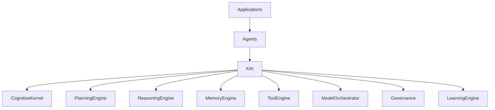
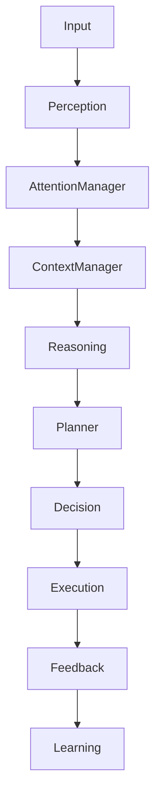
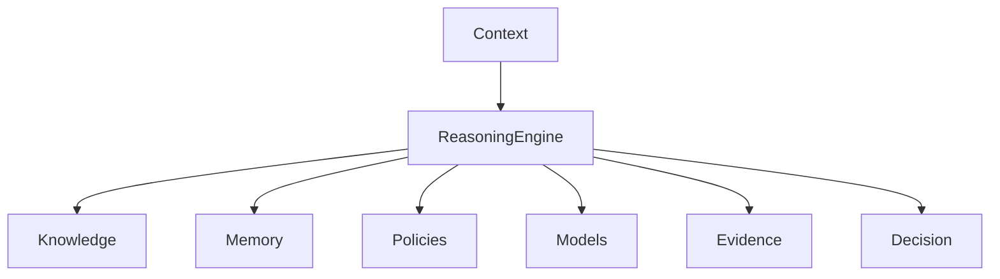
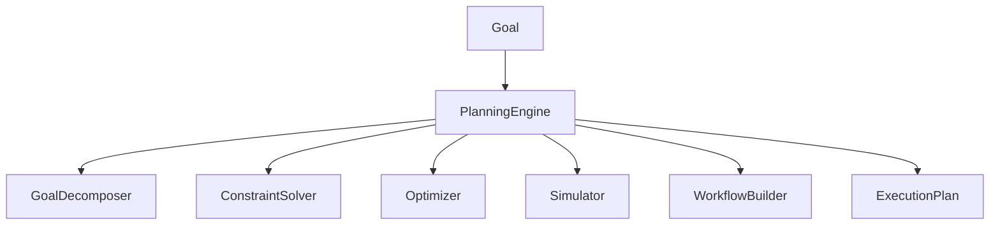
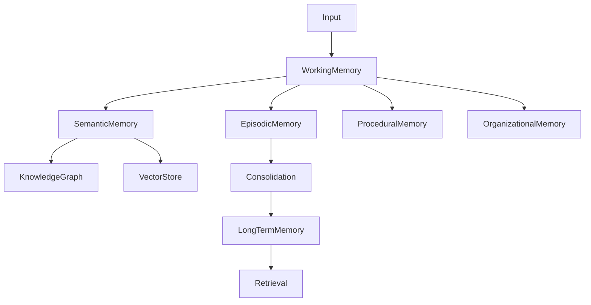
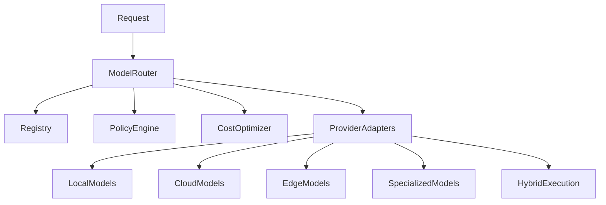
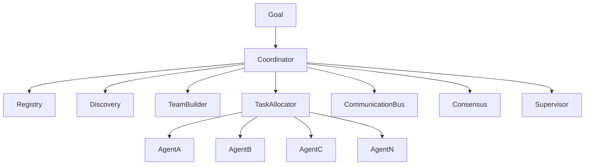
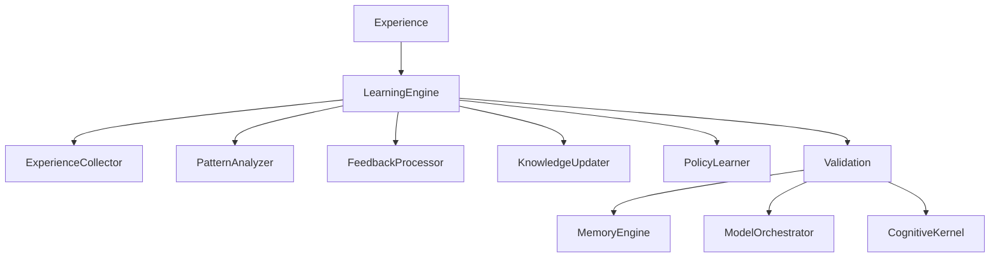
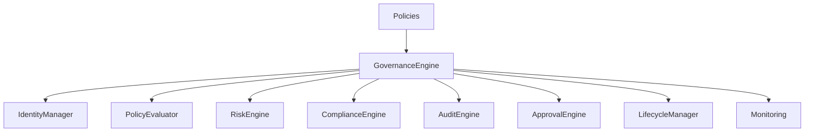

La siguiente capa más lógica y estratégica es **KAI (KAIZEN Artificial Intelligence Framework)**. Mientras KOS define *cómo* se ejecuta el sistema operativo, KAI define *cómo piensa, razona, aprende, planifica y colabora la inteligencia artificial* sobre ese sistema.

---

# KAI-0001 — KAIZEN Artificial Intelligence Framework

# KAIZEN Artificial Intelligence Framework (KAI)

## Arquitectura General de la Plataforma de Inteligencia Artificial Nativa

**Estado:** ⏳ En desarrollo

**Dependencias:**

✅ KDL — KAIZEN Definition Language
✅ KCF — KAIZEN Compiler Framework
✅ KRE — KAIZEN Runtime Environment
✅ KSP — KAIZEN Service Platform
✅ KOS — KAIZEN Operating System

**Siguiente documento:** **KAI-0002 Cognitive Kernel**

**Capa:** Artificial Intelligence Layer

**Clasificación:** Arquitectura Base de Inteligencia Artificial

---

# 1. Propósito

El **KAIZEN Artificial Intelligence Framework (KAI)** define la arquitectura universal para construir, ejecutar, coordinar y gobernar inteligencia artificial dentro del ecosistema KAIZEN.

Mientras KOS administra recursos computacionales, KAI administra capacidades cognitivas.

Su función es convertir modelos de IA, agentes y sistemas de conocimiento en componentes interoperables, observables y gobernados.

**Principio:**

> La inteligencia es un recurso del sistema operativo y debe gestionarse como tal.

---

# 2. Evolución del Estándar

```text
KDL
↓
Lenguaje

KCF
↓
Compilador

KRE
↓
Runtime

KSP
↓
Servicios

KOS
↓
Sistema Operativo

KAI
↓
Inteligencia Artificial
```

---

# 3. Objetivos

KAI proporciona:

* Orquestación de modelos.
* Razonamiento.
* Planificación.
* Memoria cognitiva.
* Coordinación de agentes.
* Aprendizaje.
* Gestión de herramientas.
* Gobernanza de IA.
* Seguridad cognitiva.
* Observabilidad de decisiones.

---

# 4. Arquitectura General



---

# 5. Componentes Principales

El framework se compone de:

* Cognitive Kernel.
* Reasoning Engine.
* Planning Engine.
* Memory Engine.
* Model Orchestrator.
* Tool Engine.
* Learning Engine.
* Knowledge Integration Layer.
* Multi-Agent Coordinator.
* AI Governance Engine.

---

# 6. Filosofía Arquitectónica

Toda inteligencia debe ser:

* Modular.
* Explicable.
* Auditada.
* Gobernada.
* Sustituible.
* Distribuida.
* Observable.

Los modelos de IA nunca se integran directamente con las aplicaciones; siempre lo hacen mediante KAI.

---

# 7. Modelo Cognitivo

```text
Percepción

↓

Memoria

↓

Razonamiento

↓

Planificación

↓

Decisión

↓

Acción

↓

Aprendizaje
```

Cada fase es un componente independiente.

---

# 8. Inteligencia como Servicio

KAI abstrae cualquier proveedor de IA.

Ejemplos:

* Modelos fundacionales.
* Modelos locales.
* Modelos especializados.
* Modelos multimodales.
* Motores de inferencia.
* Sistemas simbólicos.

Las aplicaciones consumen capacidades cognitivas, no implementaciones concretas.

---

# 9. Integración con KOS

KOS administra:

* CPU.
* GPU.
* Memoria.
* Procesos.
* Recursos.

KAI administra:

* Contexto.
* Modelos.
* Agentes.
* Decisiones.
* Objetivos.
* Planes.

---

# 10. Modelo Universal de IA

Todo componente inteligente implementa un contrato común.

```text
Input

↓

Context

↓

Reasoning

↓

Decision

↓

Execution

↓

Feedback
```

Esto permite intercambiar motores sin modificar las aplicaciones.

---

# 11. Gobernanza

Toda decisión puede asociarse con:

* Identidad del agente.
* Modelo utilizado.
* Evidencias.
* Herramientas empleadas.
* Restricciones aplicadas.
* Nivel de confianza.
* Fecha y versión.

---

# 12. Observabilidad

KAI registra:

* Prompts.
* Contexto utilizado.
* Herramientas invocadas.
* Modelos seleccionados.
* Coste.
* Tiempo.
* Calidad.
* Resultado.

---

# 13. Integración con KSP

Utiliza:

* Knowledge Platform.
* Identity.
* Billing.
* Marketplace.
* Model Registry.
* Policy Engine.

---

# 14. Integración con KRE

Los agentes inteligentes son ejecutados por KRE.

KAI define su comportamiento cognitivo.

---

# 15. Integración con KDL

KDL describe:

* Agentes.
* Objetivos.
* Herramientas.
* Políticas.
* Restricciones.

KAI interpreta y ejecuta estas definiciones.

---

# 16. Objetivos No Funcionales

Debe garantizar:

* Escalabilidad.
* Baja latencia.
* Explicabilidad.
* Seguridad.
* Trazabilidad.
* Reproducibilidad.
* Compatibilidad con múltiples modelos.

---

# 17. Principios Arquitectónicos

## AI Native

Toda la arquitectura está diseñada para IA desde el origen.

## Model Agnostic

No depende de un proveedor específico.

## Multi-Agent

Los agentes colaboran bajo reglas comunes.

## Explainable

Las decisiones deben poder justificarse.

## Governed

La IA está sujeta a políticas y auditoría.

## Evolutivo

Nuevos modelos y técnicas pueden incorporarse sin romper la plataforma.

---

# 18. Resultado del Documento

Con **KAI-0001** queda definida la arquitectura base del framework de inteligencia artificial:

✅ Arquitectura general.
✅ Componentes principales.
✅ Modelo cognitivo.
✅ Inteligencia como servicio.
✅ Gobernanza.
✅ Observabilidad.
✅ Integración con KDL, KRE, KSP y KOS.
✅ Principios arquitectónicos.
✅ Objetivos funcionales y no funcionales.

---

# Estado de la Serie KAI

| Documento                              | Estado      |
| -------------------------------------- | ----------- |
| **KAI-0001 AI Framework Architecture** | ✅ Completo  |
| KAI-0002 Cognitive Kernel              | ⏳ Siguiente |
| KAI-0003 Reasoning Engine              | Pendiente   |
| KAI-0004 Planning Engine               | Pendiente   |
| KAI-0005 Memory Engine                 | Pendiente   |
| KAI-0006 Model Orchestrator            | Pendiente   |
| KAI-0007 Multi-Agent Coordinator       | Pendiente   |
| KAI-0008 Learning Engine               | Pendiente   |
| KAI-0009 AI Governance                 | Pendiente   |
| KAI-0010 AI Conformance                | Pendiente   |

---

# Próximo documento oficial

## **KAI-0002 — Cognitive Kernel**

Definirá el núcleo cognitivo de KAIZEN, incluyendo:

* Arquitectura cognitiva.
* Ciclo percepción–razonamiento–acción.
* Gestión de objetivos e intenciones.
* Contexto de trabajo.
* Toma de decisiones.
* Control ejecutivo.
* Gestión de atención y prioridades.
* Interfaces cognitivas internas.
* Coordinación con memoria, planificación y herramientas.
* Garantías de explicabilidad y determinismo cognitivo.

Este documento establecerá el corazón cognitivo de KAIZEN, responsable de coordinar todas las capacidades de razonamiento e inteligencia del ecosistema.


# KAI-0002 — Cognitive Kernel

# KAIZEN Artificial Intelligence Framework (KAI)

## Núcleo Cognitivo para la Coordinación de Inteligencia Artificial

**Estado:** ⏳ En desarrollo

**Dependencias:**

✅ KDL — KAIZEN Definition Language
✅ KCF — KAIZEN Compiler Framework
✅ KRE — KAIZEN Runtime Environment
✅ KSP — KAIZEN Service Platform
✅ KOS — KAIZEN Operating System
✅ KAI-0001 AI Framework Architecture

**Siguiente documento:** **KAI-0003 Reasoning Engine**

**Capa:** Cognitive Core Layer

**Clasificación:** Núcleo Cognitivo del Framework de IA

---

# 1. Propósito

El **Cognitive Kernel (CK)** es el núcleo de inteligencia de KAIZEN.

Mientras el **AI Microkernel (KOS)** coordina la ejecución del sistema operativo, el **Cognitive Kernel** coordina la ejecución de los procesos cognitivos.

Su función es transformar objetivos en acciones mediante percepción, razonamiento, planificación y aprendizaje.

**Principio:**

> Toda decisión inteligente dentro de KAIZEN debe pasar por el Cognitive Kernel.

---

# 2. Arquitectura General



---

# 3. Responsabilidades

El Cognitive Kernel administra:

* Objetivos.
* Intenciones.
* Contexto.
* Atención.
* Decisiones.
* Coordinación entre motores.
* Priorización.
* Retroalimentación.
* Estado cognitivo.

No ejecuta modelos directamente; coordina los componentes especializados.

---

# 4. Ciclo Cognitivo

```text
Percepción

↓

Interpretación

↓

Contextualización

↓

Razonamiento

↓

Planificación

↓

Decisión

↓

Acción

↓

Evaluación

↓

Aprendizaje
```

Cada ciclo genera información reutilizable para los siguientes.

---

# 5. Gestión de Objetivos

Todo agente opera con objetivos explícitos.

Cada objetivo posee:

* Identificador.
* Prioridad.
* Restricciones.
* Estado.
* Fecha de creación.
* Fecha límite.
* Dependencias.

Los objetivos pueden dividirse en subobjetivos.

---

# 6. Gestión de Intenciones

Las intenciones representan la estrategia inmediata del agente para alcanzar un objetivo.

Ejemplos:

* Investigar.
* Consultar conocimiento.
* Invocar herramienta.
* Solicitar colaboración.
* Esperar información.
* Ejecutar workflow.

Las intenciones son dinámicas y pueden modificarse durante la ejecución.

---

# 7. Gestión de Atención

El **Attention Manager** decide qué información es relevante en cada momento.

Factores considerados:

* Prioridad del objetivo.
* Riesgo.
* Novedad.
* Urgencia.
* Confianza.
* Coste.
* Tiempo disponible.

Esto evita el procesamiento innecesario de contexto.

---

# 8. Context Manager

El contexto activo incluye:

* Conversación.
* Estado del agente.
* Historial reciente.
* Memoria recuperada.
* Restricciones.
* Herramientas disponibles.
* Políticas aplicables.

El contexto se mantiene mínimo y relevante para optimizar el rendimiento.

---

# 9. Estado Cognitivo

Cada agente mantiene un estado interno:

```text
Idle

↓

Observing

↓

Thinking

↓

Planning

↓

Acting

↓

Learning
```

El estado puede cambiar múltiples veces durante un mismo objetivo.

---

# 10. Coordinación de Motores

El Cognitive Kernel coordina:

* Reasoning Engine.
* Planning Engine.
* Memory Engine.
* Tool Engine.
* Model Orchestrator.
* Learning Engine.

Cada motor expone interfaces estables y desacopladas.

---

# 11. Selección de Estrategia

Antes de actuar, el kernel evalúa:

* Complejidad del problema.
* Recursos disponibles.
* Tiempo máximo.
* Nivel de confianza requerido.
* Coste esperado.

Puede elegir entre distintas estrategias cognitivas.

---

# 12. Gestión de Decisiones

Toda decisión incluye:

* Alternativas evaluadas.
* Evidencias.
* Restricciones.
* Nivel de confianza.
* Justificación.
* Riesgos identificados.

Las decisiones quedan registradas para auditoría.

---

# 13. Control Ejecutivo

El kernel supervisa que los agentes:

* Cumplan políticas.
* Respeten objetivos.
* No entren en bucles.
* Utilicen herramientas autorizadas.
* Mantengan coherencia con el contexto.

---

# 14. Gestión de Errores Cognitivos

Se detectan situaciones como:

* Contexto insuficiente.
* Ambigüedad.
* Conflictos entre objetivos.
* Información contradictoria.
* Baja confianza.
* Herramientas no disponibles.

El kernel decide si reintentar, solicitar información adicional o escalar el problema.

---

# 15. Interrupciones Cognitivas

El kernel puede interrumpir un proceso cuando:

* Aparece un objetivo más prioritario.
* Cambia el contexto.
* Se detecta una emergencia.
* Una política lo exige.

El estado se conserva para reanudar posteriormente.

---

# 16. Observabilidad Cognitiva

Se registra:

* Objetivos activos.
* Intenciones.
* Contexto utilizado.
* Tiempo de razonamiento.
* Herramientas invocadas.
* Decisiones tomadas.
* Nivel de confianza.
* Resultado obtenido.

---

# 17. Integración

El Cognitive Kernel interactúa con:

* KOS (recursos y ejecución).
* KRE (runtime de agentes).
* Knowledge Platform.
* Model Orchestrator.
* Policy Engine.
* Memory Engine.
* Scheduler.

---

# 18. API Conceptual

Crear objetivo:

```typescript
Cognitive.createGoal({

goal:

"Generar informe SST"

})
```

Actualizar intención:

```typescript
Cognitive.setIntent({

intent:

"Consultar Knowledge Base"

})
```

Solicitar decisión:

```typescript
Cognitive.decide({

goal:

"Responder consulta"

})
```

---

# 19. Objetivos No Funcionales

Debe garantizar:

* Baja latencia cognitiva.
* Consistencia de decisiones.
* Explicabilidad.
* Reproducibilidad.
* Escalabilidad.
* Seguridad.
* Observabilidad completa.

---

# 20. Principios Arquitectónicos

## Goal Driven

Todo comportamiento parte de un objetivo.

## Context Aware

Las decisiones dependen del contexto activo.

## Explainable

Cada decisión debe poder justificarse.

## Modular

Cada capacidad cognitiva es reemplazable.

## Governed

La inteligencia está controlada por políticas.

## Determinista cuando sea requerido

Para procesos regulados, el mismo contexto debe producir decisiones reproducibles.

---

# 21. Resultado del Documento

Con **KAI-0002** queda definido:

✅ Arquitectura del Cognitive Kernel.
✅ Ciclo cognitivo completo.
✅ Gestión de objetivos e intenciones.
✅ Atención y contexto.
✅ Coordinación de motores cognitivos.
✅ Control ejecutivo.
✅ Gestión de errores e interrupciones cognitivas.
✅ Observabilidad y auditoría de decisiones.
✅ Integración con KOS, KRE y KSP.

---

# Estado actualizado Serie KAI

| Documento                          | Estado      |
| ---------------------------------- | ----------- |
| KAI-0001 AI Framework Architecture | ✅ Completo  |
| **KAI-0002 Cognitive Kernel**      | ✅ Completo  |
| KAI-0003 Reasoning Engine          | ⏳ Siguiente |
| KAI-0004 Planning Engine           | Pendiente   |
| KAI-0005 Memory Engine             | Pendiente   |
| KAI-0006 Model Orchestrator        | Pendiente   |
| KAI-0007 Multi-Agent Coordinator   | Pendiente   |
| KAI-0008 Learning Engine           | Pendiente   |
| KAI-0009 AI Governance             | Pendiente   |
| KAI-0010 AI Conformance            | Pendiente   |

---

# Próximo documento oficial

## **KAI-0003 — Reasoning Engine**

Este documento definirá el motor de razonamiento de KAIZEN, incluyendo:

* Modelos de razonamiento deductivo, inductivo y abductivo.
* Razonamiento simbólico y basado en LLM.
* Razonamiento híbrido (neuro-simbólico).
* Inferencia causal.
* Resolución de conflictos.
* Evaluación de evidencias.
* Gestión de incertidumbre.
* Encadenamiento de razonamientos.
* Explicabilidad de inferencias.
* Integración con memoria, planificación y conocimiento.

Con **KAI-0003** se establecerá el componente responsable de transformar información y contexto en inferencias justificables y decisiones inteligentes dentro del ecosistema KAIZEN.


# KAI-0003 — Reasoning Engine

# KAIZEN Artificial Intelligence Framework (KAI)

## Motor Universal de Razonamiento e Inferencia Inteligente

**Estado:** ⏳ En desarrollo

**Dependencias:**

✅ KDL — KAIZEN Definition Language
✅ KCF — KAIZEN Compiler Framework
✅ KRE — KAIZEN Runtime Environment
✅ KSP — KAIZEN Service Platform
✅ KOS — KAIZEN Operating System
✅ KAI-0001 AI Framework Architecture
✅ KAI-0002 Cognitive Kernel

**Siguiente documento:** **KAI-0004 Planning Engine**

**Capa:** Cognitive Reasoning Layer

**Clasificación:** Motor Universal de Razonamiento

---

# 1. Propósito

El **Reasoning Engine (RE)** transforma datos, contexto y conocimiento en conclusiones justificables.

Su responsabilidad no es generar texto, sino producir inferencias consistentes, verificables y trazables.

Opera de manera desacoplada de cualquier modelo de IA específico y puede combinar razonamiento simbólico, estadístico y basado en modelos fundacionales.

**Principio:**

> Ninguna decisión inteligente debe tomarse sin un proceso explícito de razonamiento.

---

# 2. Arquitectura General



---

# 3. Flujo General

```text
Entrada

↓

Normalización

↓

Recuperación de conocimiento

↓

Selección de estrategia

↓

Inferencia

↓

Evaluación

↓

Explicación

↓

Resultado
```

---

# 4. Tipos de Razonamiento

El motor soporta múltiples paradigmas:

### Deductivo

Parte de reglas generales para obtener conclusiones específicas.

### Inductivo

Generaliza patrones a partir de observaciones.

### Abductivo

Selecciona la hipótesis más probable ante información incompleta.

### Analógico

Resuelve problemas comparando situaciones similares.

### Causal

Determina relaciones de causa y efecto.

### Contrafactual

Evalúa escenarios hipotéticos ("¿qué habría ocurrido si...?").

### Probabilístico

Gestiona incertidumbre mediante distribuciones de probabilidad.

### Temporal

Analiza secuencias y dependencias en el tiempo.

### Espacial

Relaciona entidades según ubicación y proximidad.

---

# 5. Razonamiento Neuro-Simbólico

El Reasoning Engine puede combinar:

* Reglas formales.
* Ontologías.
* Grafos de conocimiento.
* Motores de inferencia.
* Modelos LLM.
* Modelos especializados.

Cada mecanismo aporta evidencia al resultado final.

---

# 6. Evaluación de Evidencias

Toda conclusión debe indicar:

* Evidencias utilizadas.
* Fuente.
* Nivel de confianza.
* Fecha de obtención.
* Consistencia.
* Calidad.

Las evidencias se ponderan antes de generar una inferencia.

---

# 7. Gestión de Incertidumbre

El motor identifica:

* Información incompleta.
* Ambigüedad.
* Conflictos.
* Hipótesis múltiples.
* Riesgos.

Cuando la confianza es insuficiente, puede:

* Solicitar más información.
* Consultar memoria.
* Invocar herramientas.
* Escalar a un agente especializado.

---

# 8. Resolución de Conflictos

Si dos inferencias son incompatibles:

```text
Inferencia A

↓

Comparación

↓

Evaluación de evidencia

↓

Aplicación de políticas

↓

Selección

↓

Auditoría
```

Nunca se descartan conclusiones sin dejar trazabilidad.

---

# 9. Encadenamiento de Inferencias

El motor puede construir cadenas de razonamiento:

```text
Hecho

↓

Inferencia 1

↓

Inferencia 2

↓

Inferencia 3

↓

Conclusión
```

Cada paso mantiene su justificación y dependencia.

---

# 10. Explicabilidad

Cada resultado debe poder responder:

* ¿Qué información se utilizó?
* ¿Qué reglas se aplicaron?
* ¿Qué modelos participaron?
* ¿Qué alternativas fueron descartadas?
* ¿Cuál es el nivel de confianza?
* ¿Qué incertidumbres permanecen?

---

# 11. Integración con la Memoria

El motor consulta:

* Memoria episódica.
* Memoria semántica.
* Memoria procedimental.
* Memoria de trabajo.

La recuperación es contextual y gobernada por políticas.

---

# 12. Integración con el Conocimiento

Puede consumir:

* Bases de conocimiento.
* Grafos semánticos.
* Documentación empresarial.
* Normativas.
* Datos estructurados.
* Información en tiempo real.

---

# 13. Integración con Herramientas

Cuando el razonamiento requiere información adicional, puede invocar:

* Búsquedas.
* APIs.
* Motores matemáticos.
* Simuladores.
* OCR.
* Sistemas ERP/CRM.
* Motores GIS.

Las herramientas aportan evidencia, no decisiones.

---

# 14. Integración con Model Orchestrator

El Reasoning Engine delega tareas específicas al **Model Orchestrator**, que selecciona el modelo más adecuado según:

* Tipo de inferencia.
* Coste.
* Latencia.
* Precisión.
* Políticas.

---

# 15. Políticas de Razonamiento

Ejemplo:

```yaml
reasoning:

strategy: hybrid

require_explanation: true

minimum_confidence: 0.90

allow_external_tools: true

max_reasoning_depth: 12
```

---

# 16. API Conceptual

Solicitar inferencia:

```typescript
Reasoning.infer({

goal: "Evaluar riesgo SST",

context: context

})
```

Validar conclusión:

```typescript
Reasoning.validate({

inference: "RISK-42"

})
```

Explicar decisión:

```typescript
Reasoning.explain({

inference: "RISK-42"

})
```

---

# 17. Observabilidad

El sistema registra:

* Estrategia seleccionada.
* Evidencias utilizadas.
* Modelos invocados.
* Tiempo de razonamiento.
* Coste computacional.
* Confianza.
* Inferencias descartadas.
* Explicaciones generadas.

---

# 18. Objetivos No Funcionales

Debe garantizar:

* Consistencia lógica.
* Explicabilidad.
* Reproducibilidad.
* Escalabilidad.
* Baja latencia.
* Gobernanza.
* Compatibilidad con múltiples modelos y motores.

---

# 19. Principios Arquitectónicos

## Reasoning First

Toda decisión parte de un proceso de inferencia explícito.

## Evidence Driven

Las conclusiones se sustentan en evidencias verificables.

## Hybrid Intelligence

Combina razonamiento simbólico, estadístico y neuronal.

## Explainable by Default

Toda inferencia puede justificarse.

## Model Agnostic

No depende de un único proveedor o arquitectura de IA.

## Policy Governed

El comportamiento del motor está regulado por políticas declarativas.

---

# 20. Resultado del Documento

Con **KAI-0003** queda definido:

✅ Arquitectura del Reasoning Engine.
✅ Paradigmas de razonamiento soportados.
✅ Modelo neuro-simbólico.
✅ Gestión de incertidumbre.
✅ Evaluación y resolución de conflictos.
✅ Encadenamiento de inferencias.
✅ Explicabilidad completa.
✅ Integración con memoria, conocimiento y herramientas.
✅ Gobernanza mediante políticas.

---

# Estado actualizado de la Serie KAI

| Documento                          | Estado      |
| ---------------------------------- | ----------- |
| KAI-0001 AI Framework Architecture | ✅ Completo  |
| KAI-0002 Cognitive Kernel          | ✅ Completo  |
| **KAI-0003 Reasoning Engine**      | ✅ Completo  |
| KAI-0004 Planning Engine           | ⏳ Siguiente |
| KAI-0005 Memory Engine             | Pendiente   |
| KAI-0006 Model Orchestrator        | Pendiente   |
| KAI-0007 Multi-Agent Coordinator   | Pendiente   |
| KAI-0008 Learning Engine           | Pendiente   |
| KAI-0009 AI Governance             | Pendiente   |
| KAI-0010 AI Conformance            | Pendiente   |

---

# Próximo documento oficial

## **KAI-0004 — Planning Engine**

Definirá el motor universal de planificación de KAIZEN, incluyendo:

* Descomposición jerárquica de objetivos.
* Planificación reactiva y deliberativa.
* Generación de planes y subplanes.
* Optimización multiobjetivo.
* Gestión de restricciones.
* Replanificación dinámica.
* Coordinación con agentes y workflows.
* Simulación y evaluación de planes.
* Ejecución incremental.
* Explicabilidad y auditoría de planes.

Con **KAI-0004** se establecerá el componente responsable de transformar objetivos e inferencias en planes de acción ejecutables, optimizados y adaptables dentro del ecosistema KAIZEN.


# KAI-0004 — Planning Engine

# KAIZEN Artificial Intelligence Framework (KAI)

## Motor Universal de Planificación, Estrategia y Ejecución Inteligente

**Estado:** ⏳ En desarrollo

**Dependencias:**

✅ KDL — KAIZEN Definition Language
✅ KCF — KAIZEN Compiler Framework
✅ KRE — KAIZEN Runtime Environment
✅ KSP — KAIZEN Service Platform
✅ KOS — KAIZEN Operating System
✅ KAI-0001 AI Framework Architecture
✅ KAI-0002 Cognitive Kernel
✅ KAI-0003 Reasoning Engine

**Siguiente documento:** **KAI-0005 Memory Engine**

**Capa:** Cognitive Planning Layer

**Clasificación:** Motor Universal de Planificación

---

# 1. Propósito

El **Planning Engine (PE)** transforma objetivos e inferencias en planes de acción ejecutables.

Mientras el **Reasoning Engine** responde **qué** debería hacerse, el **Planning Engine** determina **cómo**, **cuándo**, **en qué orden** y **con qué recursos** debe ejecutarse cada acción.

Su misión es generar planes óptimos, adaptativos y verificables.

**Principio:**

> Todo objetivo complejo debe convertirse en un plan estructurado, medible y adaptable antes de ejecutarse.

---

# 2. Arquitectura General



---

# 3. Flujo General

```text
Objetivo

↓

Análisis

↓

Descomposición

↓

Evaluación de restricciones

↓

Generación de alternativas

↓

Optimización

↓

Simulación

↓

Plan aprobado

↓

Ejecución
```

---

# 4. Modelo Universal de Plan

Todo plan implementa la siguiente estructura lógica:

```text
Objetivo

↓

Subobjetivos

↓

Tareas

↓

Acciones

↓

Resultados Esperados
```

Cada nivel puede contener dependencias, restricciones y métricas.

---

# 5. Descomposición Jerárquica

Los objetivos complejos pueden dividirse automáticamente.

Ejemplo:

```text
Publicar Aplicación

├── Desarrollar Backend

├── Desarrollar Frontend

├── Ejecutar Pruebas

├── Desplegar

└── Validar Producción
```

Cada subobjetivo puede generar nuevos planes.

---

# 6. Tipos de Planificación

El Planning Engine soporta:

### Deliberativa

Construye un plan completo antes de ejecutar.

### Reactiva

Reacciona dinámicamente ante cambios del entorno.

### Incremental

Genera únicamente el siguiente conjunto de acciones.

### Continua

Reevalúa constantemente el plan.

### Colaborativa

Distribuye partes del plan entre múltiples agentes.

### Distribuida

Coordina planes ejecutados en diferentes nodos o regiones.

---

# 7. Gestión de Restricciones

Las restricciones pueden ser:

* Tiempo.
* Coste.
* Recursos.
* Políticas.
* Seguridad.
* Dependencias.
* SLA.
* Disponibilidad.
* Ubicación.

El motor nunca genera planes que violen restricciones obligatorias.

---

# 8. Optimización Multiobjetivo

El plan puede optimizar simultáneamente:

* Tiempo.
* Coste.
* Calidad.
* Riesgo.
* Consumo energético.
* Uso de GPU.
* Uso de herramientas.
* Prioridad organizacional.

La estrategia de optimización es configurable.

---

# 9. Dependencias

Cada tarea puede depender de otras.

```text
Diseño

↓

Desarrollo

↓

Pruebas

↓

Despliegue
```

El planificador valida que no existan ciclos o dependencias imposibles.

---

# 10. Simulación

Antes de aprobar un plan, puede ejecutarse una simulación para estimar:

* Duración.
* Coste.
* Riesgos.
* Recursos requeridos.
* Probabilidad de éxito.

Los resultados alimentan la fase de optimización.

---

# 11. Replanificación Dinámica

El plan puede modificarse cuando:

* Cambian los objetivos.
* Cambia el contexto.
* Falla una tarea.
* Cambian las prioridades.
* Se incorporan nuevos recursos.
* Aparece nueva información.

La replanificación conserva el historial de decisiones.

---

# 12. Planificación Multiagente

Los planes pueden distribuirse entre agentes especializados.

Ejemplo:

```text
Plan Global

├── Agente Jurídico

├── Agente Técnico

├── Agente Financiero

└── Agente Auditor
```

El Cognitive Kernel coordina la sincronización entre ellos.

---

# 13. Integración con Workflows

Los planes pueden convertirse automáticamente en workflows ejecutables por KRE.

Cada acción del plan puede mapearse a:

* Actividades.
* Eventos.
* Procesos.
* Agentes.
* Herramientas.

---

# 14. Gestión de Riesgos

Durante la planificación se evalúan:

* Riesgos técnicos.
* Riesgos operativos.
* Riesgos regulatorios.
* Riesgos financieros.
* Riesgos de seguridad.

Cada riesgo genera estrategias de mitigación.

---

# 15. Explicabilidad

Cada plan debe responder:

* ¿Por qué se eligió este orden?
* ¿Qué alternativas fueron descartadas?
* ¿Qué restricciones influyeron?
* ¿Qué riesgos existen?
* ¿Qué métricas se optimizaron?

---

# 16. API Conceptual

Generar plan:

```typescript
Planning.create({

goal: "Implementar SG-SST"

})
```

Simular plan:

```typescript
Planning.simulate({

plan: "PLAN-001"

})
```

Replanificar:

```typescript
Planning.replan({

plan: "PLAN-001"

})
```

---

# 17. Observabilidad

El sistema registra:

* Objetivos.
* Planes generados.
* Versiones del plan.
* Simulaciones.
* Costes estimados.
* Cambios.
* Riesgos.
* Métricas de ejecución.

---

# 18. Integración

El Planning Engine interactúa con:

* Cognitive Kernel.
* Reasoning Engine.
* Memory Engine.
* Workflow Runtime.
* Scheduler.
* Resource Allocator.
* Policy Engine.
* Knowledge Platform.

---

# 19. Objetivos No Funcionales

Debe garantizar:

* Planificación determinista cuando sea requerida.
* Baja latencia.
* Escalabilidad.
* Adaptabilidad.
* Explicabilidad.
* Trazabilidad.
* Optimización automática.

---

# 20. Principios Arquitectónicos

## Goal Driven

Todo plan nace de un objetivo.

## Adaptive

Los planes evolucionan con el contexto.

## Constraint Aware

Las restricciones gobiernan la planificación.

## Explainable

Cada decisión de planificación puede justificarse.

## Distributed

Los planes pueden ejecutarse de forma distribuida.

## Policy Governed

Toda planificación está regulada por políticas declarativas.

---

# 21. Resultado del Documento

Con **KAI-0004** queda definido:

✅ Arquitectura del Planning Engine.
✅ Modelo universal de planes.
✅ Descomposición jerárquica de objetivos.
✅ Gestión de restricciones.
✅ Optimización multiobjetivo.
✅ Simulación de planes.
✅ Replanificación dinámica.
✅ Coordinación multiagente.
✅ Integración con Workflows y KRE.
✅ Explicabilidad y auditoría de planes.

---

# Estado actualizado de la Serie KAI

| Documento                          | Estado      |
| ---------------------------------- | ----------- |
| KAI-0001 AI Framework Architecture | ✅ Completo  |
| KAI-0002 Cognitive Kernel          | ✅ Completo  |
| KAI-0003 Reasoning Engine          | ✅ Completo  |
| **KAI-0004 Planning Engine**       | ✅ Completo  |
| KAI-0005 Memory Engine             | ⏳ Siguiente |
| KAI-0006 Model Orchestrator        | Pendiente   |
| KAI-0007 Multi-Agent Coordinator   | Pendiente   |
| KAI-0008 Learning Engine           | Pendiente   |
| KAI-0009 AI Governance             | Pendiente   |
| KAI-0010 AI Conformance            | Pendiente   |

---

# Próximo documento oficial

## **KAI-0005 — Memory Engine**

Este documento definirá el sistema universal de memoria cognitiva de KAIZEN, incluyendo:

* Memoria de trabajo (Working Memory).
* Memoria episódica.
* Memoria semántica.
* Memoria procedimental.
* Memoria organizacional.
* Recuperación contextual (Contextual Retrieval).
* Consolidación y olvido inteligente.
* Versionado y trazabilidad de recuerdos.
* Sincronización entre agentes.
* Integración con RAG, grafos de conocimiento y bases vectoriales.

Con **KAI-0005** se establecerá la arquitectura que permitirá a los agentes de KAIZEN recordar, aprender y reutilizar conocimiento de forma consistente, gobernada y explicable.


# KAI-0005 — Memory Engine

# KAIZEN Artificial Intelligence Framework (KAI)

## Sistema Universal de Memoria Cognitiva, Conocimiento y Recuperación Contextual

**Estado:** ⏳ En desarrollo

**Dependencias:**

✅ KDL — KAIZEN Definition Language
✅ KCF — KAIZEN Compiler Framework
✅ KRE — KAIZEN Runtime Environment
✅ KSP — KAIZEN Service Platform
✅ KOS — KAIZEN Operating System
✅ KAI-0001 AI Framework Architecture
✅ KAI-0002 Cognitive Kernel
✅ KAI-0003 Reasoning Engine
✅ KAI-0004 Planning Engine

**Siguiente documento:** **KAI-0006 Model Orchestrator**

**Capa:** Cognitive Memory Layer

**Clasificación:** Motor Universal de Memoria

---

# 1. Propósito

El **Memory Engine (ME)** proporciona la capacidad de almacenar, organizar, recuperar, consolidar y olvidar información de forma inteligente.

Mientras el **Reasoning Engine** genera inferencias y el **Planning Engine** crea planes, el **Memory Engine** preserva el conocimiento necesario para que los agentes actúen con continuidad, contexto y aprendizaje acumulativo.

**Principio:**

> Un agente inteligente no solo razona; también recuerda, contextualiza y aprende de su experiencia.

---

# 2. Arquitectura General



---

# 3. Modelo Universal de Memoria

Toda memoria implementa un contrato común:

```text
Entrada

↓

Codificación

↓

Indexación

↓

Persistencia

↓

Recuperación

↓

Uso Cognitivo

↓

Actualización
```

---

# 4. Tipos de Memoria

## Memoria de Trabajo (Working Memory)

Almacena información temporal utilizada durante un ciclo cognitivo.

Características:

* Volátil.
* Alta velocidad.
* Contexto activo.
* Capacidad limitada.
* Reiniciable.

---

## Memoria Episódica

Registra experiencias.

Ejemplos:

* Conversaciones.
* Acciones ejecutadas.
* Eventos.
* Resultados obtenidos.
* Errores.
* Decisiones.

Cada episodio mantiene:

* Fecha.
* Contexto.
* Participantes.
* Evidencias.
* Resultado.

---

## Memoria Semántica

Almacena conocimiento general.

Ejemplos:

* Conceptos.
* Definiciones.
* Normativas.
* Ontologías.
* Relaciones.
* Hechos.

Se organiza mediante:

* Knowledge Graphs.
* Bases vectoriales.
* Índices semánticos.

---

## Memoria Procedimental

Conserva habilidades.

Ejemplos:

* Cómo ejecutar workflows.
* Uso de herramientas.
* Procedimientos SST.
* Protocolos.
* Algoritmos.
* Buenas prácticas.

---

## Memoria Organizacional

Representa el conocimiento específico de cada organización.

Incluye:

* Políticas.
* Manuales.
* Procesos.
* Documentación.
* Indicadores.
* Riesgos.
* Historial operativo.

Está completamente aislada entre tenants.

---

# 5. Consolidación

La memoria de trabajo no se almacena automáticamente.

Proceso:

```text
Working Memory

↓

Evaluación

↓

Relevancia

↓

Clasificación

↓

Consolidación

↓

Long-Term Memory
```

Solo la información útil pasa a memoria permanente.

---

# 6. Recuperación Contextual

Antes de razonar, el sistema identifica qué información recuperar considerando:

* Objetivo.
* Contexto.
* Rol del agente.
* Organización.
* Restricciones.
* Conversación.
* Historial.

La recuperación prioriza relevancia sobre volumen.

---

# 7. Búsqueda Híbrida

El Memory Engine combina:

* Búsqueda semántica.
* Búsqueda léxica.
* Filtros estructurados.
* Grafos de conocimiento.
* Metadatos.
* Recuperación temporal.

---

# 8. Integración con RAG

El motor soporta **Retrieval-Augmented Generation (RAG)** como patrón nativo.

Flujo:

```text
Consulta

↓

Recuperación

↓

Ranking

↓

Contexto

↓

Modelo

↓

Respuesta
```

El RAG puede combinar múltiples fuentes de conocimiento.

---

# 9. Versionado

Cada elemento de memoria mantiene:

* Identificador.
* Versión.
* Fecha.
* Autor.
* Origen.
* Historial de cambios.

Esto permite auditoría y reproducción de decisiones pasadas.

---

# 10. Olvido Inteligente

El sistema puede reducir o eliminar memoria según políticas.

Factores:

* Antigüedad.
* Relevancia.
* Frecuencia de uso.
* Retención legal.
* Coste de almacenamiento.

El olvido puede ser lógico o físico.

---

# 11. Sincronización Multiagente

Los agentes pueden compartir memoria cuando las políticas lo permiten.

Tipos:

* Compartida.
* Privada.
* Temporal.
* Organizacional.
* Global.

La sincronización respeta permisos y aislamiento.

---

# 12. Integración con Knowledge Graph

El Memory Engine puede enriquecer la recuperación mediante relaciones explícitas entre entidades.

Ejemplo:

```text
Empleado

↓

Capacitación

↓

Normativa

↓

Incidente

↓

Acción Correctiva
```

---

# 13. Gestión de Conflictos

Cuando existen recuerdos contradictorios:

* Se preservan todas las versiones.
* Se evalúa la fuente.
* Se asigna nivel de confianza.
* Se selecciona la más adecuada según contexto.

---

# 14. API Conceptual

Guardar memoria:

```typescript
Memory.store({

type: "episodic",

data: event

})
```

Recuperar memoria:

```typescript
Memory.retrieve({

goal: "Auditoría SST"

})
```

Consolidar:

```typescript
Memory.consolidate({

session: "SESSION-001"

})
```

---

# 15. Observabilidad

El sistema registra:

* Recuperaciones.
* Inserciones.
* Consolidaciones.
* Eliminaciones.
* Versiones.
* Costes.
* Latencia.
* Calidad de recuperación.

---

# 16. Integración

El Memory Engine trabaja con:

* Cognitive Kernel.
* Reasoning Engine.
* Planning Engine.
* Knowledge Platform.
* Model Orchestrator.
* Learning Engine.
* AI Governance.

---

# 17. Objetivos No Funcionales

Debe garantizar:

* Baja latencia.
* Escalabilidad.
* Recuperación contextual precisa.
* Trazabilidad.
* Seguridad.
* Aislamiento entre organizaciones.
* Consistencia.

---

# 18. Principios Arquitectónicos

## Memory by Design

La memoria es una capacidad fundamental.

## Context First

La recuperación depende del contexto.

## Multi-Layer Memory

Cada tipo de memoria cumple un propósito específico.

## Explainable Retrieval

Toda recuperación puede justificarse.

## Secure Memory

La memoria está protegida por políticas de acceso.

## AI Native

Optimizada para agentes inteligentes y RAG.

---

# 19. Resultado del Documento

Con **KAI-0005** queda definido:

✅ Arquitectura del Memory Engine.
✅ Modelo universal de memoria.
✅ Memoria de trabajo, episódica, semántica, procedimental y organizacional.
✅ Consolidación y olvido inteligente.
✅ Recuperación contextual.
✅ Integración nativa con RAG.
✅ Versionado y trazabilidad.
✅ Sincronización multiagente.
✅ Integración con grafos de conocimiento y bases vectoriales.

---

# Estado actualizado de la Serie KAI

| Documento                          | Estado      |
| ---------------------------------- | ----------- |
| KAI-0001 AI Framework Architecture | ✅ Completo  |
| KAI-0002 Cognitive Kernel          | ✅ Completo  |
| KAI-0003 Reasoning Engine          | ✅ Completo  |
| KAI-0004 Planning Engine           | ✅ Completo  |
| **KAI-0005 Memory Engine**         | ✅ Completo  |
| KAI-0006 Model Orchestrator        | ⏳ Siguiente |
| KAI-0007 Multi-Agent Coordinator   | Pendiente   |
| KAI-0008 Learning Engine           | Pendiente   |
| KAI-0009 AI Governance             | Pendiente   |
| KAI-0010 AI Conformance            | Pendiente   |

---

# Próximo documento oficial

## **KAI-0006 — Model Orchestrator**

Este documento definirá el orquestador universal de modelos de inteligencia artificial de KAIZEN, incluyendo:

* Registro de modelos.
* Selección dinámica de modelos.
* Enrutamiento inteligente de solicitudes.
* Orquestación de múltiples modelos (LLM, visión, voz, OCR, embeddings y modelos especializados).
* Balanceo de carga entre proveedores.
* Optimización de coste, latencia y calidad.
* Fallback y tolerancia a fallos.
* Versionado y despliegue de modelos.
* Integración con proveedores locales, cloud y on-premise.
* Observabilidad, auditoría y gobernanza de inferencias.

Con **KAI-0006** se establecerá el componente que permitirá a KAIZEN utilizar cualquier modelo de IA de forma transparente, eficiente y gobernada, evitando el acoplamiento con un proveedor o tecnología específica.


# KAI-0006 — Model Orchestrator

# KAIZEN Artificial Intelligence Framework (KAI)

## Orquestador Universal de Modelos de Inteligencia Artificial

**Estado:** ⏳ En desarrollo

**Dependencias:**

✅ KDL — KAIZEN Definition Language
✅ KCF — KAIZEN Compiler Framework
✅ KRE — KAIZEN Runtime Environment
✅ KSP — KAIZEN Service Platform
✅ KOS — KAIZEN Operating System
✅ KAI-0001 AI Framework Architecture
✅ KAI-0002 Cognitive Kernel
✅ KAI-0003 Reasoning Engine
✅ KAI-0004 Planning Engine
✅ KAI-0005 Memory Engine

**Siguiente documento:** **KAI-0007 Multi-Agent Coordinator**

**Capa:** AI Execution Layer

**Clasificación:** Orquestador Universal de Modelos

---

# 1. Propósito

El **Model Orchestrator (MO)** es la capa responsable de descubrir, seleccionar, coordinar y optimizar el uso de modelos de inteligencia artificial dentro del ecosistema KAIZEN.

Su función es desacoplar completamente las aplicaciones, agentes y motores cognitivos de los proveedores concretos de modelos.

Para el resto del sistema, un modelo de IA es simplemente una capacidad disponible.

**Principio:**

> Los agentes solicitan capacidades; el Model Orchestrator decide qué modelo, proveedor y configuración utilizar.

---

# 2. Arquitectura General



---

# 3. Objetivos

El Model Orchestrator garantiza:

* Independencia del proveedor.
* Optimización automática.
* Alta disponibilidad.
* Balanceo inteligente.
* Escalabilidad.
* Auditoría.
* Gobernanza.
* Observabilidad.

---

# 4. Registro Universal de Modelos

Todo modelo publica un manifiesto común.

Ejemplo:

```json
{
"id":"llm-gpt5",

"type":"LLM",

"provider":"OpenAI",

"modality":"text",

"context":1000000,

"supports_tools":true,

"supports_streaming":true
}
```

---

# 5. Clasificación de Modelos

## Modelos Generativos

* LLM.
* Código.
* Imágenes.
* Audio.
* Video.

---

## Modelos Analíticos

* Clasificación.
* Predicción.
* Detección.
* Recomendación.

---

## Modelos Cognitivos

* Planificación.
* Razonamiento.
* Agentes.
* Simulación.

---

## Modelos Especializados

* OCR.
* Voz.
* Traducción.
* Medicina.
* Derecho.
* Ingeniería.
* Finanzas.
* SG-SST.
* Ambiental.

---

# 6. Capacidades

Los modelos anuncian capacidades:

```text
Text Generation

Reasoning

Planning

Vision

Speech

OCR

Embeddings

Translation

Classification

Summarization

Tool Calling

Function Calling

Structured Output
```

Las aplicaciones consumen capacidades, no nombres de modelos.

---

# 7. Selección Inteligente

El Model Orchestrator evalúa:

* Tipo de tarea.
* Complejidad.
* Coste.
* Latencia.
* Región.
* Políticas.
* Nivel de precisión requerido.
* Disponibilidad.
* Historial de rendimiento.

---

# 8. Políticas de Selección

Ejemplo:

```yaml
model:

reasoning: premium

vision: local

ocr: enterprise

fallback: cloud

max_cost: 0.10

latency: low
```

---

# 9. Enrutamiento Dinámico

```text
Solicitud

↓

Clasificación

↓

Selección

↓

Proveedor

↓

Inferencia

↓

Validación

↓

Respuesta
```

Cada solicitud puede terminar en un proveedor distinto.

---

# 10. Ejecución Multi-Modelo

Una única tarea puede utilizar varios modelos.

Ejemplo:

```text
OCR

↓

LLM

↓

Reasoning

↓

Knowledge Graph

↓

Respuesta
```

Cada etapa es independiente y sustituible.

---

# 11. Balanceo

Cuando existen varias instancias equivalentes:

* Round Robin.
* Least Loaded.
* Cost Aware.
* Region Aware.
* Quality Aware.
* Latency Aware.

---

# 12. Fallback

Ante una falla:

```text
Modelo Principal

↓

Error

↓

Proveedor Secundario

↓

Modelo Local

↓

Respuesta
```

El proceso es transparente para el agente.

---

# 13. Versionado

Cada modelo mantiene:

* Identificador.
* Versión.
* Fecha.
* Compatibilidad.
* Estado.
* Política de migración.

Las versiones pueden coexistir.

---

# 14. Optimización

El sistema optimiza automáticamente:

* Coste.
* Tiempo.
* Calidad.
* Consumo de GPU.
* Consumo energético.
* Tokens.
* Uso de contexto.

---

# 15. Integración con Memoria

Antes de ejecutar un modelo:

* Recupera contexto.
* Recupera recuerdos.
* Recupera conocimiento.

El contexto es preparado por el Memory Engine.

---

# 16. Integración con Reasoning

El Reasoning Engine solicita capacidades cognitivas.

El Model Orchestrator decide qué modelos ejecutarlas.

---

# 17. Integración con Planning

El Planning Engine puede asignar distintos modelos a diferentes tareas del mismo plan.

---

# 18. Integración con Resource Allocator

Antes de ejecutar:

* Reserva GPU.
* Reserva memoria.
* Reserva aceleradores.
* Evalúa disponibilidad regional.

---

# 19. API Conceptual

Solicitar modelo:

```typescript
Model.execute({

capability:"reasoning",

input:data

})
```

Consultar catálogo:

```typescript
Model.search({

type:"vision"

})
```

Registrar modelo:

```typescript
Model.register({

manifest:model

})
```

---

# 20. Observabilidad

El sistema registra:

* Modelo seleccionado.
* Proveedor.
* Coste.
* Tokens.
* Tiempo.
* Calidad.
* Latencia.
* Fallos.
* Reintentos.
* Fallbacks.

---

# 21. Objetivos No Funcionales

Debe garantizar:

* Independencia del proveedor.
* Alta disponibilidad.
* Baja latencia.
* Optimización automática.
* Escalabilidad global.
* Gobernanza.
* Seguridad.

---

# 22. Principios Arquitectónicos

## Provider Agnostic

Nunca depende de un único proveedor.

## Capability Driven

La selección se basa en capacidades.

## Policy Driven

Las decisiones siguen políticas declarativas.

## Cost Optimized

Optimiza continuamente el coste total.

## Observable

Cada inferencia es completamente trazable.

## AI Native

Preparado para modelos presentes y futuros.

---

# 23. Resultado del Documento

Con **KAI-0006** queda definido:

✅ Registro universal de modelos.
✅ Clasificación de modelos.
✅ Capacidades estandarizadas.
✅ Selección dinámica.
✅ Enrutamiento inteligente.
✅ Ejecución multi-modelo.
✅ Balanceo y fallback.
✅ Versionado.
✅ Optimización automática.
✅ Integración con memoria, razonamiento, planificación y recursos.

---

# Estado actualizado de la Serie KAI

| Documento                          | Estado      |
| ---------------------------------- | ----------- |
| KAI-0001 AI Framework Architecture | ✅ Completo  |
| KAI-0002 Cognitive Kernel          | ✅ Completo  |
| KAI-0003 Reasoning Engine          | ✅ Completo  |
| KAI-0004 Planning Engine           | ✅ Completo  |
| KAI-0005 Memory Engine             | ✅ Completo  |
| **KAI-0006 Model Orchestrator**    | ✅ Completo  |
| KAI-0007 Multi-Agent Coordinator   | ⏳ Siguiente |
| KAI-0008 Learning Engine           | Pendiente   |
| KAI-0009 AI Governance             | Pendiente   |
| KAI-0010 AI Conformance            | Pendiente   |

---

# Próximo documento oficial

## **KAI-0007 — Multi-Agent Coordinator**

Este documento definirá el sistema universal de coordinación de agentes inteligentes de KAIZEN, incluyendo:

* Arquitectura de sistemas multiagente.
* Registro y descubrimiento de agentes.
* Comunicación entre agentes.
* Delegación de tareas.
* Negociación y resolución de conflictos.
* Coordinación jerárquica y distribuida.
* Equipos de agentes especializados.
* Memoria compartida.
* Protocolos de colaboración.
* Supervisión, auditoría y gobernanza de ecosistemas de agentes.

Con **KAI-0007** se establecerá el componente que permitirá que cientos o miles de agentes inteligentes colaboren de forma coordinada, segura y eficiente como un único sistema cognitivo distribuido.


# KAI-0007 — Multi-Agent Coordinator

# KAIZEN Artificial Intelligence Framework (KAI)

## Sistema Universal de Coordinación de Agentes Inteligentes

**Estado:** ⏳ En desarrollo

**Dependencias:**

✅ KDL — KAIZEN Definition Language
✅ KCF — KAIZEN Compiler Framework
✅ KRE — KAIZEN Runtime Environment
✅ KSP — KAIZEN Service Platform
✅ KOS — KAIZEN Operating System
✅ KAI-0001 AI Framework Architecture
✅ KAI-0002 Cognitive Kernel
✅ KAI-0003 Reasoning Engine
✅ KAI-0004 Planning Engine
✅ KAI-0005 Memory Engine
✅ KAI-0006 Model Orchestrator

**Siguiente documento:** **KAI-0008 Learning Engine**

**Capa:** Multi-Agent Coordination Layer

**Clasificación:** Coordinador Universal de Agentes Inteligentes

---

# 1. Propósito

El **Multi-Agent Coordinator (MAC)** permite que múltiples agentes inteligentes colaboren como un único sistema cognitivo distribuido.

Su función es coordinar agentes especializados, distribuir objetivos, sincronizar conocimiento, resolver conflictos y garantizar que el conjunto actúe de forma coherente, segura y eficiente.

**Principio:**

> La inteligencia colectiva supera a la inteligencia aislada cuando existe coordinación gobernada.

---

# 2. Arquitectura General



---

# 3. Objetivos

El MAC proporciona:

* Registro de agentes.
* Descubrimiento dinámico.
* Formación de equipos.
* Delegación de tareas.
* Comunicación segura.
* Consenso.
* Supervisión.
* Recuperación ante fallos.
* Coordinación distribuida.

---

# 4. Modelo Universal de Agente

Todo agente implementa un contrato común:

```text
Identity

↓

Capabilities

↓

Goals

↓

Memory

↓

Reasoning

↓

Planning

↓

Execution

↓

Feedback
```

Esto permite sustituir agentes sin afectar al resto del ecosistema.

---

# 5. Registro de Agentes

Cada agente publica un manifiesto:

```yaml
agent:

id: legal-agent-01

type: legal

skills:

- regulation

- contracts

- compliance

languages:

- es

- en

availability: online
```

El registro mantiene:

* Estado.
* Versión.
* Capacidades.
* Ubicación.
* Coste.
* Historial.

---

# 6. Descubrimiento Dinámico

Los agentes pueden localizar otros agentes según:

* Especialidad.
* Herramientas.
* Organización.
* Región.
* Latencia.
* Confianza.
* Políticas.

---

# 7. Formación de Equipos

El sistema puede crear equipos temporales.

Ejemplo:

```text
Proyecto

↓

Coordinador

↓

Jurídico

↓

Finanzas

↓

Ingeniería

↓

Auditoría
```

Cada equipo tiene un líder responsable de la coordinación.

---

# 8. Delegación de Tareas

El coordinador asigna tareas considerando:

* Especialización.
* Disponibilidad.
* Coste.
* Prioridad.
* Carga actual.
* Historial de éxito.

La delegación es completamente auditable.

---

# 9. Comunicación

Los agentes utilizan un protocolo estándar de mensajes.

Tipos:

* Solicitud.
* Respuesta.
* Evento.
* Notificación.
* Confirmación.
* Negociación.
* Error.

Toda comunicación viaja sobre el Event Bus de KRE.

---

# 10. Protocolos de Colaboración

El MAC soporta distintos modelos:

### Jerárquico

Un coordinador dirige al resto.

### Cooperativo

Todos colaboran en igualdad.

### Competitivo

Varios agentes proponen soluciones y se selecciona la mejor.

### Federado

Cada organización mantiene autonomía pero coopera.

### Híbrido

Combinación de los anteriores.

---

# 11. Consenso

Cuando existen múltiples propuestas:

```text
Propuesta A

↓

Propuesta B

↓

Propuesta C

↓

Evaluación

↓

Consenso

↓

Decisión Final
```

El mecanismo de consenso es configurable según políticas.

---

# 12. Resolución de Conflictos

Si dos agentes generan resultados incompatibles:

* Se comparan evidencias.
* Se evalúa la confianza.
* Se aplican políticas.
* Se solicita revisión si es necesario.
* Se conserva el historial completo.

---

# 13. Memoria Compartida

Los equipos pueden acceder a:

* Memoria compartida.
* Memoria privada.
* Memoria organizacional.
* Memoria temporal del proyecto.

Los permisos son gestionados por AI Governance.

---

# 14. Sincronización

El coordinador mantiene sincronizados:

* Objetivos.
* Estado.
* Planes.
* Contexto.
* Versiones.
* Memoria.

Esto evita inconsistencias entre agentes.

---

# 15. Recuperación ante Fallos

Si un agente deja de responder:

```text
Agente

↓

Timeout

↓

Reasignación

↓

Nuevo Agente

↓

Continuación
```

El objetivo continúa sin pérdida de trazabilidad.

---

# 16. Escalabilidad

El MAC permite coordinar:

* Decenas de agentes.
* Cientos de agentes.
* Miles de agentes.
* Clústeres completos de agentes.

La coordinación es distribuida y tolerante a fallos.

---

# 17. API Conceptual

Registrar agente:

```typescript
Agents.register({

agent: manifest

})
```

Crear equipo:

```typescript
Agents.team({

goal:"Auditoría ISO"

})
```

Delegar tarea:

```typescript
Agents.delegate({

task:"Evaluar Riesgos"

})
```

---

# 18. Observabilidad

Se registra:

* Agentes activos.
* Equipos.
* Delegaciones.
* Mensajes.
* Consensos.
* Conflictos.
* Rendimiento.
* Costes.
* Latencia.

---

# 19. Integración

El MAC trabaja con:

* Cognitive Kernel.
* Reasoning Engine.
* Planning Engine.
* Memory Engine.
* Model Orchestrator.
* Event Bus.
* Workflow Runtime.
* AI Governance.

---

# 20. Objetivos No Funcionales

Debe garantizar:

* Escalabilidad masiva.
* Baja latencia.
* Coordinación distribuida.
* Alta disponibilidad.
* Consistencia.
* Seguridad.
* Auditoría.

---

# 21. Principios Arquitectónicos

## Collective Intelligence

Los agentes forman un sistema cognitivo distribuido.

## Capability Driven

Las tareas se asignan por capacidades.

## Policy Governed

Toda colaboración sigue políticas declarativas.

## Fault Tolerant

La falla de un agente no detiene el sistema.

## Explainable Collaboration

Toda interacción puede reconstruirse y auditarse.

## Vendor Neutral

Los agentes pueden implementarse con tecnologías diferentes.

---

# 22. Resultado del Documento

Con **KAI-0007** queda definido:

✅ Arquitectura multiagente.
✅ Registro y descubrimiento dinámico.
✅ Formación de equipos.
✅ Delegación inteligente de tareas.
✅ Protocolos de comunicación y colaboración.
✅ Mecanismos de consenso.
✅ Resolución de conflictos.
✅ Memoria compartida.
✅ Recuperación ante fallos.
✅ Escalabilidad para ecosistemas de agentes.

---

# Estado actualizado de la Serie KAI

| Documento                            | Estado      |
| ------------------------------------ | ----------- |
| KAI-0001 AI Framework Architecture   | ✅ Completo  |
| KAI-0002 Cognitive Kernel            | ✅ Completo  |
| KAI-0003 Reasoning Engine            | ✅ Completo  |
| KAI-0004 Planning Engine             | ✅ Completo  |
| KAI-0005 Memory Engine               | ✅ Completo  |
| KAI-0006 Model Orchestrator          | ✅ Completo  |
| **KAI-0007 Multi-Agent Coordinator** | ✅ Completo  |
| KAI-0008 Learning Engine             | ⏳ Siguiente |
| KAI-0009 AI Governance               | Pendiente   |
| KAI-0010 AI Conformance              | Pendiente   |

---

# Próximo documento oficial

## **KAI-0008 — Learning Engine**

Este documento definirá el sistema universal de aprendizaje de KAIZEN, incluyendo:

* Aprendizaje supervisado, no supervisado y por refuerzo.
* Aprendizaje continuo (Continuous Learning).
* Aprendizaje federado.
* Aprendizaje organizacional.
* Retroalimentación humana (Human-in-the-Loop).
* Evaluación y validación de modelos.
* Gestión de datasets y experiencias.
* Versionado del conocimiento aprendido.
* Prevención de deriva (Model Drift y Concept Drift).
* Integración con memoria, razonamiento y gobernanza.

Con **KAI-0008** se establecerá el componente que permitirá a KAIZEN evolucionar de manera controlada, reutilizando experiencias y mejorando continuamente sin comprometer la trazabilidad, la seguridad ni la gobernanza del sistema.


# KAI-0008 — Learning Engine

# KAIZEN Artificial Intelligence Framework (KAI)

## Motor Universal de Aprendizaje, Adaptación y Evolución Cognitiva

**Estado:** ⏳ En desarrollo

**Dependencias:**

✅ KDL — KAIZEN Definition Language
✅ KCF — KAIZEN Compiler Framework
✅ KRE — KAIZEN Runtime Environment
✅ KSP — KAIZEN Service Platform
✅ KOS — KAIZEN Operating System
✅ KAI-0001 AI Framework Architecture
✅ KAI-0002 Cognitive Kernel
✅ KAI-0003 Reasoning Engine
✅ KAI-0004 Planning Engine
✅ KAI-0005 Memory Engine
✅ KAI-0006 Model Orchestrator
✅ KAI-0007 Multi-Agent Coordinator

**Siguiente documento:** **KAI-0009 AI Governance**

**Capa:** Cognitive Learning Layer

**Clasificación:** Motor Universal de Aprendizaje

---

# 1. Propósito

El **Learning Engine (LE)** es el componente responsable de transformar experiencias, resultados y retroalimentación en mejoras permanentes del comportamiento cognitivo del ecosistema KAIZEN.

A diferencia del **Memory Engine**, que conserva información, el Learning Engine convierte esa información en conocimiento operativo reutilizable.

**Principio:**

> Recordar permite continuidad; aprender permite evolución.

---

# 2. Arquitectura General



---

# 3. Ciclo Universal de Aprendizaje

```text
Experiencia

↓

Observación

↓

Evaluación

↓

Extracción de patrones

↓

Validación

↓

Consolidación

↓

Actualización del conocimiento

↓

Aplicación futura
```

---

# 4. Fuentes de Aprendizaje

El Learning Engine aprende a partir de:

* Experiencias de agentes.
* Resultados de workflows.
* Conversaciones.
* Decisiones.
* Errores.
* Casos exitosos.
* Evaluaciones humanas.
* Datos operativos.
* Simulaciones.
* Eventos externos.

---

# 5. Modalidades de Aprendizaje

## Supervisado

Utiliza ejemplos etiquetados.

## No Supervisado

Detecta patrones y agrupaciones.

## Semi-Supervisado

Combina ejemplos etiquetados y no etiquetados.

## Aprendizaje por Refuerzo

Optimiza estrategias mediante recompensas.

## Aprendizaje Basado en Casos

Reutiliza soluciones exitosas para problemas similares.

## Metaaprendizaje

Aprende a seleccionar el mejor método de aprendizaje para cada contexto.

---

# 6. Aprendizaje Continuo

El sistema aprende sin detener la operación.

Características:

* Incremental.
* Controlado.
* Versionado.
* Reversible.
* Auditable.

No se permite modificar el comportamiento sin pasar por validación.

---

# 7. Human-in-the-Loop (HITL)

El sistema puede solicitar validación humana para:

* Casos críticos.
* Baja confianza.
* Cambios regulatorios.
* Decisiones de alto impacto.
* Actualización de políticas.

Las intervenciones humanas se registran como evidencia.

---

# 8. Aprendizaje Organizacional

Cada organización desarrolla conocimiento propio.

Incluye:

* Procesos internos.
* Buenas prácticas.
* Excepciones.
* Riesgos frecuentes.
* Preferencias operativas.
* Lecciones aprendidas.

Este conocimiento permanece aislado entre tenants.

---

# 9. Aprendizaje Federado

KAIZEN permite entrenar capacidades compartidas sin intercambiar datos sensibles.

Cada organización:

* Mantiene sus datos.
* Comparte únicamente parámetros autorizados.
* Conserva la soberanía de la información.

---

# 10. Gestión de Experiencias

Cada experiencia incluye:

* Objetivo.
* Contexto.
* Acciones.
* Resultado.
* Métricas.
* Evidencias.
* Retroalimentación.

Estas experiencias forman una base reutilizable para futuros razonamientos.

---

# 11. Extracción de Patrones

El sistema identifica automáticamente:

* Tendencias.
* Repeticiones.
* Anomalías.
* Correlaciones.
* Causas frecuentes.
* Estrategias exitosas.

Los patrones son candidatos a convertirse en conocimiento permanente.

---

# 12. Validación del Aprendizaje

Antes de incorporar nuevo conocimiento se verifica:

* Calidad.
* Consistencia.
* Reproducibilidad.
* Riesgo.
* Compatibilidad.
* Cumplimiento normativo.

Solo el conocimiento validado se incorpora al sistema.

---

# 13. Prevención de Deriva

El Learning Engine supervisa:

## Model Drift

Pérdida de rendimiento del modelo.

## Concept Drift

Cambios en el comportamiento del entorno.

## Policy Drift

Desalineación respecto a políticas organizacionales.

Cuando se detecta deriva, se activa un proceso de revisión.

---

# 14. Versionado del Conocimiento

Cada actualización mantiene:

* Versión.
* Fecha.
* Autor.
* Origen.
* Evidencias.
* Justificación.
* Historial.

Esto permite revertir cambios cuando sea necesario.

---

# 15. Integración con Memoria

La memoria almacena experiencias.

El Learning Engine decide:

* Qué conservar.
* Qué generalizar.
* Qué convertir en conocimiento.
* Qué descartar.

---

# 16. Integración con Model Orchestrator

El aprendizaje puede recomendar:

* Nuevos modelos.
* Ajustes de configuración.
* Cambios de proveedor.
* Estrategias híbridas.

La decisión final permanece gobernada por políticas.

---

# 17. API Conceptual

Registrar experiencia:

```typescript
Learning.record({

experience:event

})
```

Validar aprendizaje:

```typescript
Learning.validate({

candidate:"PATTERN-001"

})
```

Aplicar conocimiento:

```typescript
Learning.apply({

knowledge:"BEST-PRACTICE-015"

})
```

---

# 18. Observabilidad

El sistema registra:

* Experiencias.
* Patrones detectados.
* Cambios de conocimiento.
* Versiones.
* Deriva.
* Validaciones.
* Retroalimentación humana.
* Impacto del aprendizaje.

---

# 19. Integración

El Learning Engine interactúa con:

* Cognitive Kernel.
* Memory Engine.
* Reasoning Engine.
* Planning Engine.
* Model Orchestrator.
* AI Governance.
* Knowledge Platform.
* Workflow Runtime.

---

# 20. Objetivos No Funcionales

Debe garantizar:

* Aprendizaje continuo.
* Seguridad.
* Auditabilidad.
* Reversibilidad.
* Escalabilidad.
* Explicabilidad.
* Soberanía de datos.

---

# 21. Principios Arquitectónicos

## Continuous Learning

El sistema evoluciona continuamente.

## Human Governed

El aprendizaje crítico requiere supervisión humana.

## Explainable Evolution

Toda mejora puede justificarse.

## Federated Intelligence

La colaboración no compromete la privacidad.

## Versioned Knowledge

Nada aprendido reemplaza información anterior sin conservar historial.

## Safe Learning

La evolución nunca compromete la estabilidad operativa.

---

# 22. Resultado del Documento

Con **KAI-0008** queda definido:

✅ Arquitectura del Learning Engine.
✅ Ciclo universal de aprendizaje.
✅ Modalidades de aprendizaje.
✅ Human-in-the-Loop.
✅ Aprendizaje organizacional y federado.
✅ Gestión de experiencias y patrones.
✅ Validación del conocimiento.
✅ Prevención de deriva.
✅ Versionado del aprendizaje.
✅ Integración con memoria, razonamiento y modelos.

---

# Estado actualizado de la Serie KAI

| Documento                          | Estado      |
| ---------------------------------- | ----------- |
| KAI-0001 AI Framework Architecture | ✅ Completo  |
| KAI-0002 Cognitive Kernel          | ✅ Completo  |
| KAI-0003 Reasoning Engine          | ✅ Completo  |
| KAI-0004 Planning Engine           | ✅ Completo  |
| KAI-0005 Memory Engine             | ✅ Completo  |
| KAI-0006 Model Orchestrator        | ✅ Completo  |
| KAI-0007 Multi-Agent Coordinator   | ✅ Completo  |
| **KAI-0008 Learning Engine**       | ✅ Completo  |
| KAI-0009 AI Governance             | ⏳ Siguiente |
| KAI-0010 AI Conformance            | Pendiente   |

---

# Próximo documento oficial

## **KAI-0009 — AI Governance**

Este documento definirá el sistema de gobernanza integral de inteligencia artificial de KAIZEN, incluyendo:

* Políticas de IA.
* Gestión de identidades de agentes y modelos.
* Control de acceso basado en capacidades.
* Aprobaciones y flujos de revisión.
* Ética y principios de IA responsable.
* Gestión de riesgos.
* Auditoría completa de decisiones.
* Cumplimiento regulatorio (EU AI Act, ISO/IEC 42001, NIST AI RMF, entre otros).
* Gestión del ciclo de vida de modelos y agentes.
* Supervisión y aplicación automática de políticas.

Con **KAI-0009** se establecerá la capa que garantizará que toda inteligencia artificial dentro del ecosistema KAIZEN opere de forma segura, ética, trazable y conforme a estándares internacionales.


# KAI-0009 — AI Governance

# KAIZEN Artificial Intelligence Framework (KAI)

## Sistema Universal de Gobernanza, Riesgo, Cumplimiento y Supervisión de Inteligencia Artificial

**Estado:** ⏳ En desarrollo

**Dependencias:**

✅ KDL — KAIZEN Definition Language
✅ KCF — KAIZEN Compiler Framework
✅ KRE — KAIZEN Runtime Environment
✅ KSP — KAIZEN Service Platform
✅ KOS — KAIZEN Operating System
✅ KAI-0001 AI Framework Architecture
✅ KAI-0002 Cognitive Kernel
✅ KAI-0003 Reasoning Engine
✅ KAI-0004 Planning Engine
✅ KAI-0005 Memory Engine
✅ KAI-0006 Model Orchestrator
✅ KAI-0007 Multi-Agent Coordinator
✅ KAI-0008 Learning Engine

**Siguiente documento:** **KAI-0010 AI Conformance**

**Capa:** AI Governance Layer

**Clasificación:** Sistema Universal de Gobernanza de IA

---

# 1. Propósito

El **AI Governance Engine (AIGE)** establece las políticas, controles y mecanismos que garantizan que toda inteligencia artificial dentro de KAIZEN opere de forma segura, ética, auditable y conforme a la normativa aplicable.

Su misión es gobernar agentes, modelos, conocimiento y decisiones durante todo su ciclo de vida.

**Principio:**

> Ninguna inteligencia artificial puede operar fuera del marco de gobernanza definido por la organización.

---

# 2. Arquitectura General



---

# 3. Alcance

La gobernanza aplica a:

* Agentes.
* Modelos.
* Herramientas.
* Workflows inteligentes.
* Memoria.
* Conocimiento.
* Datos utilizados por IA.
* Decisiones automatizadas.
* Aprendizaje continuo.

---

# 4. Modelo de Gobernanza

Todo activo inteligente posee:

* Identidad.
* Propietario.
* Organización.
* Clasificación.
* Nivel de riesgo.
* Estado.
* Políticas asociadas.
* Historial.
* Auditoría.

---

# 5. Gestión de Identidades

Se administran identidades para:

* Agentes.
* Modelos.
* Equipos de agentes.
* Herramientas.
* Servicios cognitivos.
* Organizaciones.

Cada identidad posee credenciales verificables y permisos específicos.

---

# 6. Motor de Políticas

Las políticas pueden definir:

* Modelos autorizados.
* Herramientas permitidas.
* Regiones de ejecución.
* Límites de coste.
* Restricciones regulatorias.
* Retención de memoria.
* Niveles mínimos de confianza.
* Requisitos de aprobación.

Ejemplo:

```yaml id="gov01"
ai_policy:

minimum_confidence: 0.92

allow_external_models: false

require_human_review: high_risk

max_cost_per_request: 0.25

audit_level: full
```

---

# 7. Clasificación del Riesgo

Las decisiones se clasifican como:

* Riesgo mínimo.
* Riesgo limitado.
* Riesgo significativo.
* Riesgo alto.
* Riesgo crítico.

La clasificación determina el nivel de supervisión requerido.

---

# 8. Human-in-the-Loop (HITL)

Para determinados escenarios, el sistema exige intervención humana antes de ejecutar acciones.

Ejemplos:

* Despidos.
* Diagnósticos médicos.
* Decisiones legales.
* Operaciones financieras críticas.
* Cambios regulatorios.
* Eliminación masiva de información.

---

# 9. Human-on-the-Loop (HOTL)

Permite supervisión continua sin bloquear la ejecución.

Los supervisores pueden:

* Observar.
* Interrumpir.
* Aprobar.
* Revertir.
* Escalar.

---

# 10. Gestión del Ciclo de Vida

Todo agente y modelo atraviesa las siguientes fases:

```text id="life01"
Diseño

↓

Desarrollo

↓

Validación

↓

Aprobación

↓

Producción

↓

Monitoreo

↓

Actualización

↓

Retiro
```

Cada transición requiere evidencia y trazabilidad.

---

# 11. Auditoría Universal

Toda actividad queda registrada:

* Objetivo.
* Contexto.
* Modelo utilizado.
* Agentes participantes.
* Herramientas invocadas.
* Evidencias.
* Resultado.
* Responsable.
* Marca temporal.

Los registros son inmutables y verificables.

---

# 12. Cumplimiento Normativo

El framework está preparado para alinearse con:

* EU AI Act.
* ISO/IEC 42001.
* ISO 27001.
* ISO 23894.
* NIST AI RMF.
* NIST Cybersecurity Framework.
* SOC 2.
* GDPR.
* Legislaciones nacionales.

La implementación concreta puede activar o desactivar perfiles regulatorios según la jurisdicción.

---

# 13. Gestión de Sesgos

El sistema incorpora mecanismos para:

* Detectar sesgos.
* Medir impacto.
* Documentar limitaciones.
* Validar conjuntos de datos.
* Mitigar resultados discriminatorios.

Toda mitigación debe ser trazable.

---

# 14. Explicabilidad

Cada decisión debe responder:

* ¿Quién decidió?
* ¿Qué modelo intervino?
* ¿Qué evidencias se utilizaron?
* ¿Qué políticas fueron aplicadas?
* ¿Qué alternativas existían?
* ¿Cuál fue el nivel de confianza?

---

# 15. Supervisión Continua

El sistema monitoriza:

* Calidad de decisiones.
* Desviaciones.
* Incidentes.
* Violaciones de políticas.
* Uso de herramientas.
* Consumo de recursos.
* Costes.

Las anomalías generan alertas automáticas.

---

# 16. Gestión de Incidentes

Ante una infracción:

```text id="gov02"
Detección

↓

Clasificación

↓

Contención

↓

Investigación

↓

Mitigación

↓

Auditoría

↓

Cierre
```

Todos los incidentes generan un expediente auditable.

---

# 17. API Conceptual

Evaluar política:

```typescript id="gov03"
Governance.evaluate({

agent:"legal-agent",

action:"approve_contract"

})
```

Solicitar aprobación:

```typescript id="gov04"
Governance.requestApproval({

risk:"high"

})
```

Consultar auditoría:

```typescript id="gov05"
Governance.audit({

decision:"DEC-1021"

})
```

---

# 18. Observabilidad

El sistema registra:

* Violaciones.
* Políticas aplicadas.
* Riesgos.
* Aprobaciones.
* Intervenciones humanas.
* Costes.
* Modelos utilizados.
* Agentes participantes.
* Evidencias.

---

# 19. Integración

El AI Governance Engine trabaja con:

* Cognitive Kernel.
* Reasoning Engine.
* Planning Engine.
* Memory Engine.
* Learning Engine.
* Model Orchestrator.
* Multi-Agent Coordinator.
* Identity Platform.
* Policy Engine.
* Observability Platform.

---

# 20. Objetivos No Funcionales

Debe garantizar:

* Seguridad.
* Transparencia.
* Auditabilidad.
* Explicabilidad.
* Cumplimiento normativo.
* Escalabilidad.
* Alta disponibilidad.

---

# 21. Principios Arquitectónicos

## Governance by Design

La gobernanza es parte del diseño, no un complemento.

## Trustworthy AI

Toda IA debe ser confiable y verificable.

## Policy First

Las políticas prevalecen sobre cualquier decisión automatizada.

## Human Oversight

Las personas mantienen el control en escenarios críticos.

## Explainability

Las decisiones siempre pueden justificarse.

## Compliance Ready

Preparado para adaptarse a diferentes marcos regulatorios.

---

# 22. Resultado del Documento

Con **KAI-0009** queda definido:

✅ Arquitectura del AI Governance Engine.
✅ Gestión de identidades.
✅ Motor de políticas.
✅ Clasificación de riesgos.
✅ HITL y HOTL.
✅ Gestión del ciclo de vida de agentes y modelos.
✅ Auditoría universal.
✅ Cumplimiento normativo.
✅ Gestión de sesgos.
✅ Supervisión continua e integración con el resto del ecosistema.

---

# Estado actualizado de la Serie KAI

| Documento                          | Estado      |
| ---------------------------------- | ----------- |
| KAI-0001 AI Framework Architecture | ✅ Completo  |
| KAI-0002 Cognitive Kernel          | ✅ Completo  |
| KAI-0003 Reasoning Engine          | ✅ Completo  |
| KAI-0004 Planning Engine           | ✅ Completo  |
| KAI-0005 Memory Engine             | ✅ Completo  |
| KAI-0006 Model Orchestrator        | ✅ Completo  |
| KAI-0007 Multi-Agent Coordinator   | ✅ Completo  |
| KAI-0008 Learning Engine           | ✅ Completo  |
| **KAI-0009 AI Governance**         | ✅ Completo  |
| KAI-0010 AI Conformance            | ⏳ Siguiente |

---

# Próximo documento oficial

## **KAI-0010 — AI Conformance**

Este documento cerrará oficialmente la serie **KAI**, definiendo:

* Requisitos mínimos de conformidad para implementaciones de IA.
* Interfaces obligatorias para agentes, modelos y motores cognitivos.
* Compatibilidad entre versiones del framework.
* Niveles de certificación (Core, Enterprise y Autonomous).
* Suite oficial de pruebas de conformidad (KACTS — KAIZEN AI Conformance Test Suite).
* Requisitos de interoperabilidad entre implementaciones.
* Criterios de rendimiento, resiliencia y seguridad.
* Validación de gobernanza y trazabilidad.
* Certificación de extensiones cognitivas.
* Proceso de evolución mediante **KAIZEN Enhancement Proposals (KEP)**.

Con **KAI-0010** quedará completada la especificación del **KAIZEN Artificial Intelligence Framework**, estableciendo las reglas que deberá cumplir cualquier implementación para ser considerada oficialmente compatible con el estándar KAIZEN.


# KAI-0010 — AI Conformance

# KAIZEN Artificial Intelligence Framework (KAI)

## Estándar Oficial de Conformidad, Certificación e Interoperabilidad del Framework de Inteligencia Artificial

**Estado:** ✅ Final

**Dependencias:**

✅ KDL — KAIZEN Definition Language
✅ KCF — KAIZEN Compiler Framework
✅ KRE — KAIZEN Runtime Environment
✅ KSP — KAIZEN Service Platform
✅ KOS — KAIZEN Operating System
✅ KAI-0001 AI Framework Architecture
✅ KAI-0002 Cognitive Kernel
✅ KAI-0003 Reasoning Engine
✅ KAI-0004 Planning Engine
✅ KAI-0005 Memory Engine
✅ KAI-0006 Model Orchestrator
✅ KAI-0007 Multi-Agent Coordinator
✅ KAI-0008 Learning Engine
✅ KAI-0009 AI Governance

**Serie:** KAI — Completada

**Clasificación:** Especificación Normativa

---

# 1. Propósito

El documento **KAI-0010** define los requisitos que debe cumplir cualquier implementación del **KAIZEN Artificial Intelligence Framework (KAI)** para ser considerada oficialmente compatible con el estándar KAIZEN.

Su objetivo es garantizar que agentes, modelos, motores cognitivos y plataformas de IA desarrolladas por diferentes organizaciones puedan interoperar de forma segura, verificable y consistente.

**Principio:**

> La conformidad garantiza que la inteligencia artificial sea portable, gobernable e interoperable dentro del ecosistema KAIZEN.

---

# 2. Objetivos

El estándar de conformidad asegura:

* Compatibilidad.
* Interoperabilidad.
* Seguridad.
* Gobernanza.
* Explicabilidad.
* Auditabilidad.
* Escalabilidad.
* Evolución controlada.

---

# 3. Alcance

La conformidad aplica a:

* Cognitive Kernel.
* Reasoning Engine.
* Planning Engine.
* Memory Engine.
* Model Orchestrator.
* Multi-Agent Coordinator.
* Learning Engine.
* AI Governance.
* APIs cognitivas.
* Agentes.
* Extensiones certificadas.

---

# 4. Niveles de Certificación

## Nivel 1 — Core AI

Requiere:

* Cognitive Kernel.
* Reasoning Engine.
* Planning Engine.
* Memory Engine.
* Observabilidad básica.
* Gobernanza mínima.

Uso previsto:

* Desarrollo.
* Investigación.
* Automatización local.

---

## Nivel 2 — Enterprise AI

Incluye además:

* Model Orchestrator.
* Multi-Agent Coordinator.
* AI Governance.
* Human-in-the-Loop.
* Auditoría avanzada.
* Multi-tenant.

Uso previsto:

* Empresas.
* Plataformas SaaS.
* Sector público.

---

## Nivel 3 — Autonomous AI

Incluye:

* Aprendizaje continuo gobernado.
* Coordinación masiva de agentes.
* Despliegue distribuido.
* Recuperación autónoma.
* Optimización automática.
* Alta disponibilidad global.

Uso previsto:

* Infraestructura crítica.
* Ecosistemas autónomos.
* Plataformas de IA a gran escala.

---

# 5. Interfaces Obligatorias

Toda implementación conforme debe exponer interfaces estables para:

```text
Cognitive Kernel
Reasoning Engine
Planning Engine
Memory Engine
Model Orchestrator
Multi-Agent Coordinator
Learning Engine
AI Governance
Observability
Policy Engine
```

Estas interfaces no podrán romper compatibilidad dentro de una misma versión mayor.

---

# 6. Compatibilidad de Versiones

Se adopta **Semantic Versioning**:

```text
MAJOR.MINOR.PATCH
```

* **MAJOR:** cambios incompatibles.
* **MINOR:** nuevas capacidades compatibles.
* **PATCH:** correcciones sin cambios funcionales.

---

# 7. Compatibilidad con el Ecosistema KAIZEN

Toda implementación certificada debe ser compatible con:

| Capa | Obligatoria |
| ---- | ----------- |
| KDL  | ✅           |
| KCF  | ✅           |
| KRE  | ✅           |
| KSP  | ✅           |
| KOS  | ✅           |
| KAI  | ✅           |

---

# 8. Requisitos Funcionales

Toda implementación debe demostrar:

* Coordinación cognitiva.
* Razonamiento explicable.
* Planificación.
* Recuperación contextual de memoria.
* Orquestación de modelos.
* Coordinación multiagente.
* Aprendizaje gobernado.
* Aplicación de políticas.
* Auditoría.

---

# 9. Requisitos No Funcionales

Debe garantizar:

* Baja latencia.
* Escalabilidad horizontal.
* Alta disponibilidad.
* Consistencia.
* Seguridad.
* Trazabilidad.
* Explicabilidad.
* Reproducibilidad.

---

# 10. Seguridad

Toda implementación debe proporcionar:

* Identidad verificable de agentes.
* Autenticación fuerte.
* Autorización basada en políticas.
* Aislamiento entre organizaciones.
* Protección de memoria.
* Cifrado de datos en tránsito y en reposo.
* Gestión segura de secretos.

---

# 11. Gobernanza

Debe garantizar:

* Human-in-the-Loop configurable.
* Human-on-the-Loop.
* Gestión de riesgos.
* Auditoría inmutable.
* Registro de decisiones.
* Versionado de conocimiento.
* Gestión del ciclo de vida de modelos y agentes.

---

# 12. Observabilidad

Debe exponer:

* Logs estructurados.
* Métricas.
* Trazas distribuidas.
* Eventos cognitivos.
* Estado de agentes.
* Costes de inferencia.
* Indicadores de calidad.

---

# 13. Interoperabilidad

Implementaciones certificadas deben poder:

* Compartir agentes.
* Compartir conocimiento.
* Compartir memoria autorizada.
* Delegar tareas.
* Coordinar planes.
* Intercambiar eventos.
* Ejecutar protocolos comunes.

---

# 14. Certificación de Agentes

Todo agente certificado debe declarar:

* Identidad.
* Capacidades.
* Herramientas.
* Políticas.
* Modelos compatibles.
* Requisitos de recursos.
* Versión.
* Nivel de confianza.

---

# 15. Certificación de Modelos

Todo modelo debe publicar un manifiesto estándar que describa:

* Tipo.
* Modalidades soportadas.
* Capacidades.
* Requisitos de hardware.
* Latencia esperada.
* Coste estimado.
* Compatibilidad.
* Restricciones de uso.

---

# 16. Suite Oficial de Conformidad

Se establece la **KAIZEN AI Conformance Test Suite (KACTS)**.

La suite valida:

* APIs.
* Interoperabilidad.
* Seguridad.
* Memoria.
* Razonamiento.
* Planificación.
* Aprendizaje.
* Gobernanza.
* Recuperación.
* Observabilidad.

La aprobación de KACTS es obligatoria para obtener la certificación oficial.

---

# 17. Certificación de Extensiones Cognitivas

Las extensiones deben:

* Declarar compatibilidad.
* Publicar manifiesto.
* Firmarse digitalmente.
* Superar pruebas KACTS.
* Respetar las políticas del framework.

---

# 18. Gobernanza del Estándar

La evolución de KAI seguirá el proceso oficial **KEP (KAIZEN Enhancement Proposal)**:

1. Propuesta.
2. Revisión técnica.
3. Implementación de referencia.
4. Validación mediante KACTS.
5. Publicación de nueva versión.

---

# 19. Principios Arquitectónicos

## AI Native

El framework está diseñado desde su origen para inteligencia artificial.

## Interoperable

Todas las implementaciones compatibles pueden colaborar.

## Explainable

Toda decisión puede justificarse.

## Governed

La IA nunca opera fuera de políticas.

## Portable

Agentes y capacidades pueden migrar entre implementaciones.

## Evolutivo

El estándar admite nuevas capacidades sin fragmentarse.

---

# 20. Resultado del Documento

Con **KAI-0010** queda definido:

✅ Requisitos oficiales de conformidad.
✅ Niveles de certificación.
✅ Interfaces obligatorias.
✅ Compatibilidad entre versiones.
✅ Interoperabilidad entre implementaciones.
✅ Certificación de agentes y modelos.
✅ Suite oficial KACTS.
✅ Gobernanza del estándar.
✅ Criterios de seguridad, observabilidad y resiliencia.
✅ Proceso formal de evolución mediante KEP.

---

# Estado Final de la Serie KAI

| Documento                          | Estado     |
| ---------------------------------- | ---------- |
| KAI-0001 AI Framework Architecture | ✅ Completo |
| KAI-0002 Cognitive Kernel          | ✅ Completo |
| KAI-0003 Reasoning Engine          | ✅ Completo |
| KAI-0004 Planning Engine           | ✅ Completo |
| KAI-0005 Memory Engine             | ✅ Completo |
| KAI-0006 Model Orchestrator        | ✅ Completo |
| KAI-0007 Multi-Agent Coordinator   | ✅ Completo |
| KAI-0008 Learning Engine           | ✅ Completo |
| KAI-0009 AI Governance             | ✅ Completo |
| **KAI-0010 AI Conformance**        | ✅ Completo |

# Estado Global del Estándar KAIZEN

Con este documento queda completada la sexta gran capa del estándar:

* ✅ **KDL** — KAIZEN Definition Language
* ✅ **KCF** — KAIZEN Compiler Framework
* ✅ **KRE** — KAIZEN Runtime Environment
* ✅ **KSP** — KAIZEN Service Platform
* ✅ **KOS** — KAIZEN Operating System
* ✅ **KAI** — KAIZEN Artificial Intelligence Framework

---

# Próxima gran capa recomendada

La evolución natural del estándar es iniciar la **séptima capa**, centrada en la infraestructura de despliegue y operación:

## **KCL — KAIZEN Cloud Layer**

Esta nueva serie definiría una arquitectura cloud nativa, híbrida y multi-cloud para ejecutar cualquier implementación KAIZEN. Una posible estructura sería:

| Documento | Tema                        |
| --------- | --------------------------- |
| KCL-0001  | Cloud Architecture          |
| KCL-0002  | Deployment Manager          |
| KCL-0003  | Infrastructure Orchestrator |
| KCL-0004  | Networking & Service Mesh   |
| KCL-0005  | Storage & Data Fabric       |
| KCL-0006  | Edge & Hybrid Computing     |
| KCL-0007  | Autoscaling & Elasticity    |
| KCL-0008  | Multi-Cloud Federation      |
| KCL-0009  | Disaster Recovery Cloud     |
| KCL-0010  | Cloud Conformance           |

Con la finalización de **KAI**, el estándar KAIZEN dispone ahora de una especificación integral que cubre el lenguaje, el compilador, el runtime, la plataforma de servicios, el sistema operativo y el framework de inteligencia artificial. La siguiente etapa es definir la infraestructura donde todo este ecosistema se despliega y opera de forma distribuida.
