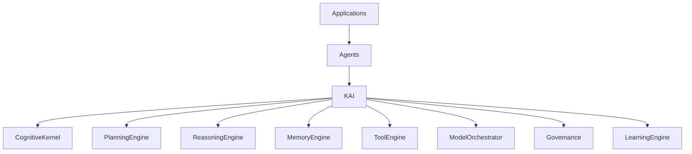

La siguiente capa más lógica y estratégica es **KAI (KAIZEN Artificial Intelligence Framework)**. Mientras KOS define *cómo* se ejecuta el sistema operativo, KAI define *cómo piensa, razona, aprende, planifica y colabora la inteligencia artificial* sobre ese sistema.

---

# KAI-0001 — KAIZEN Artificial Intelligence Framework

# KAIZEN Artificial Intelligence Framework (KAI)

## Arquitectura General de la Plataforma de Inteligencia Artificial Nativa

**Estado:** ⏳ En desarrollo

**Dependencias:**

✅ KDL — KAIZEN Definition Language
✅ KCF — KAIZEN Compiler Framework
✅ KRE — KAIZEN Runtime Environment
✅ KSP — KAIZEN Service Platform
✅ KOS — KAIZEN Operating System

**Siguiente documento:** **KAI-0002 Cognitive Kernel**

**Capa:** Artificial Intelligence Layer

**Clasificación:** Arquitectura Base de Inteligencia Artificial

---

# 1. Propósito

El **KAIZEN Artificial Intelligence Framework (KAI)** define la arquitectura universal para construir, ejecutar, coordinar y gobernar inteligencia artificial dentro del ecosistema KAIZEN.

Mientras KOS administra recursos computacionales, KAI administra capacidades cognitivas.

Su función es convertir modelos de IA, agentes y sistemas de conocimiento en componentes interoperables, observables y gobernados.

**Principio:**

> La inteligencia es un recurso del sistema operativo y debe gestionarse como tal.

---

# 2. Evolución del Estándar

```text
KDL
↓
Lenguaje

KCF
↓
Compilador

KRE
↓
Runtime

KSP
↓
Servicios

KOS
↓
Sistema Operativo

KAI
↓
Inteligencia Artificial
```

---

# 3. Objetivos

KAI proporciona:

* Orquestación de modelos.
* Razonamiento.
* Planificación.
* Memoria cognitiva.
* Coordinación de agentes.
* Aprendizaje.
* Gestión de herramientas.
* Gobernanza de IA.
* Seguridad cognitiva.
* Observabilidad de decisiones.

---

# 4. Arquitectura General



---

# 5. Componentes Principales

El framework se compone de:

* Cognitive Kernel.
* Reasoning Engine.
* Planning Engine.
* Memory Engine.
* Model Orchestrator.
* Tool Engine.
* Learning Engine.
* Knowledge Integration Layer.
* Multi-Agent Coordinator.
* AI Governance Engine.

---

# 6. Filosofía Arquitectónica

Toda inteligencia debe ser:

* Modular.
* Explicable.
* Auditada.
* Gobernada.
* Sustituible.
* Distribuida.
* Observable.

Los modelos de IA nunca se integran directamente con las aplicaciones; siempre lo hacen mediante KAI.

---

# 7. Modelo Cognitivo

```text
Percepción

↓

Memoria

↓

Razonamiento

↓

Planificación

↓

Decisión

↓

Acción

↓

Aprendizaje
```

Cada fase es un componente independiente.

---

# 8. Inteligencia como Servicio

KAI abstrae cualquier proveedor de IA.

Ejemplos:

* Modelos fundacionales.
* Modelos locales.
* Modelos especializados.
* Modelos multimodales.
* Motores de inferencia.
* Sistemas simbólicos.

Las aplicaciones consumen capacidades cognitivas, no implementaciones concretas.

---

# 9. Integración con KOS

KOS administra:

* CPU.
* GPU.
* Memoria.
* Procesos.
* Recursos.

KAI administra:

* Contexto.
* Modelos.
* Agentes.
* Decisiones.
* Objetivos.
* Planes.

---

# 10. Modelo Universal de IA

Todo componente inteligente implementa un contrato común.

```text
Input

↓

Context

↓

Reasoning

↓

Decision

↓

Execution

↓

Feedback
```

Esto permite intercambiar motores sin modificar las aplicaciones.

---

# 11. Gobernanza

Toda decisión puede asociarse con:

* Identidad del agente.
* Modelo utilizado.
* Evidencias.
* Herramientas empleadas.
* Restricciones aplicadas.
* Nivel de confianza.
* Fecha y versión.

---

# 12. Observabilidad

KAI registra:

* Prompts.
* Contexto utilizado.
* Herramientas invocadas.
* Modelos seleccionados.
* Coste.
* Tiempo.
* Calidad.
* Resultado.

---

# 13. Integración con KSP

Utiliza:

* Knowledge Platform.
* Identity.
* Billing.
* Marketplace.
* Model Registry.
* Policy Engine.

---

# 14. Integración con KRE

Los agentes inteligentes son ejecutados por KRE.

KAI define su comportamiento cognitivo.

---

# 15. Integración con KDL

KDL describe:

* Agentes.
* Objetivos.
* Herramientas.
* Políticas.
* Restricciones.

KAI interpreta y ejecuta estas definiciones.

---

# 16. Objetivos No Funcionales

Debe garantizar:

* Escalabilidad.
* Baja latencia.
* Explicabilidad.
* Seguridad.
* Trazabilidad.
* Reproducibilidad.
* Compatibilidad con múltiples modelos.

---

# 17. Principios Arquitectónicos

## AI Native

Toda la arquitectura está diseñada para IA desde el origen.

## Model Agnostic

No depende de un proveedor específico.

## Multi-Agent

Los agentes colaboran bajo reglas comunes.

## Explainable

Las decisiones deben poder justificarse.

## Governed

La IA está sujeta a políticas y auditoría.

## Evolutivo

Nuevos modelos y técnicas pueden incorporarse sin romper la plataforma.

---

# 18. Resultado del Documento

Con **KAI-0001** queda definida la arquitectura base del framework de inteligencia artificial:

✅ Arquitectura general.
✅ Componentes principales.
✅ Modelo cognitivo.
✅ Inteligencia como servicio.
✅ Gobernanza.
✅ Observabilidad.
✅ Integración con KDL, KRE, KSP y KOS.
✅ Principios arquitectónicos.
✅ Objetivos funcionales y no funcionales.

---

# Estado de la Serie KAI

| Documento                              | Estado      |
| -------------------------------------- | ----------- |
| **KAI-0001 AI Framework Architecture** | ✅ Completo  |
| KAI-0002 Cognitive Kernel              | ⏳ Siguiente |
| KAI-0003 Reasoning Engine              | Pendiente   |
| KAI-0004 Planning Engine               | Pendiente   |
| KAI-0005 Memory Engine                 | Pendiente   |
| KAI-0006 Model Orchestrator            | Pendiente   |
| KAI-0007 Multi-Agent Coordinator       | Pendiente   |
| KAI-0008 Learning Engine               | Pendiente   |
| KAI-0009 AI Governance                 | Pendiente   |
| KAI-0010 AI Conformance                | Pendiente   |

---

# Próximo documento oficial

## **KAI-0002 — Cognitive Kernel**

Definirá el núcleo cognitivo de KAIZEN, incluyendo:

* Arquitectura cognitiva.
* Ciclo percepción–razonamiento–acción.
* Gestión de objetivos e intenciones.
* Contexto de trabajo.
* Toma de decisiones.
* Control ejecutivo.
* Gestión de atención y prioridades.
* Interfaces cognitivas internas.
* Coordinación con memoria, planificación y herramientas.
* Garantías de explicabilidad y determinismo cognitivo.

Este documento establecerá el corazón cognitivo de KAIZEN, responsable de coordinar todas las capacidades de razonamiento e inteligencia del ecosistema.
