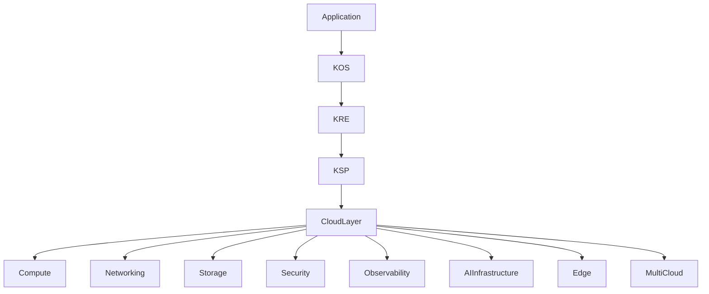
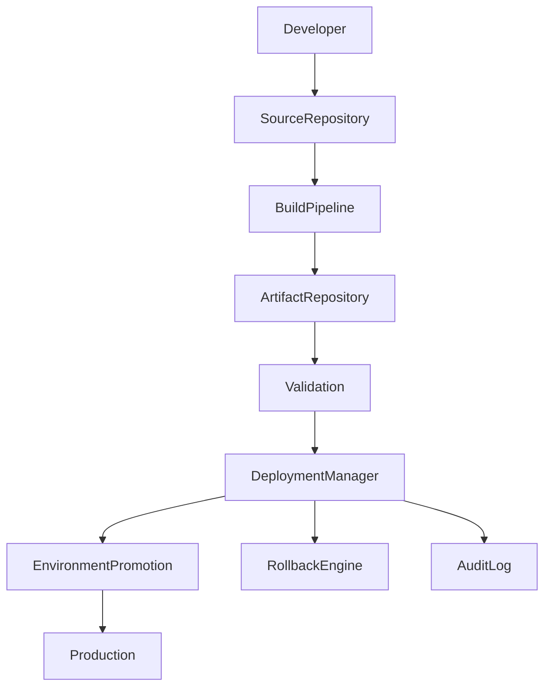
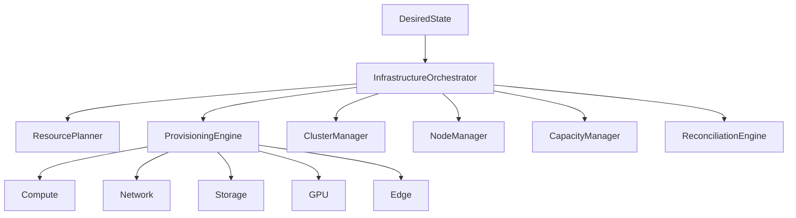
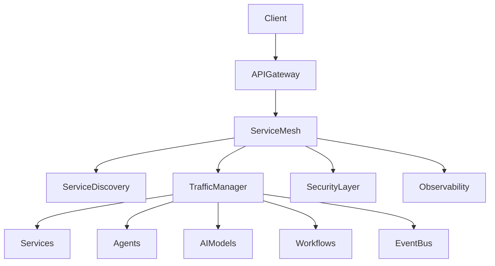
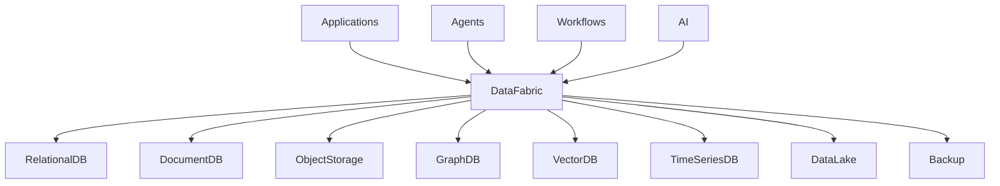
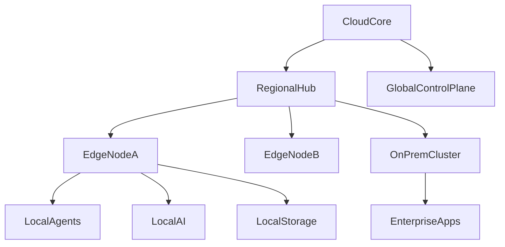
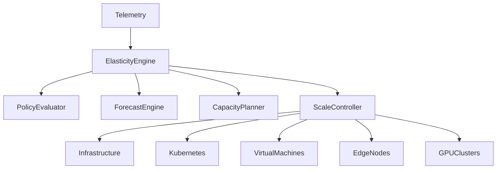
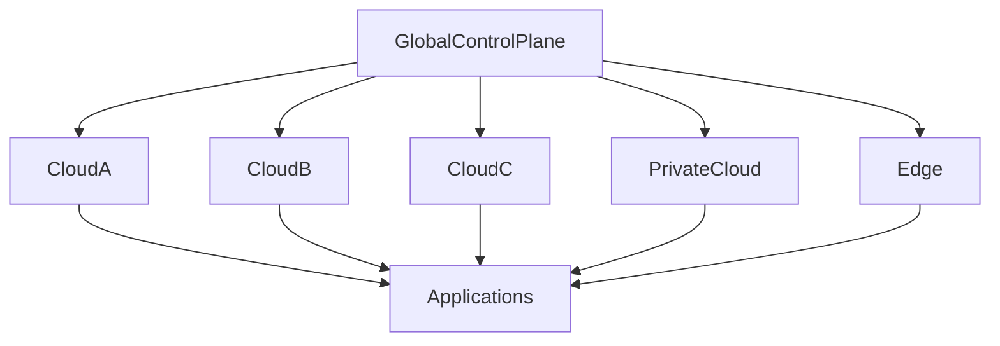
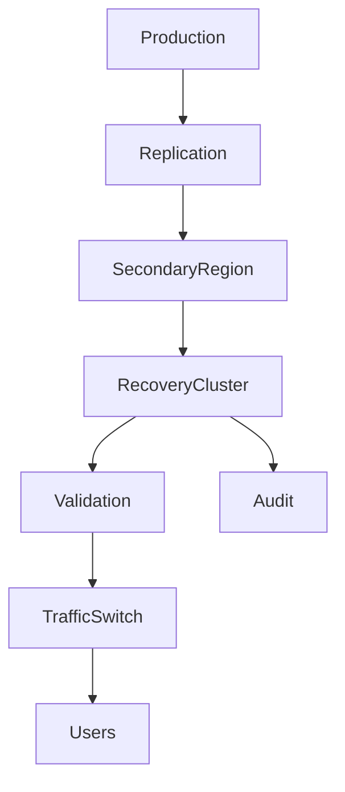

# KCL-0001 — Cloud Architecture

# KAIZEN Cloud Layer (KCL)

## Arquitectura Universal de Infraestructura Cloud para el Ecosistema KAIZEN

**Estado:** ⏳ En desarrollo

**Dependencias:**

✅ KDL — KAIZEN Definition Language
✅ KCF — KAIZEN Compiler Framework
✅ KRE — KAIZEN Runtime Environment
✅ KSP — KAIZEN Service Platform
✅ KOS — KAIZEN Operating System
✅ KAI — KAIZEN Artificial Intelligence Framework

**Siguiente documento:** **KCL-0002 Deployment Manager**

**Capa:** Cloud Infrastructure Layer

**Clasificación:** Arquitectura Universal Cloud

---

# 1. Propósito

La **KAIZEN Cloud Layer (KCL)** define la arquitectura estándar para desplegar, operar y escalar cualquier implementación del ecosistema KAIZEN sobre infraestructuras cloud, híbridas, edge o on-premise.

Su misión es proporcionar una abstracción uniforme de infraestructura, eliminando el acoplamiento con proveedores específicos y permitiendo portabilidad, resiliencia y escalabilidad global.

**Principio:**

> Las aplicaciones KAIZEN deben ejecutarse de la misma manera, independientemente del proveedor o la infraestructura subyacente.

---

# 2. Objetivos

La arquitectura cloud debe garantizar:

* Independencia del proveedor.
* Infraestructura declarativa.
* Despliegue reproducible.
* Escalabilidad automática.
* Alta disponibilidad.
* Recuperación ante desastres.
* Seguridad por diseño.
* Observabilidad integral.
* Optimización de costes.

---

# 3. Arquitectura General



---

# 4. Principios Fundamentales

## Cloud Agnostic

La infraestructura nunca depende de un único proveedor.

---

## Declarative Infrastructure

Toda infraestructura se define mediante especificaciones declarativas.

---

## Immutable Infrastructure

La infraestructura se reemplaza, no se modifica manualmente.

---

## Elastic by Default

Todos los componentes deben poder escalar automáticamente.

---

## Zero Trust

Toda comunicación requiere autenticación y autorización.

---

## Self-Healing

La plataforma debe recuperarse automáticamente ante fallos.

---

# 5. Modelo Universal de Infraestructura

Toda implementación KCL se organiza en:

```text
Organization

↓

Environment

↓

Region

↓

Cluster

↓

Namespace

↓

Application

↓

Services

↓

Resources
```

---

# 6. Entornos

El estándar define los siguientes entornos:

* Local.
* Desarrollo.
* Integración.
* QA.
* Preproducción.
* Producción.
* Recuperación ante desastres.

Cada entorno mantiene aislamiento completo.

---

# 7. Regiones

Una implementación puede ejecutarse en múltiples regiones.

Ejemplo:

```text
us-east

↓

eu-west

↓

sa-east

↓

asia-south
```

Cada región puede operar de manera independiente.

---

# 8. Modelo de Clúster

Cada región puede contener múltiples clústeres.

Tipos:

* Producción.
* IA.
* GPU.
* Edge.
* Desarrollo.
* Batch.
* Analítica.

Los clústeres pueden escalar horizontalmente.

---

# 9. Componentes de Infraestructura

Toda instalación incluye:

* Compute.
* Networking.
* Storage.
* Identity.
* Secret Management.
* Observabilidad.
* Event Bus.
* API Gateway.
* Service Mesh.
* AI Runtime.

---

# 10. Modelo de Recursos

Todo recurso posee:

* Identificador.
* Organización.
* Región.
* Etiquetas.
* Políticas.
* Cuotas.
* Estado.
* Coste asociado.

---

# 11. Multi-Tenant

El aislamiento entre organizaciones es obligatorio.

Cada tenant dispone de:

* Espacios de nombres.
* Secretos.
* Políticas.
* Recursos.
* Memoria.
* Datos.
* Observabilidad.

No existe acceso cruzado salvo autorización explícita.

---

# 12. Compatibilidad

La arquitectura puede implementarse sobre:

* Kubernetes.
* Máquinas virtuales.
* Bare Metal.
* Edge Computing.
* Plataformas serverless.
* Entornos híbridos.

El estándar no obliga a una tecnología concreta.

---

# 13. Seguridad

Toda infraestructura debe incorporar:

* Gestión de identidades.
* Zero Trust.
* Cifrado.
* Gestión de certificados.
* Políticas de red.
* Escaneo continuo.
* Gestión de secretos.

---

# 14. Alta Disponibilidad

Debe soportar:

* Redundancia regional.
* Balanceo global.
* Réplicas automáticas.
* Recuperación automática.
* Actualizaciones sin interrupción.

---

# 15. Observabilidad

Todos los componentes exponen:

* Logs.
* Métricas.
* Trazas.
* Eventos.
* Estado.
* Costes.
* Consumo energético.

---

# 16. Optimización

La infraestructura optimiza:

* Coste.
* CPU.
* GPU.
* Memoria.
* Almacenamiento.
* Tráfico.
* Latencia.
* Energía.

---

# 17. API Conceptual

Crear entorno:

```typescript
Cloud.createEnvironment({

name:"production"

})
```

Desplegar aplicación:

```typescript
Cloud.deploy({

application:"LAJAM"

})
```

Escalar recursos:

```typescript
Cloud.scale({

service:"reasoning-engine"

})
```

---

# 18. Objetivos No Funcionales

La plataforma debe garantizar:

* Disponibilidad ≥ 99.99%.
* Escalabilidad horizontal.
* Recuperación automática.
* Despliegues reproducibles.
* Seguridad por defecto.
* Baja latencia global.
* Portabilidad.

---

# 19. Principios Arquitectónicos

## Infrastructure as Code

Toda infraestructura es código.

## Everything Observable

Todo componente genera telemetría.

## Elastic Cloud

La capacidad se adapta dinámicamente.

## Multi-Cloud Ready

Compatible con múltiples proveedores.

## Secure by Default

La seguridad está integrada desde el diseño.

## Portable

Las aplicaciones pueden migrarse sin cambios funcionales.

---

# 20. Resultado del Documento

Con **KCL-0001** queda definida:

✅ Arquitectura universal cloud.
✅ Modelo de infraestructura.
✅ Organización por regiones y clústeres.
✅ Compatibilidad multi-cloud e híbrida.
✅ Seguridad Zero Trust.
✅ Alta disponibilidad.
✅ Observabilidad integrada.
✅ Modelo multi-tenant.
✅ Principios de infraestructura declarativa e inmutable.

---

# Estado de la Serie KCL

| Documento                            | Estado      |
| ------------------------------------ | ----------- |
| **KCL-0001 Cloud Architecture**      | ✅ Completo  |
| KCL-0002 Deployment Manager          | ⏳ Siguiente |
| KCL-0003 Infrastructure Orchestrator | Pendiente   |
| KCL-0004 Networking & Service Mesh   | Pendiente   |
| KCL-0005 Storage & Data Fabric       | Pendiente   |
| KCL-0006 Edge & Hybrid Computing     | Pendiente   |
| KCL-0007 Autoscaling & Elasticity    | Pendiente   |
| KCL-0008 Multi-Cloud Federation      | Pendiente   |
| KCL-0009 Disaster Recovery Cloud     | Pendiente   |
| KCL-0010 Cloud Conformance           | Pendiente   |

---

# Estado Global del Estándar KAIZEN

Capas completadas:

* ✅ KDL — Lenguaje
* ✅ KCF — Compilador
* ✅ KRE — Runtime
* ✅ KSP — Plataforma de Servicios
* ✅ KOS — Sistema Operativo
* ✅ KAI — Framework de Inteligencia Artificial

En desarrollo:

* ⏳ **KCL — Cloud Layer**

---

# Próximo documento oficial

## **KCL-0002 — Deployment Manager**

Este documento definirá el sistema universal de despliegue de KAIZEN, incluyendo:

* Despliegues declarativos.
* Gestión de versiones.
* Estrategias Blue/Green, Canary y Rolling Update.
* Despliegues progresivos.
* Gestión de artefactos.
* Promoción entre entornos.
* Rollback automático.
* Validación previa y posterior al despliegue.
* Integración con CI/CD.
* Auditoría completa del ciclo de despliegue.

Con **KCL-0002** se establecerá el estándar para realizar despliegues seguros, reproducibles y automatizados en cualquier infraestructura compatible con KAIZEN.


# KCL-0002 — Deployment Manager

# KAIZEN Cloud Layer (KCL)

## Sistema Universal de Despliegue, Promoción y Gestión de Releases

**Estado:** ⏳ En desarrollo

**Dependencias:**

✅ KDL — KAIZEN Definition Language
✅ KCF — KAIZEN Compiler Framework
✅ KRE — KAIZEN Runtime Environment
✅ KSP — KAIZEN Service Platform
✅ KOS — KAIZEN Operating System
✅ KAI — KAIZEN Artificial Intelligence Framework
✅ KCL-0001 Cloud Architecture

**Siguiente documento:** **KCL-0003 Infrastructure Orchestrator**

**Capa:** Cloud Deployment Layer

**Clasificación:** Gestor Universal de Despliegues

---

# 1. Propósito

El **Deployment Manager (DM)** define el proceso estándar para construir, validar, distribuir, desplegar, promover y retirar versiones de aplicaciones, servicios y componentes del ecosistema KAIZEN.

Su objetivo es garantizar despliegues repetibles, seguros, auditables y reversibles en cualquier infraestructura compatible con KCL.

**Principio:**

> Todo despliegue debe ser declarativo, verificable y completamente reversible.

---

# 2. Arquitectura General



---

# 3. Ciclo de Vida de un Despliegue

```text
Código

↓

Compilación

↓

Pruebas

↓

Empaquetado

↓

Firma

↓

Repositorio

↓

Validación

↓

Despliegue

↓

Verificación

↓

Promoción

↓

Producción
```

---

# 4. Modelo Universal de Release

Cada release contiene:

* Identificador.
* Versión.
* Artefactos.
* Dependencias.
* Cambios.
* Firmas digitales.
* Evidencias.
* Estado.
* Historial.

Las releases son inmutables una vez publicadas.

---

# 5. Gestión de Artefactos

El Deployment Manager administra:

* Imágenes de contenedores.
* Paquetes KDL/KCF.
* Workflows.
* Agentes.
* Modelos de IA.
* Extensiones.
* Archivos de configuración.

Cada artefacto se almacena con hash criptográfico y firma digital.

---

# 6. Estrategias de Despliegue

## Rolling Update

Actualización gradual de instancias sin interrupción.

---

## Blue/Green

Dos entornos idénticos donde el tráfico cambia al nuevo entorno tras la validación.

---

## Canary

El nuevo despliegue se libera inicialmente a un pequeño porcentaje de usuarios.

---

## Shadow Deployment

La nueva versión recibe tráfico en paralelo sin afectar a los usuarios.

---

## Progressive Delivery

El porcentaje de tráfico aumenta automáticamente según métricas de salud.

---

# 7. Promoción entre Entornos

El flujo recomendado es:

```text
Local

↓

Development

↓

Integration

↓

QA

↓

Preproduction

↓

Production
```

Cada promoción requiere superar las validaciones configuradas.

---

# 8. Validación Previa

Antes del despliegue se ejecutan:

* Compilación.
* Análisis estático.
* Escaneo de seguridad.
* Validación de políticas.
* Pruebas unitarias.
* Pruebas de integración.
* Validación de infraestructura.
* Verificación de firmas.

---

# 9. Validación Posterior

Después del despliegue:

* Health Checks.
* Smoke Tests.
* Validación funcional.
* Métricas de rendimiento.
* Consumo de recursos.
* Latencia.
* Integridad de datos.

Solo tras superar estas verificaciones el despliegue se considera exitoso.

---

# 10. Rollback Automático

El sistema puede revertir automáticamente un despliegue cuando detecta:

* Fallos funcionales.
* Incremento de errores.
* Degradación del rendimiento.
* Violaciones de políticas.
* Pérdida de disponibilidad.

El rollback restaura la versión estable anterior con trazabilidad completa.

---

# 11. Gestión de Configuración

La configuración se separa del código.

Incluye:

* Variables de entorno.
* Secretos.
* Feature Flags.
* Parámetros de despliegue.
* Configuración regional.

---

# 12. Gestión de Secretos

Los secretos nunca forman parte de los artefactos.

Se gestionan mediante un servicio dedicado con:

* Rotación.
* Versionado.
* Auditoría.
* Cifrado.

---

# 13. Integración con CI/CD

El Deployment Manager se integra con cualquier plataforma CI/CD mediante interfaces estándar.

Etapas típicas:

1. Build.
2. Test.
3. Security Scan.
4. Package.
5. Sign.
6. Publish.
7. Deploy.
8. Verify.
9. Promote.

---

# 14. Gestión de Releases

Cada release mantiene:

* Estado.
* Entornos desplegados.
* Fecha.
* Responsable.
* Evidencias.
* Incidencias.
* Rollbacks realizados.

---

# 15. Auditoría

Toda operación queda registrada:

* Usuario o agente.
* Fecha.
* Artefactos.
* Entorno.
* Resultado.
* Evidencias.
* Firma.
* Duración.

---

# 16. API Conceptual

Crear release:

```typescript
Deployment.release({

version:"2.4.0"

})
```

Desplegar:

```typescript
Deployment.deploy({

environment:"production"

})
```

Rollback:

```typescript
Deployment.rollback({

release:"2.4.0"

})
```

---

# 17. Observabilidad

El sistema expone:

* Estado de despliegues.
* Releases activas.
* Rollbacks.
* Tiempos de despliegue.
* Tasa de éxito.
* Errores.
* Consumo de recursos.

---

# 18. Integración

El Deployment Manager trabaja con:

* KCF Compiler.
* KRE Runtime.
* KOS.
* KAI.
* Infrastructure Orchestrator.
* Identity Platform.
* Policy Engine.
* Observability Platform.

---

# 19. Objetivos No Funcionales

Debe garantizar:

* Despliegues reproducibles.
* Alta disponibilidad.
* Rollback inmediato.
* Seguridad.
* Auditoría completa.
* Integridad de artefactos.
* Automatización.

---

# 20. Principios Arquitectónicos

## Immutable Releases

Las releases nunca se modifican.

## Deployment as Code

Todo despliegue es declarativo.

## Progressive Delivery

La exposición al tráfico es gradual y controlada.

## Secure Supply Chain

Toda la cadena de suministro está protegida.

## Reversible Operations

Toda operación puede revertirse.

## Continuous Delivery

Preparado para despliegue continuo.

---

# 21. Resultado del Documento

Con **KCL-0002** queda definido:

✅ Arquitectura del Deployment Manager.
✅ Ciclo universal de despliegue.
✅ Modelo de releases.
✅ Gestión de artefactos.
✅ Estrategias Blue/Green, Canary, Rolling y Shadow.
✅ Validación previa y posterior.
✅ Rollback automático.
✅ Integración con CI/CD.
✅ Auditoría y observabilidad completas.

---

# Estado de la Serie KCL

| Documento                            | Estado      |
| ------------------------------------ | ----------- |
| KCL-0001 Cloud Architecture          | ✅ Completo  |
| **KCL-0002 Deployment Manager**      | ✅ Completo  |
| KCL-0003 Infrastructure Orchestrator | ⏳ Siguiente |
| KCL-0004 Networking & Service Mesh   | Pendiente   |
| KCL-0005 Storage & Data Fabric       | Pendiente   |
| KCL-0006 Edge & Hybrid Computing     | Pendiente   |
| KCL-0007 Autoscaling & Elasticity    | Pendiente   |
| KCL-0008 Multi-Cloud Federation      | Pendiente   |
| KCL-0009 Disaster Recovery Cloud     | Pendiente   |
| KCL-0010 Cloud Conformance           | Pendiente   |

---

# Próximo documento oficial

## **KCL-0003 — Infrastructure Orchestrator**

Este documento definirá el orquestador universal de infraestructura del ecosistema KAIZEN, incluyendo:

* Aprovisionamiento declarativo de recursos.
* Orquestación de cómputo, almacenamiento y red.
* Gestión de clústeres y nodos.
* Programación de cargas de trabajo.
* Integración con Kubernetes, máquinas virtuales, bare metal y plataformas serverless.
* Automatización del ciclo de vida de la infraestructura.
* Políticas de capacidad y cuotas.
* Optimización de costes y consumo energético.
* Auto-reparación y reconciliación del estado deseado.
* Integración con observabilidad, seguridad y despliegues.

Con **KCL-0003** se establecerá el componente responsable de mantener la infraestructura física y lógica alineada permanentemente con el estado declarado por el ecosistema KAIZEN.


# KCL-0003 — Infrastructure Orchestrator

# KAIZEN Cloud Layer (KCL)

## Orquestador Universal de Infraestructura, Recursos y Estado Declarado

**Estado:** ⏳ En desarrollo

**Dependencias:**

✅ KDL — KAIZEN Definition Language
✅ KCF — KAIZEN Compiler Framework
✅ KRE — KAIZEN Runtime Environment
✅ KSP — KAIZEN Service Platform
✅ KOS — KAIZEN Operating System
✅ KAI — KAIZEN Artificial Intelligence Framework
✅ KCL-0001 Cloud Architecture
✅ KCL-0002 Deployment Manager

**Siguiente documento:** **KCL-0004 Networking & Service Mesh**

**Capa:** Cloud Infrastructure Control Layer

**Clasificación:** Orquestador Universal de Infraestructura

---

# 1. Propósito

El **Infrastructure Orchestrator (IO)** es el componente responsable de administrar el ciclo de vida completo de la infraestructura del ecosistema KAIZEN.

Mientras el **Deployment Manager** despliega aplicaciones, el **Infrastructure Orchestrator** garantiza que los recursos físicos y lógicos existan, permanezcan sincronizados con el estado deseado y evolucionen automáticamente conforme a las políticas definidas.

**Principio:**

> La infraestructura debe converger continuamente hacia el estado declarado, sin intervención manual.

---

# 2. Arquitectura General



---

# 3. Modelo Declarativo

Toda infraestructura se describe mediante un manifiesto.

Ejemplo:

```yaml
infrastructure:

environment: production

region: sa-east

cluster: ai-prod

nodes:

- type: gpu

count: 8

autoscaling: enabled
```

El manifiesto representa el **estado deseado**, nunca la implementación concreta.

---

# 4. Estado Deseado vs Estado Actual

El orquestador compara continuamente:

```text
Estado Declarado

↓

Comparación

↓

Diferencias

↓

Plan de Reconciliación

↓

Aplicación

↓

Nuevo Estado
```

Este proceso es continuo y automático.

---

# 5. Aprovisionamiento

El IO administra recursos como:

* Máquinas virtuales.
* Contenedores.
* Clústeres Kubernetes.
* Bare Metal.
* GPUs.
* TPU.
* Almacenamiento.
* Redes.
* Balanceadores.
* Firewalls.
* Edge Nodes.

---

# 6. Gestión de Clústeres

Cada clúster posee:

* Identificador.
* Región.
* Tipo.
* Estado.
* Políticas.
* Recursos.
* Cuotas.
* Capacidad.

Tipos de clúster:

* Producción.
* IA.
* Batch.
* Desarrollo.
* Edge.
* Analítica.

---

# 7. Gestión de Nodos

Cada nodo mantiene:

* CPU.
* GPU.
* Memoria.
* Disco.
* Estado.
* Etiquetas.
* Cargas activas.
* Consumo energético.

El Node Manager redistribuye cargas cuando detecta saturación.

---

# 8. Planificador de Recursos

El Resource Planner decide dónde ejecutar las cargas considerando:

* CPU disponible.
* GPU libre.
* Memoria.
* Latencia.
* Afinidad.
* Anti-afinidad.
* Coste.
* Región.
* Políticas.
* Consumo energético.

---

# 9. Motor de Reconciliación

El Reconciliation Engine detecta:

* Recursos ausentes.
* Recursos sobrantes.
* Configuración incorrecta.
* Desviaciones.
* Fallos.

Posteriormente aplica las acciones necesarias para restaurar el estado esperado.

---

# 10. Auto-Reparación

Ante un fallo:

```text
Nodo

↓

Detección

↓

Aislamiento

↓

Reemplazo

↓

Redistribución

↓

Validación
```

La recuperación debe ser automática siempre que las políticas lo permitan.

---

# 11. Gestión de Capacidad

El Capacity Manager supervisa:

* CPU.
* GPU.
* RAM.
* Disco.
* Red.
* Consumo energético.
* Coste.
* Saturación.

Puede recomendar expansión o reducción automática.

---

# 12. Gestión de Cuotas

Cada organización posee límites configurables para:

* CPU.
* GPU.
* Memoria.
* Almacenamiento.
* Tráfico.
* Modelos IA.
* Agentes.
* Workflows.

Las cuotas pueden ser dinámicas.

---

# 13. Optimización

El sistema optimiza continuamente:

* Coste.
* Latencia.
* Utilización.
* Disponibilidad.
* Energía.
* Distribución regional.

---

# 14. Integración con KAI

El Infrastructure Orchestrator reserva recursos especializados para:

* Inferencia.
* Entrenamiento.
* Embeddings.
* OCR.
* Visión.
* Voz.
* Coordinación multiagente.

---

# 15. Integración con Deployment Manager

Antes de desplegar una aplicación:

1. Se valida capacidad.
2. Se aprovisionan recursos.
3. Se verifica disponibilidad.
4. Se autoriza el despliegue.

---

# 16. API Conceptual

Crear infraestructura:

```typescript
Infrastructure.apply({

manifest:file

})
```

Consultar estado:

```typescript
Infrastructure.status({

cluster:"ai-prod"

})
```

Reconcilación:

```typescript
Infrastructure.reconcile({

region:"sa-east"

})
```

---

# 17. Observabilidad

Se registran:

* Recursos creados.
* Recursos eliminados.
* Eventos.
* Reconciliaciones.
* Auto-reparaciones.
* Costes.
* Energía.
* Capacidad.
* Saturación.

---

# 18. Integración

El Infrastructure Orchestrator trabaja con:

* Deployment Manager.
* Cloud Scheduler.
* Policy Engine.
* Identity Platform.
* Security Platform.
* Observability Platform.
* AI Infrastructure.
* Service Mesh.

---

# 19. Objetivos No Funcionales

Debe garantizar:

* Alta disponibilidad.
* Escalabilidad horizontal.
* Auto-reparación.
* Baja latencia.
* Portabilidad.
* Seguridad.
* Infraestructura reproducible.

---

# 20. Principios Arquitectónicos

## Desired State First

El estado declarado gobierna toda la infraestructura.

## Self-Healing

La plataforma se recupera automáticamente.

## Elastic Resources

Los recursos evolucionan dinámicamente.

## Cloud Neutral

Compatible con cualquier proveedor.

## Policy Driven

Toda acción respeta las políticas organizacionales.

## Infrastructure as Code

Toda infraestructura es código declarativo.

---

# 21. Resultado del Documento

Con **KCL-0003** queda definido:

✅ Arquitectura del Infrastructure Orchestrator.
✅ Modelo declarativo de infraestructura.
✅ Gestión de clústeres y nodos.
✅ Aprovisionamiento automático.
✅ Motor de reconciliación.
✅ Auto-reparación.
✅ Gestión de capacidad y cuotas.
✅ Optimización continua.
✅ Integración con despliegues e IA.

---

# Estado de la Serie KCL

| Documento                                | Estado      |
| ---------------------------------------- | ----------- |
| KCL-0001 Cloud Architecture              | ✅ Completo  |
| KCL-0002 Deployment Manager              | ✅ Completo  |
| **KCL-0003 Infrastructure Orchestrator** | ✅ Completo  |
| KCL-0004 Networking & Service Mesh       | ⏳ Siguiente |
| KCL-0005 Storage & Data Fabric           | Pendiente   |
| KCL-0006 Edge & Hybrid Computing         | Pendiente   |
| KCL-0007 Autoscaling & Elasticity        | Pendiente   |
| KCL-0008 Multi-Cloud Federation          | Pendiente   |
| KCL-0009 Disaster Recovery Cloud         | Pendiente   |
| KCL-0010 Cloud Conformance               | Pendiente   |

---

# Próximo documento oficial

## **KCL-0004 — Networking & Service Mesh**

Este documento definirá la arquitectura universal de comunicaciones del ecosistema KAIZEN, incluyendo:

* Red lógica distribuida.
* Descubrimiento de servicios.
* Service Mesh.
* Balanceo de carga.
* API Gateway.
* Gestión de tráfico este-oeste y norte-sur.
* mTLS y Zero Trust Networking.
* Políticas de red.
* Observabilidad de comunicaciones.
* Integración con entornos multi-región, edge y multi-cloud.

Con **KCL-0004** se establecerá el estándar de comunicación segura, resiliente y observable entre todos los componentes del ecosistema KAIZEN.


# KCL-0004 — Networking & Service Mesh

# KAIZEN Cloud Layer (KCL)

## Arquitectura Universal de Redes, Comunicaciones y Malla de Servicios

**Estado:** ⏳ En desarrollo

**Dependencias:**

✅ KDL — KAIZEN Definition Language
✅ KCF — KAIZEN Compiler Framework
✅ KRE — KAIZEN Runtime Environment
✅ KSP — KAIZEN Service Platform
✅ KOS — KAIZEN Operating System
✅ KAI — KAIZEN Artificial Intelligence Framework
✅ KCL-0001 Cloud Architecture
✅ KCL-0002 Deployment Manager
✅ KCL-0003 Infrastructure Orchestrator

**Siguiente documento:** **KCL-0005 Storage & Data Fabric**

**Capa:** Cloud Networking Layer

**Clasificación:** Arquitectura Universal de Comunicaciones

---

# 1. Propósito

El **Networking & Service Mesh (NSM)** define la infraestructura de comunicación del ecosistema KAIZEN.

Su función es proporcionar conectividad segura, resiliente, observable y desacoplada entre aplicaciones, agentes, servicios, modelos de IA, workflows y componentes distribuidos.

**Principio:**

> Toda comunicación debe ser autenticada, cifrada, observable y gobernada por políticas, independientemente de la infraestructura física.

---

# 2. Arquitectura General



---

# 3. Objetivos

El NSM proporciona:

* Descubrimiento automático de servicios.
* Enrutamiento inteligente.
* Balanceo de carga.
* Cifrado extremo a extremo.
* Autenticación mutua.
* Control de tráfico.
* Observabilidad distribuida.
* Integración multi-región y multi-cloud.

---

# 4. Modelo Universal de Comunicación

Toda comunicación sigue el siguiente flujo:

```text
Origen

↓

Resolución del servicio

↓

Autenticación

↓

Autorización

↓

Cifrado

↓

Balanceo

↓

Entrega

↓

Observabilidad
```

---

# 5. Descubrimiento de Servicios

Cada servicio registra automáticamente:

* Identificador.
* Dirección lógica.
* Región.
* Versión.
* Estado.
* Capacidades.
* Salud.
* Etiquetas.

El acceso siempre se realiza mediante nombres lógicos, nunca mediante direcciones físicas.

---

# 6. API Gateway

El API Gateway es el punto de entrada para tráfico externo.

Funciones:

* Autenticación.
* Autorización.
* Rate Limiting.
* Validación.
* Transformación.
* Versionado.
* Registro.
* Auditoría.

---

# 7. Service Mesh

El Service Mesh administra la comunicación interna.

Incluye:

* Sidecars o proxies equivalentes.
* Enrutamiento.
* Retries.
* Circuit Breakers.
* Timeouts.
* Balanceo.
* Telemetría.

El estándar no depende de una implementación específica.

---

# 8. Gestión del Tráfico

El Traffic Manager soporta:

## Norte-Sur

Cliente → Plataforma.

## Este-Oeste

Servicio → Servicio.

## Multi-Región

Servicio → Región.

## Edge

Cloud → Edge.

Cada tipo de tráfico puede tener políticas independientes.

---

# 9. Balanceo de Carga

Algoritmos soportados:

* Round Robin.
* Least Connections.
* Weighted.
* Latency Aware.
* Geo Aware.
* Capacity Aware.
* AI Aware (optimizado para cargas de inferencia).

---

# 10. Zero Trust Networking

Toda comunicación requiere:

* Identidad verificable.
* Autenticación mutua (mTLS).
* Políticas explícitas.
* Autorización continua.

No existe confianza implícita entre componentes.

---

# 11. Seguridad

El NSM incorpora:

* mTLS.
* Rotación automática de certificados.
* Gestión de identidades.
* Segmentación lógica.
* Políticas de red.
* Protección contra ataques internos.

---

# 12. Políticas de Comunicación

Ejemplo:

```yaml
network_policy:

allow:

- reasoning-engine

- memory-engine

deny:

- external-access

encryption: required

mtls: required
```

Las políticas son evaluadas antes de establecer cualquier conexión.

---

# 13. Resiliencia

El sistema soporta:

* Retries automáticos.
* Circuit Breakers.
* Failover regional.
* Reintentos exponenciales.
* Balanceo adaptativo.
* Recuperación automática.

---

# 14. Observabilidad

Toda comunicación genera:

* Logs.
* Métricas.
* Trazas distribuidas.
* Latencia.
* Errores.
* Retries.
* Consumo de ancho de banda.
* Dependencias entre servicios.

---

# 15. Integración Multi-Región

El NSM puede enrutar tráfico según:

* Latencia.
* Cercanía geográfica.
* Disponibilidad.
* Coste.
* Políticas regulatorias.
* Capacidad.

---

# 16. Integración con IA

La comunicación con modelos de IA soporta:

* Streaming.
* Inferencias síncronas.
* Inferencias asíncronas.
* Batch.
* GPU Routing.
* Multi-Model Routing.

---

# 17. API Conceptual

Registrar servicio:

```typescript
Network.register({

service:"reasoning-engine"

})
```

Resolver servicio:

```typescript
Network.resolve({

service:"memory-engine"

})
```

Aplicar política:

```typescript
Network.policy({

policy:"zero-trust"

})
```

---

# 18. Integración

El Networking & Service Mesh trabaja con:

* Infrastructure Orchestrator.
* Deployment Manager.
* Identity Platform.
* Policy Engine.
* Observability Platform.
* Event Bus.
* AI Infrastructure.
* API Gateway.

---

# 19. Objetivos No Funcionales

Debe garantizar:

* Latencia mínima.
* Alta disponibilidad.
* Seguridad Zero Trust.
* Escalabilidad horizontal.
* Compatibilidad multi-cloud.
* Observabilidad completa.
* Tolerancia a fallos.

---

# 20. Principios Arquitectónicos

## Service First

Toda comunicación ocurre entre servicios identificables.

## Zero Trust

No existe confianza implícita.

## Secure by Default

Todo tráfico está cifrado.

## Observable Network

Toda comunicación genera telemetría.

## Policy Driven

Las políticas gobiernan el tráfico.

## Cloud Neutral

Compatible con cualquier infraestructura.

---

# 21. Resultado del Documento

Con **KCL-0004** queda definido:

✅ Arquitectura universal de redes.
✅ Descubrimiento de servicios.
✅ API Gateway.
✅ Service Mesh.
✅ Gestión de tráfico norte-sur y este-oeste.
✅ Balanceo inteligente.
✅ Zero Trust Networking con mTLS.
✅ Políticas de red declarativas.
✅ Observabilidad completa de comunicaciones.
✅ Integración multi-región, edge y multi-cloud.

---

# Estado de la Serie KCL

| Documento                              | Estado      |
| -------------------------------------- | ----------- |
| KCL-0001 Cloud Architecture            | ✅ Completo  |
| KCL-0002 Deployment Manager            | ✅ Completo  |
| KCL-0003 Infrastructure Orchestrator   | ✅ Completo  |
| **KCL-0004 Networking & Service Mesh** | ✅ Completo  |
| KCL-0005 Storage & Data Fabric         | ⏳ Siguiente |
| KCL-0006 Edge & Hybrid Computing       | Pendiente   |
| KCL-0007 Autoscaling & Elasticity      | Pendiente   |
| KCL-0008 Multi-Cloud Federation        | Pendiente   |
| KCL-0009 Disaster Recovery Cloud       | Pendiente   |
| KCL-0010 Cloud Conformance             | Pendiente   |

---

# Próximo documento oficial

## **KCL-0005 — Storage & Data Fabric**

Este documento definirá la arquitectura universal de almacenamiento y gestión de datos del ecosistema KAIZEN, incluyendo:

* Data Fabric distribuido.
* Almacenamiento estructurado y no estructurado.
* Bases de datos relacionales, documentales, vectoriales y de grafos.
* Replicación multi-región.
* Consistencia y disponibilidad.
* Gestión del ciclo de vida de los datos.
* Versionado, snapshots y recuperación.
* Cifrado, clasificación y gobierno de datos.
* Integración con IA, RAG y Knowledge Graphs.
* Optimización de rendimiento y costes.

Con **KCL-0005** se establecerá el estándar para una plataforma de datos unificada, resiliente y preparada para aplicaciones empresariales e inteligencia artificial a gran escala.


# KCL-0005 — Storage & Data Fabric

# KAIZEN Cloud Layer (KCL)

## Arquitectura Universal de Almacenamiento, Gestión de Datos y Data Fabric Distribuido

**Estado:** ⏳ En desarrollo

**Dependencias:**

✅ KDL — KAIZEN Definition Language
✅ KCF — KAIZEN Compiler Framework
✅ KRE — KAIZEN Runtime Environment
✅ KSP — KAIZEN Service Platform
✅ KOS — KAIZEN Operating System
✅ KAI — KAIZEN Artificial Intelligence Framework
✅ KCL-0001 Cloud Architecture
✅ KCL-0002 Deployment Manager
✅ KCL-0003 Infrastructure Orchestrator
✅ KCL-0004 Networking & Service Mesh

**Siguiente documento:** **KCL-0006 Edge & Hybrid Computing**

**Capa:** Cloud Data Layer

**Clasificación:** Plataforma Universal de Datos

---

# 1. Propósito

El **Storage & Data Fabric (SDF)** define la arquitectura estándar para almacenar, organizar, proteger, sincronizar y gobernar toda la información del ecosistema KAIZEN.

Su objetivo es proporcionar una capa de datos unificada que abstraiga las tecnologías de almacenamiento subyacentes y permita que aplicaciones, agentes y servicios accedan a la información de manera consistente, segura y eficiente.

**Principio:**

> Los datos pertenecen al negocio; la infraestructura de almacenamiento es un detalle de implementación.

---

# 2. Objetivos

El SDF garantiza:

* Abstracción del almacenamiento.
* Data Fabric distribuido.
* Alta disponibilidad.
* Consistencia configurable.
* Gobierno de datos.
* Seguridad por diseño.
* Optimización de costes.
* Integración nativa con IA.

---

# 3. Arquitectura General



---

# 4. Modelo Universal de Datos

Todo recurso de datos posee:

* Identificador.
* Organización.
* Clasificación.
* Propietario.
* Región.
* Versión.
* Estado.
* Política.
* Metadatos.
* Historial.

---

# 5. Tipos de Almacenamiento

## Relacional

Para datos transaccionales.

Ejemplos:

* Empresas.
* Usuarios.
* Facturación.
* Configuración.

---

## Documental

Para documentos estructurados.

Ejemplos:

* Expedientes.
* JSON.
* Configuración.
* Formularios.

---

## Objetos

Para archivos binarios.

Ejemplos:

* PDF.
* Imágenes.
* Videos.
* Audio.
* Modelos IA.

---

## Grafos

Para relaciones complejas.

Ejemplos:

* Knowledge Graph.
* Dependencias.
* Ontologías.
* Redes organizacionales.

---

## Vectorial

Para búsqueda semántica.

Ejemplos:

* Embeddings.
* RAG.
* Recuperación contextual.
* Similitud.

---

## Series Temporales

Para:

* Telemetría.
* Sensores.
* Métricas.
* Logs.
* Observabilidad.

---

## Data Lake

Para:

* Analítica.
* Big Data.
* IA.
* Entrenamiento.
* Históricos.

---

# 6. Data Fabric

El Data Fabric proporciona una vista lógica unificada de todos los datos, independientemente de su ubicación física.

Funciones:

* Descubrimiento.
* Virtualización.
* Integración.
* Catálogo.
* Linaje.
* Gobierno.

---

# 7. Consistencia

El estándar soporta:

* Consistencia fuerte.
* Consistencia eventual.
* Consistencia configurable por dominio.

Cada servicio declara sus necesidades.

---

# 8. Replicación

Se soportan estrategias:

* Sincrónica.
* Asincrónica.
* Multi-región.
* Multi-cloud.
* Edge.

La política depende de la criticidad del dato.

---

# 9. Versionado

Todo dato puede mantener:

* Versiones.
* Snapshots.
* Historial.
* Auditoría.
* Comparación.
* Restauración.

Las políticas de retención son configurables.

---

# 10. Gobierno de Datos

Cada conjunto de datos define:

* Clasificación.
* Sensibilidad.
* Retención.
* Residencia.
* Propietario.
* Calidad.
* Políticas de acceso.

---

# 11. Seguridad

Toda la información debe:

* Cifrarse en reposo.
* Cifrarse en tránsito.
* Firmarse cuando corresponda.
* Mantener trazabilidad.
* Aplicar control de acceso granular.

---

# 12. Integración con IA

El SDF es la base para:

* RAG.
* Embeddings.
* Knowledge Graphs.
* Memoria organizacional.
* Aprendizaje.
* Fine-tuning.
* Recuperación contextual.

---

# 13. Ciclo de Vida del Dato

```text id="cycle01"
Creación

↓

Validación

↓

Clasificación

↓

Uso

↓

Archivado

↓

Retención

↓

Eliminación Segura
```

Cada transición es gobernada por políticas.

---

# 14. Optimización

El sistema optimiza:

* Coste.
* Rendimiento.
* Latencia.
* Ubicación.
* Replicación.
* Compresión.
* Almacenamiento en frío.

---

# 15. API Conceptual

Guardar:

```typescript id="store01"
Data.store({

collection:"employees",

record:data

})
```

Consultar:

```typescript id="query01"
Data.query({

filter:"status=active"

})
```

Restaurar versión:

```typescript id="restore01"
Data.restore({

version:"v12"

})
```

---

# 16. Observabilidad

El SDF registra:

* Accesos.
* Consultas.
* Escrituras.
* Replicaciones.
* Snapshots.
* Restauraciones.
* Costes.
* Latencia.
* Calidad de datos.

---

# 17. Integración

El Storage & Data Fabric interactúa con:

* Memory Engine.
* Knowledge Platform.
* AI Framework.
* Workflow Runtime.
* Identity Platform.
* Governance Engine.
* Observability Platform.
* Infrastructure Orchestrator.

---

# 18. Objetivos No Funcionales

Debe garantizar:

* Disponibilidad ≥ 99.999%.
* Escalabilidad horizontal.
* Baja latencia.
* Integridad.
* Resiliencia.
* Seguridad.
* Portabilidad.

---

# 19. Principios Arquitectónicos

## Data as an Asset

Los datos son activos estratégicos.

## Unified Fabric

Una vista lógica sobre múltiples tecnologías.

## Security by Default

Protección integrada desde el diseño.

## AI Ready

Preparado para IA desde su arquitectura.

## Governed Data

Todo dato posee políticas explícitas.

## Cloud Neutral

Compatible con cualquier proveedor.

---

# 20. Resultado del Documento

Con **KCL-0005** queda definido:

✅ Arquitectura universal de almacenamiento.
✅ Data Fabric distribuido.
✅ Tipos de almacenamiento especializados.
✅ Gestión de consistencia y replicación.
✅ Versionado y snapshots.
✅ Gobierno y clasificación de datos.
✅ Integración nativa con IA y RAG.
✅ Ciclo de vida completo del dato.
✅ Observabilidad y optimización.

---

# Estado de la Serie KCL

| Documento                            | Estado      |
| ------------------------------------ | ----------- |
| KCL-0001 Cloud Architecture          | ✅ Completo  |
| KCL-0002 Deployment Manager          | ✅ Completo  |
| KCL-0003 Infrastructure Orchestrator | ✅ Completo  |
| KCL-0004 Networking & Service Mesh   | ✅ Completo  |
| **KCL-0005 Storage & Data Fabric**   | ✅ Completo  |
| KCL-0006 Edge & Hybrid Computing     | ⏳ Siguiente |
| KCL-0007 Autoscaling & Elasticity    | Pendiente   |
| KCL-0008 Multi-Cloud Federation      | Pendiente   |
| KCL-0009 Disaster Recovery Cloud     | Pendiente   |
| KCL-0010 Cloud Conformance           | Pendiente   |

---

# Próximo documento oficial

## **KCL-0006 — Edge & Hybrid Computing**

Este documento definirá la arquitectura de ejecución distribuida del ecosistema KAIZEN, incluyendo:

* Edge Computing.
* Edge AI.
* Infraestructura híbrida.
* Sincronización cloud-edge.
* Operación desconectada (offline-first).
* Replicación inteligente.
* Gestión de nodos remotos.
* Distribución de cargas.
* Inferencia local de IA.
* Integración transparente entre edge, on-premise y nube.

Con **KCL-0006** se establecerá el estándar para ejecutar aplicaciones y agentes KAIZEN cerca de donde se generan los datos, reduciendo la latencia y aumentando la resiliencia del sistema distribuido.


# KCL-0006 — Edge & Hybrid Computing

# KAIZEN Cloud Layer (KCL)

## Arquitectura Universal para Edge Computing, Infraestructura Híbrida y Ejecución Distribuida

**Estado:** ⏳ En desarrollo

**Dependencias:**

✅ KDL — KAIZEN Definition Language
✅ KCF — KAIZEN Compiler Framework
✅ KRE — KAIZEN Runtime Environment
✅ KSP — KAIZEN Service Platform
✅ KOS — KAIZEN Operating System
✅ KAI — KAIZEN Artificial Intelligence Framework
✅ KCL-0001 Cloud Architecture
✅ KCL-0002 Deployment Manager
✅ KCL-0003 Infrastructure Orchestrator
✅ KCL-0004 Networking & Service Mesh
✅ KCL-0005 Storage & Data Fabric

**Siguiente documento:** **KCL-0007 Autoscaling & Elasticity**

**Capa:** Edge & Distributed Execution Layer

**Clasificación:** Arquitectura Universal de Computación Distribuida

---

# 1. Propósito

El **Edge & Hybrid Computing Engine (EHCE)** define el estándar para ejecutar aplicaciones, agentes, modelos de IA y servicios KAIZEN en entornos distribuidos, incluyendo nube pública, nube privada, centros de datos locales (on-premise), dispositivos edge y entornos desconectados.

Su objetivo es acercar el procesamiento al origen de los datos, reducir la latencia, mejorar la resiliencia y permitir la continuidad operativa incluso cuando no existe conectividad permanente con la nube.

**Principio:**

> El lugar donde se ejecuta una carga de trabajo debe decidirse dinámicamente según el contexto, las políticas y las capacidades disponibles.

---

# 2. Objetivos

La arquitectura debe proporcionar:

* Ejecución híbrida transparente.
* Sincronización cloud-edge.
* Operación offline-first.
* Inferencia local de IA.
* Baja latencia.
* Resiliencia distribuida.
* Gestión centralizada.
* Seguridad uniforme.

---

# 3. Arquitectura General



---

# 4. Modelo de Infraestructura

El estándar reconoce cinco niveles:

```text
Global Cloud

↓

Regional Cloud

↓

Private Cloud

↓

On-Premise

↓

Edge Node
```

Cada nivel puede ejecutar componentes KAIZEN completos o parciales.

---

# 5. Tipos de Nodos

## Cloud Node

Infraestructura central.

---

## Regional Node

Optimizado para baja latencia regional.

---

## Enterprise Node

Infraestructura privada de la organización.

---

## Edge Node

Procesamiento cercano al origen de los datos.

---

## Mobile Node

Dispositivos móviles capaces de ejecutar agentes o modelos locales.

---

# 6. Distribución Inteligente de Cargas

El sistema evalúa:

* Latencia.
* CPU.
* GPU.
* Memoria.
* Coste.
* Disponibilidad.
* Regulaciones.
* Consumo energético.
* Conectividad.
* Prioridad.

Con base en ello decide dónde ejecutar cada carga.

---

# 7. Edge AI

Los nodos Edge pueden ejecutar:

* Modelos cuantizados.
* LLM compactos.
* Modelos de visión.
* Reconocimiento de voz.
* OCR.
* Embeddings.
* Inferencias en tiempo real.

La nube solo recibe resultados o sincronizaciones cuando es necesario.

---

# 8. Sincronización Cloud-Edge

La sincronización puede ser:

* Tiempo real.
* Programada.
* Bajo demanda.
* Basada en eventos.
* Diferencial.

El sistema transmite únicamente los cambios necesarios.

---

# 9. Operación Offline

Cuando un nodo pierde conectividad:

```text
Conectividad Perdida

↓

Modo Autónomo

↓

Registro Local

↓

Sincronización Diferida

↓

Resolución de Conflictos
```

La continuidad operativa no depende de la nube.

---

# 10. Resolución de Conflictos

El estándar soporta:

* Última escritura válida.
* Prioridad por política.
* Fusión automática.
* Revisión humana.
* Reglas específicas del dominio.

---

# 11. Gestión de Nodos Remotos

Cada nodo mantiene:

* Identidad.
* Región.
* Estado.
* Capacidad.
* Versiones.
* Políticas.
* Certificados.
* Telemetría.

Todos los nodos son administrados desde un plano de control central.

---

# 12. Seguridad

Toda comunicación utiliza:

* mTLS.
* Certificados rotativos.
* Cifrado extremo a extremo.
* Zero Trust.
* Arranque seguro (Secure Boot) cuando el hardware lo soporte.
* Validación de integridad del software.

---

# 13. Distribución de Modelos

Los modelos de IA pueden desplegarse:

* Globalmente.
* Regionalmente.
* Localmente.
* Bajo demanda.
* Según el perfil del nodo.

El sistema mantiene versiones y firmas digitales.

---

# 14. Gestión de Datos

Cada nodo mantiene un subconjunto de datos definido por políticas:

* Caché.
* Réplicas.
* Datos temporales.
* Datos críticos.
* Embeddings locales.

La sincronización respeta las reglas de residencia y gobierno de datos.

---

# 15. API Conceptual

Registrar nodo:

```typescript
Edge.register({

type:"factory-node"

})
```

Sincronizar:

```typescript
Edge.sync({

mode:"incremental"

})
```

Ejecutar inferencia local:

```typescript
Edge.inference({

model:"inspection-ai"

})
```

---

# 16. Observabilidad

El sistema registra:

* Estado de conectividad.
* Latencia.
* Sincronizaciones.
* Conflictos.
* Inferencias locales.
* Consumo energético.
* Estado del hardware.
* Uso de recursos.

---

# 17. Integración

El EHCE interactúa con:

* Infrastructure Orchestrator.
* Deployment Manager.
* Networking & Service Mesh.
* Storage & Data Fabric.
* AI Framework.
* Identity Platform.
* Observability Platform.

---

# 18. Objetivos No Funcionales

Debe garantizar:

* Operación offline.
* Recuperación automática.
* Escalabilidad distribuida.
* Seguridad extremo a extremo.
* Sincronización eficiente.
* Baja latencia.
* Portabilidad.

---

# 19. Principios Arquitectónicos

## Edge First

Las cargas se ejecutan cerca de donde se generan los datos cuando resulta beneficioso.

## Hybrid by Design

La infraestructura híbrida es un requisito de primera clase.

## Autonomous Nodes

Los nodos pueden operar de forma independiente.

## Intelligent Synchronization

Solo se sincroniza la información necesaria.

## Secure Everywhere

La seguridad es uniforme en todos los niveles.

## Cloud Continuity

La nube coordina, pero no constituye un único punto de fallo.

---

# 20. Resultado del Documento

Con **KCL-0006** queda definido:

✅ Arquitectura Edge e híbrida.
✅ Tipos de nodos.
✅ Distribución inteligente de cargas.
✅ Edge AI e inferencia local.
✅ Sincronización cloud-edge.
✅ Operación offline-first.
✅ Resolución de conflictos.
✅ Gestión centralizada de nodos.
✅ Seguridad distribuida.
✅ Integración con el ecosistema KAIZEN.

---

# Estado de la Serie KCL

| Documento                            | Estado      |
| ------------------------------------ | ----------- |
| KCL-0001 Cloud Architecture          | ✅ Completo  |
| KCL-0002 Deployment Manager          | ✅ Completo  |
| KCL-0003 Infrastructure Orchestrator | ✅ Completo  |
| KCL-0004 Networking & Service Mesh   | ✅ Completo  |
| KCL-0005 Storage & Data Fabric       | ✅ Completo  |
| **KCL-0006 Edge & Hybrid Computing** | ✅ Completo  |
| KCL-0007 Autoscaling & Elasticity    | ⏳ Siguiente |
| KCL-0008 Multi-Cloud Federation      | Pendiente   |
| KCL-0009 Disaster Recovery Cloud     | Pendiente   |
| KCL-0010 Cloud Conformance           | Pendiente   |

---

# Próximo documento oficial

## **KCL-0007 — Autoscaling & Elasticity**

Este documento definirá el sistema universal de escalado automático del ecosistema KAIZEN, incluyendo:

* Escalado horizontal y vertical.
* Escalado predictivo basado en IA.
* Gestión automática de capacidad.
* Elasticidad multi-región.
* Optimización de CPU, GPU y memoria.
* Programación dinámica de recursos.
* Balanceo inteligente de cargas.
* Optimización de costes y consumo energético.
* Políticas de escalado declarativas.
* Integración con observabilidad, infraestructura y despliegues.

Con **KCL-0007** se establecerá el estándar para que las plataformas KAIZEN ajusten automáticamente su capacidad de procesamiento según la demanda, manteniendo el equilibrio entre rendimiento, disponibilidad y eficiencia.

# KCL-0007 — Autoscaling & Elasticity

# KAIZEN Cloud Layer (KCL)

## Sistema Universal de Escalado Inteligente, Elasticidad y Optimización Autónoma de Recursos

**Estado:** ⏳ En desarrollo

**Dependencias:**

✅ KDL — KAIZEN Definition Language
✅ KCF — KAIZEN Compiler Framework
✅ KRE — KAIZEN Runtime Environment
✅ KSP — KAIZEN Service Platform
✅ KOS — KAIZEN Operating System
✅ KAI — KAIZEN Artificial Intelligence Framework
✅ KCL-0001 Cloud Architecture
✅ KCL-0002 Deployment Manager
✅ KCL-0003 Infrastructure Orchestrator
✅ KCL-0004 Networking & Service Mesh
✅ KCL-0005 Storage & Data Fabric
✅ KCL-0006 Edge & Hybrid Computing

**Siguiente documento:** **KCL-0008 Multi-Cloud Federation**

**Capa:** Cloud Elasticity Layer

**Clasificación:** Sistema Universal de Elasticidad

---

# 1. Propósito

El **Autoscaling & Elasticity Engine (AEE)** es el componente responsable de ajustar dinámicamente la capacidad computacional del ecosistema KAIZEN en respuesta a cambios en la demanda, eventos operativos y políticas organizacionales.

Su misión es garantizar el equilibrio óptimo entre rendimiento, disponibilidad, resiliencia, consumo energético y coste operativo.

**Principio:**

> La infraestructura debe crecer, reducirse y redistribuirse automáticamente antes de convertirse en un cuello de botella o en un recurso infrautilizado.

---

# 2. Objetivos

El AEE debe proporcionar:

* Escalado automático.
* Elasticidad horizontal y vertical.
* Escalado predictivo mediante IA.
* Optimización de costes.
* Optimización energética.
* Alta disponibilidad.
* Adaptación multi-región.
* Integración con políticas de negocio.

---

# 3. Arquitectura General



---

# 4. Tipos de Escalado

## Horizontal

Agregar o eliminar instancias.

Ejemplo:

```text
4 Pods

↓

8 Pods
```

---

## Vertical

Modificar recursos de una instancia.

Ejemplo:

```text
CPU

4

↓

16
```

---

## Funcional

Mover cargas entre distintos servicios especializados.

---

## Regional

Expandir capacidad hacia otras regiones.

---

## Edge

Migrar procesamiento hacia nodos cercanos al usuario.

---

# 5. Variables Analizadas

El sistema evalúa continuamente:

* CPU.
* GPU.
* RAM.
* Disco.
* Latencia.
* Errores.
* Cola de solicitudes.
* Tiempo de respuesta.
* Coste.
* Consumo energético.
* Temperatura del hardware.
* Saturación de red.

---

# 6. Escalado Predictivo

El **Forecast Engine** utiliza IA para anticipar la demanda considerando:

* Históricos.
* Estacionalidad.
* Eventos programados.
* Tendencias.
* Comportamiento de usuarios.
* Patrones de negocio.

El escalado puede producirse antes de que ocurra el incremento de carga.

---

# 7. Políticas Declarativas

Ejemplo:

```yaml
autoscaling:

min_instances: 2

max_instances: 50

cpu_threshold: 70

gpu_threshold: 80

latency_threshold: 200ms

predictive_scaling: enabled
```

Las políticas son evaluadas de forma continua.

---

# 8. Gestión de Capacidad

El Capacity Planner calcula:

* Capacidad disponible.
* Capacidad reservada.
* Capacidad comprometida.
* Capacidad libre.
* Recursos críticos.

Con base en ello recomienda o ejecuta acciones.

---

# 9. Optimización de GPU

Las cargas de IA consideran:

* Memoria GPU.
* Número de inferencias.
* Modelos activos.
* Tiempo de espera.
* Afinidad del modelo.
* Consumo energético.

El sistema redistribuye inferencias entre aceleradores disponibles.

---

# 10. Balanceo Inteligente

El Balanceador evalúa:

* Latencia.
* Región.
* Capacidad.
* Salud.
* Coste.
* Proximidad al usuario.
* Disponibilidad de GPU.

---

# 11. Gestión Energética

El sistema puede:

* Consolidar cargas.
* Apagar nodos inactivos.
* Reducir consumo.
* Priorizar centros de datos más eficientes.

---

# 12. Optimización de Costes

El AEE analiza:

* Precio por región.
* Coste de GPU.
* Coste de almacenamiento.
* Tráfico de red.
* Horarios.
* Reservas de capacidad.

Puede mover cargas hacia infraestructuras más económicas respetando las políticas.

---

# 13. Escenarios Especiales

Se soportan:

* Eventos masivos.
* Lanzamientos de productos.
* Entrenamiento de modelos.
* Procesamiento batch.
* Recuperación ante desastres.
* Campañas comerciales.

---

# 14. Integración con IA

El sistema adapta automáticamente recursos para:

* LLM.
* Embeddings.
* OCR.
* Visión.
* Audio.
* Multi-Agent Systems.
* Fine-Tuning.

---

# 15. API Conceptual

Escalar:

```typescript
Elasticity.scale({

service:"reasoning-engine"

})
```

Consultar capacidad:

```typescript
Elasticity.capacity({

region:"sa-east"

})
```

Actualizar política:

```typescript
Elasticity.policy({

policy:"high-availability"

})
```

---

# 16. Observabilidad

Se registran:

* Eventos de escalado.
* Recursos creados.
* Recursos eliminados.
* Tiempo de reacción.
* Costes.
* Consumo energético.
* Rendimiento.
* Predicciones.

---

# 17. Integración

El Autoscaling Engine trabaja con:

* Infrastructure Orchestrator.
* Deployment Manager.
* Networking.
* Storage.
* AI Framework.
* Observability Platform.
* Policy Engine.

---

# 18. Objetivos No Funcionales

Debe garantizar:

* Escalado < 30 segundos.
* Disponibilidad ≥ 99.99%.
* Optimización automática.
* Baja latencia.
* Alta eficiencia energética.
* Portabilidad.

---

# 19. Principios Arquitectónicos

## Elastic by Default

Toda carga es escalable.

## Predict Before React

La IA anticipa la demanda.

## Cost Aware

Las decisiones consideran el coste.

## Energy Efficient

La energía es un recurso optimizable.

## Policy Driven

Las políticas gobiernan el escalado.

## Self Optimizing

La plataforma aprende y mejora continuamente.

---

# 20. Resultado del Documento

Con **KCL-0007** queda definido:

✅ Escalado horizontal y vertical.
✅ Escalado predictivo mediante IA.
✅ Gestión dinámica de capacidad.
✅ Optimización de GPU y cargas IA.
✅ Balanceo inteligente.
✅ Optimización energética.
✅ Optimización de costes.
✅ Políticas declarativas de elasticidad.
✅ Observabilidad completa del proceso de escalado.

---

# Estado de la Serie KCL

| Documento                             | Estado      |
| ------------------------------------- | ----------- |
| KCL-0001 Cloud Architecture           | ✅ Completo  |
| KCL-0002 Deployment Manager           | ✅ Completo  |
| KCL-0003 Infrastructure Orchestrator  | ✅ Completo  |
| KCL-0004 Networking & Service Mesh    | ✅ Completo  |
| KCL-0005 Storage & Data Fabric        | ✅ Completo  |
| KCL-0006 Edge & Hybrid Computing      | ✅ Completo  |
| **KCL-0007 Autoscaling & Elasticity** | ✅ Completo  |
| KCL-0008 Multi-Cloud Federation       | ⏳ Siguiente |
| KCL-0009 Disaster Recovery Cloud      | Pendiente   |
| KCL-0010 Cloud Conformance            | Pendiente   |

---

# Próximo documento oficial

## **KCL-0008 — Multi-Cloud Federation**

Este documento definirá el estándar para operar una única plataforma KAIZEN sobre múltiples proveedores de infraestructura de forma simultánea, incluyendo:

* Federación multi-cloud.
* Plano de control unificado.
* Descubrimiento de recursos entre nubes.
* Migración transparente de cargas.
* Replicación de datos entre proveedores.
* Políticas de residencia y soberanía de datos.
* Balanceo global entre clouds.
* Optimización automática de coste y rendimiento.
* Continuidad operativa ante fallos de un proveedor.
* Integración con infraestructura híbrida y edge.

Con **KCL-0008** se establecerá la base para que una implementación KAIZEN pueda funcionar como una única plataforma lógica, distribuida entre múltiples nubes públicas, privadas y entornos híbridos sin dependencia de un proveedor específico.


# KCL-0008 — Multi-Cloud Federation

# KAIZEN Cloud Layer (KCL)

## Arquitectura Universal para Federación Multi-Cloud, Soberanía de Datos y Operación Distribuida

**Estado:** ⏳ En desarrollo

**Dependencias:**

✅ KDL — KAIZEN Definition Language
✅ KCF — KAIZEN Compiler Framework
✅ KRE — KAIZEN Runtime Environment
✅ KSP — KAIZEN Service Platform
✅ KOS — KAIZEN Operating System
✅ KAI — KAIZEN Artificial Intelligence Framework
✅ KCL-0001 — Cloud Architecture
✅ KCL-0002 — Deployment Manager
✅ KCL-0003 — Infrastructure Orchestrator
✅ KCL-0004 — Networking & Service Mesh
✅ KCL-0005 — Storage & Data Fabric
✅ KCL-0006 — Edge & Hybrid Computing
✅ KCL-0007 — Autoscaling & Elasticity

**Siguiente documento:** **KCL-0009 Disaster Recovery Cloud**

**Capa:** Multi-Cloud Federation Layer

**Clasificación:** Federación Universal Multi-Cloud

---

# 1. Propósito

El **Multi-Cloud Federation Engine (MCFE)** permite que una implementación KAIZEN opere como una única plataforma lógica distribuida entre múltiples proveedores cloud, centros de datos privados, infraestructuras híbridas y nodos edge.

La federación abstrae las diferencias entre proveedores, garantizando continuidad operativa, portabilidad y cumplimiento normativo.

**Principio:**

> La nube es un recurso intercambiable; la plataforma KAIZEN permanece consistente independientemente del proveedor.

---

# 2. Objetivos

El MCFE proporciona:

* Federación multi-cloud.
* Gestión unificada.
* Portabilidad de cargas.
* Soberanía de datos.
* Optimización de costes.
* Alta disponibilidad global.
* Balanceo inteligente.
* Continuidad del negocio.

---

# 3. Arquitectura General



---

# 4. Modelo Federado

La infraestructura se organiza como:

```text
Federation

↓

Cloud Provider

↓

Region

↓

Cluster

↓

Namespace

↓

Services

↓

Resources
```

Cada proveedor mantiene su autonomía física mientras participa en una federación lógica.

---

# 5. Plano de Control Global

El **Global Control Plane** administra:

* Inventario.
* Recursos.
* Identidades.
* Políticas.
* Despliegues.
* Observabilidad.
* Seguridad.
* Costes.

No ejecuta cargas de trabajo; coordina la federación.

---

# 6. Descubrimiento de Recursos

Cada proveedor publica:

* Regiones.
* Capacidades.
* CPU.
* GPU.
* Almacenamiento.
* Redes.
* Servicios disponibles.
* Costes estimados.
* Estado de salud.

Esta información alimenta el planificador global.

---

# 7. Portabilidad de Cargas

Las aplicaciones pueden migrar entre proveedores sin cambios funcionales.

Se soportan:

* Migración planificada.
* Migración por coste.
* Migración por latencia.
* Migración por capacidad.
* Migración por desastre.

---

# 8. Balanceo Global

El tráfico puede distribuirse considerando:

* Latencia.
* Ubicación geográfica.
* Estado de salud.
* Coste operativo.
* Capacidad disponible.
* Requisitos regulatorios.

---

# 9. Soberanía y Residencia de Datos

Las políticas permiten definir:

* País permitido.
* Región obligatoria.
* Restricciones regulatorias.
* Proveedores autorizados.
* Niveles de cifrado.

Ejemplo:

```yaml
data_policy:

country: Colombia

allowed_providers:

- PrivateCloud

- CloudB

cross_border_transfer: denied
```

---

# 10. Replicación Multi-Cloud

Se soporta:

* Replicación síncrona.
* Replicación asíncrona.
* Réplicas activas.
* Réplicas pasivas.
* Replicación selectiva por dominio.

---

# 11. Optimización de Costes

El sistema compara continuamente:

* Precio por CPU.
* Precio por GPU.
* Coste de almacenamiento.
* Coste de red.
* Coste energético.
* Coste por región.

Las cargas pueden redistribuirse automáticamente si las políticas lo permiten.

---

# 12. Continuidad Operativa

Ante la pérdida de un proveedor:

```text
Fallo Detectado

↓

Evaluación

↓

Selección del Proveedor Alternativo

↓

Migración

↓

Validación

↓

Reanudación del Servicio
```

El objetivo es minimizar la interrupción del servicio.

---

# 13. Seguridad Federada

Todos los proveedores deben cumplir:

* Identidad federada.
* mTLS.
* Zero Trust.
* Gestión centralizada de certificados.
* Políticas homogéneas.
* Auditoría unificada.

---

# 14. Observabilidad Global

El plano de control consolida:

* Logs.
* Métricas.
* Trazas.
* Eventos.
* Costes.
* Salud de proveedores.
* Estado de sincronización.

---

# 15. API Conceptual

Registrar proveedor:

```typescript
Federation.register({

provider:"cloud-a"

})
```

Migrar carga:

```typescript
Federation.migrate({

service:"reasoning-engine",

target:"cloud-b"

})
```

Consultar estado:

```typescript
Federation.status({

provider:"cloud-a"

})
```

---

# 16. Integración

El MCFE interactúa con:

* Infrastructure Orchestrator.
* Deployment Manager.
* Networking & Service Mesh.
* Storage & Data Fabric.
* Autoscaling Engine.
* AI Framework.
* Identity Platform.
* Observability Platform.

---

# 17. Objetivos No Funcionales

Debe garantizar:

* Portabilidad.
* Escalabilidad global.
* Disponibilidad ≥ 99.999%.
* Baja latencia.
* Seguridad uniforme.
* Cumplimiento regulatorio.
* Optimización continua.

---

# 18. Principios Arquitectónicos

## Cloud Independence

Ningún proveedor es indispensable.

## Federated Control

Un único plano de control coordina múltiples infraestructuras.

## Data Sovereignty

Los datos permanecen donde las políticas lo requieren.

## Intelligent Placement

Las cargas se ejecutan donde generan mayor valor.

## Continuous Optimization

La plataforma optimiza coste, rendimiento y resiliencia de forma continua.

## Unified Experience

Los usuarios perciben una única plataforma, independientemente del número de proveedores.

---

# 19. Resultado del Documento

Con **KCL-0008** queda definido:

✅ Arquitectura de federación multi-cloud.
✅ Plano de control global.
✅ Descubrimiento de recursos.
✅ Portabilidad de cargas.
✅ Balanceo global.
✅ Políticas de soberanía y residencia de datos.
✅ Replicación entre proveedores.
✅ Optimización automática de costes.
✅ Continuidad operativa ante fallos de un proveedor.
✅ Observabilidad y seguridad unificadas.

---

# Estado de la Serie KCL

| Documento                            | Estado      |
| ------------------------------------ | ----------- |
| KCL-0001 Cloud Architecture          | ✅ Completo  |
| KCL-0002 Deployment Manager          | ✅ Completo  |
| KCL-0003 Infrastructure Orchestrator | ✅ Completo  |
| KCL-0004 Networking & Service Mesh   | ✅ Completo  |
| KCL-0005 Storage & Data Fabric       | ✅ Completo  |
| KCL-0006 Edge & Hybrid Computing     | ✅ Completo  |
| KCL-0007 Autoscaling & Elasticity    | ✅ Completo  |
| **KCL-0008 Multi-Cloud Federation**  | ✅ Completo  |
| KCL-0009 Disaster Recovery Cloud     | ⏳ Siguiente |
| KCL-0010 Cloud Conformance           | Pendiente   |

---

# Próximo documento oficial

## **KCL-0009 — Disaster Recovery Cloud**

Este documento definirá el estándar de continuidad del negocio y recuperación ante desastres para el ecosistema KAIZEN, incluyendo:

* Arquitectura de Disaster Recovery (DR).
* Objetivos RTO y RPO declarativos.
* Replicación geográfica.
* Failover y failback automáticos.
* Recuperación de datos y servicios.
* Simulación y pruebas de desastres.
* Gestión de copias de seguridad.
* Recuperación de infraestructura declarativa.
* Continuidad multi-cloud y edge.
* Integración con observabilidad, gobernanza y seguridad.

Con **KCL-0009** se establecerá el marco para garantizar que cualquier implementación KAIZEN pueda recuperarse de incidentes críticos con tiempos y pérdidas de datos definidos por políticas, asegurando la continuidad del negocio en entornos distribuidos.


# KCL-0009 — Disaster Recovery Cloud

# KAIZEN Cloud Layer (KCL)

## Sistema Universal de Continuidad del Negocio, Recuperación ante Desastres y Resiliencia Operacional

**Estado:** ⏳ En desarrollo

**Dependencias:**

✅ KDL — KAIZEN Definition Language
✅ KCF — KAIZEN Compiler Framework
✅ KRE — KAIZEN Runtime Environment
✅ KSP — KAIZEN Service Platform
✅ KOS — KAIZEN Operating System
✅ KAI — KAIZEN Artificial Intelligence Framework
✅ KCL-0001 — Cloud Architecture
✅ KCL-0002 — Deployment Manager
✅ KCL-0003 — Infrastructure Orchestrator
✅ KCL-0004 — Networking & Service Mesh
✅ KCL-0005 — Storage & Data Fabric
✅ KCL-0006 — Edge & Hybrid Computing
✅ KCL-0007 — Autoscaling & Elasticity
✅ KCL-0008 — Multi-Cloud Federation

**Siguiente documento:** **KCL-0010 Cloud Conformance**

**Capa:** Business Continuity Layer

**Clasificación:** Arquitectura Universal de Recuperación ante Desastres

---

# 1. Propósito

El **Disaster Recovery Cloud Engine (DRCE)** establece el estándar para garantizar la continuidad del negocio frente a fallos de infraestructura, errores humanos, ataques, desastres naturales o interrupciones de proveedores cloud.

Su misión es restaurar servicios, aplicaciones, agentes, datos e infraestructura dentro de objetivos previamente definidos de tiempo y pérdida de datos.

**Principio:**

> Toda plataforma KAIZEN debe ser capaz de recuperarse de cualquier incidente sin comprometer la integridad, la seguridad ni la continuidad del negocio.

---

# 2. Objetivos

El DRCE proporciona:

* Continuidad del negocio.
* Recuperación automática.
* Replicación geográfica.
* Failover inteligente.
* Failback controlado.
* Recuperación declarativa.
* Validación continua.
* Auditoría completa.

---

# 3. Arquitectura General



---

# 4. Modelo de Recuperación

Todo sistema define:

* Nivel de criticidad.
* RTO (Recovery Time Objective).
* RPO (Recovery Point Objective).
* Estrategia de recuperación.
* Dependencias.
* Prioridad.

---

# 5. Clasificación de Servicios

## Nivel 0 — No crítico

Recuperación manual.

---

## Nivel 1 — Baja prioridad

RTO: horas.

---

## Nivel 2 — Media prioridad

RTO: minutos.

---

## Nivel 3 — Alta prioridad

Recuperación automática.

---

## Nivel 4 — Misión crítica

Disponibilidad continua con recuperación inmediata.

---

# 6. Replicación

El sistema soporta:

* Local.
* Regional.
* Multi-región.
* Multi-cloud.
* Edge.

Cada dominio puede utilizar una estrategia diferente.

---

# 7. Objetivos Declarativos

Ejemplo:

```yaml
recovery:

rto: 5m

rpo: 30s

strategy: active-active

backup: continuous
```

---

# 8. Estrategias de Recuperación

## Active-Passive

Infraestructura secundaria en espera.

---

## Active-Active

Ambas infraestructuras atienden tráfico simultáneamente.

---

## Warm Standby

Infraestructura parcialmente preparada.

---

## Cold Standby

Infraestructura desplegada únicamente cuando ocurre el desastre.

---

# 9. Detección de Incidentes

El DRCE detecta:

* Fallos regionales.
* Pérdida de conectividad.
* Corrupción de datos.
* Saturación crítica.
* Ataques.
* Errores de configuración.
* Fallos de hardware.

---

# 10. Failover Automático

Proceso:

```text
Incidente

↓

Evaluación

↓

Selección del Sitio

↓

Sincronización

↓

Cambio de Tráfico

↓

Validación

↓

Servicio Restaurado
```

---

# 11. Failback

Una vez recuperado el entorno principal:

* Validación.
* Sincronización.
* Cambio controlado.
* Auditoría.
* Confirmación.

El failback nunca debe provocar pérdida de datos.

---

# 12. Recuperación Declarativa

Toda la infraestructura puede reconstruirse a partir de manifiestos declarativos.

Incluye:

* Redes.
* Clústeres.
* Secretos.
* Políticas.
* Aplicaciones.
* Agentes.
* Modelos IA.

---

# 13. Gestión de Backups

Tipos soportados:

* Snapshot.
* Incremental.
* Completo.
* Continuo.
* Inmutable.

Cada copia mantiene:

* Firma.
* Hash.
* Fecha.
* Retención.
* Clasificación.

---

# 14. Simulación de Desastres

El estándar incorpora pruebas periódicas de:

* Fallo regional.
* Caída de proveedor.
* Pérdida de datos.
* Recuperación de infraestructura.
* Restauración de backups.

Las simulaciones no deben afectar a producción.

---

# 15. Integración con IA

La IA puede:

* Detectar anomalías.
* Recomendar acciones.
* Priorizar recuperación.
* Predecir riesgos.
* Optimizar secuencias de restauración.

---

# 16. API Conceptual

Ejecutar failover:

```typescript
Recovery.failover({

region:"sa-east"

})
```

Restaurar backup:

```typescript
Recovery.restore({

snapshot:"daily-001"

})
```

Consultar estado:

```typescript
Recovery.status({

application:"LAJAM"

})
```

---

# 17. Observabilidad

Se registran:

* Incidentes.
* Failovers.
* Failbacks.
* Restauraciones.
* Tiempos RTO.
* Tiempos RPO.
* Estado de réplicas.
* Resultados de simulaciones.

---

# 18. Integración

El DRCE interactúa con:

* Infrastructure Orchestrator.
* Deployment Manager.
* Storage & Data Fabric.
* Networking & Service Mesh.
* Multi-Cloud Federation.
* Identity Platform.
* AI Framework.
* Observability Platform.

---

# 19. Objetivos No Funcionales

Debe garantizar:

* Disponibilidad ≥ 99.999%.
* Recuperación automática.
* Integridad de datos.
* Alta resiliencia.
* Portabilidad.
* Auditoría completa.

---

# 20. Principios Arquitectónicos

## Recover by Design

La recuperación forma parte del diseño.

## Continuous Readiness

La plataforma está permanentemente preparada.

## Infrastructure Recovery

Toda la infraestructura es reconstruible.

## Immutable Backups

Las copias críticas son inmutables.

## Policy Driven Recovery

Las políticas gobiernan la recuperación.

## Tested Continuously

Toda estrategia debe validarse periódicamente.

---

# 21. Resultado del Documento

Con **KCL-0009** queda definido:

✅ Arquitectura de Disaster Recovery.
✅ Gestión de RTO y RPO.
✅ Estrategias Active-Active, Active-Passive, Warm y Cold Standby.
✅ Replicación geográfica y multi-cloud.
✅ Failover y failback automáticos.
✅ Recuperación declarativa de infraestructura.
✅ Gestión de backups.
✅ Simulación periódica de desastres.
✅ Integración con IA para recuperación inteligente.
✅ Observabilidad y auditoría completas.

---

# Estado de la Serie KCL

| Documento                            | Estado      |
| ------------------------------------ | ----------- |
| KCL-0001 Cloud Architecture          | ✅ Completo  |
| KCL-0002 Deployment Manager          | ✅ Completo  |
| KCL-0003 Infrastructure Orchestrator | ✅ Completo  |
| KCL-0004 Networking & Service Mesh   | ✅ Completo  |
| KCL-0005 Storage & Data Fabric       | ✅ Completo  |
| KCL-0006 Edge & Hybrid Computing     | ✅ Completo  |
| KCL-0007 Autoscaling & Elasticity    | ✅ Completo  |
| KCL-0008 Multi-Cloud Federation      | ✅ Completo  |
| **KCL-0009 Disaster Recovery Cloud** | ✅ Completo  |
| KCL-0010 Cloud Conformance           | ⏳ Siguiente |

---

# Próximo documento oficial

## **KCL-0010 — Cloud Conformance**

Este documento cerrará oficialmente la serie **KCL**, definiendo:

* Requisitos mínimos de conformidad para implementaciones cloud.
* Interfaces obligatorias para infraestructura, red, almacenamiento y despliegues.
* Compatibilidad entre versiones de la capa cloud.
* Niveles de certificación (Core Cloud, Enterprise Cloud y Global Cloud).
* Suite oficial de pruebas de conformidad (**KCCTS — KAIZEN Cloud Conformance Test Suite**).
* Requisitos de interoperabilidad multi-cloud.
* Criterios de rendimiento, disponibilidad y resiliencia.
* Validación de seguridad, gobernanza y observabilidad.
* Certificación de extensiones cloud.
* Evolución del estándar mediante **KEP (KAIZEN Enhancement Proposal)**.

Con **KCL-0010** quedará completada la especificación de la **KAIZEN Cloud Layer**, estableciendo los requisitos que deberá cumplir cualquier infraestructura para ser considerada oficialmente compatible con el estándar KAIZEN.


# KCL-0010 — Cloud Conformance

# KAIZEN Cloud Layer (KCL)

## Estándar Universal de Conformidad, Certificación e Interoperabilidad Cloud

**Estado:** ✅ Completo

**Dependencias:**

✅ KDL — KAIZEN Definition Language
✅ KCF — KAIZEN Compiler Framework
✅ KRE — KAIZEN Runtime Environment
✅ KSP — KAIZEN Service Platform
✅ KOS — KAIZEN Operating System
✅ KAI — KAIZEN Artificial Intelligence Framework

**Serie KCL Completa:**

* ✅ KCL-0001 Cloud Architecture
* ✅ KCL-0002 Deployment Manager
* ✅ KCL-0003 Infrastructure Orchestrator
* ✅ KCL-0004 Networking & Service Mesh
* ✅ KCL-0005 Storage & Data Fabric
* ✅ KCL-0006 Edge & Hybrid Computing
* ✅ KCL-0007 Autoscaling & Elasticity
* ✅ KCL-0008 Multi-Cloud Federation
* ✅ KCL-0009 Disaster Recovery Cloud

---

# 1. Propósito

El **Cloud Conformance Standard (CCS)** establece los requisitos técnicos, funcionales y operativos que debe cumplir cualquier implementación cloud para ser considerada oficialmente compatible con el ecosistema KAIZEN.

El objetivo es garantizar que diferentes proveedores, distribuciones e implementaciones mantengan un comportamiento consistente, seguro, interoperable y verificable.

**Principio:**

> Toda implementación compatible con KAIZEN debe ofrecer el mismo comportamiento observable, independientemente de la infraestructura subyacente.

---

# 2. Objetivos

El CCS garantiza:

* Compatibilidad.
* Interoperabilidad.
* Portabilidad.
* Seguridad.
* Resiliencia.
* Observabilidad.
* Escalabilidad.
* Cumplimiento normativo.

---

# 3. Alcance

El estándar cubre:

* Infraestructura.
* Redes.
* Almacenamiento.
* Edge.
* Multi-cloud.
* Despliegues.
* Recuperación.
* Elasticidad.
* Observabilidad.
* Gobierno.

---

# 4. Modelo de Certificación

Se definen tres niveles de conformidad.

## Nivel 1 — Core Cloud

Requisitos mínimos para ejecutar cargas KAIZEN.

Incluye:

* Despliegue.
* Red.
* Almacenamiento.
* Observabilidad básica.
* Seguridad.

---

## Nivel 2 — Enterprise Cloud

Incluye todo Core Cloud más:

* Alta disponibilidad.
* Disaster Recovery.
* Multi-región.
* Gobernanza.
* Escalado automático.
* Auditoría.

---

## Nivel 3 — Global Cloud

Incluye:

* Federación multi-cloud.
* Edge.
* IA distribuida.
* Optimización global.
* Recuperación geográfica.
* Operación planetaria.

---

# 5. Requisitos Funcionales

Toda implementación debe proporcionar:

* Plano de control.
* Gestión de identidades.
* Registro de eventos.
* Descubrimiento de servicios.
* Observabilidad.
* APIs estables.
* Versionado.

---

# 6. Requisitos de Seguridad

Obligatorios:

* mTLS.
* Zero Trust.
* Gestión de certificados.
* Cifrado en tránsito.
* Cifrado en reposo.
* Gestión de secretos.
* Auditoría.

---

# 7. Requisitos de Disponibilidad

Según el nivel:

| Nivel      | Disponibilidad mínima |
| ---------- | --------------------: |
| Core       |                 99.9% |
| Enterprise |                99.99% |
| Global     |               99.999% |

---

# 8. Requisitos de Rendimiento

Toda plataforma debe medir y publicar:

* Latencia.
* Throughput.
* Tiempo de recuperación.
* Tiempo de despliegue.
* Tiempo de escalado.
* Tiempo de sincronización.

---

# 9. Requisitos de Observabilidad

Debe existir soporte para:

* Logs estructurados.
* Métricas.
* Trazas distribuidas.
* Eventos.
* Alertas.
* Auditoría.
* Dashboards.

---

# 10. Requisitos de Interoperabilidad

Toda implementación debe:

* Soportar APIs estándar.
* Mantener compatibilidad entre versiones.
* Respetar contratos públicos.
* Implementar descubrimiento universal.
* Compartir metadatos compatibles.

---

# 11. Compatibilidad entre Versiones

Se definen:

* Compatibilidad hacia atrás.
* Compatibilidad hacia adelante cuando sea posible.
* Versionado semántico.
* Políticas de deprecación.

---

# 12. KCCTS — KAIZEN Cloud Conformance Test Suite

La conformidad se valida mediante la **KAIZEN Cloud Conformance Test Suite (KCCTS)**.

Áreas evaluadas:

* Infraestructura.
* Networking.
* Storage.
* Autoscaling.
* Multi-cloud.
* Edge.
* Disaster Recovery.
* Seguridad.
* Observabilidad.

---

# 13. Flujo de Certificación

```text
Implementación

↓

Validación estática

↓

Pruebas funcionales

↓

Pruebas de resiliencia

↓

Pruebas de rendimiento

↓

Pruebas de seguridad

↓

Auditoría

↓

Certificación
```

---

# 14. Gestión de Extensiones

Las extensiones cloud deben:

* Declarar capacidades.
* Declarar dependencias.
* Superar KCCTS.
* Mantener compatibilidad.
* Documentar interfaces.

---

# 15. Gobernanza del Estándar

Las modificaciones se realizan mediante:

* **KEP (KAIZEN Enhancement Proposal)**.
* Revisión técnica.
* Implementación de referencia.
* Validación de conformidad.
* Publicación de nueva versión.

---

# 16. API Conceptual

Validar implementación:

```typescript
Cloud.validate({

provider:"enterprise-cloud"

})
```

Ejecutar pruebas:

```typescript
Cloud.test({

suite:"KCCTS"

})
```

Consultar certificación:

```typescript
Cloud.certification({

provider:"enterprise-cloud"

})
```

---

# 17. Integración

Cloud Conformance interactúa con:

* Infrastructure Orchestrator.
* Deployment Manager.
* Networking & Service Mesh.
* Storage & Data Fabric.
* Edge Computing.
* Multi-Cloud Federation.
* Disaster Recovery.
* Observability Platform.
* Governance Engine.

---

# 18. Objetivos No Funcionales

Debe garantizar:

* Compatibilidad.
* Portabilidad.
* Estabilidad.
* Repetibilidad.
* Auditabilidad.
* Evolución controlada.
* Neutralidad tecnológica.

---

# 19. Principios Arquitectónicos

## Specification First

La especificación define el comportamiento antes que la implementación.

## Vendor Neutral

No existe dependencia de un proveedor específico.

## Testable by Default

Toda característica debe poder verificarse automáticamente.

## Stable Interfaces

Las interfaces públicas son estables y versionadas.

## Continuous Certification

La conformidad se mantiene mediante validaciones continuas.

## Evolution without Fragmentation

El estándar evoluciona preservando la interoperabilidad.

---

# 20. Resultado del Documento

Con **KCL-0010** queda definido:

✅ Modelo oficial de conformidad cloud.
✅ Niveles de certificación (Core, Enterprise y Global).
✅ Requisitos funcionales y no funcionales.
✅ Requisitos de seguridad, rendimiento y observabilidad.
✅ Compatibilidad entre versiones.
✅ **KCCTS** como suite oficial de pruebas.
✅ Gobernanza mediante **KEP**.
✅ Gestión de extensiones cloud.
✅ Criterios de interoperabilidad global.

---

# Estado Final de la Serie KCL

| Documento                            | Estado     |
| ------------------------------------ | ---------- |
| KCL-0001 Cloud Architecture          | ✅ Completo |
| KCL-0002 Deployment Manager          | ✅ Completo |
| KCL-0003 Infrastructure Orchestrator | ✅ Completo |
| KCL-0004 Networking & Service Mesh   | ✅ Completo |
| KCL-0005 Storage & Data Fabric       | ✅ Completo |
| KCL-0006 Edge & Hybrid Computing     | ✅ Completo |
| KCL-0007 Autoscaling & Elasticity    | ✅ Completo |
| KCL-0008 Multi-Cloud Federation      | ✅ Completo |
| KCL-0009 Disaster Recovery Cloud     | ✅ Completo |
| **KCL-0010 Cloud Conformance**       | ✅ Completo |

# Serie KCL — Completada al 100 %

Con este documento queda finalizada la **KAIZEN Cloud Layer (KCL)**, completando la arquitectura de infraestructura distribuida del estándar KAIZEN. La serie define una plataforma cloud independiente del proveedor, preparada para despliegues multi-cloud, edge, híbridos y con capacidades avanzadas de IA.

## Estado global del estándar KAIZEN

| Capa                                             | Estado       |
| ------------------------------------------------ | ------------ |
| ✅ KDL — KAIZEN Definition Language               | Completa     |
| ✅ KCF — KAIZEN Compiler Framework                | Completa     |
| ✅ KRE — KAIZEN Runtime Environment               | Completa     |
| ✅ KSP — KAIZEN Service Platform                  | Completa     |
| ✅ KOS — KAIZEN Operating System                  | Completa     |
| ✅ KAI — KAIZEN Artificial Intelligence Framework | Completa     |
| ✅ **KCL — KAIZEN Cloud Layer**                   | **Completa** |

## Próxima gran capa recomendada

Con las capas fundamentales completadas, el siguiente paso natural es iniciar una nueva serie transversal que formalice la experiencia del desarrollador y el ecosistema de extensibilidad:

### **KDX — KAIZEN Developer Experience**

Esta serie podría incluir, entre otros, los siguientes documentos:

1. **KDX-0001 — Developer Experience Architecture**
2. **KDX-0002 — SDK Framework**
3. **KDX-0003 — CLI & Toolchain**
4. **KDX-0004 — Plugin & Extension System**
5. **KDX-0005 — Package Registry**
6. **KDX-0006 — Templates & Project Scaffolding**
7. **KDX-0007 — Testing Framework**
8. **KDX-0008 — Documentation System**
9. **KDX-0009 — IDE & Language Server Protocol**
10. **KDX-0010 — Developer Conformance**

Esta capa convertiría el estándar KAIZEN en una plataforma completa para desarrolladores, facilitando la creación, distribución, prueba, documentación y certificación de aplicaciones, agentes y extensiones sobre el ecosistema.
