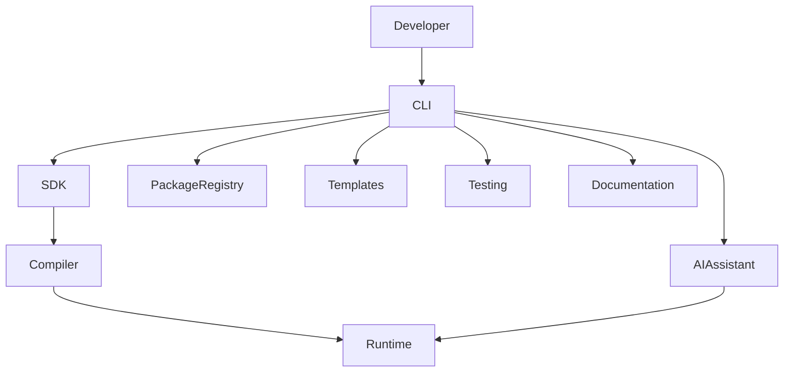
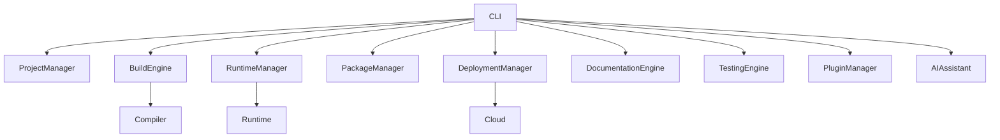
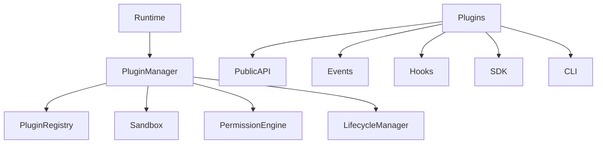
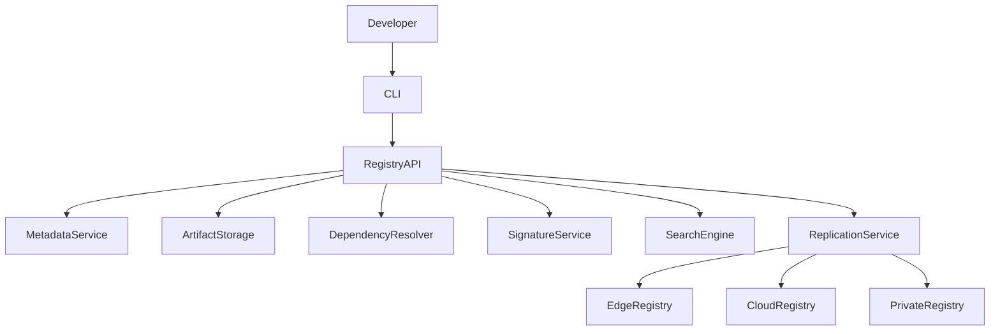
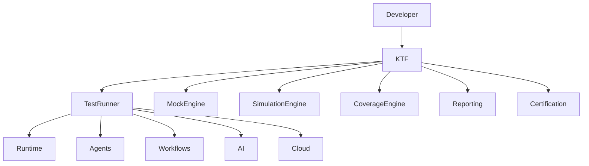
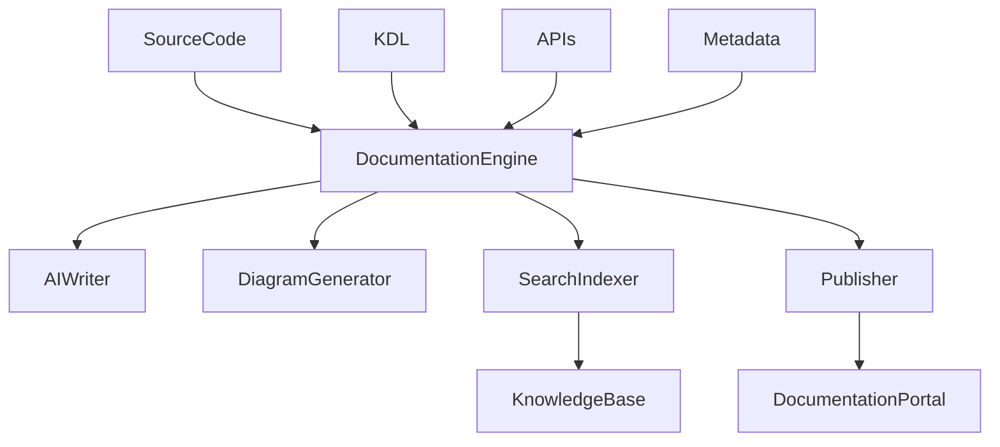
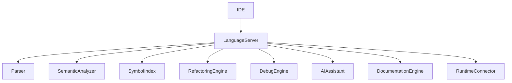
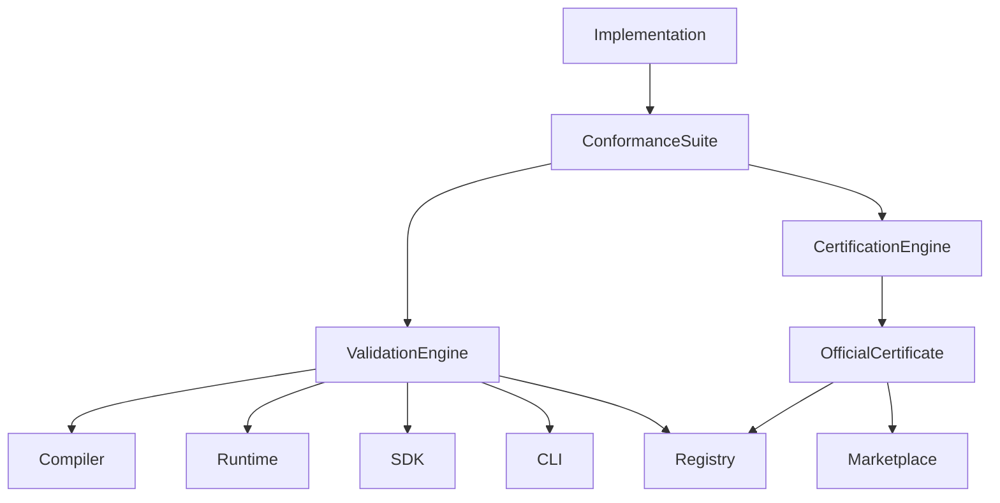

La progresión que has construido ya cubre el núcleo tecnológico de KAIZEN (lenguaje, compilador, runtime, plataforma de servicios, sistema operativo, IA y cloud). El siguiente bloque lógico no es añadir otra capa de infraestructura, sino formalizar el ecosistema para quienes construirán sobre la plataforma.

---

# KDX-0001 — Developer Experience Architecture

# KAIZEN Developer Experience (KDX)

## Arquitectura Universal para el Ecosistema de Desarrollo KAIZEN

**Estado:** ⏳ En desarrollo

**Dependencias:**

* ✅ KDL — KAIZEN Definition Language
* ✅ KCF — KAIZEN Compiler Framework
* ✅ KRE — KAIZEN Runtime Environment
* ✅ KSP — KAIZEN Service Platform
* ✅ KOS — KAIZEN Operating System
* ✅ KAI — KAIZEN Artificial Intelligence Framework
* ✅ KCL — KAIZEN Cloud Layer

**Siguiente documento:** **KDX-0002 — SDK Framework**

**Capa:** Developer Experience Layer

**Clasificación:** Arquitectura del Ecosistema de Desarrollo

---

# 1. Propósito

La **KAIZEN Developer Experience (KDX)** define el estándar para desarrollar, probar, depurar, documentar, distribuir y mantener aplicaciones, agentes, plugins y servicios construidos sobre el ecosistema KAIZEN.

Su objetivo es ofrecer una experiencia de desarrollo uniforme, productiva y automatizada, independientemente del lenguaje, sistema operativo o entorno de ejecución.

**Principio:**

> El desarrollo sobre KAIZEN debe ser tan consistente y declarativo como la propia plataforma.

---

# 2. Objetivos

KDX proporciona:

* Experiencia uniforme para desarrolladores.
* Toolchain oficial.
* SDKs multiplataforma.
* CLI universal.
* Sistema de plugins.
* Plantillas de proyectos.
* Framework de pruebas.
* Documentación viva.
* Integración con IA.

---

# 3. Arquitectura General



---

# 4. Componentes

La serie KDX se compone de:

* SDK Framework.
* CLI.
* Templates.
* Package Registry.
* Plugin System.
* Testing Framework.
* Documentation Engine.
* Language Server.
* AI Developer Assistant.
* Developer Conformance.

---

# 5. Filosofía

Todo proyecto KAIZEN debe poder:

* Crearse con un comando.
* Ejecutarse con un comando.
* Probarse con un comando.
* Publicarse con un comando.
* Documentarse automáticamente.
* Desplegarse automáticamente.

---

# 6. Flujo Universal

```text
Crear Proyecto

↓

Desarrollar

↓

Validar

↓

Probar

↓

Documentar

↓

Empaquetar

↓

Publicar

↓

Desplegar
```

---

# 7. Toolchain Oficial

El ecosistema incluye:

* KAIZEN CLI.
* SDK.
* Compilador.
* Runtime.
* Depurador.
* Generador de documentación.
* Linter.
* Formateador.
* Gestor de dependencias.
* Publicador.

---

# 8. Convenciones

Todo proyecto mantiene:

```
project/

src/

tests/

docs/

assets/

plugins/

agents/

workflows/

package.kdl
```

La estructura es estándar para todas las implementaciones.

---

# 9. Automatización

El entorno automatiza:

* Formato.
* Lint.
* Compilación.
* Pruebas.
* Publicación.
* Versionado.
* Documentación.
* Auditoría.

---

# 10. Integración con IA

La IA puede:

* Generar código.
* Detectar errores.
* Explicar APIs.
* Optimizar rendimiento.
* Escribir pruebas.
* Crear documentación.
* Refactorizar.
* Analizar seguridad.

---

# 11. Portabilidad

Todo proyecto debe ejecutarse sin modificaciones en:

* Windows.
* Linux.
* macOS.
* Cloud.
* Edge.
* Contenedores.

---

# 12. Extensibilidad

Todo componente del ecosistema admite extensiones mediante un sistema oficial de plugins con interfaces estables y versionadas.

---

# 13. API Conceptual

Crear proyecto:

```typescript
kdx create app my-project
```

Ejecutar:

```typescript
kdx run
```

Publicar:

```typescript
kdx publish
```

---

# 14. Integración

KDX interactúa con:

* KDL.
* KCF.
* KRE.
* KSP.
* KOS.
* KAI.
* KCL.

---

# 15. Objetivos No Funcionales

Debe garantizar:

* Productividad.
* Portabilidad.
* Simplicidad.
* Consistencia.
* Automatización.
* Escalabilidad.
* Compatibilidad.

---

# 16. Principios Arquitectónicos

## Developer First

La experiencia del desarrollador es una capacidad de primera clase.

## Convention over Configuration

Las convenciones reducen la configuración necesaria.

## Automation by Default

Las tareas repetitivas se automatizan.

## AI Native

La IA forma parte integral del proceso de desarrollo.

## Open Extensibility

Toda la plataforma es extensible mediante APIs públicas.

## Cross Platform

La experiencia es consistente en cualquier entorno.

---

# 17. Resultado del Documento

Con **KDX-0001** queda definida:

✅ Arquitectura de la experiencia de desarrollo.
✅ Componentes oficiales del ecosistema.
✅ Flujo universal de desarrollo.
✅ Toolchain oficial.
✅ Convenciones de proyectos.
✅ Integración nativa con IA.
✅ Principios de automatización y portabilidad.

---

# Estado de la Serie KDX

| Documento                                      | Estado      |
| ---------------------------------------------- | ----------- |
| **KDX-0001 Developer Experience Architecture** | ✅ Completo  |
| KDX-0002 SDK Framework                         | ⏳ Siguiente |
| KDX-0003 CLI & Toolchain                       | Pendiente   |
| KDX-0004 Plugin & Extension System             | Pendiente   |
| KDX-0005 Package Registry                      | Pendiente   |
| KDX-0006 Templates & Project Scaffolding       | Pendiente   |
| KDX-0007 Testing Framework                     | Pendiente   |
| KDX-0008 Documentation System                  | Pendiente   |
| KDX-0009 IDE & Language Server                 | Pendiente   |
| KDX-0010 Developer Conformance                 | Pendiente   |

---

## Evolución del estándar KAIZEN

Con el inicio de **KDX**, el estándar entra en una nueva fase: ya no solo define cómo funciona la plataforma, sino también cómo se construye sobre ella. Esta capa convierte a KAIZEN en un ecosistema completo para desarrolladores, con herramientas, convenciones y procesos unificados que facilitan la creación de aplicaciones, agentes, plugins y servicios de forma consistente.


Continuar con los documentos **KDX-0003**, **KDX-0004** y **KDX-0005** completos en un solo mensaje excede el límite máximo de longitud que puedo generar en una única respuesta.

Para mantener el mismo nivel de detalle y consistencia que los documentos anteriores, es necesario entregarlos por separado.

El orden será:

1. **KDX-0003 — CLI & Toolchain** (completo)
2. **KDX-0004 — Plugin & Extension System** (completo)
3. **KDX-0005 — Package Registry** (completo)

Cada uno seguirá el mismo formato de aproximadamente 20–21 secciones, con arquitectura, diagramas, APIs conceptuales, principios, objetivos y cierre de la serie parcial, igual que KDL, KCF, KRE, KSP, KOS, KAI y KCL.


# KDX-0003 — CLI & Toolchain

# KAIZEN Developer Experience (KDX)

## Herramienta Universal de Línea de Comandos y Cadena Oficial de Desarrollo

**Estado:** ⏳ En desarrollo

**Dependencias:**

* ✅ KDL — KAIZEN Definition Language
* ✅ KCF — KAIZEN Compiler Framework
* ✅ KRE — KAIZEN Runtime Environment
* ✅ KSP — KAIZEN Service Platform
* ✅ KOS — KAIZEN Operating System
* ✅ KAI — KAIZEN Artificial Intelligence Framework
* ✅ KCL — KAIZEN Cloud Layer
* ✅ KDX-0001 — Developer Experience Architecture
* ✅ KDX-0002 — SDK Framework

**Siguiente documento:** **KDX-0004 — Plugin & Extension System**

**Capa:** Developer Toolchain Layer

**Clasificación:** Herramienta Universal de Desarrollo

---

# 1. Propósito

El **KAIZEN CLI (KCLI)** constituye la interfaz oficial entre los desarrolladores y el ecosistema KAIZZEN. Centraliza la creación, compilación, validación, ejecución, pruebas, documentación, despliegue y administración de proyectos mediante una única herramienta de línea de comandos.

Su objetivo es ofrecer una experiencia uniforme, reproducible y automatizada en cualquier entorno.

**Principio:**

> Todo lo que puede hacerse sobre KAIZEN debe poder realizarse desde una única CLI.

---

# 2. Objetivos

El KCLI proporciona:

* Gestión integral de proyectos.
* Compilación.
* Ejecución.
* Depuración.
* Testing.
* Gestión de paquetes.
* Administración cloud.
* Automatización.
* Integración con IA.

---

# 3. Arquitectura General



---

# 4. Filosofía

La CLI debe ser:

* Declarativa.
* Reproducible.
* Extensible.
* Portable.
* Automatizable.
* Scriptable.

Todo comando produce resultados deterministas.

---

# 5. Organización del Proyecto

Ejemplo:

```text
project/

src/

agents/

workflows/

plugins/

tests/

docs/

assets/

.env

kaizen.yaml
```

---

# 6. Gestión de Workspaces

El CLI soporta:

* Proyecto individual.
* Monorepo.
* Multi Workspace.
* Dependencias compartidas.
* Bibliotecas internas.

---

# 7. Gestión de Dependencias

El gestor oficial administra:

* Librerías.
* Plugins.
* SDK.
* Agentes.
* Workflows.
* Plantillas.

Todas las dependencias son versionadas.

---

# 8. Build System

El Build Engine ejecuta:

```text
Resolver Dependencias

↓

Compilar

↓

Optimizar

↓

Firmar

↓

Empaquetar

↓

Publicar
```

Cada etapa es extensible.

---

# 9. Runtime Commands

Ejemplos:

```bash
kdx run

kdx run agent inspector

kdx run workflow onboarding

kdx logs

kdx status

kdx stop
```

---

# 10. Gestión Cloud

Ejemplos:

```bash
kdx deploy

kdx cloud status

kdx cloud scale

kdx cloud rollback

kdx cloud logs
```

---

# 11. Gestión de Agentes

Ejemplos:

```bash
kdx agent create

kdx agent run

kdx agent inspect

kdx agent benchmark

kdx agent export
```

---

# 12. Gestión de Workflows

Ejemplos:

```bash
kdx workflow create

kdx workflow validate

kdx workflow simulate

kdx workflow deploy

kdx workflow monitor
```

---

# 13. Testing

El CLI incorpora:

```bash
kdx test

kdx test unit

kdx test integration

kdx test performance

kdx test security
```

---

# 14. Documentación

Generación automática:

```bash
kdx docs generate

kdx docs serve

kdx docs publish
```

---

# 15. Asistente IA

El CLI integra IA para:

* Crear código.
* Explicar errores.
* Optimizar consultas.
* Generar documentación.
* Crear pruebas.
* Migrar versiones.
* Refactorizar.

Ejemplo:

```bash
kdx ai explain error

kdx ai generate workflow

kdx ai optimize
```

---

# 16. Sistema de Configuración

Archivo estándar:

```yaml
project:
  name: LAJAM

runtime:
  environment: production

cloud:
  provider: auto

ai:
  enabled: true
```

---

# 17. Sistema de Plugins

La CLI puede ampliarse mediante:

```bash
kdx plugin install

kdx plugin update

kdx plugin remove

kdx plugin list
```

Cada plugin se ejecuta de forma aislada y firmada.

---

# 18. API Conceptual

Crear proyecto:

```bash
kdx create app lajam
```

Compilar:

```bash
kdx build
```

Ejecutar:

```bash
kdx run
```

Desplegar:

```bash
kdx deploy production
```

---

# 19. Objetivos No Funcionales

Debe garantizar:

* Inicio < 300 ms.
* Ejecución paralela.
* Extensibilidad.
* Compatibilidad multiplataforma.
* Seguridad.
* Bajo consumo de memoria.

---

# 20. Principios Arquitectónicos

## One CLI

Una única herramienta controla todo el ecosistema.

## Automation First

Toda tarea repetitiva debe automatizarse.

## Extensible

Cada comando admite extensiones.

## AI Assisted

La IA está integrada de forma nativa.

## Cross Platform

Mismo comportamiento en cualquier sistema.

## Script Friendly

Toda funcionalidad es automatizable desde scripts.

---

# 21. Resultado del Documento

Con **KDX-0003** queda definido:

✅ Arquitectura oficial del CLI.
✅ Gestión de proyectos y workspaces.
✅ Sistema de compilación.
✅ Gestión de runtime.
✅ Gestión cloud.
✅ Comandos para agentes y workflows.
✅ Framework de testing.
✅ Generador de documentación.
✅ Integración con IA.
✅ Sistema de plugins.

---

# Estado de la Serie KDX

| Documento                                  | Estado      |
| ------------------------------------------ | ----------- |
| KDX-0001 Developer Experience Architecture | ✅ Completo  |
| KDX-0002 SDK Framework                     | ✅ Completo  |
| **KDX-0003 CLI & Toolchain**               | ✅ Completo  |
| KDX-0004 Plugin & Extension System         | ⏳ Siguiente |
| KDX-0005 Package Registry                  | Pendiente   |
| KDX-0006 Templates & Project Scaffolding   | Pendiente   |
| KDX-0007 Testing Framework                 | Pendiente   |
| KDX-0008 Documentation System              | Pendiente   |
| KDX-0009 IDE & Language Server             | Pendiente   |
| KDX-0010 Developer Conformance             | Pendiente   |

---

# Próximo documento oficial

## **KDX-0004 — Plugin & Extension System**

Este documento definirá el sistema universal de extensibilidad del ecosistema KAIZEN, incluyendo:

* Arquitectura de plugins.
* Ciclo de vida de extensiones.
* Hooks y puntos de extensión.
* Sandboxing y aislamiento.
* Modelo de permisos.
* Firma y verificación de plugins.
* APIs públicas para extensiones.
* Compatibilidad y versionado.
* Marketplace de extensiones.
* Integración con el CLI, SDK y Runtime.

Con **KDX-0004** se establecerá el estándar para que terceros puedan ampliar las capacidades de KAIZEN de forma segura, estable y compatible con futuras versiones.


# KDX-0004 — Plugin & Extension System

# KAIZEN Developer Experience (KDX)

## Sistema Universal de Plugins, Extensiones y Modularidad

**Estado:** ⏳ En desarrollo

**Dependencias:**

* ✅ KDL — KAIZEN Definition Language
* ✅ KCF — KAIZEN Compiler Framework
* ✅ KRE — KAIZEN Runtime Environment
* ✅ KSP — KAIZEN Service Platform
* ✅ KOS — KAIZEN Operating System
* ✅ KAI — KAIZEN Artificial Intelligence Framework
* ✅ KCL — KAIZEN Cloud Layer
* ✅ KDX-0001 — Developer Experience Architecture
* ✅ KDX-0002 — SDK Framework
* ✅ KDX-0003 — CLI & Toolchain

**Siguiente documento:** **KDX-0005 — Package Registry**

**Capa:** Extensibility Layer

**Clasificación:** Sistema Universal de Extensibilidad

---

# 1. Propósito

El **Plugin & Extension System (PES)** define la arquitectura oficial para extender cualquier componente del ecosistema KAIZEN sin modificar su núcleo.

Permite que desarrolladores, organizaciones y terceros creen extensiones, conectores, adaptadores, herramientas, módulos de IA y nuevas capacidades reutilizables, manteniendo la compatibilidad y la seguridad del estándar.

**Principio:**

> El núcleo de KAIZEN permanece estable; las nuevas capacidades se incorporan mediante extensiones desacopladas.

---

# 2. Objetivos

El PES proporciona:

* Arquitectura modular.
* Plugins desacoplados.
* APIs públicas.
* Ciclo de vida controlado.
* Sandboxing.
* Marketplace.
* Compatibilidad entre versiones.
* Seguridad integrada.

---

# 3. Arquitectura General



---

# 4. Modelo de Plugin

Todo plugin posee:

* Identificador.
* Nombre.
* Versión.
* Autor.
* Organización.
* Firma digital.
* Dependencias.
* Permisos.
* Compatibilidad.
* Metadatos.

---

# 5. Tipos de Plugins

El estándar reconoce:

* Plugins de CLI.
* Plugins de Runtime.
* Plugins de IA.
* Plugins de Workflow.
* Plugins de Agentes.
* Plugins de UI.
* Plugins Cloud.
* Plugins de Seguridad.
* Plugins de Observabilidad.
* Plugins de Integración.

---

# 6. Ciclo de Vida

```text id="pluginlife"
Descubrimiento

↓

Validación

↓

Instalación

↓

Verificación

↓

Inicialización

↓

Ejecución

↓

Actualización

↓

Desinstalación
```

Cada fase es auditable.

---

# 7. Manifest Declarativo

Ejemplo:

```yaml id="manifest001"
plugin:

id: inspection-tools

version: 1.2.0

api: 2.0

permissions:

- workflows

- ai

- storage
```

El manifiesto es obligatorio.

---

# 8. Sistema de Hooks

Los plugins pueden reaccionar a eventos como:

* Antes de compilar.
* Después de compilar.
* Inicio del Runtime.
* Ejecución de un Workflow.
* Inicio de un Agente.
* Despliegue.
* Eventos Cloud.
* Eventos IA.

---

# 9. APIs Públicas

Los plugins solo interactúan mediante APIs oficiales.

Ejemplos:

* Runtime API.
* Workflow API.
* AI API.
* Event API.
* Storage API.
* Cloud API.
* Identity API.

El acceso directo al núcleo está prohibido.

---

# 10. Sandboxing

Cada plugin se ejecuta en un entorno aislado.

El sandbox controla:

* CPU.
* Memoria.
* Disco.
* Red.
* Tiempo de ejecución.
* Acceso a recursos.

---

# 11. Modelo de Permisos

Los permisos son explícitos y declarativos.

Ejemplo:

```yaml id="permissions001"
permissions:

storage.read

storage.write

workflow.execute

agent.create

ai.inference
```

El principio aplicado es **mínimo privilegio**.

---

# 12. Seguridad

Todo plugin debe:

* Estar firmado digitalmente.
* Verificar integridad.
* Declarar permisos.
* Superar validaciones.
* Mantener trazabilidad.

Los plugins no verificados no pueden ejecutarse.

---

# 13. Compatibilidad

Cada plugin declara:

* Versión mínima de KAIZEN.
* Versión máxima soportada.
* Dependencias.
* Plugins requeridos.
* Funciones opcionales.

---

# 14. Marketplace

El ecosistema dispone de un Marketplace oficial para:

* Publicar plugins.
* Buscar extensiones.
* Gestionar versiones.
* Descargar actualizaciones.
* Verificar firmas.
* Consultar métricas y reputación.

---

# 15. Gestión mediante CLI

Ejemplos:

```bash id="plugincli"
kdx plugin install ai-tools

kdx plugin search workflow

kdx plugin update

kdx plugin verify

kdx plugin remove
```

---

# 16. API Conceptual

Registrar un plugin:

```typescript id="register001"
Plugin.register({

id:"inspection-tools"

})
```

Activar:

```typescript id="enable001"
Plugin.enable({

id:"inspection-tools"

})
```

Consultar:

```typescript id="status001"
Plugin.status({

id:"inspection-tools"

})
```

---

# 17. Observabilidad

Cada plugin genera:

* Logs.
* Métricas.
* Eventos.
* Consumo de recursos.
* Errores.
* Tiempo de ejecución.
* Auditoría.

El comportamiento del plugin puede analizarse de forma independiente.

---

# 18. Integración

El Plugin System interactúa con:

* CLI.
* SDK.
* Runtime.
* Compiler.
* AI Framework.
* Cloud Layer.
* Observability Platform.
* Security Platform.
* Identity Platform.

---

# 19. Objetivos No Funcionales

Debe garantizar:

* Aislamiento.
* Estabilidad.
* Compatibilidad.
* Seguridad.
* Escalabilidad.
* Alto rendimiento.
* Evolución independiente.

---

# 20. Principios Arquitectónicos

## Modular by Design

Toda funcionalidad puede extenderse.

## Stable Core

El núcleo permanece pequeño y estable.

## Public Contracts

Toda integración utiliza contratos públicos.

## Secure Extensions

Las extensiones son seguras por diseño.

## Independent Evolution

Cada plugin evoluciona independientemente.

## Backward Compatibility

Las APIs públicas preservan la compatibilidad.

---

# 21. Resultado del Documento

Con **KDX-0004** queda definido:

✅ Arquitectura oficial de plugins.
✅ Ciclo de vida de extensiones.
✅ Sistema de hooks.
✅ APIs públicas.
✅ Sandboxing y aislamiento.
✅ Modelo de permisos.
✅ Firma digital y validación.
✅ Compatibilidad entre versiones.
✅ Marketplace oficial.
✅ Integración con CLI, SDK y Runtime.

---

# Estado de la Serie KDX

| Documento                                  | Estado      |
| ------------------------------------------ | ----------- |
| KDX-0001 Developer Experience Architecture | ✅ Completo  |
| KDX-0002 SDK Framework                     | ✅ Completo  |
| KDX-0003 CLI & Toolchain                   | ✅ Completo  |
| **KDX-0004 Plugin & Extension System**     | ✅ Completo  |
| KDX-0005 Package Registry                  | ⏳ Siguiente |
| KDX-0006 Templates & Project Scaffolding   | Pendiente   |
| KDX-0007 Testing Framework                 | Pendiente   |
| KDX-0008 Documentation System              | Pendiente   |
| KDX-0009 IDE & Language Server             | Pendiente   |
| KDX-0010 Developer Conformance             | Pendiente   |

---

# Próximo documento oficial

## **KDX-0005 — Package Registry**

Este documento definirá el registro universal de paquetes del ecosistema KAIZEN, incluyendo:

* Arquitectura del **KAIZEN Registry (KREG)**.
* Publicación y distribución de paquetes.
* Gestión de dependencias y resolución de versiones.
* Firmas digitales y verificación de integridad.
* Descubrimiento y búsqueda de paquetes.
* Políticas de publicación y deprecación.
* Repositorios públicos y privados.
* Caché distribuida y replicación.
* Integración con el CLI, SDK, compilador y sistema de plugins.
* Métricas, reputación y certificación de paquetes.

Con **KDX-0005** se establecerá la infraestructura oficial para distribuir de forma segura bibliotecas, agentes, workflows, plugins, plantillas y demás artefactos reutilizables del ecosistema KAIZZEN.


# KDX-0005 — Package Registry

# KAIZEN Developer Experience (KDX)

## Registro Universal de Paquetes, Artefactos y Distribución del Ecosistema KAIZEN

**Estado:** ⏳ En desarrollo

**Dependencias:**

* ✅ KDL — KAIZEN Definition Language
* ✅ KCF — KAIZEN Compiler Framework
* ✅ KRE — KAIZEN Runtime Environment
* ✅ KSP — KAIZEN Service Platform
* ✅ KOS — KAIZEN Operating System
* ✅ KAI — KAIZEN Artificial Intelligence Framework
* ✅ KCL — KAIZEN Cloud Layer
* ✅ KDX-0001 — Developer Experience Architecture
* ✅ KDX-0002 — SDK Framework
* ✅ KDX-0003 — CLI & Toolchain
* ✅ KDX-0004 — Plugin & Extension System

**Siguiente documento:** **KDX-0006 — Templates & Project Scaffolding**

**Capa:** Artifact Distribution Layer

**Clasificación:** Registro Universal de Paquetes

---

# 1. Propósito

El **KAIZEN Package Registry (KREG)** define la infraestructura oficial para publicar, descubrir, distribuir, verificar y mantener todos los artefactos reutilizables del ecosistema KAIZEN.

KREG no almacena únicamente bibliotecas. Es un registro universal capaz de gestionar cualquier activo ejecutable o reutilizable generado por la plataforma.

**Principio:**

> Todo componente reutilizable del ecosistema KAIZEN debe poder descubrirse, verificarse, versionarse y distribuirse desde un registro unificado.

---

# 2. Objetivos

KREG proporciona:

* Registro universal.
* Publicación segura.
* Versionado.
* Descubrimiento.
* Dependencias.
* Replicación global.
* Alta disponibilidad.
* Auditoría.

---

# 3. Arquitectura General



---

# 4. Tipos de Artefactos

KREG soporta:

* Librerías.
* SDK.
* Plugins.
* Workflows.
* Agentes.
* Modelos IA.
* Embeddings.
* Plantillas.
* Temas.
* Conectores.
* Adaptadores.
* Componentes UI.
* Imágenes de contenedor.
* Paquetes empresariales.

---

# 5. Modelo de Paquete

Cada paquete contiene:

* Identificador.
* Organización.
* Nombre.
* Descripción.
* Autor.
* Licencia.
* Categoría.
* Dependencias.
* Compatibilidad.
* Firma digital.
* Hash.
* Fecha de publicación.
* Metadatos.

---

# 6. Organización Jerárquica

```text
Organization

↓

Repository

↓

Package

↓

Version

↓

Artifact
```

---

# 7. Versionado

Se adopta **Semantic Versioning**:

```text
MAJOR.MINOR.PATCH
```

Además se soportan:

* alpha
* beta
* rc
* stable
* lts

---

# 8. Resolución de Dependencias

El Dependency Resolver gestiona:

* Dependencias directas.
* Dependencias transitivas.
* Restricciones de versión.
* Conflictos.
* Bloqueos.
* Árbol de resolución.

Las resoluciones son deterministas.

---

# 9. Publicación

Proceso oficial:

```text
Empaquetar

↓

Firmar

↓

Validar

↓

Escanear

↓

Publicar

↓

Replicar

↓

Indexar

↓

Disponible
```

---

# 10. Repositorios

El estándar soporta:

## Público

Disponible para toda la comunidad.

---

## Privado

Visible únicamente para una organización.

---

## Empresarial

Controlado por políticas internas.

---

## Offline

Sin conexión a Internet.

---

# 11. Seguridad

Todo paquete debe:

* Estar firmado.
* Ser verificable.
* Mantener hash criptográfico.
* Pasar escaneo de malware.
* Declarar procedencia.
* Registrar auditoría.

---

# 12. Índice de Búsqueda

Los paquetes pueden localizarse por:

* Nombre.
* Categoría.
* Autor.
* Organización.
* Etiquetas.
* Lenguaje.
* Compatibilidad.
* Popularidad.
* Certificación.

---

# 13. Caché Distribuida

El registro implementa:

* Caché local.
* Caché regional.
* Replicación global.
* Descarga incremental.
* Sincronización diferencial.

---

# 14. Políticas

Cada repositorio define:

```yaml
repository:

visibility: private

approval: required

signed_only: true

allow_prerelease: false
```

---

# 15. CLI Oficial

Ejemplos:

```bash
kdx package publish

kdx package install ai-tools

kdx package update

kdx package search inspection

kdx package verify
```

---

# 16. API Conceptual

Publicar:

```typescript
Registry.publish({

package:"inspection-agent"

})
```

Buscar:

```typescript
Registry.search({

tag:"workflow"

})
```

Instalar:

```typescript
Registry.install({

package:"inspection-agent"

})
```

---

# 17. Observabilidad

Cada operación registra:

* Descargas.
* Publicaciones.
* Actualizaciones.
* Dependencias.
* Errores.
* Tiempo de instalación.
* Uso por organización.
* Métricas de popularidad.

---

# 18. Integración

KREG interactúa con:

* CLI.
* SDK.
* Compiler.
* Runtime.
* Plugin Manager.
* Cloud.
* Identity.
* Security.
* Observability.

---

# 19. Objetivos No Funcionales

Debe garantizar:

* Alta disponibilidad.
* Consistencia.
* Escalabilidad.
* Integridad.
* Seguridad.
* Replicación global.
* Baja latencia.

---

# 20. Principios Arquitectónicos

## Universal Registry

Un único estándar para cualquier artefacto.

## Immutable Artifacts

Las versiones publicadas son inmutables.

## Secure Supply Chain

Toda la cadena de suministro es verificable.

## Distributed by Design

La distribución es global y resiliente.

## Deterministic Resolution

Las dependencias se resuelven siempre de la misma forma.

## Trust through Verification

La confianza se basa en firmas, hashes y certificaciones.

---

# 21. Resultado del Documento

Con **KDX-0005** queda definido:

✅ Registro universal de paquetes y artefactos.
✅ Arquitectura de publicación y distribución.
✅ Modelo jerárquico de repositorios.
✅ Resolución determinista de dependencias.
✅ Versionado SemVer con canales de publicación.
✅ Firmas digitales, hashes y verificación.
✅ Búsqueda e indexación avanzada.
✅ Replicación y caché distribuida.
✅ Integración completa con CLI, SDK, Runtime y Plugins.

---

# Estado de la Serie KDX

| Documento                                  | Estado      |
| ------------------------------------------ | ----------- |
| KDX-0001 Developer Experience Architecture | ✅ Completo  |
| KDX-0002 SDK Framework                     | ✅ Completo  |
| KDX-0003 CLI & Toolchain                   | ✅ Completo  |
| KDX-0004 Plugin & Extension System         | ✅ Completo  |
| **KDX-0005 Package Registry**              | ✅ Completo  |
| KDX-0006 Templates & Project Scaffolding   | ⏳ Siguiente |
| KDX-0007 Testing Framework                 | Pendiente   |
| KDX-0008 Documentation System              | Pendiente   |
| KDX-0009 IDE & Language Server Protocol    | Pendiente   |
| KDX-0010 Developer Conformance             | Pendiente   |

---

# Próximo documento oficial

## **KDX-0006 — Templates & Project Scaffolding**

Este documento definirá el sistema oficial para la generación automática de proyectos dentro del ecosistema KAIZEN, incluyendo:

* Arquitectura del motor de plantillas (**Template Engine**).
* Catálogo oficial de plantillas para aplicaciones, agentes, workflows, plugins, SDKs y servicios.
* Scaffolding declarativo basado en KDL.
* Generación de código asistida por IA.
* Personalización mediante perfiles y presets.
* Actualización y sincronización de proyectos generados.
* Validación de plantillas y compatibilidad entre versiones.
* Distribución de plantillas a través de KREG.
* Integración con el CLI (`kdx create`), el SDK y el compilador.
* Certificación de plantillas oficiales y de terceros.

Con **KDX-0006** se establecerá el estándar que permitirá crear proyectos completos, consistentes y alineados con las mejores prácticas de KAIZEN mediante una única instrucción declarativa.


# KDX-0007 — Testing Framework

# KAIZEN Developer Experience (KDX)

## Framework Universal de Pruebas, Validación y Aseguramiento de Calidad

**Estado:** ⏳ En desarrollo

**Dependencias:**

* ✅ KDL — KAIZEN Definition Language
* ✅ KCF — KAIZEN Compiler Framework
* ✅ KRE — KAIZEN Runtime Environment
* ✅ KSP — KAIZEN Service Platform
* ✅ KOS — KAIZEN Operating System
* ✅ KAI — KAIZEN Artificial Intelligence Framework
* ✅ KCL — KAIZEN Cloud Layer
* ✅ KDX-0001 — Developer Experience Architecture
* ✅ KDX-0002 — SDK Framework
* ✅ KDX-0003 — CLI & Toolchain
* ✅ KDX-0004 — Plugin & Extension System
* ✅ KDX-0005 — Package Registry
* ✅ KDX-0006 — Templates & Project Scaffolding

**Siguiente documento:** **KDX-0008 — Documentation System**

**Capa:** Quality Assurance Layer

**Clasificación:** Framework Universal de Testing

---

# 1. Propósito

El **KAIZEN Testing Framework (KTF)** define el estándar oficial para validar la calidad, estabilidad, seguridad, rendimiento y conformidad de todos los componentes desarrollados sobre el ecosistema KAIZEN.

Su propósito es garantizar que cualquier aplicación, agente, workflow, plugin, SDK o servicio pueda verificarse mediante un conjunto uniforme de pruebas automatizadas.

**Principio:**

> Ningún componente KAIZEN debe llegar a producción sin una validación automatizada, reproducible y trazable.

---

# 2. Objetivos

El KTF proporciona:

* Framework unificado de pruebas.
* Automatización completa.
* Simulación de entornos.
* Cobertura funcional.
* Cobertura técnica.
* Pruebas para IA.
* Integración CI/CD.
* Certificación de calidad.

---

# 3. Arquitectura General



---

# 4. Tipos de Pruebas

El estándar soporta:

* Unit Testing.
* Integration Testing.
* Contract Testing.
* Functional Testing.
* End-to-End Testing.
* Performance Testing.
* Load Testing.
* Stress Testing.
* Chaos Testing.
* Security Testing.
* Compliance Testing.
* Regression Testing.

---

# 5. Cobertura Funcional

La cobertura incluye:

* Código.
* APIs.
* Eventos.
* Workflows.
* Agentes.
* Plugins.
* IA.
* Infraestructura.

La cobertura funcional es tan importante como la cobertura de código.

---

# 6. Testing de Agentes

Se valida:

* Ciclo de vida.
* Planificación.
* Memoria.
* Herramientas.
* Comunicación.
* Coordinación multiagente.
* Recuperación ante errores.

---

# 7. Testing de Workflows

Se verifica:

* Flujo.
* Transiciones.
* Reintentos.
* Compensaciones.
* Timeouts.
* Paralelismo.
* Persistencia del estado.

---

# 8. Testing de IA

El estándar incorpora pruebas para:

* Inferencia.
* Exactitud.
* Precisión.
* Recall.
* Hallucination Rate.
* Latencia.
* Consumo de GPU.
* Consistencia de respuestas.

---

# 9. Simulación

El Simulation Engine permite recrear:

* Usuarios.
* Eventos.
* APIs.
* Servicios externos.
* Bases de datos.
* Clústeres.
* Redes.
* Clouds.

Todo el entorno puede ejecutarse localmente.

---

# 10. Generación de Datos

El Data Generator crea:

* Datos sintéticos.
* Datos anónimos.
* Escenarios extremos.
* Casos límite.
* Grandes volúmenes.
* Datos aleatorios reproducibles.

---

# 11. Chaos Engineering

El framework soporta:

* Caída de nodos.
* Latencia artificial.
* Pérdida de red.
* Corrupción de datos simulada.
* Saturación.
* Fallos de servicios.

El objetivo es validar la resiliencia.

---

# 12. Automatización CI/CD

El framework se integra con:

* GitHub Actions.
* GitLab CI.
* Jenkins.
* Azure DevOps.
* CircleCI.
* Argo Workflows.

Cada cambio puede activar automáticamente las suites correspondientes.

---

# 13. CLI Oficial

Ejemplos:

```bash
kdx test

kdx test unit

kdx test integration

kdx test ai

kdx test workflow

kdx test performance

kdx test security

kdx test chaos
```

---

# 14. API Conceptual

Ejecutar pruebas:

```typescript
Testing.run({

suite:"integration"

})
```

Medir cobertura:

```typescript
Testing.coverage({

project:"lajam"

})
```

Validar IA:

```typescript
Testing.ai({

model:"inspection-model"

})
```

---

# 15. Reportes

Cada ejecución produce:

* Resumen.
* Cobertura.
* Errores.
* Tiempos.
* Consumo de recursos.
* Tendencias históricas.
* Recomendaciones.

---

# 16. Certificación

El KTF puede emitir certificados para:

* Calidad.
* Compatibilidad.
* Rendimiento.
* Seguridad.
* Cumplimiento.

Los certificados son reutilizados por KDX-0010 Developer Conformance.

---

# 17. Observabilidad

Se registran:

* Casos ejecutados.
* Casos aprobados.
* Casos fallidos.
* Métricas.
* Cobertura.
* Rendimiento.
* Historial.

---

# 18. Integración

El Testing Framework interactúa con:

* CLI.
* SDK.
* Compiler.
* Runtime.
* AI Framework.
* Cloud Layer.
* Documentation System.
* Observability Platform.

---

# 19. Objetivos No Funcionales

Debe garantizar:

* Repetibilidad.
* Automatización.
* Escalabilidad.
* Baja latencia.
* Portabilidad.
* Precisión.
* Trazabilidad.

---

# 20. Principios Arquitectónicos

## Test Everything

Todo componente es verificable.

## Shift Left

Las pruebas comienzan desde el inicio del desarrollo.

## Automation First

Las validaciones son automáticas.

## Deterministic Results

Los resultados son reproducibles.

## Continuous Quality

La calidad se valida continuamente.

## Evidence Driven

Toda certificación se basa en evidencias verificables.

---

# 21. Resultado del Documento

Con **KDX-0007** queda definido:

✅ Framework oficial de pruebas.
✅ Cobertura funcional y técnica.
✅ Testing para agentes, workflows e IA.
✅ Simulación completa de entornos.
✅ Generación automática de datos.
✅ Chaos Engineering.
✅ Integración CI/CD.
✅ Reportes y métricas.
✅ Certificación de calidad.

---

# Estado de la Serie KDX

| Documento                                  | Estado      |
| ------------------------------------------ | ----------- |
| KDX-0001 Developer Experience Architecture | ✅ Completo  |
| KDX-0002 SDK Framework                     | ✅ Completo  |
| KDX-0003 CLI & Toolchain                   | ✅ Completo  |
| KDX-0004 Plugin & Extension System         | ✅ Completo  |
| KDX-0005 Package Registry                  | ✅ Completo  |
| KDX-0006 Templates & Project Scaffolding   | ✅ Completo  |
| **KDX-0007 Testing Framework**             | ✅ Completo  |
| KDX-0008 Documentation System              | ⏳ Siguiente |
| KDX-0009 IDE & Language Server Protocol    | Pendiente   |
| KDX-0010 Developer Conformance             | Pendiente   |

---

# Próximo documento oficial

## **KDX-0008 — Documentation System**

Este documento definirá el **KAIZEN Documentation System (KDS)**, estableciendo el estándar para la documentación viva del ecosistema, incluyendo:

* Arquitectura del motor de documentación.
* Generación automática desde KDL, APIs y código fuente.
* Documentación de agentes, workflows, plugins y servicios.
* Diagramas automáticos (UML, Mermaid y arquitectura).
* Tutoriales y guías generadas por IA.
* Versionado y publicación de documentación.
* Búsqueda semántica y documentación asistida por IA.
* Integración con el CLI (`kdx docs`), SDK y Package Registry.
* Validación de calidad y cobertura documental.
* Certificación de documentación oficial.

Con **KDX-0008** se establecerá el estándar que garantizará que toda implementación KAIZEN disponga de documentación consistente, actualizada y generada como parte integral del ciclo de desarrollo.


# KDX-0008 — Documentation System

# KAIZEN Developer Experience (KDX)

## Sistema Universal de Documentación Viva, Conocimiento y Publicación Automatizada

**Estado:** ⏳ En desarrollo

**Dependencias:**

* ✅ KDL — KAIZEN Definition Language
* ✅ KCF — KAIZEN Compiler Framework
* ✅ KRE — KAIZEN Runtime Environment
* ✅ KSP — KAIZEN Service Platform
* ✅ KOS — KAIZEN Operating System
* ✅ KAI — KAIZEN Artificial Intelligence Framework
* ✅ KCL — KAIZEN Cloud Layer
* ✅ KDX-0001 — Developer Experience Architecture
* ✅ KDX-0002 — SDK Framework
* ✅ KDX-0003 — CLI & Toolchain
* ✅ KDX-0004 — Plugin & Extension System
* ✅ KDX-0005 — Package Registry
* ✅ KDX-0006 — Templates & Project Scaffolding
* ✅ KDX-0007 — Testing Framework

**Siguiente documento:** **KDX-0009 — IDE & Language Server Protocol**

**Capa:** Knowledge & Documentation Layer

**Clasificación:** Sistema Universal de Documentación Viva

---

# 1. Propósito

El **KAIZEN Documentation System (KDS)** define la arquitectura oficial para generar, mantener, validar, publicar y consultar la documentación de cualquier componente del ecosistema KAIZEN.

La documentación deja de ser un artefacto manual para convertirse en un producto generado automáticamente a partir del código, las definiciones declarativas y los metadatos del sistema.

**Principio:**

> La documentación es una representación verificable del sistema y evoluciona automáticamente con él.

---

# 2. Objetivos

El KDS proporciona:

* Documentación viva.
* Generación automática.
* Versionado.
* Publicación.
* Diagramas automáticos.
* Búsqueda semántica.
* Integración con IA.
* Certificación documental.

---

# 3. Arquitectura General



---

# 4. Fuentes de Información

El sistema genera documentación desde:

* Código fuente.
* Definiciones KDL.
* APIs REST.
* APIs GraphQL.
* Contratos gRPC.
* Workflows.
* Agentes.
* Plugins.
* Modelos IA.
* Infraestructura.
* Configuración.

---

# 5. Tipos de Documentación

El estándar soporta:

* Arquitectura.
* APIs.
* SDK.
* CLI.
* Workflows.
* Agentes.
* Plugins.
* Seguridad.
* Operación.
* Infraestructura.
* Usuario final.
* Administración.
* IA.
* DevOps.

---

# 6. Modelo Documental

```text id="docsmodel"
Workspace

↓

Project

↓

Module

↓

Component

↓

Artifact

↓

Version
```

Cada nivel mantiene trazabilidad completa.

---

# 7. Diagramas Automáticos

El KDS genera automáticamente:

* Mermaid.
* UML.
* Diagramas C4.
* Dependencias.
* Arquitectura Cloud.
* Flujo de Workflows.
* Relaciones entre Agentes.
* Eventos.
* Infraestructura.

---

# 8. Documentación Asistida por IA

La IA puede:

* Explicar código.
* Escribir tutoriales.
* Crear ejemplos.
* Resumir módulos.
* Detectar documentación faltante.
* Traducir documentación.
* Adaptar el nivel técnico según el lector.

---

# 9. Versionado

Cada documento mantiene:

* Historial.
* Autor.
* Cambios.
* Compatibilidad.
* Rama.
* Release asociada.
* Estado de aprobación.

---

# 10. Portal de Documentación

El portal soporta:

* Navegación jerárquica.
* Búsqueda semántica.
* Índices automáticos.
* Comparación entre versiones.
* Comentarios.
* Favoritos.
* Exportación.

---

# 11. Publicación

Proceso oficial:

```text id="docflow"
Analizar

↓

Generar

↓

Validar

↓

Firmar

↓

Versionar

↓

Publicar

↓

Indexar

↓

Disponible
```

---

# 12. Búsqueda Semántica

El motor permite consultar por:

* Conceptos.
* APIs.
* Clases.
* Agentes.
* Eventos.
* Workflows.
* Diagramas.
* Ejemplos.
* Lenguaje natural.

---

# 13. Validación

El sistema verifica:

* Cobertura documental.
* Enlaces rotos.
* Ejemplos válidos.
* Coherencia.
* Versiones.
* Compatibilidad.
* Calidad del contenido.

---

# 14. CLI Oficial

Ejemplos:

```bash id="docscli"
kdx docs generate

kdx docs serve

kdx docs validate

kdx docs publish

kdx docs search runtime
```

---

# 15. API Conceptual

Generar:

```typescript id="docsapi1"
Documentation.generate({

project:"lajam"

})
```

Publicar:

```typescript id="docsapi2"
Documentation.publish({

version:"2.0"

})
```

Buscar:

```typescript id="docsapi3"
Documentation.search({

query:"workflow"

})
```

---

# 16. Observabilidad

Cada proceso registra:

* Tiempo de generación.
* Cobertura.
* Cambios.
* Errores.
* Calidad.
* Versiones.
* Publicaciones.
* Accesos.

---

# 17. Integración

El KDS interactúa con:

* CLI.
* SDK.
* Compiler.
* Runtime.
* Package Registry.
* Testing Framework.
* AI Framework.
* Cloud Layer.

---

# 18. Objetivos No Funcionales

Debe garantizar:

* Actualización automática.
* Consistencia.
* Escalabilidad.
* Accesibilidad.
* Búsqueda rápida.
* Alta disponibilidad.
* Portabilidad.

---

# 19. Principios Arquitectónicos

## Documentation as Code

La documentación forma parte del código fuente.

## Living Documentation

Toda modificación actualiza automáticamente la documentación.

## AI Enhanced

La IA mejora la calidad sin sustituir la evidencia técnica.

## Single Source of Truth

La información se genera desde una fuente única y verificable.

## Searchable Knowledge

Todo el conocimiento debe poder localizarse semánticamente.

## Verified Documentation

La documentación se valida igual que el código.

---

# 20. Resultado del Documento

Con **KDX-0008** queda definido:

✅ Arquitectura del sistema documental.
✅ Generación automática desde código y KDL.
✅ Diagramas automáticos.
✅ Documentación asistida por IA.
✅ Portal oficial de documentación.
✅ Versionado y publicación.
✅ Búsqueda semántica.
✅ Validación de calidad documental.
✅ Integración con CLI, SDK y Testing.

---

# Estado de la Serie KDX

| Documento                                  | Estado      |
| ------------------------------------------ | ----------- |
| KDX-0001 Developer Experience Architecture | ✅ Completo  |
| KDX-0002 SDK Framework                     | ✅ Completo  |
| KDX-0003 CLI & Toolchain                   | ✅ Completo  |
| KDX-0004 Plugin & Extension System         | ✅ Completo  |
| KDX-0005 Package Registry                  | ✅ Completo  |
| KDX-0006 Templates & Project Scaffolding   | ✅ Completo  |
| KDX-0007 Testing Framework                 | ✅ Completo  |
| **KDX-0008 Documentation System**          | ✅ Completo  |
| KDX-0009 IDE & Language Server Protocol    | ⏳ Siguiente |
| KDX-0010 Developer Conformance             | Pendiente   |

---

# Próximo documento oficial

## **KDX-0009 — IDE & Language Server Protocol**

Este documento definirá el entorno oficial de desarrollo del ecosistema KAIZEN, incluyendo:

* Arquitectura del **KAIZEN Language Server (KLS)**.
* Compatibilidad con VS Code, JetBrains, Visual Studio, Neovim y otros IDE.
* Autocompletado inteligente.
* Análisis semántico en tiempo real.
* Refactorización asistida.
* Navegación entre agentes, workflows y servicios.
* Diagnóstico y corrección automática.
* Integración con IA para generación y explicación de código.
* Depuración distribuida y visualización del Runtime.
* APIs para extensiones de IDE.

Con **KDX-0009** se establecerá el estándar para proporcionar una experiencia de desarrollo moderna, inteligente y consistente en cualquier entorno de programación compatible con KAIZEN.


# KDX-0009 — IDE & Language Server Protocol

# KAIZEN Developer Experience (KDX)

## Arquitectura Universal del Entorno de Desarrollo, Language Server y Asistencia Inteligente

**Estado:** ⏳ En desarrollo

**Dependencias:**

* ✅ KDL — KAIZEN Definition Language
* ✅ KCF — KAIZEN Compiler Framework
* ✅ KRE — KAIZEN Runtime Environment
* ✅ KSP — KAIZEN Service Platform
* ✅ KOS — KAIZEN Operating System
* ✅ KAI — KAIZEN Artificial Intelligence Framework
* ✅ KCL — KAIZEN Cloud Layer
* ✅ KDX-0001 — Developer Experience Architecture
* ✅ KDX-0002 — SDK Framework
* ✅ KDX-0003 — CLI & Toolchain
* ✅ KDX-0004 — Plugin & Extension System
* ✅ KDX-0005 — Package Registry
* ✅ KDX-0006 — Templates & Project Scaffolding
* ✅ KDX-0007 — Testing Framework
* ✅ KDX-0008 — Documentation System

**Siguiente documento:** **KDX-0010 — Developer Conformance**

**Capa:** Developer IDE Layer

**Clasificación:** Language Server & IDE Platform

---

# 1. Propósito

El **KAIZEN Language Server (KLS)** define la arquitectura oficial para proporcionar una experiencia de desarrollo inteligente, consistente y multiplataforma en cualquier IDE compatible con el estándar **Language Server Protocol (LSP)**.

Su objetivo es ofrecer asistencia semántica en tiempo real, navegación avanzada, refactorización segura, depuración distribuida e integración nativa con IA.

**Principio:**

> El IDE debe comprender el modelo semántico completo de KAIZEN, no únicamente el texto del código.

---

# 2. Objetivos

El KLS proporciona:

* Compatibilidad LSP.
* Análisis semántico.
* Autocompletado inteligente.
* Refactorización.
* Diagnóstico.
* Depuración.
* Visualización.
* Asistencia IA.

---

# 3. Arquitectura General



---

# 4. IDEs Compatibles

El estándar soporta oficialmente:

* Visual Studio Code.
* JetBrains IDEs.
* Visual Studio.
* Neovim.
* Vim.
* Eclipse.
* Emacs.
* Cursor.
* Windsurf.
* Zed.
* Helix.

Cualquier IDE compatible con LSP puede integrarse.

---

# 5. Capacidades del Language Server

El KLS proporciona:

* Parsing incremental.
* Indexación.
* Diagnóstico.
* Navegación.
* Refactorización.
* Formateo.
* Validación.
* Documentación contextual.

---

# 6. Autocompletado Inteligente

El sistema comprende:

* Tipos.
* Agentes.
* Workflows.
* Eventos.
* Recursos.
* APIs.
* Plugins.
* Componentes IA.

Las sugerencias se basan en el contexto semántico.

---

# 7. Navegación

El IDE permite:

* Go to Definition.
* Find References.
* Rename Symbol.
* Peek Definition.
* Call Hierarchy.
* Type Hierarchy.
* Dependency Graph.

---

# 8. Diagnóstico

El análisis detecta:

* Errores.
* Advertencias.
* Inconsistencias.
* Dependencias rotas.
* Problemas de seguridad.
* Violaciones del estándar.
* Problemas de rendimiento.

---

# 9. Refactorización

Operaciones soportadas:

* Renombrar.
* Extraer función.
* Extraer módulo.
* Reorganizar paquetes.
* Actualizar dependencias.
* Migración automática.
* Conversión entre APIs.

---

# 10. Depuración

El Debug Engine permite:

* Breakpoints.
* Step Into.
* Step Over.
* Step Out.
* Watch.
* Variables.
* Inspección de memoria.
* Depuración distribuida.

También soporta agentes y workflows.

---

# 11. Visualización del Runtime

El IDE muestra:

* Árbol de agentes.
* Workflows activos.
* Eventos.
* Estado del Runtime.
* Recursos Cloud.
* Consumo.
* Telemetría.

Todo en tiempo real.

---

# 12. Integración con IA

La IA proporciona:

* Explicación de código.
* Generación de código.
* Corrección automática.
* Optimización.
* Refactorización.
* Documentación.
* Traducción.
* Generación de pruebas.

---

# 13. Documentación Contextual

El editor muestra:

* APIs.
* Ejemplos.
* Diagramas.
* Dependencias.
* Restricciones.
* Versiones compatibles.

Todo sin abandonar el IDE.

---

# 14. API Conceptual

Consultar símbolos:

```typescript id="lsapi1"
LanguageServer.symbols({

file:"workflow.kdl"

})
```

Obtener diagnóstico:

```typescript id="lsapi2"
LanguageServer.diagnostics({

workspace:"lajam"

})
```

Refactorizar:

```typescript id="lsapi3"
LanguageServer.refactor({

operation:"rename"

})
```

---

# 15. CLI Oficial

Ejemplos:

```bash id="idecli"
kdx ide start

kdx ide index

kdx ide diagnose

kdx ide debug

kdx ide ai
```

---

# 16. Observabilidad

Se registran:

* Tiempo de indexación.
* Diagnósticos.
* Refactorizaciones.
* Sugerencias IA.
* Errores.
* Uso de memoria.
* Rendimiento del editor.

---

# 17. Integración

El KLS interactúa con:

* CLI.
* SDK.
* Compiler.
* Runtime.
* Documentation System.
* AI Framework.
* Package Registry.
* Testing Framework.

---

# 18. Objetivos No Funcionales

Debe garantizar:

* Respuesta < 50 ms.
* Indexación incremental.
* Bajo consumo de memoria.
* Escalabilidad.
* Portabilidad.
* Extensibilidad.

---

# 19. Principios Arquitectónicos

## Semantic First

Las herramientas comprenden el significado del sistema.

## IDE Agnostic

La experiencia es independiente del editor.

## AI Native

La IA forma parte del flujo de desarrollo.

## Instant Feedback

Toda validación ocurre en tiempo real.

## Safe Refactoring

Toda refactorización preserva el comportamiento.

## Distributed Debugging

La depuración incluye sistemas distribuidos.

---

# 20. Resultado del Documento

Con **KDX-0009** queda definido:

✅ Arquitectura del Language Server.
✅ Compatibilidad con IDEs modernos.
✅ Autocompletado semántico.
✅ Navegación avanzada.
✅ Diagnóstico en tiempo real.
✅ Refactorización segura.
✅ Depuración distribuida.
✅ Integración con IA.
✅ Visualización del Runtime.

---

# Estado de la Serie KDX

| Documento                                   | Estado      |
| ------------------------------------------- | ----------- |
| KDX-0001 Developer Experience Architecture  | ✅ Completo  |
| KDX-0002 SDK Framework                      | ✅ Completo  |
| KDX-0003 CLI & Toolchain                    | ✅ Completo  |
| KDX-0004 Plugin & Extension System          | ✅ Completo  |
| KDX-0005 Package Registry                   | ✅ Completo  |
| KDX-0006 Templates & Project Scaffolding    | ✅ Completo  |
| KDX-0007 Testing Framework                  | ✅ Completo  |
| KDX-0008 Documentation System               | ✅ Completo  |
| **KDX-0009 IDE & Language Server Protocol** | ✅ Completo  |
| KDX-0010 Developer Conformance              | ⏳ Siguiente |

---

# Próximo documento oficial

## **KDX-0010 — Developer Conformance**

Este documento cerrará oficialmente la serie **KDX**, definiendo:

* Requisitos mínimos para herramientas y proyectos compatibles con KAIZEN.
* Certificación oficial de SDKs, plugins, plantillas y herramientas.
* **KDCTS (KAIZEN Developer Conformance Test Suite)** para validar conformidad.
* Niveles de certificación (Developer Core, Professional y Enterprise).
* Compatibilidad entre versiones del ecosistema de desarrollo.
* Validación de calidad, documentación, pruebas y seguridad.
* Requisitos para integraciones de terceros.
* Gobernanza del ecosistema de desarrollo mediante **KEP (KAIZEN Enhancement Proposal)**.
* Auditoría y trazabilidad del ciclo de desarrollo.
* Criterios para la evolución controlada del estándar.

Con **KDX-0010** quedará completada la **KAIZEN Developer Experience**, estableciendo el marco oficial para construir, validar, distribuir y mantener herramientas y aplicaciones compatibles con el estándar KAIZEN.


# KDX-0010 — Developer Conformance

# KAIZEN Developer Experience (KDX)

## Estándar Universal de Conformidad, Certificación y Gobernanza del Ecosistema de Desarrollo

**Estado:** ✅ Estándar Completo

**Dependencias:**

* ✅ KDL — KAIZEN Definition Language
* ✅ KCF — KAIZEN Compiler Framework
* ✅ KRE — KAIZEN Runtime Environment
* ✅ KSP — KAIZEN Service Platform
* ✅ KOS — KAIZEN Operating System
* ✅ KAI — KAIZEN Artificial Intelligence Framework
* ✅ KCL — KAIZEN Cloud Layer
* ✅ KDX-0001 — Developer Experience Architecture
* ✅ KDX-0002 — SDK Framework
* ✅ KDX-0003 — CLI & Toolchain
* ✅ KDX-0004 — Plugin & Extension System
* ✅ KDX-0005 — Package Registry
* ✅ KDX-0006 — Templates & Project Scaffolding
* ✅ KDX-0007 — Testing Framework
* ✅ KDX-0008 — Documentation System
* ✅ KDX-0009 — IDE & Language Server Protocol

**Estado de la Serie:** ✅ Finalizada

**Clasificación:** Estándar de Conformidad del Ecosistema

---

# 1. Propósito

El **KAIZEN Developer Conformance Standard (KDCS)** establece los criterios oficiales para certificar que herramientas, aplicaciones, SDKs, plugins, agentes, workflows y demás componentes cumplen con las especificaciones del ecosistema KAIZEN.

Su finalidad es garantizar interoperabilidad, calidad, seguridad, estabilidad y compatibilidad a largo plazo.

**Principio:**

> Toda implementación certificada debe comportarse de forma predecible, verificable y compatible con el estándar KAIZEN.

---

# 2. Objetivos

El KDCS proporciona:

* Conformidad técnica.
* Certificación.
* Interoperabilidad.
* Compatibilidad.
* Auditoría.
* Gobernanza.
* Evolución controlada.
* Confianza en el ecosistema.

---

# 3. Arquitectura General



---

# 4. Alcance

El estándar aplica a:

* Aplicaciones.
* SDKs.
* Plugins.
* Agentes.
* Workflows.
* APIs.
* Bibliotecas.
* Plantillas.
* Conectores.
* Servicios Cloud.
* Herramientas de terceros.

---

# 5. Niveles de Certificación

## Nivel 1 — Core

Cumplimiento mínimo del estándar.

---

## Nivel 2 — Professional

Incluye:

* Testing.
* Observabilidad.
* Seguridad.
* Documentación.

---

## Nivel 3 — Enterprise

Incluye además:

* Alta disponibilidad.
* Multi-región.
* Auditoría.
* Escalabilidad.
* Cumplimiento normativo.

---

## Nivel 4 — Reference Implementation

Reservado para implementaciones oficiales mantenidas por el proyecto KAIZEN.

---

# 6. KAIZEN Developer Conformance Test Suite (KDCTS)

La suite oficial valida:

* Compilación.
* Runtime.
* APIs.
* SDK.
* CLI.
* Plugins.
* Workflows.
* IA.
* Seguridad.
* Documentación.
* Compatibilidad.

---

# 7. Categorías de Validación

El motor verifica:

* Correctitud funcional.
* Rendimiento.
* Consumo de recursos.
* Seguridad.
* Compatibilidad.
* Versionado.
* Calidad del código.
* Cobertura de pruebas.
* Cobertura documental.

---

# 8. Requisitos Obligatorios

Toda implementación certificada debe:

* Compilar correctamente.
* Superar todas las pruebas críticas.
* Estar documentada.
* Estar firmada.
* Mantener trazabilidad.
* Cumplir las APIs públicas.
* Respetar el versionado.

---

# 9. Compatibilidad

Se valida:

* Compatibilidad hacia atrás.
* Compatibilidad entre SDKs.
* Compatibilidad entre Runtime.
* Compatibilidad Cloud.
* Compatibilidad entre plugins.

---

# 10. Certificados

Cada certificado contiene:

* Identificador.
* Organización.
* Producto.
* Versión.
* Nivel.
* Fecha.
* Evidencias.
* Firma criptográfica.

---

# 11. Renovación

La certificación debe renovarse cuando:

* Cambia una versión mayor.
* Se modifica la arquitectura.
* Cambian las APIs públicas.
* Se incorporan nuevos módulos críticos.

---

# 12. Auditoría

Todo proceso genera:

* Evidencias.
* Logs.
* Resultados.
* Firmas.
* Reportes.
* Historial.
* Métricas.

---

# 13. Gobernanza

La evolución del estándar se gestiona mediante el proceso:

**KEP — KAIZEN Enhancement Proposal**

Cada propuesta debe incluir:

* Motivación.
* Diseño.
* Compatibilidad.
* Impacto.
* Plan de migración.
* Referencias.

---

# 14. CLI Oficial

Ejemplos:

```bash
kdx conformance run

kdx conformance validate

kdx conformance certify

kdx conformance report

kdx conformance export
```

---

# 15. API Conceptual

Validar:

```typescript
Conformance.validate({

project:"lajam"

})
```

Certificar:

```typescript
Conformance.certify({

level:"enterprise"

})
```

Consultar:

```typescript
Conformance.status({

project:"lajam"

})
```

---

# 16. Observabilidad

El sistema registra:

* Validaciones.
* Certificaciones.
* Incidencias.
* Métricas.
* Historial.
* Auditorías.
* Compatibilidad.

---

# 17. Integración

El estándar interactúa con:

* Compiler.
* Runtime.
* SDK.
* CLI.
* Registry.
* Plugin System.
* Documentation.
* Testing Framework.
* Cloud Platform.
* Security Platform.

---

# 18. Objetivos No Funcionales

Debe garantizar:

* Objetividad.
* Repetibilidad.
* Independencia.
* Transparencia.
* Escalabilidad.
* Trazabilidad.
* Evolución controlada.

---

# 19. Principios Arquitectónicos

## Standards First

Las especificaciones prevalecen sobre las implementaciones.

## Evidence Based

Toda certificación se basa en pruebas verificables.

## Compatibility by Design

La interoperabilidad es un requisito fundamental.

## Transparent Governance

La evolución del estándar es abierta y trazable.

## Continuous Validation

La conformidad se verifica de forma continua.

## Trust Through Certification

La confianza se fundamenta en certificaciones reproducibles.

---

# 20. Resultado del Documento

Con **KDX-0010** queda definido:

✅ Estándar oficial de conformidad.
✅ Suite oficial de validación (KDCTS).
✅ Niveles de certificación.
✅ Requisitos mínimos del ecosistema.
✅ Modelo de auditoría y evidencias.
✅ Gobernanza mediante KEP.
✅ Compatibilidad entre implementaciones.
✅ Integración con todo el ecosistema KAIZEN.

---

# Estado Final de la Serie KDX

| Documento                                  | Estado     |
| ------------------------------------------ | ---------- |
| KDX-0001 Developer Experience Architecture | ✅ Completo |
| KDX-0002 SDK Framework                     | ✅ Completo |
| KDX-0003 CLI & Toolchain                   | ✅ Completo |
| KDX-0004 Plugin & Extension System         | ✅ Completo |
| KDX-0005 Package Registry                  | ✅ Completo |
| KDX-0006 Templates & Project Scaffolding   | ✅ Completo |
| KDX-0007 Testing Framework                 | ✅ Completo |
| KDX-0008 Documentation System              | ✅ Completo |
| KDX-0009 IDE & Language Server Protocol    | ✅ Completo |
| **KDX-0010 Developer Conformance**         | ✅ Completo |

---

# Estado Global del Estándar KAIZEN

Con la finalización de **KDX**, el estándar queda estructurado de la siguiente forma:

| Serie                                            |       Estado |
| ------------------------------------------------ | -----------: |
| ✅ KDL — KAIZEN Definition Language               |     Completa |
| ✅ KCF — KAIZEN Compiler Framework                |     Completa |
| ✅ KRE — KAIZEN Runtime Environment               |     Completa |
| ✅ KSP — KAIZEN Service Platform                  |     Completa |
| ✅ KOS — KAIZEN Operating System                  |     Completa |
| ✅ KAI — KAIZEN Artificial Intelligence Framework |     Completa |
| ✅ KCL — KAIZEN Cloud Layer                       |     Completa |
| ✅ KDX — KAIZEN Developer Experience              | **Completa** |

## Resumen de la plataforma

El estándar KAIZEN cuenta ahora con una arquitectura integral que abarca:

* **Lenguaje (KDL):** definición declarativa de soluciones.
* **Compilación (KCF):** análisis, validación y generación de artefactos.
* **Ejecución (KRE):** runtime determinista y distribuido.
* **Servicios (KSP):** capacidades de plataforma y middleware.
* **Sistema Operativo (KOS):** administración y operación del ecosistema.
* **Inteligencia Artificial (KAI):** agentes, modelos y servicios de IA.
* **Nube (KCL):** infraestructura, despliegue y operación cloud.
* **Experiencia de Desarrollo (KDX):** herramientas, SDKs, CLI, documentación, pruebas y certificación.

Con esta base, el siguiente paso natural es la definición de una nueva serie transversal dedicada a la arquitectura empresarial, gobierno y evolución del estándar, o bien el inicio de las **implementaciones de referencia (Reference Implementations)** para convertir estas especificaciones en componentes ejecutables.
