# KOS-0001 — KAIZEN Operating System Architecture

# KAIZEN Operating System (KOS)

## Arquitectura del Sistema Operativo Nativo para Software Inteligente

**Estado:** ⏳ En desarrollo
**Dependencias:**

✅ KDL — KAIZEN Definition Language
✅ KCF — KAIZEN Compiler Framework
✅ KRE — KAIZEN Runtime Environment
✅ KSP — KAIZEN Service Platform (Completa)

**Siguiente documento:** KOS-0002 AI Microkernel
**Capa:** Operating System Layer
**Clasificación:** Arquitectura Base del Sistema Operativo KAIZEN

---

# 1. Propósito del KAIZEN Operating System

El **KAIZEN Operating System (KOS)** es la quinta gran capa del estándar KAIZEN y representa la evolución de la plataforma hacia un sistema operativo distribuido para aplicaciones inteligentes, agentes de IA, workflows y servicios empresariales.

A diferencia de un sistema operativo tradicional, KOS no administra únicamente CPU, memoria y dispositivos; administra también agentes inteligentes, modelos de IA, conocimiento, eventos, flujos de trabajo y recursos distribuidos.

**Principio fundamental:**

> El sistema operativo deja de gestionar procesos únicamente y pasa a gestionar capacidades inteligentes.

---

# 2. Evolución del Estándar KAIZEN

```text
KDL
↓
Lenguaje

KCF
↓
Compilador

KRE
↓
Runtime

KSP
↓
Servicios Compartidos

KOS
↓
Sistema Operativo Inteligente
```

Cada capa amplía las capacidades de la anterior sin romper la compatibilidad.

---

# 3. Objetivos de KOS

KOS debe proporcionar:

* Ejecución distribuida.
* Gestión de procesos inteligentes.
* Planificación global.
* Alta disponibilidad.
* Auto recuperación.
* Auto escalamiento.
* Orquestación de recursos.
* Coordinación entre agentes.
* Gobierno del sistema.
* Observabilidad nativa.

---

# 4. Arquitectura General

```mermaid
graph TD

Applications --> Runtime

Runtime --> KOS

KOS --> Kernel

Kernel --> Scheduler

Kernel --> Memory

Kernel --> Storage

Kernel --> Cluster

Kernel --> Security

Kernel --> Networking

Kernel --> Observability

Kernel --> AI Services

Kernel --> Resource Manager
```

---

# 5. Filosofía Arquitectónica

KOS adopta un modelo de **Microkernel Inteligente**.

El núcleo contiene únicamente funciones esenciales.

Todo lo demás se implementa como servicios desacoplados.

Ventajas:

* Mayor estabilidad.
* Actualizaciones independientes.
* Alta disponibilidad.
* Escalabilidad horizontal.
* Menor superficie de ataque.

---

# 6. Capas Internas

```text
Applications

↓

Agents

↓

Workflows

↓

Runtime

↓

Operating System Services

↓

Microkernel

↓

Infrastructure
```

---

# 7. Componentes Principales

El sistema operativo se compone de:

* AI Microkernel.
* Process Manager.
* Scheduler.
* Resource Allocator.
* Memory Manager.
* Cluster Manager.
* Storage Manager.
* Network Manager.
* Security Manager.
* Service Supervisor.
* Observability Engine.
* Recovery Manager.

---

# 8. Responsabilidades del Kernel

El kernel administra:

* Procesos.
* Agentes.
* Eventos.
* Workflows.
* Recursos.
* Sincronización.
* Estado.
* Comunicación.
* Políticas.
* Tiempo del sistema.

---

# 9. Modelo de Ejecución

KOS ejecuta múltiples tipos de cargas:

```text
Servicios

↓

Procesos

↓

Agentes IA

↓

Workflows

↓

Eventos

↓

Jobs

↓

Modelos IA
```

Todos comparten una infraestructura común de planificación.

---

# 10. Modelo de Recursos

Los recursos son entidades de primera clase.

Tipos:

* CPU.
* GPU.
* Memoria.
* Red.
* Disco.
* Modelos IA.
* Embeddings.
* Vector DB.
* Tokens.
* APIs externas.

---

# 11. Arquitectura Distribuida

KOS está diseñado para operar como un sistema distribuido.

```text
Cluster

├── Node 1

├── Node 2

├── Node 3

└── Node N
```

Los nodos cooperan mediante protocolos de coordinación y replicación.

---

# 12. Modelo de Nodo

Cada nodo ejecuta:

* Runtime.
* Scheduler.
* Supervisor.
* Resource Agent.
* Telemetría.
* Seguridad.

---

# 13. Gobernanza del Sistema

Todo componente posee:

* Identidad.
* Estado.
* Propietario.
* Políticas.
* Auditoría.

Ningún proceso opera fuera del modelo de gobierno.

---

# 14. Alta Disponibilidad

El sistema soporta:

* Failover automático.
* Redundancia.
* Replicación.
* Balanceo.
* Recuperación automática.

---

# 15. Autoescalado

KOS puede escalar según:

* CPU.
* Memoria.
* Cola de trabajos.
* Latencia.
* Consumo de GPU.
* Número de agentes.
* Número de workflows.

---

# 16. Observabilidad Nativa

Todo componente expone:

* Logs.
* Métricas.
* Trazas.
* Eventos.
* Estado.
* Salud.

Sin instrumentación adicional.

---

# 17. Integración con KSP

KOS utiliza directamente:

* Identity Service.
* Tenant Service.
* Knowledge Platform.
* Marketplace.
* Billing.
* Model Registry.

Estos servicios se consideran infraestructura del sistema operativo.

---

# 18. Integración con KRE

KRE continúa siendo el motor de ejecución.

KOS agrega:

* Coordinación.
* Gobierno.
* Distribución.
* Orquestación.

La relación es:

```text
Aplicación

↓

KRE

↓

KOS

↓

Infraestructura
```

---

# 19. Objetivos No Funcionales

El sistema debe garantizar:

* Disponibilidad ≥ 99.99%.
* Recuperación automática.
* Escalabilidad horizontal.
* Tolerancia a fallos.
* Baja latencia.
* Seguridad por diseño.
* Determinismo operacional.

---

# 20. Principios Arquitectónicos

## AI Native

Diseñado para cargas inteligentes desde el origen.

## Cloud Native

Preparado para nubes públicas y privadas.

## Distributed First

Sin nodo central obligatorio.

## Self-Healing

Recuperación automática.

## Policy Driven

Gobernado mediante políticas.

## Zero Trust

Seguridad en todas las capas.

## Event Driven

Todo cambio relevante genera eventos.

---

# 21. Resultado del Documento

Con **KOS-0001** queda definida la arquitectura general del sistema operativo KAIZEN:

✅ Sistema Operativo Inteligente.
✅ Arquitectura de microkernel.
✅ Componentes principales.
✅ Modelo distribuido.
✅ Gestión de recursos inteligentes.
✅ Integración con Runtime y Service Platform.
✅ Alta disponibilidad.
✅ Escalabilidad horizontal.
✅ Observabilidad nativa.
✅ Gobierno del sistema.

---

# Estado de la Serie KOS

| Documento                                  | Estado      |
| ------------------------------------------ | ----------- |
| **KOS-0001 Operating System Architecture** | ✅ Completo  |
| KOS-0002 AI Microkernel                    | ⏳ Siguiente |
| KOS-0003 Process Manager                   | Pendiente   |
| KOS-0004 Scheduler                         | Pendiente   |
| KOS-0005 Memory Manager                    | Pendiente   |
| KOS-0006 Cluster Manager                   | Pendiente   |
| KOS-0007 Service Supervisor                | Pendiente   |
| KOS-0008 Resource Allocator                | Pendiente   |
| KOS-0009 Recovery Manager                  | Pendiente   |
| KOS-0010 Operating System Conformance      | Pendiente   |

---

# Próximo documento oficial

## **KOS-0002 — AI Microkernel**

Definirá el núcleo del sistema operativo KAIZEN, incluyendo:

* Arquitectura del microkernel.
* Gestión del ciclo de vida de procesos.
* Gestión de agentes inteligentes.
* Comunicación entre servicios (IPC).
* Manejo de interrupciones y eventos.
* Sincronización y concurrencia.
* Interfaces del kernel.
* Mecanismos de aislamiento.
* Planificación de bajo nivel.
* Carga dinámica de módulos.
* Inicialización y apagado del sistema.
* Contratos internos del kernel.
* Garantías de estabilidad y compatibilidad.

Este documento establecerá el corazón operativo de KAIZEN, sobre el que descansarán todas las capacidades distribuidas, inteligentes y empresariales del sistema.


# KOS-0002 — AI Microkernel

# KAIZEN Operating System (KOS)

## Microkernel Inteligente para la Ejecución Distribuida de Agentes, Servicios y Workflows

**Estado:** ⏳ En desarrollo
**Dependencias:**

✅ KDL — KAIZEN Definition Language
✅ KCF — KAIZEN Compiler Framework
✅ KRE — KAIZEN Runtime Environment
✅ KSP — KAIZEN Service Platform
✅ KOS-0001 Operating System Architecture

**Siguiente documento:** KOS-0003 Process Manager
**Capa:** Kernel Layer
**Clasificación:** Núcleo del Sistema Operativo KAIZEN

---

# 1. Propósito del AI Microkernel

El **AI Microkernel** es el núcleo mínimo y crítico del sistema operativo KAIZEN.

Su misión es coordinar la ejecución segura, determinista y distribuida de todos los componentes del ecosistema, sin incorporar lógica de negocio.

El microkernel actúa como el árbitro central entre recursos, procesos, agentes, servicios y eventos.

**Principio:**

> El microkernel no implementa inteligencia; proporciona la infraestructura para que la inteligencia opere de forma segura y eficiente.

---

# 2. Filosofía del Microkernel

A diferencia de un kernel monolítico, el AI Microkernel contiene únicamente funciones esenciales.

Todo lo demás se implementa como servicios externos.

```text id="kos0002-001"
AI Microkernel

↓

IPC

↓

Scheduler Interface

↓

Memory Interface

↓

Security Interface

↓

Resource Interface

↓

Event Interface
```

---

# 3. Responsabilidades

El microkernel administra:

* Inicialización del sistema.
* Registro de componentes.
* Comunicación interna.
* Sincronización.
* Gestión de eventos críticos.
* Control de procesos.
* Interfaces de recursos.
* Supervisión básica.

No administra reglas de negocio ni lógica de aplicación.

---

# 4. Arquitectura General

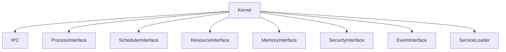

---

# 5. Interfaces del Kernel

Todas las capacidades se exponen mediante interfaces estables.

Interfaces principales:

* IProcessManager
* IScheduler
* IMemoryManager
* IResourceAllocator
* IServiceSupervisor
* IClusterManager
* ISecurityManager
* IEventDispatcher

Esto permite reemplazar implementaciones sin modificar el núcleo.

---

# 6. Inicialización del Sistema

Secuencia de arranque:

```text id="kos0002-003"
Boot

↓

Kernel Load

↓

Core Services

↓

Runtime

↓

Identity

↓

Resource Manager

↓

Scheduler

↓

Ready
```

---

# 7. Registro de Componentes

Todo componente debe registrarse.

Ejemplo:

```json id="kos0002-004"
{
"id":"scheduler",

"type":"core-service",

"version":"1.0",

"status":"READY"
}
```

---

# 8. Descubrimiento de Servicios

El microkernel mantiene un catálogo dinámico.

```text id="kos0002-005"
Kernel Registry

├── Scheduler

├── Memory

├── Security

├── Cluster

├── Storage

├── Runtime
```

---

# 9. IPC (Inter Process Communication)

Toda comunicación utiliza un canal uniforme.

Características:

* Asíncrono.
* Seguro.
* Trazable.
* Versionado.
* Compatible entre nodos.

Modelos soportados:

* Request/Response.
* Publish/Subscribe.
* Streaming.
* Events.
* RPC.

---

# 10. Modelo de Mensajes

Todo mensaje contiene:

```json id="kos0002-006"
{
"id":"MSG-001",

"source":"Scheduler",

"destination":"Runtime",

"type":"COMMAND",

"priority":"HIGH"
}
```

---

# 11. Sincronización

El kernel coordina:

* Locks.
* Semáforos.
* Barreras.
* Eventos.
* Señales.

Siempre evitando bloqueos innecesarios.

---

# 12. Gestión de Eventos Críticos

Eventos del kernel:

* Boot.
* Shutdown.
* Panic.
* Node Join.
* Node Leave.
* Resource Failure.
* Service Failure.
* Recovery.

Todos generan trazabilidad completa.

---

# 13. Modelo de Aislamiento

Cada proceso opera en un contexto aislado.

Incluye:

* Espacio lógico.
* Identidad.
* Tenant.
* Permisos.
* Recursos asignados.

---

# 14. Carga Dinámica

El kernel puede cargar:

* Drivers.
* Plugins.
* Servicios.
* Extensiones.

Sin reiniciar el sistema.

---

# 15. Gestión de Versiones

El microkernel soporta:

* Versiones paralelas.
* Compatibilidad hacia atrás.
* Migración progresiva.
* Desactivación controlada.

---

# 16. Gestión de Errores

El kernel distingue:

* Error recuperable.
* Error crítico.
* Error fatal.

Acciones:

```text id="kos0002-007"
Detect

↓

Classify

↓

Recover

↓

Restart

↓

Escalate
```

---

# 17. Seguridad del Kernel

El núcleo aplica:

* Zero Trust.
* Validación de identidad.
* Verificación de permisos.
* Firma de módulos.
* Carga segura.

Ningún módulo puede ejecutarse sin validación.

---

# 18. Estado del Sistema

Cada componente reporta:

* Estado.
* Salud.
* Disponibilidad.
* Versión.
* Consumo.
* Última actividad.

---

# 19. API Conceptual

Registrar módulo:

```typescript id="kos0002-008"
Kernel.register({

service:

"Scheduler"

})
```

Enviar mensaje:

```typescript id="kos0002-009"
Kernel.send({

destination:

"Runtime",

command:

"StartProcess"

})
```

Consultar estado:

```typescript id="kos0002-010"
Kernel.status({

service:

"Cluster"

})
```

---

# 20. Observabilidad

El microkernel registra:

* Eventos internos.
* Tiempo de arranque.
* Errores.
* Mensajes IPC.
* Cambios de estado.
* Consumo de recursos.

---

# 21. Integración con KRE

El Runtime utiliza el microkernel para:

* Crear procesos.
* Programar tareas.
* Gestionar eventos.
* Solicitar recursos.

---

# 22. Integración con KSP

Los servicios compartidos utilizan el kernel mediante interfaces oficiales.

No existe acceso directo al núcleo.

---

# 23. Objetivos No Funcionales

Debe garantizar:

* Arranque rápido.
* Baja latencia.
* Alta estabilidad.
* Determinismo.
* Escalabilidad.
* Recuperación automática.
* Compatibilidad evolutiva.

---

# 24. Principios Arquitectónicos

## Minimalista

Solo funciones esenciales.

## Modular

Todo mediante interfaces.

## Seguro

Zero Trust desde el núcleo.

## Distribuido

Preparado para múltiples nodos.

## Evolutivo

Actualizaciones sin interrupción.

## Determinista

Mismo comportamiento ante las mismas condiciones.

---

# 25. Resultado del Documento

Con **KOS-0002** queda definido:

✅ Arquitectura del microkernel.
✅ Interfaces del núcleo.
✅ Registro de componentes.
✅ Comunicación IPC.
✅ Sincronización.
✅ Gestión de eventos críticos.
✅ Carga dinámica de módulos.
✅ Aislamiento de procesos.
✅ Seguridad del kernel.
✅ Observabilidad e integración con KRE y KSP.

---

# Estado actualizado Serie KOS

| Documento                              | Estado      |
| -------------------------------------- | ----------- |
| KOS-0001 Operating System Architecture | ✅ Completo  |
| **KOS-0002 AI Microkernel**            | ✅ Completo  |
| KOS-0003 Process Manager               | ⏳ Siguiente |
| KOS-0004 Scheduler                     | Pendiente   |
| KOS-0005 Memory Manager                | Pendiente   |
| KOS-0006 Cluster Manager               | Pendiente   |
| KOS-0007 Service Supervisor            | Pendiente   |
| KOS-0008 Resource Allocator            | Pendiente   |
| KOS-0009 Recovery Manager              | Pendiente   |
| KOS-0010 Operating System Conformance  | Pendiente   |

---

# Próximo documento oficial

## **KOS-0003 — Process Manager**

Definirá el sistema de gestión de procesos del sistema operativo KAIZEN, incluyendo:

* Modelo universal de procesos.
* Ciclo de vida de procesos inteligentes.
* Procesos de agentes.
* Procesos de workflows.
* Procesos distribuidos.
* Árbol de procesos.
* Jerarquía y dependencias.
* Prioridades.
* Estados.
* Supervisión.
* Migración entre nodos.
* Terminación controlada.
* Recuperación de procesos.
* APIs del gestor de procesos.

Este documento establecerá cómo KAIZEN administra todas las unidades de ejecución del sistema operativo, independientemente de si representan servicios, agentes de IA, workflows o tareas distribuidas.


# KOS-0003 — Process Manager

# KAIZEN Operating System (KOS)

## Gestor Universal de Procesos para Servicios, Agentes, Workflows y Ejecución Distribuida

**Estado:** ⏳ En desarrollo
**Dependencias:**

✅ KDL — KAIZEN Definition Language
✅ KCF — KAIZEN Compiler Framework
✅ KRE — KAIZEN Runtime Environment
✅ KSP — KAIZEN Service Platform
✅ KOS-0001 Operating System Architecture
✅ KOS-0002 AI Microkernel

**Siguiente documento:** KOS-0004 Scheduler
**Capa:** Process Management Layer
**Clasificación:** Servicio Fundamental del Sistema Operativo

---

# 1. Propósito del Process Manager

El **Process Manager (PM)** administra todas las unidades de ejecución del sistema operativo KAIZEN.

En KOS, un proceso no representa únicamente un programa ejecutándose, sino cualquier entidad con ciclo de vida propio.

Esto incluye:

* Servicios.
* Agentes IA.
* Workflows.
* Jobs.
* Eventos persistentes.
* Tareas distribuidas.
* Pipelines de IA.

**Principio:**

> Todo elemento ejecutable dentro de KAIZEN es un proceso gobernado.

---

# 2. Modelo Universal de Procesos

KOS unifica todos los tipos de ejecución.

```text id="kos0003-001"
Service

↓

Agent

↓

Workflow

↓

Job

↓

Task

↓

Universal Process
```

Todos comparten el mismo contrato de ejecución.

---

# 3. Arquitectura

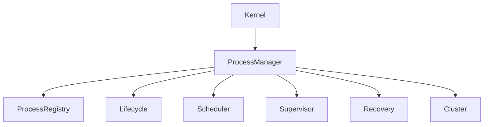

---

# 4. Process Identity

Todo proceso posee identidad única.

Ejemplo:

```json id="kos0003-003"
{
"process_id":

"PROC-1001",

"type":

"Agent",

"owner":

"tenant001",

"status":

"RUNNING"
}
```

---

# 5. Tipos de Procesos

El gestor reconoce:

## System Process

Servicios internos.

---

## Service Process

Microservicios.

---

## Agent Process

Agentes inteligentes.

---

## Workflow Process

Automatizaciones.

---

## Scheduled Process

Procesos programados.

---

## Background Process

Tareas permanentes.

---

## Distributed Process

Procesos distribuidos.

---

## Interactive Process

Sesiones de usuario.

---

# 6. Ciclo de Vida

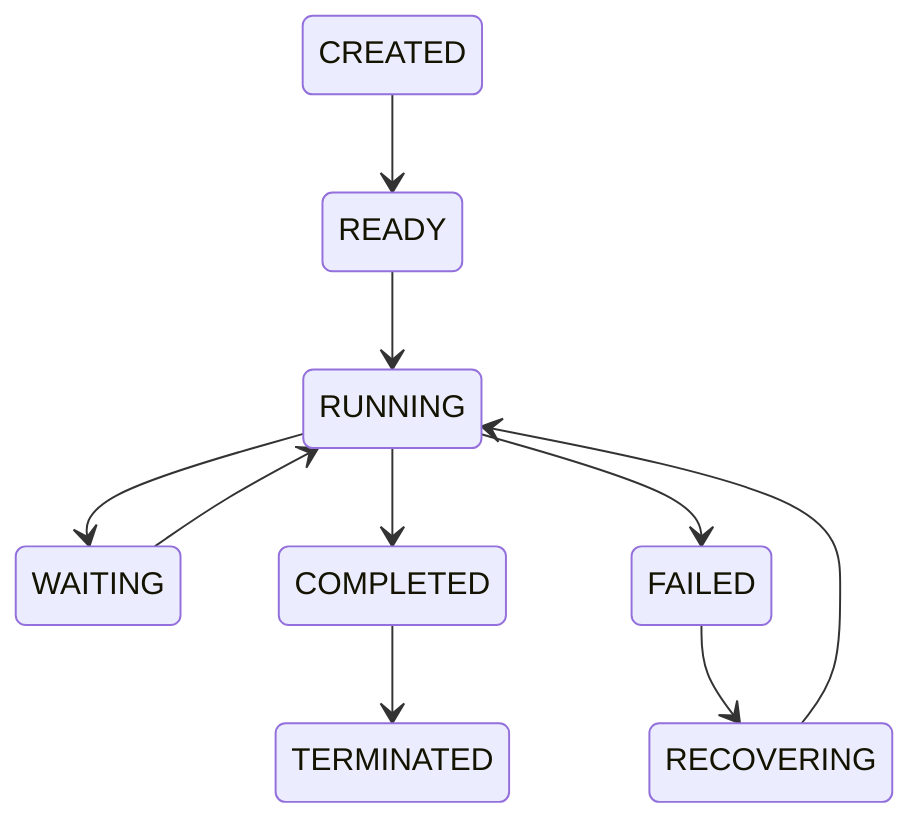

---

# 7. Estados

Estados oficiales:

* CREATED
* READY
* RUNNING
* WAITING
* BLOCKED
* PAUSED
* FAILED
* RECOVERING
* COMPLETED
* TERMINATED

---

# 8. Árbol de Procesos

Los procesos pueden generar hijos.

```text id="kos0003-005"
Workflow

├── Agent

│

├── OCR Service

│

└── Billing Service
```

---

# 9. Jerarquía

Cada proceso conoce:

* Padre.
* Hijos.
* Dependencias.
* Recursos.
* Contexto.

---

# 10. Contexto del Proceso

```json id="kos0003-006"
{
"tenant":

"company001",

"user":

"user01",

"workflow":

"invoice",

"priority":

"HIGH"
}
```

---

# 11. Prioridades

Cinco niveles:

| Nivel    | Uso           |
| -------- | ------------- |
| Critical | Kernel        |
| High     | IA crítica    |
| Normal   | Aplicaciones  |
| Low      | Batch         |
| Idle     | Mantenimiento |

---

# 12. Dependencias

Ejemplo:

```text id="kos0003-007"
Invoice Workflow

↓

OCR

↓

Knowledge

↓

LLM

↓

Approval
```

Un proceso no inicia hasta resolver dependencias.

---

# 13. Scheduler Interface

El Process Manager delega la planificación al Scheduler.

```text id="kos0003-008"
Create

↓

Queue

↓

Scheduler

↓

CPU

↓

Execution
```

---

# 14. Resource Binding

Cada proceso recibe:

* CPU.
* GPU.
* Memoria.
* Storage.
* Red.
* Tokens IA.

---

# 15. Migración

Procesos pueden migrarse entre nodos.

```text id="kos0003-009"
Node A

↓

Checkpoint

↓

Transfer

↓

Restore

↓

Node B
```

---

# 16. Checkpointing

Permite guardar estado.

Incluye:

* Memoria.
* Variables.
* Contexto.
* Eventos.
* Recursos.

---

# 17. Terminación

Tipos:

## Normal

Proceso completado.

## Cancelled

Usuario.

## Timeout

Tiempo excedido.

## Failure

Error.

## Forced

Administrador.

---

# 18. Recuperación

El sistema detecta:

```text id="kos0003-010"
Failure

↓

Checkpoint

↓

Recovery

↓

Resume
```

---

# 19. Supervisión

Cada proceso reporta:

* Estado.
* Consumo.
* Tiempo.
* Eventos.
* Errores.

---

# 20. Process Registry

Registro global:

```text id="kos0003-011"
Running

Queued

Waiting

Completed

Failed
```

---

# 21. Seguridad

Cada proceso hereda:

* Identidad.
* Tenant.
* Roles.
* Políticas.
* Límites.

No puede escapar de su contexto.

---

# 22. API Conceptual

Crear:

```typescript id="kos0003-012"
Process.create({

type:

"Agent"

})
```

Pausar:

```typescript id="kos0003-013"
Process.pause({

id:

"PROC001"

})
```

Reanudar:

```typescript id="kos0003-014"
Process.resume({

id:

"PROC001"

})
```

Terminar:

```typescript id="kos0003-015"
Process.stop({

id:

"PROC001"

})
```

---

# 23. Observabilidad

El gestor registra:

* Inicio.
* Finalización.
* Errores.
* Consumo.
* Migraciones.
* Recuperaciones.
* Latencia.

---

# 24. Integración

El Process Manager trabaja con:

* AI Microkernel.
* Scheduler.
* Memory Manager.
* Cluster Manager.
* Resource Allocator.
* Recovery Manager.
* Service Supervisor.

---

# 25. Objetivos No Funcionales

Debe soportar:

* Millones de procesos.
* Baja latencia.
* Recuperación automática.
* Distribución transparente.
* Escalabilidad horizontal.
* Determinismo.

---

# 26. Principios Arquitectónicos

## Universal

Un único modelo para todas las cargas.

## Seguro

Contexto aislado.

## Distribuido

Procesos movibles entre nodos.

## Recuperable

Checkpointing nativo.

## Gobernado

Todas las acciones auditadas.

## Escalable

Diseñado para grandes clústeres.

---

# 27. Resultado del Documento

Con **KOS-0003** queda definido:

✅ Modelo universal de procesos.
✅ Identidad y contexto.
✅ Ciclo de vida.
✅ Árbol de procesos.
✅ Gestión de prioridades.
✅ Dependencias.
✅ Migración entre nodos.
✅ Checkpointing.
✅ Recuperación.
✅ Supervisión y observabilidad.

---

# Estado actualizado Serie KOS

| Documento                              | Estado      |
| -------------------------------------- | ----------- |
| KOS-0001 Operating System Architecture | ✅ Completo  |
| KOS-0002 AI Microkernel                | ✅ Completo  |
| **KOS-0003 Process Manager**           | ✅ Completo  |
| KOS-0004 Scheduler                     | ⏳ Siguiente |
| KOS-0005 Memory Manager                | Pendiente   |
| KOS-0006 Cluster Manager               | Pendiente   |
| KOS-0007 Service Supervisor            | Pendiente   |
| KOS-0008 Resource Allocator            | Pendiente   |
| KOS-0009 Recovery Manager              | Pendiente   |
| KOS-0010 Operating System Conformance  | Pendiente   |

---

# Próximo documento oficial

## **KOS-0004 — Scheduler**

Este documento definirá el planificador universal del sistema operativo KAIZEN, incluyendo:

* Planificación determinista.
* Colas multinivel.
* Prioridades dinámicas.
* Fair Scheduling.
* Time Slicing.
* Afinidad de recursos.
* Planificación de agentes IA.
* Planificación de workflows.
* Balanceo de carga.
* Distribución entre nodos.
* Optimización basada en políticas.
* Scheduling predictivo asistido por IA.
* Garantías de equidad, rendimiento y disponibilidad.

Con este documento quedará definida la inteligencia de planificación del sistema operativo KAIZEN, responsable de decidir **qué se ejecuta, cuándo, dónde y con qué recursos**.


# KOS-0004 — Universal Scheduler

# KAIZEN Operating System (KOS)

## Planificador Universal para Procesos, Agentes, Workflows y Recursos Distribuidos

**Estado:** ⏳ En desarrollo
**Dependencias:**

✅ KDL — KAIZEN Definition Language
✅ KCF — KAIZEN Compiler Framework
✅ KRE — KAIZEN Runtime Environment
✅ KSP — KAIZEN Service Platform
✅ KOS-0001 Operating System Architecture
✅ KOS-0002 AI Microkernel
✅ KOS-0003 Process Manager

**Siguiente documento:** **KOS-0005 Memory Manager**
**Capa:** Scheduling & Execution Layer
**Clasificación:** Planificador Universal del Sistema Operativo

---

# 1. Propósito

El **Universal Scheduler (US)** es responsable de decidir:

* Qué ejecutar.
* Cuándo ejecutarlo.
* Dónde ejecutarlo.
* Con qué prioridad.
* Con qué recursos.
* Durante cuánto tiempo.

Su objetivo es maximizar el rendimiento global del sistema garantizando equidad, determinismo y cumplimiento de políticas.

**Principio:**

> Ningún proceso se ejecuta sin haber sido planificado por el Scheduler.

---

# 2. Filosofía

El Scheduler de KAIZEN no es únicamente un planificador de CPU.

Planifica recursos heterogéneos:

* CPU.
* GPU.
* Memoria.
* Modelos IA.
* Agentes.
* Workflows.
* APIs externas.
* Vector Databases.
* Motores OCR.
* Herramientas.

Todos los recursos son tratados mediante un modelo unificado.

---

# 3. Arquitectura

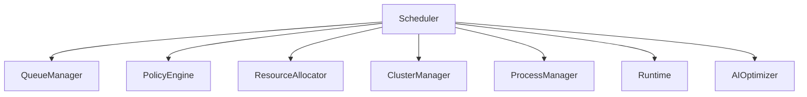

---

# 4. Flujo General

```text
Nuevo proceso

↓

Clasificación

↓

Priorización

↓

Cola

↓

Asignación de recursos

↓

Nodo óptimo

↓

Ejecución

↓

Monitoreo

↓

Finalización
```

---

# 5. Colas Multinivel

El Scheduler mantiene múltiples colas independientes.

```text
Critical

High

Normal

Low

Background

Maintenance
```

Cada cola posee políticas propias.

---

# 6. Prioridades

Prioridad base:

| Nivel | Uso              |
| ----- | ---------------- |
| P0    | Kernel           |
| P1    | Seguridad        |
| P2    | Agentes críticos |
| P3    | Workflows        |
| P4    | Servicios        |
| P5    | Batch            |

La prioridad efectiva puede modificarse dinámicamente.

---

# 7. Prioridad Dinámica

El sistema ajusta prioridades según:

* SLA.
* Tiempo de espera.
* Latencia.
* Recursos.
* Dependencias.
* Usuario.
* Tenant.
* Políticas.

---

# 8. Time Slicing

Cada proceso recibe una ventana de ejecución.

```text
Execute

↓

Quantum

↓

Yield

↓

Requeue
```

El tamaño del quantum depende del tipo de carga.

---

# 9. Tipos de Scheduling

KOS soporta simultáneamente:

* FIFO.
* Round Robin.
* Priority Scheduling.
* Fair Scheduling.
* Deadline Scheduling.
* Real-Time Scheduling.
* Event Scheduling.
* AI Scheduling.

---

# 10. Fair Scheduler

Garantiza que ningún tenant monopolice los recursos.

Variables consideradas:

* Uso histórico.
* Cuotas contratadas.
* Prioridad.
* Créditos disponibles.
* SLA.

---

# 11. Afinidad

El Scheduler puede mantener afinidad con:

* CPU.
* GPU.
* Nodo.
* Memoria.
* Caché.
* Modelo IA.

Con el objetivo de reducir migraciones y mejorar el rendimiento.

---

# 12. Localidad de Datos

El Scheduler intenta ejecutar los procesos cerca de los datos requeridos.

```text
Knowledge

↓

Vector DB

↓

Nodo cercano

↓

Ejecución
```

Esto reduce la latencia.

---

# 13. Planificación de Agentes

Los agentes poseen atributos adicionales:

* Modelo requerido.
* Contexto.
* Memoria.
* Herramientas.
* Dependencias.

El Scheduler optimiza su ubicación según estas características.

---

# 14. Planificación de Workflows

Los workflows se analizan como grafos acíclicos dirigidos (DAG).

El Scheduler identifica:

* Dependencias.
* Paralelismo.
* Cuellos de botella.
* Rutas críticas.

---

# 15. Distribución entre Nodos

```text
Queue

↓

Node Selection

↓

Capacity Check

↓

Deployment

↓

Execution
```

El Scheduler selecciona el nodo óptimo según políticas y disponibilidad.

---

# 16. Balanceo de Carga

Variables:

* CPU.
* GPU.
* Memoria.
* I/O.
* Red.
* Latencia.
* Temperatura del nodo.
* Coste estimado.

---

# 17. Scheduling Predictivo

El Scheduler incorpora modelos de IA para:

* Anticipar picos de carga.
* Precalentar recursos.
* Reordenar colas.
* Optimizar consumo energético.
* Reducir tiempos de espera.

---

# 18. Políticas

Ejemplos:

```yaml
policy:

tenant: enterprise

priority: HIGH

gpu: preferred

region: us-east

retry: 3
```

Las políticas pueden definirse a nivel de tenant, servicio o proceso.

---

# 19. Preemption

Un proceso puede ser interrumpido cuando:

* Existe una tarea crítica.
* Se detecta riesgo para un SLA.
* Hay una emergencia operativa.
* Una política lo exige.

La reanudación se realiza desde un checkpoint cuando es posible.

---

# 20. Tolerancia a Fallos

Si un nodo falla:

```text
Failure

↓

Checkpoint

↓

Reschedule

↓

Restore

↓

Continue
```

La recuperación es transparente para el proceso.

---

# 21. Observabilidad

El Scheduler registra:

* Tiempo en cola.
* Tiempo de ejecución.
* Uso de recursos.
* Reintentos.
* Preemptions.
* Migraciones.
* Decisiones de planificación.

---

# 22. API Conceptual

```typescript
Scheduler.schedule({

process:

"PROC-1001"

})
```

```typescript
Scheduler.priority({

process:

"PROC-1001",

level:

"HIGH"

})
```

```typescript
Scheduler.migrate({

process:

"PROC-1001",

node:

"Node-07"

})
```

---

# 23. Integración

El Scheduler interactúa con:

* AI Microkernel.
* Process Manager.
* Resource Allocator.
* Cluster Manager.
* Recovery Manager.
* Service Supervisor.
* Observability Engine.

---

# 24. Objetivos No Funcionales

Debe garantizar:

* Baja latencia.
* Alto throughput.
* Determinismo.
* Escalabilidad horizontal.
* Equidad entre tenants.
* Uso eficiente de recursos.
* Recuperación automática.

---

# 25. Principios Arquitectónicos

## Determinista

Las mismas condiciones producen la misma decisión.

## Justo

Distribución equilibrada de recursos.

## Predictivo

Optimización mediante IA.

## Adaptativo

Se ajusta a cambios del entorno.

## Distribuido

Opera sobre múltiples nodos.

## Basado en Políticas

Todas las decisiones son gobernadas por reglas configurables.

---

# 26. Resultado del Documento

Con **KOS-0004** queda definido:

✅ Scheduler universal.
✅ Colas multinivel.
✅ Prioridades dinámicas.
✅ Time Slicing.
✅ Fair Scheduling.
✅ Afinidad de recursos.
✅ Planificación de agentes y workflows.
✅ Balanceo de carga.
✅ Scheduling predictivo con IA.
✅ Recuperación y replanificación automática.

---

# Estado actualizado Serie KOS

| Documento                              | Estado      |
| -------------------------------------- | ----------- |
| KOS-0001 Operating System Architecture | ✅ Completo  |
| KOS-0002 AI Microkernel                | ✅ Completo  |
| KOS-0003 Process Manager               | ✅ Completo  |
| **KOS-0004 Universal Scheduler**       | ✅ Completo  |
| KOS-0005 Memory Manager                | ⏳ Siguiente |
| KOS-0006 Cluster Manager               | Pendiente   |
| KOS-0007 Service Supervisor            | Pendiente   |
| KOS-0008 Resource Allocator            | Pendiente   |
| KOS-0009 Recovery Manager              | Pendiente   |
| KOS-0010 Operating System Conformance  | Pendiente   |

---

# Próximo documento oficial

## **KOS-0005 — Memory Manager**

Este documento definirá el sistema de gestión de memoria del sistema operativo KAIZEN, incluyendo:

* Espacios de memoria para procesos, agentes y workflows.
* Memoria compartida y aislada.
* Cachés multinivel.
* Gestión de memoria distribuida.
* Integración con Enterprise Memory y Knowledge Platform.
* Garbage Collection distribuido.
* Checkpointing de memoria.
* Persistencia de contexto para agentes.
* Optimización mediante políticas y telemetría.
* Garantías de aislamiento, consistencia y recuperación.

Con este documento se establecerá cómo KAIZEN administra la memoria no solo como un recurso físico, sino también como un activo semántico y de contexto para aplicaciones inteligentes.


# KOS-0005 — Memory Manager

# KAIZEN Operating System (KOS)

## Gestor Universal de Memoria para Procesos, Agentes, Workflows y Conocimiento Distribuido

**Estado:** ⏳ En desarrollo

**Dependencias:**

✅ KDL — KAIZEN Definition Language
✅ KCF — KAIZEN Compiler Framework
✅ KRE — KAIZEN Runtime Environment
✅ KSP — KAIZEN Service Platform
✅ KOS-0001 Operating System Architecture
✅ KOS-0002 AI Microkernel
✅ KOS-0003 Process Manager
✅ KOS-0004 Universal Scheduler

**Siguiente documento:** **KOS-0006 Cluster Manager**

**Capa:** Memory & Context Management Layer

**Clasificación:** Gestor Universal de Memoria Inteligente

---

# 1. Propósito

El **Memory Manager (MM)** administra toda la memoria utilizada por el sistema operativo KAIZEN.

A diferencia de un sistema operativo tradicional, KOS administra cuatro categorías de memoria:

* Memoria computacional.
* Memoria distribuida.
* Memoria contextual.
* Memoria semántica.

La memoria deja de ser únicamente RAM y se convierte en un activo estratégico para la inteligencia del sistema.

**Principio:**

> Todo contexto utilizado por un proceso puede ser administrado, protegido, persistido y recuperado.

---

# 2. Arquitectura General

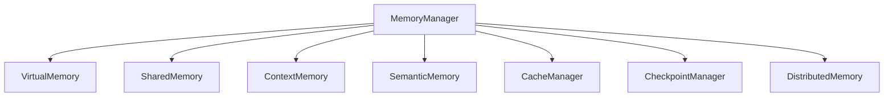

---

# 3. Modelo Unificado de Memoria

```text
RAM

↓

Virtual Memory

↓

Context Memory

↓

Knowledge Memory

↓

Persistent Memory
```

Todos los tipos de memoria comparten políticas comunes de asignación, aislamiento y recuperación.

---

# 4. Tipos de Memoria

## Memoria Física

Recursos físicos disponibles.

---

## Memoria Virtual

Espacios lógicos para procesos.

---

## Memoria Compartida

Intercambio seguro entre procesos autorizados.

---

## Memoria Contextual

Estado operativo de procesos, agentes y workflows.

---

## Memoria Semántica

Conocimiento derivado del Knowledge Platform.

---

## Memoria Persistente

Estado almacenado para recuperación y continuidad.

---

# 5. Espacios de Memoria

Cada proceso recibe un espacio aislado.

```text
Tenant

↓

Process

↓

Memory Space

↓

Protected Region
```

No existe acceso directo entre espacios sin autorización explícita.

---

# 6. Context Memory

Cada proceso mantiene:

* Variables.
* Estado.
* Dependencias.
* Configuración.
* Tokens temporales.
* Recursos asignados.

---

# 7. Agent Memory

Los agentes poseen memoria especializada.

Incluye:

* Conversaciones.
* Objetivos.
* Herramientas utilizadas.
* Resultados anteriores.
* Preferencias.
* Planes activos.

---

# 8. Workflow Memory

Cada workflow conserva:

* Estado de ejecución.
* Variables compartidas.
* Resultados intermedios.
* Dependencias.
* Historial.

---

# 9. Enterprise Memory

El Memory Manager se integra con KSP.

```text
Memory Manager

↓

Enterprise Memory

↓

Knowledge Platform

↓

Vector Database

↓

Knowledge Graph
```

El sistema distingue claramente entre memoria operativa y conocimiento persistente.

---

# 10. Caché Multinivel

```text
L1

↓

L2

↓

L3

↓

Distributed Cache

↓

Persistent Cache
```

Cada nivel optimiza un tipo diferente de acceso.

---

# 11. Política de Caché

Se soportan:

* LRU.
* LFU.
* FIFO.
* TTL.
* Adaptativa basada en IA.

---

# 12. Garbage Collection

El sistema elimina automáticamente:

* Objetos huérfanos.
* Contextos expirados.
* Recursos liberados.
* Cachés obsoletas.

El proceso es incremental y distribuido para minimizar pausas.

---

# 13. Checkpointing

La memoria puede persistirse periódicamente.

```text
Running

↓

Snapshot

↓

Storage

↓

Recovery

↓

Resume
```

---

# 14. Restauración

Ante una falla:

* Recuperar snapshot.
* Restaurar memoria.
* Validar consistencia.
* Reanudar ejecución.

---

# 15. Memoria Distribuida

La memoria puede distribuirse entre nodos.

```text
Node A

↓

Shared Memory Fabric

↓

Node B

↓

Node C
```

El acceso se realiza mediante protocolos seguros y coherentes.

---

# 16. Consistencia

Modelos soportados:

* Strong Consistency.
* Eventual Consistency.
* Session Consistency.
* Read Your Writes.

La política depende del tipo de carga.

---

# 17. Aislamiento

Cada espacio de memoria posee:

* Tenant.
* Usuario.
* Roles.
* Políticas.
* Cifrado.

No existen accesos implícitos.

---

# 18. Seguridad

Toda memoria sensible puede cifrarse.

Se soporta:

* Cifrado en reposo.
* Cifrado en tránsito.
* Cifrado en uso (cuando la infraestructura lo permita).

---

# 19. Optimización Inteligente

El Memory Manager puede:

* Precargar contexto.
* Liberar memoria predictivamente.
* Reubicar datos.
* Optimizar cachés.
* Detectar patrones de uso.

Mediante modelos de IA y telemetría histórica.

---

# 20. Integración con Scheduler

El Scheduler consulta:

* Memoria disponible.
* Afinidad.
* Localidad.
* Cachés.
* Coste de migración.

Antes de asignar un proceso.

---

# 21. API Conceptual

Asignar memoria:

```typescript
Memory.allocate({

process:

"PROC001",

size:

"2GB"

})
```

Crear snapshot:

```typescript
Memory.snapshot({

process:

"PROC001"

})
```

Liberar memoria:

```typescript
Memory.release({

process:

"PROC001"

})
```

---

# 22. Observabilidad

El sistema registra:

* Consumo.
* Fragmentación.
* Fallos de asignación.
* Uso por tenant.
* Hit Ratio de caché.
* Snapshots.
* Recuperaciones.

---

# 23. Objetivos No Funcionales

Debe garantizar:

* Baja fragmentación.
* Alta disponibilidad.
* Recuperación rápida.
* Escalabilidad horizontal.
* Baja latencia.
* Consistencia configurable.
* Seguridad por diseño.

---

# 24. Principios Arquitectónicos

## Context Aware

La memoria comprende el contexto del proceso.

## Distribuida

Escala entre múltiples nodos.

## Persistente

Puede sobrevivir a fallos.

## Inteligente

Optimiza automáticamente el uso.

## Segura

Protección completa por aislamiento y cifrado.

## Integrada

Conecta la memoria operativa con la memoria empresarial.

---

# 25. Resultado del Documento

Con **KOS-0005** queda definido:

✅ Modelo universal de memoria.
✅ Memoria contextual para procesos y agentes.
✅ Integración con Enterprise Memory.
✅ Cachés multinivel.
✅ Garbage Collection distribuido.
✅ Checkpointing y restauración.
✅ Memoria distribuida.
✅ Consistencia configurable.
✅ Seguridad y aislamiento.
✅ Optimización inteligente basada en IA.

---

# Estado actualizado Serie KOS

| Documento                              | Estado      |
| -------------------------------------- | ----------- |
| KOS-0001 Operating System Architecture | ✅ Completo  |
| KOS-0002 AI Microkernel                | ✅ Completo  |
| KOS-0003 Process Manager               | ✅ Completo  |
| KOS-0004 Universal Scheduler           | ✅ Completo  |
| **KOS-0005 Memory Manager**            | ✅ Completo  |
| KOS-0006 Cluster Manager               | ⏳ Siguiente |
| KOS-0007 Service Supervisor            | Pendiente   |
| KOS-0008 Resource Allocator            | Pendiente   |
| KOS-0009 Recovery Manager              | Pendiente   |
| KOS-0010 Operating System Conformance  | Pendiente   |

---

# Próximo documento oficial

## **KOS-0006 — Cluster Manager**

Este documento definirá la arquitectura distribuida de KAIZEN, incluyendo:

* Gestión de clústeres y nodos.
* Descubrimiento automático de nodos.
* Coordinación distribuida.
* Elección de líder.
* Replicación y consenso.
* Balanceo global.
* Escalado horizontal.
* Federación entre clústeres.
* Multi-región y Edge Computing.
* Sincronización de estado.
* Gestión de particiones de red.
* Alta disponibilidad y tolerancia a fallos.

Con **KOS-0006** quedará definida la infraestructura distribuida que permitirá a KAIZEN operar como un sistema operativo inteligente a escala empresarial y global.


# KOS-0006 — Cluster Manager

# KAIZEN Operating System (KOS)

## Gestor Universal de Clústeres para Computación Inteligente Distribuida

**Estado:** ⏳ En desarrollo

**Dependencias:**

✅ KDL — KAIZEN Definition Language
✅ KCF — KAIZEN Compiler Framework
✅ KRE — KAIZEN Runtime Environment
✅ KSP — KAIZEN Service Platform
✅ KOS-0001 Operating System Architecture
✅ KOS-0002 AI Microkernel
✅ KOS-0003 Process Manager
✅ KOS-0004 Universal Scheduler
✅ KOS-0005 Memory Manager

**Siguiente documento:** **KOS-0007 Service Supervisor**

**Capa:** Distributed Infrastructure Layer

**Clasificación:** Gestor Universal de Clústeres

---

# 1. Propósito

El **Cluster Manager (CM)** coordina toda la infraestructura distribuida de KAIZEN.

Es responsable de administrar:

* Clústeres.
* Nodos.
* Regiones.
* Edge Nodes.
* Recursos compartidos.
* Estado distribuido.
* Alta disponibilidad.
* Federación entre centros de datos.

El objetivo es presentar múltiples máquinas físicas como un único sistema operativo lógico.

**Principio:**

> Para las aplicaciones, el clúster debe comportarse como una sola máquina.

---

# 2. Arquitectura General

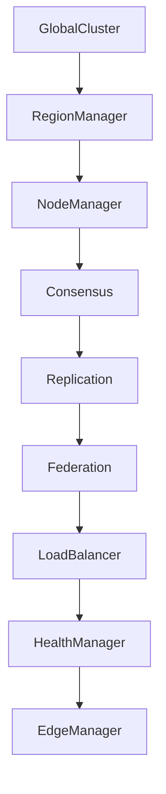

---

# 3. Modelo Jerárquico

```text
Global Cluster

├── Región América

│ ├── Cluster A

│ ├── Cluster B

│

├── Región Europa

│ ├── Cluster C

│

└── Región Asia

└── Cluster D
```

Cada nivel puede operar de forma autónoma y coordinada.

---

# 4. Tipos de Nodo

KOS reconoce múltiples perfiles:

* Compute Node.
* GPU Node.
* AI Node.
* Storage Node.
* Edge Node.
* Gateway Node.
* Management Node.
* Hybrid Node.

Cada tipo publica sus capacidades y políticas.

---

# 5. Registro de Nodos

Todo nodo mantiene un manifiesto.

```json
{
"id":"NODE-042",

"region":"us-east",

"cpu":64,

"gpu":8,

"memory":"512GB",

"status":"READY"
}
```

---

# 6. Descubrimiento Automático

El descubrimiento sigue el flujo:

```text
Nuevo Nodo

↓

Handshake

↓

Autenticación

↓

Registro

↓

Sincronización

↓

Disponible
```

No se permite la incorporación sin validación.

---

# 7. Estado del Nodo

Estados oficiales:

* JOINING.
* READY.
* ACTIVE.
* DEGRADED.
* DRAINING.
* MAINTENANCE.
* FAILED.
* REMOVED.

---

# 8. Coordinación Distribuida

El Cluster Manager mantiene:

* Configuración compartida.
* Catálogo global.
* Estado de nodos.
* Topología.
* Versiones.
* Capacidades.

Toda la información se replica entre los nodos de control.

---

# 9. Consenso

El sistema requiere un protocolo de consenso para:

* Elegir líderes.
* Confirmar cambios críticos.
* Evitar particiones inconsistentes.
* Sincronizar estado.

La implementación puede utilizar algoritmos como **Raft** o equivalentes, siempre que cumplan los contratos definidos por KOS.

---

# 10. Elección de Líder

Proceso:

```text
Failure

↓

Election

↓

Consensus

↓

Leader

↓

Replication
```

El liderazgo es transparente para las aplicaciones.

---

# 11. Replicación

Se soportan:

* Síncrona.
* Asíncrona.
* Multi-réplica.
* Multi-región.

La estrategia depende del tipo de dato y del SLA.

---

# 12. Balanceo Global

Variables consideradas:

* CPU.
* GPU.
* Memoria.
* Latencia.
* Distancia.
* Coste.
* Disponibilidad.
* Afinidad de datos.

---

# 13. Escalado Horizontal

El clúster puede crecer mediante:

```text
Nuevo Nodo

↓

Validación

↓

Integración

↓

Redistribución

↓

Balanceo
```

No requiere detener el sistema.

---

# 14. Federación

Los clústeres pueden formar federaciones.

```text
Federation

├── Cluster A

├── Cluster B

├── Cluster C

└── Cluster N
```

Cada clúster conserva autonomía operativa y comparte únicamente la información autorizada.

---

# 15. Multi-Región

Características:

* Replicación geográfica.
* Failover regional.
* Balanceo global.
* Políticas de residencia de datos.
* Recuperación ante desastres.

---

# 16. Edge Computing

El Cluster Manager administra nodos Edge.

Funciones:

* Procesamiento cercano al origen.
* Caché local.
* Inferencia IA.
* Operación desconectada.
* Sincronización diferida.

---

# 17. Gestión de Particiones

Ante una partición de red:

```text
Partition

↓

Isolation

↓

Consensus

↓

Recovery

↓

Merge
```

El sistema minimiza inconsistencias y registra todas las decisiones.

---

# 18. Mantenimiento

Un nodo puede entrar en mantenimiento.

Proceso:

* Drenar procesos.
* Migrar cargas.
* Confirmar estado.
* Deshabilitar.
* Actualizar.
* Reintegrar.

---

# 19. Seguridad

Cada nodo posee:

* Identidad criptográfica.
* Certificados.
* Políticas.
* Validación mutua.
* Rotación de credenciales.

La comunicación entre nodos es cifrada.

---

# 20. Integración con el Scheduler

El Scheduler consulta:

* Capacidad.
* Salud.
* Ubicación.
* Coste.
* Disponibilidad.

Antes de asignar procesos.

---

# 21. Integración con Resource Allocator

El Resource Allocator utiliza el inventario global del clúster para asignar recursos físicos y lógicos.

---

# 22. API Conceptual

Registrar nodo:

```typescript
Cluster.join({

node:

"NODE-042"

})
```

Consultar estado:

```typescript
Cluster.status({

node:

"NODE-042"

})
```

Retirar nodo:

```typescript
Cluster.drain({

node:

"NODE-042"

})
```

---

# 23. Observabilidad

El Cluster Manager registra:

* Estado de nodos.
* Topología.
* Latencia.
* Replicación.
* Cambios de liderazgo.
* Particiones.
* Recuperaciones.

---

# 24. Objetivos No Funcionales

Debe garantizar:

* Escalabilidad horizontal prácticamente ilimitada.
* Alta disponibilidad.
* Recuperación automática.
* Consistencia configurable.
* Baja latencia.
* Tolerancia a fallos regionales.
* Operación continua.

---

# 25. Principios Arquitectónicos

## Distributed First

Todo está diseñado para múltiples nodos.

## Self-Healing

Recuperación automática.

## Region Aware

Consciente de la ubicación geográfica.

## Secure by Design

Identidad y cifrado desde el inicio.

## Elastic

Capacidad de crecimiento y reducción dinámica.

## Federated

Múltiples clústeres cooperando bajo políticas comunes.

---

# 26. Resultado del Documento

Con **KOS-0006** queda definido:

✅ Gestión universal de clústeres.
✅ Descubrimiento automático de nodos.
✅ Registro e identidad de nodos.
✅ Coordinación distribuida.
✅ Consenso y elección de líder.
✅ Replicación configurable.
✅ Balanceo global.
✅ Escalado horizontal.
✅ Federación de clústeres.
✅ Multi-región y Edge Computing.
✅ Gestión de particiones de red.
✅ Alta disponibilidad.

---

# Estado actualizado Serie KOS

| Documento                              | Estado      |
| -------------------------------------- | ----------- |
| KOS-0001 Operating System Architecture | ✅ Completo  |
| KOS-0002 AI Microkernel                | ✅ Completo  |
| KOS-0003 Process Manager               | ✅ Completo  |
| KOS-0004 Universal Scheduler           | ✅ Completo  |
| KOS-0005 Memory Manager                | ✅ Completo  |
| **KOS-0006 Cluster Manager**           | ✅ Completo  |
| KOS-0007 Service Supervisor            | ⏳ Siguiente |
| KOS-0008 Resource Allocator            | Pendiente   |
| KOS-0009 Recovery Manager              | Pendiente   |
| KOS-0010 Operating System Conformance  | Pendiente   |

---

# Próximo documento oficial

## **KOS-0007 — Service Supervisor**

Este documento definirá el supervisor universal de servicios de KAIZEN, incluyendo:

* Registro y descubrimiento de servicios.
* Ciclo de vida de servicios.
* Supervisión continua.
* Reinicio automático.
* Auto Healing.
* Health Checks.
* Gestión de dependencias entre servicios.
* Rolling Updates y despliegues progresivos.
* Circuit Breakers.
* Políticas de disponibilidad.
* Supervisión de agentes, modelos y servicios inteligentes.
* Auditoría y observabilidad operacional.

Con **KOS-0007** se definirá el mecanismo responsable de mantener todos los servicios del sistema operativo en funcionamiento continuo, resiliente y autorrecuperable.


# KOS-0007 — Service Supervisor

# KAIZEN Operating System (KOS)

## Supervisor Universal de Servicios, Agentes, Modelos y Componentes Inteligentes

**Estado:** ⏳ En desarrollo

**Dependencias:**

✅ KDL — KAIZEN Definition Language
✅ KCF — KAIZEN Compiler Framework
✅ KRE — KAIZEN Runtime Environment
✅ KSP — KAIZEN Service Platform
✅ KOS-0001 Operating System Architecture
✅ KOS-0002 AI Microkernel
✅ KOS-0003 Process Manager
✅ KOS-0004 Universal Scheduler
✅ KOS-0005 Memory Manager
✅ KOS-0006 Cluster Manager

**Siguiente documento:** **KOS-0008 Resource Allocator**

**Capa:** Service Orchestration Layer

**Clasificación:** Supervisor Universal del Sistema Operativo

---

# 1. Propósito

El **Service Supervisor (SS)** garantiza que todos los componentes ejecutables del sistema permanezcan disponibles, saludables y alineados con las políticas operativas.

Supervisa:

* Servicios.
* Agentes IA.
* Modelos.
* Workflows persistentes.
* APIs.
* Plugins.
* Drivers.
* Conectores.

Su objetivo es mantener el sistema operativo en funcionamiento continuo mediante supervisión activa y recuperación automática.

**Principio:**

> Ningún servicio crítico permanece fuera de línea sin que el sistema intente recuperarlo.

---

# 2. Arquitectura General

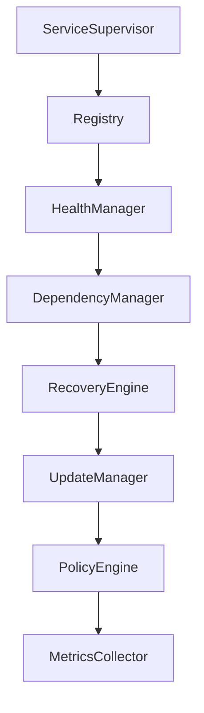

---

# 3. Ciclo de Vida del Servicio

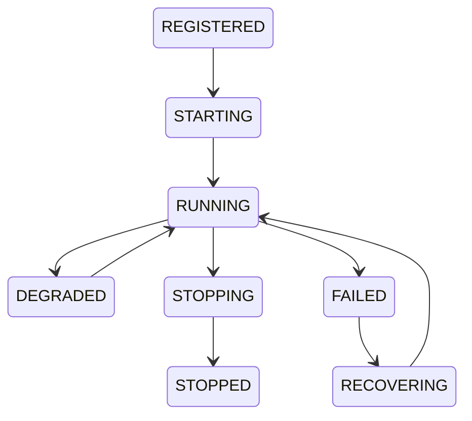

---

# 4. Registro de Servicios

Todo servicio debe registrarse.

Ejemplo:

```json
{
"id":"knowledge-service",

"type":"core",

"version":"3.1",

"critical":true
}
```

---

# 5. Catálogo Global

El supervisor mantiene un inventario con:

* Identificador.
* Versión.
* Nodo.
* Región.
* Dependencias.
* Estado.
* SLA.
* Propietario.

---

# 6. Descubrimiento de Servicios

Los servicios pueden descubrirse dinámicamente.

```text
Registry

↓

Lookup

↓

Endpoint

↓

Connect
```

El descubrimiento soporta balanceo y múltiples instancias.

---

# 7. Health Checks

Tipos soportados:

* Liveness.
* Readiness.
* Startup.
* Dependency.
* Resource.
* Semantic Health.

El estado puede ser:

* Healthy.
* Warning.
* Degraded.
* Critical.
* Offline.

---

# 8. Supervisión Continua

Cada servicio reporta:

* CPU.
* Memoria.
* Latencia.
* Throughput.
* Errores.
* Dependencias.
* Estado funcional.

---

# 9. Gestión de Dependencias

Ejemplo:

```text
Workflow Service

↓

Knowledge Service

↓

Vector Database

↓

Storage
```

Si una dependencia falla, el supervisor aplica la política correspondiente antes de propagar el impacto.

---

# 10. Reinicio Automático

Políticas configurables:

* Reinicio inmediato.
* Reinicio exponencial.
* Reinicio limitado.
* Reinicio manual.
* Escalado previo al reinicio.

---

# 11. Auto-Healing

El motor de recuperación puede:

* Reiniciar procesos.
* Migrar servicios.
* Crear nuevas instancias.
* Restaurar checkpoints.
* Sustituir nodos degradados.

---

# 12. Rolling Updates

Proceso:

```text
Nueva versión

↓

Instancia nueva

↓

Verificación

↓

Migración gradual

↓

Eliminación versión anterior
```

Permite actualizar sin interrumpir el servicio.

---

# 13. Blue/Green Deployment

Soporta despliegues paralelos:

```text
Blue

↓

Validation

↓

Switch

↓

Green
```

Facilita pruebas y rollback inmediato.

---

# 14. Canary Releases

Permite liberar versiones a un porcentaje controlado del tráfico.

Ejemplo:

* 5%
* 20%
* 50%
* 100%

Con métricas automáticas para decidir la promoción o reversión.

---

# 15. Circuit Breakers

Cuando una dependencia falla:

```text
Error

↓

Threshold

↓

Open Circuit

↓

Retry

↓

Half Open

↓

Closed
```

Evita fallos en cascada.

---

# 16. Políticas de Disponibilidad

Ejemplo:

```yaml
availability:

min_instances:3

max_restart:5

region:"global"

sla:"99.99%"
```

---

# 17. Gestión de SLA

Cada servicio define:

* Disponibilidad objetivo.
* Tiempo máximo de respuesta.
* Tiempo de recuperación (RTO).
* Punto objetivo de recuperación (RPO).
* Prioridad.

---

# 18. Integración con Cluster Manager

El supervisor puede:

* Solicitar nuevos nodos.
* Migrar servicios.
* Reequilibrar carga.
* Declarar nodos no saludables.

---

# 19. Integración con Scheduler

El Scheduler recibe información sobre:

* Saturación.
* Disponibilidad.
* Instancias.
* Recursos.

Para tomar decisiones de planificación.

---

# 20. Integración con Recovery Manager

Ante un fallo grave:

```text
Failure

↓

Supervisor

↓

Recovery Manager

↓

Restore

↓

Validation

↓

Resume
```

---

# 21. API Conceptual

Registrar servicio:

```typescript
Service.register({

id:

"knowledge"

})
```

Consultar salud:

```typescript
Service.health({

id:

"knowledge"

})
```

Reiniciar:

```typescript
Service.restart({

id:

"knowledge"

})
```

---

# 22. Observabilidad

El Service Supervisor registra:

* Disponibilidad.
* Reinicios.
* Fallos.
* Recuperaciones.
* Latencia.
* Dependencias.
* Versiones desplegadas.
* Cambios de configuración.

---

# 23. Objetivos No Funcionales

Debe garantizar:

* Recuperación automática.
* Actualizaciones sin interrupción.
* Alta disponibilidad.
* Escalabilidad.
* Baja latencia.
* Operación distribuida.
* Cumplimiento de SLA.

---

# 24. Principios Arquitectónicos

## Always On

Servicios disponibles continuamente.

## Self-Healing

Recuperación automática.

## Policy Driven

Comportamiento gobernado por políticas.

## Observable

Todo evento es medible.

## Evolutivo

Permite despliegues continuos.

## Resiliente

Tolera fallos sin afectar al conjunto del sistema.

---

# 25. Resultado del Documento

Con **KOS-0007** queda definido:

✅ Registro y descubrimiento de servicios.
✅ Ciclo de vida de servicios.
✅ Health Checks avanzados.
✅ Supervisión continua.
✅ Reinicio automático.
✅ Auto-Healing.
✅ Gestión de dependencias.
✅ Rolling Updates, Blue/Green y Canary Deployments.
✅ Circuit Breakers.
✅ Gestión de SLA.
✅ Integración con Cluster Manager y Scheduler.

---

# Estado actualizado Serie KOS

| Documento                              | Estado      |
| -------------------------------------- | ----------- |
| KOS-0001 Operating System Architecture | ✅ Completo  |
| KOS-0002 AI Microkernel                | ✅ Completo  |
| KOS-0003 Process Manager               | ✅ Completo  |
| KOS-0004 Universal Scheduler           | ✅ Completo  |
| KOS-0005 Memory Manager                | ✅ Completo  |
| KOS-0006 Cluster Manager               | ✅ Completo  |
| **KOS-0007 Service Supervisor**        | ✅ Completo  |
| KOS-0008 Resource Allocator            | ⏳ Siguiente |
| KOS-0009 Recovery Manager              | Pendiente   |
| KOS-0010 Operating System Conformance  | Pendiente   |

---

# Próximo documento oficial

## **KOS-0008 — Resource Allocator**

Este documento definirá el asignador universal de recursos de KAIZEN, incluyendo:

* Inventario global de recursos.
* Asignación de CPU, GPU, memoria y almacenamiento.
* Gestión de recursos de IA (LLMs, embeddings, herramientas).
* Cuotas por tenant y organización.
* Políticas de prioridad y aislamiento.
* Optimización de costes.
* Afinidad y localidad de recursos.
* Elasticidad y reasignación dinámica.
* Gestión de recursos híbridos (on-premise, cloud y edge).
* Integración con Billing para medición de consumo.
* Garantías de eficiencia, equidad y sostenibilidad del uso de recursos.

Con **KOS-0008** se establecerá el mecanismo central que convierte todos los recursos físicos y lógicos de la plataforma en capacidades administradas de forma inteligente y gobernada.


# KOS-0008 — Resource Allocator

# KAIZEN Operating System (KOS)

## Asignador Universal de Recursos para Infraestructura, IA y Computación Distribuida

**Estado:** ⏳ En desarrollo

**Dependencias:**

✅ KDL — KAIZEN Definition Language
✅ KCF — KAIZEN Compiler Framework
✅ KRE — KAIZEN Runtime Environment
✅ KSP — KAIZEN Service Platform
✅ KOS-0001 Operating System Architecture
✅ KOS-0002 AI Microkernel
✅ KOS-0003 Process Manager
✅ KOS-0004 Universal Scheduler
✅ KOS-0005 Memory Manager
✅ KOS-0006 Cluster Manager
✅ KOS-0007 Service Supervisor

**Siguiente documento:** **KOS-0009 Recovery Manager**

**Capa:** Resource Governance Layer

**Clasificación:** Gestor Universal de Recursos

---

# 1. Propósito

El **Resource Allocator (RA)** administra todos los recursos físicos, virtuales y lógicos del ecosistema KAIZEN.

Su función es transformar recursos heterogéneos en capacidades asignables, medibles y gobernadas mediante políticas.

No solo administra infraestructura tradicional, sino también recursos específicos de inteligencia artificial.

**Principio:**

> Todo recurso consumido por el sistema debe estar identificado, asignado, auditado y optimizado.

---

# 2. Modelo Universal de Recursos

Todos los recursos comparten un contrato común.

```text
Recurso

↓

Identidad

↓

Capacidad

↓

Disponibilidad

↓

Políticas

↓

Asignación

↓

Liberación
```

---

# 3. Arquitectura General

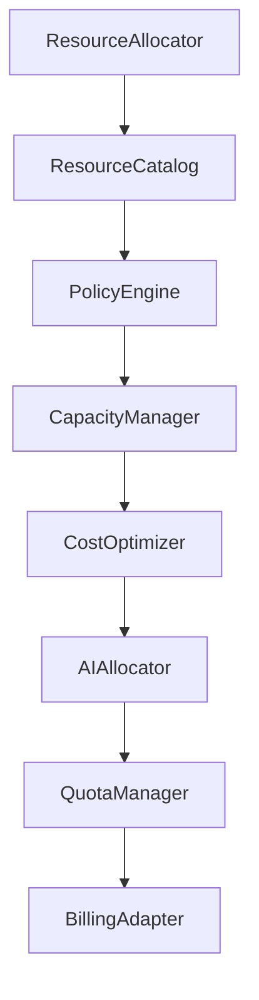

---

# 4. Tipos de Recursos

El Resource Allocator administra:

### Infraestructura

* CPU
* GPU
* TPU
* Memoria
* Almacenamiento
* Red

### Recursos Inteligentes

* Modelos LLM
* Embeddings
* Vector Databases
* Knowledge Graphs
* OCR Engines
* Speech Models
* Vision Models
* Herramientas
* Agentes especializados

### Recursos Externos

* APIs
* SaaS
* Bases de datos
* Conectores
* Colas de mensajería

---

# 5. Catálogo Global

Cada recurso publica:

```json
{
"id":"GPU-004",

"type":"GPU",

"vendor":"NVIDIA",

"capacity":"80GB",

"region":"us-east",

"status":"AVAILABLE"
}
```

---

# 6. Ciclo de Vida

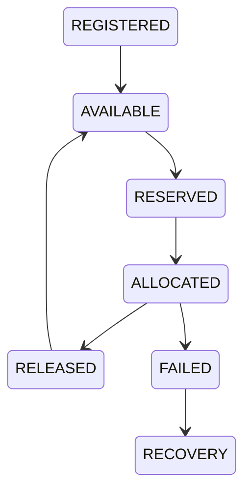

---

# 7. Asignación Inteligente

Antes de asignar recursos, el sistema evalúa:

* Tipo de carga.
* SLA.
* Prioridad.
* Coste.
* Afinidad.
* Región.
* Latencia.
* Disponibilidad.
* Historial de consumo.

---

# 8. Afinidad

El sistema intenta mantener afinidad con:

* Nodo.
* GPU.
* Caché.
* Modelo IA.
* Vector Store.
* Región.

Reduciendo migraciones innecesarias.

---

# 9. Localidad

Siempre que sea posible:

* El cómputo se mueve hacia los datos.
* No los datos hacia el cómputo.

Esto reduce:

* Coste.
* Latencia.
* Tráfico.

---

# 10. Cuotas

Cada organización dispone de límites configurables.

Ejemplo:

```yaml
tenant:

cpu:128

gpu:8

memory:512GB

storage:50TB

tokens:100000000
```

---

# 11. Priorización

Si existe competencia por recursos:

1. Kernel.
2. Seguridad.
3. SLA críticos.
4. IA empresarial.
5. Aplicaciones.
6. Batch.

---

# 12. Elasticidad

El Resource Allocator puede:

* Reservar capacidad.
* Liberar capacidad.
* Escalar horizontalmente.
* Escalar verticalmente.
* Solicitar nuevos recursos al Cluster Manager.

---

# 13. Optimización de Costes

Evalúa:

* Precio por región.
* Consumo energético.
* Coste GPU.
* Coste LLM.
* APIs.
* Transferencia.
* Almacenamiento.

Y selecciona la opción óptima según políticas.

---

# 14. Gestión de Modelos IA

Los modelos se consideran recursos.

Cada modelo publica:

* Nombre.
* Versión.
* Coste.
* Latencia.
* Memoria requerida.
* Compatibilidad.
* Estado.

---

# 15. Gestión de Embeddings

Los índices vectoriales poseen:

* Capacidad.
* Región.
* Tamaño.
* Tiempo de respuesta.
* Política de replicación.

---

# 16. Herramientas

Las herramientas disponibles se registran como recursos reutilizables.

Ejemplos:

* OCR.
* Email.
* ERP.
* CRM.
* SAP.
* Salesforce.
* GitHub.
* Calendarios.
* Firmas digitales.

---

# 17. Integración con Billing

Cada asignación genera métricas.

```text
Resource

↓

Usage

↓

Billing

↓

Invoice

↓

Analytics
```

Permite facturación basada en consumo real.

---

# 18. Políticas

Ejemplo:

```yaml
policy:

gpu:required

region:eu

cost:max50

priority:high
```

Las políticas pueden definirse por tenant, servicio o proceso.

---

# 19. Recuperación

Ante una falla:

* Detectar indisponibilidad.
* Buscar recurso alternativo.
* Migrar carga.
* Validar estado.
* Reanudar ejecución.

---

# 20. Integración

El Resource Allocator trabaja con:

* Scheduler.
* Process Manager.
* Cluster Manager.
* Service Supervisor.
* Billing.
* AI Registry.
* Knowledge Platform.

---

# 21. API Conceptual

Reservar recurso:

```typescript
Resource.allocate({

type:

"GPU",

memory:

"40GB"

})
```

Liberar recurso:

```typescript
Resource.release({

id:

"GPU-004"

})
```

Consultar disponibilidad:

```typescript
Resource.search({

type:

"LLM"

})
```

---

# 22. Observabilidad

Se registran:

* Asignaciones.
* Liberaciones.
* Saturación.
* Costes.
* Consumo por tenant.
* Consumo energético.
* Tiempo de utilización.
* Eficiencia.

---

# 23. Objetivos No Funcionales

Debe garantizar:

* Máxima utilización.
* Coste mínimo.
* Escalabilidad.
* Equidad.
* Alta disponibilidad.
* Elasticidad.
* Optimización automática.

---

# 24. Principios Arquitectónicos

## Resource First

Todo elemento consumible es un recurso.

## Policy Driven

Asignación gobernada por políticas.

## Cost Aware

Optimización económica continua.

## AI Native

Incluye recursos específicos de IA.

## Elastic

Escala dinámicamente.

## Observable

Cada recurso produce telemetría.

---

# 25. Resultado del Documento

Con **KOS-0008** queda definido:

✅ Modelo universal de recursos.
✅ Inventario global.
✅ Gestión de CPU, GPU, memoria y almacenamiento.
✅ Gestión de recursos IA.
✅ Cuotas por tenant.
✅ Optimización de costes.
✅ Elasticidad.
✅ Afinidad y localidad.
✅ Integración con Billing.
✅ Telemetría y auditoría de recursos.

---

# Estado actualizado Serie KOS

| Documento                              | Estado      |
| -------------------------------------- | ----------- |
| KOS-0001 Operating System Architecture | ✅ Completo  |
| KOS-0002 AI Microkernel                | ✅ Completo  |
| KOS-0003 Process Manager               | ✅ Completo  |
| KOS-0004 Universal Scheduler           | ✅ Completo  |
| KOS-0005 Memory Manager                | ✅ Completo  |
| KOS-0006 Cluster Manager               | ✅ Completo  |
| KOS-0007 Service Supervisor            | ✅ Completo  |
| **KOS-0008 Resource Allocator**        | ✅ Completo  |
| KOS-0009 Recovery Manager              | ⏳ Siguiente |
| KOS-0010 Operating System Conformance  | Pendiente   |

---

# Próximo documento oficial

## **KOS-0009 — Recovery Manager**

Este documento definirá el sistema de recuperación y continuidad operativa de KAIZEN, incluyendo:

* Detección automática de fallos.
* Clasificación de incidentes.
* Recuperación automática (Self-Healing).
* Checkpoints globales.
* Rollback y Rollforward.
* Recuperación de procesos, servicios y nodos.
* Recuperación multi-región.
* Gestión de desastres (Disaster Recovery).
* Objetivos RTO y RPO.
* Simulación y pruebas de recuperación.
* Auditoría y trazabilidad de incidentes.

Con **KOS-0009** quedará definida la capacidad del sistema operativo KAIZEN para mantener la continuidad del servicio frente a fallos locales, regionales o globales, minimizando el impacto para usuarios y organizaciones.

# KOS-0009 — Recovery Manager

# KAIZEN Operating System (KOS)

## Sistema Universal de Recuperación, Continuidad Operativa y Resiliencia

**Estado:** ⏳ En desarrollo

**Dependencias:**

✅ KDL — KAIZEN Definition Language
✅ KCF — KAIZEN Compiler Framework
✅ KRE — KAIZEN Runtime Environment
✅ KSP — KAIZEN Service Platform
✅ KOS-0001 Operating System Architecture
✅ KOS-0002 AI Microkernel
✅ KOS-0003 Process Manager
✅ KOS-0004 Universal Scheduler
✅ KOS-0005 Memory Manager
✅ KOS-0006 Cluster Manager
✅ KOS-0007 Service Supervisor
✅ KOS-0008 Resource Allocator

**Siguiente documento:** **KOS-0010 Operating System Conformance**

**Capa:** Resilience & Business Continuity Layer

**Clasificación:** Gestor Universal de Recuperación

---

# 1. Propósito

El **Recovery Manager (RM)** garantiza la continuidad operativa del sistema KAIZEN frente a fallos de cualquier naturaleza.

Su responsabilidad no es únicamente restaurar procesos, sino preservar el estado, la consistencia y los acuerdos de nivel de servicio (SLA).

El objetivo es minimizar el impacto operativo y permitir una recuperación autónoma.

**Principio:**

> Todo fallo debe ser detectable, clasificable, recuperable y completamente auditable.

---

# 2. Arquitectura General

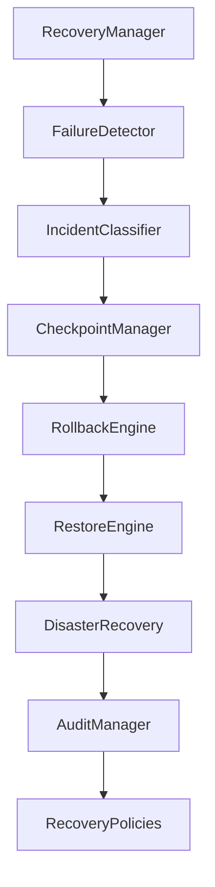

---

# 3. Flujo General

```text
Incidente

↓

Detección

↓

Clasificación

↓

Selección de estrategia

↓

Recuperación

↓

Validación

↓

Reanudación

↓

Auditoría
```

---

# 4. Detección de Fallos

El sistema detecta automáticamente:

* Caída de procesos.
* Caída de servicios.
* Fallos de nodos.
* Pérdida de conectividad.
* Saturación de recursos.
* Errores de memoria.
* Fallos de almacenamiento.
* Errores de modelos IA.
* Inconsistencias de estado.

---

# 5. Clasificación de Incidentes

Los incidentes se clasifican por:

## Severidad

* Informativo.
* Bajo.
* Medio.
* Alto.
* Crítico.

---

## Alcance

* Local.
* Nodo.
* Clúster.
* Región.
* Global.

---

## Tipo

* Hardware.
* Software.
* Red.
* Seguridad.
* Datos.
* IA.
* Dependencias externas.

---

# 6. Estrategias de Recuperación

Dependiendo del incidente:

* Reinicio.
* Restauración.
* Migración.
* Sustitución.
* Rollback.
* Rollforward.
* Failover.
* Escalado.

---

# 7. Checkpoints

El sistema mantiene checkpoints periódicos.

Incluyen:

* Procesos.
* Memoria.
* Contexto.
* Workflows.
* Estado de agentes.
* Configuración.
* Recursos asignados.

---

# 8. Restauración

Proceso:

```text
Checkpoint

↓

Verificación

↓

Carga

↓

Validación

↓

Reanudación
```

La restauración debe preservar la coherencia del sistema.

---

# 9. Rollback

Permite regresar a un estado anterior cuando una operación provoca resultados no válidos.

Ejemplos:

* Despliegues fallidos.
* Configuraciones erróneas.
* Actualizaciones incompatibles.

---

# 10. Rollforward

Cuando es posible, el sistema prefiere avanzar corrigiendo el estado sin regresar a una versión anterior.

Esto reduce interrupciones y pérdida de trabajo.

---

# 11. Recuperación de Procesos

El Recovery Manager puede:

* Reiniciar procesos.
* Restaurar checkpoints.
* Reasignar recursos.
* Migrar procesos entre nodos.

---

# 12. Recuperación de Servicios

Los servicios pueden:

* Reiniciarse.
* Replicarse.
* Sustituirse.
* Redistribuirse.

Todo ello sin afectar al resto del sistema.

---

# 13. Recuperación de Nodos

Si un nodo falla:

```text
Nodo Fallido

↓

Aislamiento

↓

Migración

↓

Redistribución

↓

Reintegración
```

---

# 14. Recuperación Multi-Región

Cuando una región completa deja de estar disponible:

* Activación de región secundaria.
* Restauración del estado.
* Reconfiguración de rutas.
* Sincronización posterior.

---

# 15. Disaster Recovery

El sistema soporta:

* Recuperación regional.
* Recuperación global.
* Restauración desde copias externas.
* Recuperación híbrida.
* Recuperación desde Edge Nodes.

---

# 16. Objetivos RTO y RPO

Cada servicio define:

* **RTO (Recovery Time Objective):** tiempo máximo aceptable para restaurar el servicio.
* **RPO (Recovery Point Objective):** pérdida máxima de datos aceptable.

Estos objetivos son utilizados por el Scheduler y el Service Supervisor para priorizar acciones de recuperación.

---

# 17. Simulación de Incidentes

El sistema soporta simulaciones controladas:

* Caída de nodos.
* Pérdida de red.
* Fallos de almacenamiento.
* Errores de servicios.
* Sobrecarga.
* Recuperación regional.

Permiten validar planes de continuidad sin afectar la producción.

---

# 18. Políticas de Recuperación

Ejemplo:

```yaml
recovery:

strategy: auto

checkpoint: 5m

rollback: enabled

max_attempts: 3

failover: true
```

Las políticas pueden definirse por organización, servicio o proceso.

---

# 19. Integración

El Recovery Manager trabaja con:

* AI Microkernel.
* Process Manager.
* Scheduler.
* Cluster Manager.
* Memory Manager.
* Service Supervisor.
* Resource Allocator.
* Observability Platform.

---

# 20. API Conceptual

Restaurar proceso:

```typescript
Recovery.restore({

process:

"PROC-010"

})
```

Forzar failover:

```typescript
Recovery.failover({

region:

"eu-west"
})
```

Crear checkpoint:

```typescript
Recovery.checkpoint({

process:

"PROC-010"

})
```

---

# 21. Observabilidad

Se registran:

* Incidentes.
* Recuperaciones.
* Rollbacks.
* Rollforwards.
* Cambios de liderazgo.
* RTO.
* RPO.
* Disponibilidad.
* Auditorías.

---

# 22. Objetivos No Funcionales

Debe garantizar:

* Alta disponibilidad.
* Recuperación automática.
* Recuperación distribuida.
* Integridad de datos.
* Baja pérdida de información.
* Escalabilidad.
* Cumplimiento de SLA.

---

# 23. Principios Arquitectónicos

## Self-Healing

Recuperación automática siempre que sea posible.

## Recovery First

La continuidad del negocio es prioritaria.

## Audit Everything

Toda recuperación deja evidencia verificable.

## Disaster Ready

Preparado para fallos regionales y globales.

## Predictable

Las estrategias son deterministas y gobernadas por políticas.

## Policy Driven

Las acciones se ejecutan según reglas configurables y auditables.

---

# 24. Resultado del Documento

Con **KOS-0009** queda definido:

✅ Detección automática de fallos.
✅ Clasificación de incidentes.
✅ Estrategias de recuperación.
✅ Checkpointing global.
✅ Rollback y Rollforward.
✅ Recuperación de procesos, servicios y nodos.
✅ Recuperación multi-región.
✅ Disaster Recovery.
✅ Gestión de RTO y RPO.
✅ Simulación de incidentes.
✅ Auditoría completa de la recuperación.

---

# Estado actualizado Serie KOS

| Documento                              | Estado      |
| -------------------------------------- | ----------- |
| KOS-0001 Operating System Architecture | ✅ Completo  |
| KOS-0002 AI Microkernel                | ✅ Completo  |
| KOS-0003 Process Manager               | ✅ Completo  |
| KOS-0004 Universal Scheduler           | ✅ Completo  |
| KOS-0005 Memory Manager                | ✅ Completo  |
| KOS-0006 Cluster Manager               | ✅ Completo  |
| KOS-0007 Service Supervisor            | ✅ Completo  |
| KOS-0008 Resource Allocator            | ✅ Completo  |
| **KOS-0009 Recovery Manager**          | ✅ Completo  |
| KOS-0010 Operating System Conformance  | ⏳ Siguiente |

---

# Próximo documento oficial

## **KOS-0010 — Operating System Conformance**

Este documento cerrará la serie **KOS** definiendo el estándar oficial de conformidad del sistema operativo KAIZEN, incluyendo:

* Requisitos mínimos de implementación.
* Interfaces obligatorias del kernel.
* Compatibilidad entre versiones.
* Certificación de módulos y extensiones.
* Pruebas de interoperabilidad.
* Requisitos de seguridad.
* Validación de rendimiento.
* Cumplimiento de resiliencia y alta disponibilidad.
* Compatibilidad con KDL, KCF, KRE y KSP.
* Niveles de certificación (Core, Enterprise y Hyperscale).
* Suite oficial de pruebas de conformidad.

Con **KOS-0010** quedará completada la especificación del **KAIZEN Operating System**, estableciendo las reglas que deberá cumplir cualquier implementación para ser considerada compatible con el estándar KAIZEN.


# KOS-0010 — Operating System Conformance

# KAIZEN Operating System (KOS)

## Estándar Oficial de Conformidad, Certificación e Interoperabilidad del Sistema Operativo KAIZEN

**Estado:** ✅ Final

**Dependencias:**

✅ KDL — KAIZEN Definition Language
✅ KCF — KAIZEN Compiler Framework
✅ KRE — KAIZEN Runtime Environment
✅ KSP — KAIZEN Service Platform
✅ KOS-0001 Operating System Architecture
✅ KOS-0002 AI Microkernel
✅ KOS-0003 Process Manager
✅ KOS-0004 Universal Scheduler
✅ KOS-0005 Memory Manager
✅ KOS-0006 Cluster Manager
✅ KOS-0007 Service Supervisor
✅ KOS-0008 Resource Allocator
✅ KOS-0009 Recovery Manager

**Serie:** KOS — Completada

**Clasificación:** Especificación Normativa

---

# 1. Propósito

El documento **KOS-0010** establece los requisitos obligatorios que debe cumplir cualquier implementación del **KAIZEN Operating System** para ser considerada oficialmente compatible con el estándar.

No define una implementación específica; define las reglas que todas las implementaciones deben respetar.

**Principio:**

> La conformidad garantiza que dos implementaciones independientes de KOS puedan interoperar de manera segura, predecible y verificable.

---

# 2. Objetivos

El estándar de conformidad busca asegurar:

* Compatibilidad entre versiones.
* Interoperabilidad.
* Seguridad.
* Rendimiento.
* Estabilidad.
* Portabilidad.
* Escalabilidad.
* Auditabilidad.
* Evolución controlada.

---

# 3. Alcance

La conformidad aplica a:

* Kernel.
* Runtime.
* Process Manager.
* Scheduler.
* Memory Manager.
* Cluster Manager.
* Resource Allocator.
* Recovery Manager.
* Service Supervisor.
* APIs oficiales.
* Extensiones certificadas.

---

# 4. Niveles de Certificación

## Nivel 1 — Core

Implementación mínima.

Requiere:

* AI Microkernel.
* Process Manager.
* Scheduler.
* Memory Manager.
* Seguridad básica.
* Observabilidad básica.

Uso previsto:

* Desarrollo.
* Laboratorios.
* Edge.

---

## Nivel 2 — Enterprise

Incluye:

* Cluster Manager.
* Recovery Manager.
* Resource Allocator.
* Alta disponibilidad.
* Multi-tenant.
* SLA empresariales.
* Auditoría.

Uso previsto:

* Empresas.
* SaaS.
* Gobierno.

---

## Nivel 3 — Hyperscale

Incluye:

* Multi-región.
* Federación.
* Edge distribuido.
* Disaster Recovery global.
* IA distribuida.
* Escalado masivo.
* Automatización completa.

Uso previsto:

* Grandes plataformas.
* Nube pública.
* Infraestructura global.

---

# 5. Interfaces Obligatorias

Toda implementación debe proporcionar interfaces estables para:

```text
Kernel
Scheduler
Process Manager
Memory Manager
Cluster Manager
Recovery Manager
Resource Allocator
Service Supervisor
Observability
Security
```

No pueden modificarse de forma incompatible dentro de una misma versión mayor.

---

# 6. Compatibilidad de Versiones

Se adopta **Semantic Versioning**:

```text
MAJOR.MINOR.PATCH
```

* **MAJOR:** cambios incompatibles.
* **MINOR:** nuevas capacidades compatibles.
* **PATCH:** correcciones.

Las implementaciones deben soportar políticas de compatibilidad y migración documentadas.

---

# 7. Compatibilidad con el Ecosistema KAIZEN

Toda implementación certificada debe ser compatible con:

| Capa | Compatibilidad requerida |
| ---- | ------------------------ |
| KDL  | Obligatoria              |
| KCF  | Obligatoria              |
| KRE  | Obligatoria              |
| KSP  | Obligatoria              |
| KOS  | Obligatoria              |

---

# 8. Requisitos Funcionales

Una implementación conforme debe demostrar:

* Gestión de procesos.
* Planificación determinista.
* Gestión de memoria.
* Gestión de recursos.
* Ejecución distribuida.
* Recuperación automática.
* Supervisión.
* Seguridad integrada.
* Observabilidad.

---

# 9. Requisitos No Funcionales

Debe cumplir objetivos mínimos para:

* Disponibilidad.
* Rendimiento.
* Escalabilidad.
* Tolerancia a fallos.
* Consistencia.
* Seguridad.
* Recuperación.
* Portabilidad.

Los valores concretos (latencia, RTO, RPO, throughput, etc.) podrán variar según el nivel de certificación, pero deben declararse y validarse.

---

# 10. Seguridad

Toda implementación debe garantizar:

* Zero Trust.
* Identidad verificable.
* Cifrado.
* Control de acceso.
* Auditoría.
* Gestión de secretos.
* Aislamiento entre tenants.

---

# 11. Observabilidad

Debe exponer:

* Logs estructurados.
* Métricas.
* Trazas distribuidas.
* Eventos.
* Estado.
* Salud.

Con interfaces estables para integración con herramientas externas.

---

# 12. Suite Oficial de Conformidad

La **KAIZEN Conformance Test Suite (KCTS)** valida:

* APIs.
* Compatibilidad.
* Rendimiento.
* Seguridad.
* Recuperación.
* Escalabilidad.
* Interoperabilidad.

La ejecución satisfactoria de esta suite es requisito para la certificación.

---

# 13. Pruebas Obligatorias

Las pruebas mínimas incluyen:

* Arranque del sistema.
* Creación de procesos.
* Planificación.
* Recuperación.
* Migración de nodos.
* Failover.
* Gestión de memoria.
* Integridad de datos.
* Consistencia.
* Seguridad.
* Observabilidad.

---

# 14. Certificación de Extensiones

Los módulos externos deben:

* Declarar versión.
* Declarar dependencias.
* Firmarse digitalmente.
* Pasar pruebas de compatibilidad.
* Cumplir políticas de seguridad.

Solo las extensiones certificadas podrán utilizar el sello de compatibilidad KAIZEN.

---

# 15. Interoperabilidad

Dos implementaciones certificadas deben poder:

* Intercambiar mensajes.
* Compartir procesos distribuidos.
* Federar clústeres.
* Migrar cargas.
* Compartir telemetría.
* Coordinar recuperación.

---

# 16. Compatibilidad Evolutiva

El estándar permite la incorporación de nuevas capacidades mediante:

* Extensiones.
* Interfaces opcionales.
* Nuevos perfiles.
* Nuevos niveles de certificación.

Sin comprometer la compatibilidad con versiones anteriores cuando así lo establezca la política de versionado.

---

# 17. Gobernanza del Estándar

La evolución del estándar deberá seguir un proceso formal:

1. Propuesta (KEP — KAIZEN Enhancement Proposal).
2. Revisión técnica.
3. Implementación de referencia.
4. Validación mediante KCTS.
5. Publicación de una nueva versión.

---

# 18. Principios de Conformidad

## Compatibilidad

Las implementaciones deben comportarse de manera coherente.

## Interoperabilidad

Componentes de distintos proveedores pueden colaborar.

## Auditabilidad

Toda certificación es verificable.

## Seguridad

La conformidad nunca reduce los requisitos de seguridad.

## Evolución

El estándar puede crecer sin fragmentarse.

## Neutralidad

No depende de un proveedor, lenguaje o infraestructura específicos.

---

# 19. Resultado del Documento

Con **KOS-0010** queda definido:

✅ Requisitos oficiales de conformidad.
✅ Niveles de certificación.
✅ Compatibilidad entre versiones.
✅ Interfaces obligatorias.
✅ Suite oficial de pruebas (KCTS).
✅ Requisitos de seguridad.
✅ Requisitos de observabilidad.
✅ Certificación de extensiones.
✅ Interoperabilidad entre implementaciones.
✅ Gobernanza y evolución del estándar.

---

# Estado Final de la Serie KOS

| Documento                                 | Estado     |
| ----------------------------------------- | ---------- |
| KOS-0001 Operating System Architecture    | ✅ Completo |
| KOS-0002 AI Microkernel                   | ✅ Completo |
| KOS-0003 Process Manager                  | ✅ Completo |
| KOS-0004 Universal Scheduler              | ✅ Completo |
| KOS-0005 Memory Manager                   | ✅ Completo |
| KOS-0006 Cluster Manager                  | ✅ Completo |
| KOS-0007 Service Supervisor               | ✅ Completo |
| KOS-0008 Resource Allocator               | ✅ Completo |
| KOS-0009 Recovery Manager                 | ✅ Completo |
| **KOS-0010 Operating System Conformance** | ✅ Completo |

# Cierre de la Capa KOS

Con este documento queda completada la especificación de la quinta gran capa del estándar **KAIZEN**:

* ✅ **KDL** — KAIZEN Definition Language
* ✅ **KCF** — KAIZEN Compiler Framework
* ✅ **KRE** — KAIZEN Runtime Environment
* ✅ **KSP** — KAIZEN Service Platform
* ✅ **KOS** — KAIZEN Operating System

El siguiente paso natural en la evolución del estándar sería definir una nueva capa, por ejemplo:

* **KAI** — KAIZEN Artificial Intelligence Framework (orquestación de modelos, razonamiento, planificación y memoria cognitiva).
* **KCL** — KAIZEN Cloud Layer (despliegue y operación multi-cloud).
* **KDX** — KAIZEN Developer Experience (SDKs, CLI, IDE, depuración y herramientas).
* **KSM** — KAIZEN Security Model (arquitectura de seguridad de extremo a extremo).

Con la serie **KOS** finalizada, el estándar ya dispone de un sistema operativo inteligente completamente especificado sobre el que pueden construirse plataformas, aplicaciones empresariales y ecosistemas de agentes de IA.
