Excelente. Con la finalización de KCF, iniciamos la siguiente gran familia del estándar: el KAIZEN Runtime Environment (KRE).
________________________________________
KAIZEN Runtime Environment (KRE)
KRE-0001
Runtime Architecture Specification
Parte I — Especificación Normativa de la Arquitectura del Runtime de KAIZEN
Versión: 1.0.0
Estado: Normative Standard
Tipo: Runtime Environment Specification
Dependencias
•	KCF-0001 → KCF-0010
•	KDL-0001 → KDL-0010
•	RA-0008 — Compiler Architecture
•	RA-0014 — Runtime Integration
•	RA-0016 — Distributed Execution
________________________________________
1. Objetivo
La KAIZEN Runtime Architecture Specification (KRAS) define la arquitectura oficial del entorno de ejecución del ecosistema KAIZEN.
El Runtime es responsable de cargar, validar, inicializar, ejecutar, monitorizar y finalizar los artefactos generados por el compilador, proporcionando un entorno de ejecución determinista, seguro, observable y escalable.
El Runtime constituye la capa de ejecución oficial entre los artefactos compilados y la infraestructura física o virtual.
________________________________________
2. Alcance
Este estándar aplica a:
•	Runtime Engine.
•	Módulos ejecutables.
•	Agentes.
•	Workflows.
•	Eventos.
•	Recursos.
•	Memoria.
•	Seguridad.
•	Observabilidad.
•	Escalabilidad.
________________________________________
3. Principios
Todo Runtime deberá cumplir:
•	Deterministic.
•	Secure.
•	Observable.
•	Distributed.
•	Fault Tolerant.
•	Resource Aware.
•	Extensible.
•	Platform Independent.
________________________________________
4. Arquitectura General
Compiled Artifact
        │
        ▼
Runtime Loader
        │
        ▼
Runtime Validator
        │
        ▼
Execution Engine
        │
 ┌──────┼───────────────┬───────────────┐
 ▼      ▼               ▼               ▼
Agents Workflows     Events        Resources
        │
        ▼
Lifecycle Manager
        │
        ▼
Telemetry & Monitoring
________________________________________
5. Componentes Oficiales
Todo Runtime implementará como mínimo:
1.	Runtime Loader.
2.	Validation Engine.
3.	Execution Engine.
4.	Lifecycle Manager.
5.	Resource Manager.
6.	Security Manager.
7.	Event Dispatcher.
8.	Scheduler.
9.	Telemetry Engine.
10.	Extension Manager.
________________________________________
6. Flujo de Ejecución
Pipeline obligatorio:
Artifact
    │
Load
    │
Validate
    │
Initialize
    │
Execute
    │
Monitor
    │
Shutdown
Cada fase deberá completarse correctamente antes de iniciar la siguiente.
________________________________________
7. Runtime Loader
El Loader será responsable de:
•	localizar artefactos;
•	verificar integridad;
•	cargar dependencias;
•	resolver versiones;
•	preparar el entorno.
No iniciará la ejecución.
________________________________________
8. Validation Engine
Antes de ejecutar, el Runtime comprobará:
•	firma digital;
•	versión del compilador;
•	compatibilidad del Runtime;
•	integridad del paquete;
•	dependencias.
Solo los artefactos válidos podrán ejecutarse.
________________________________________
9. Execution Engine
El Execution Engine será responsable de:
•	iniciar procesos;
•	programar tareas;
•	ejecutar agentes;
•	ejecutar workflows;
•	procesar eventos;
•	coordinar componentes.
Todo comportamiento será determinista.
________________________________________
10. Lifecycle Manager
Estados oficiales:
Created

Loaded

Validated

Initialized

Running

Paused

Suspended

Stopping

Stopped

Failed
Las transiciones serán controladas y auditables.
________________________________________
11. Gestión de Recursos
El Runtime administrará:
•	CPU.
•	Memoria.
•	Almacenamiento.
•	Red.
•	GPU (cuando aplique).
•	Recursos externos.
El consumo podrá limitarse mediante políticas.
________________________________________
12. Escalabilidad
El Runtime soportará:
•	ejecución local;
•	ejecución distribuida;
•	clustering;
•	autoscaling;
•	balanceo de carga.
La arquitectura será horizontalmente escalable.
________________________________________
13. Aislamiento
Cada ejecución deberá ejecutarse dentro de un contexto aislado.
El aislamiento podrá implementarse mediante:
•	procesos;
•	contenedores;
•	máquinas virtuales;
•	sandboxes.
________________________________________
14. Configuración
Toda configuración será declarativa.
Ejemplo:
runtime:
  profile:
  resources:
  security:
  telemetry:
La configuración será versionada.
________________________________________
15. Compatibilidad
El Runtime será compatible con todos los artefactos certificados producidos por compiladores conformes a KCF.
________________________________________
16. Observabilidad
El Runtime emitirá:
•	logs;
•	métricas;
•	eventos;
•	trazas distribuidas;
•	diagnósticos.
Compatible con OpenTelemetry.
________________________________________
17. Recuperación
El Runtime soportará:
•	reinicio automático;
•	recuperación tras fallos;
•	reintentos;
•	restauración del estado;
•	continuidad operacional.
________________________________________
18. Integración
El Runtime podrá integrarse con:
•	Kubernetes.
•	Docker.
•	Serverless.
•	Edge Computing.
•	Cloud Providers.
•	Sistemas On-Premise.
________________________________________
19. Interfaces Oficiales
Interfaces mínimas:
load()

validate()

initialize()

execute()

pause()

resume()

stop()

shutdown()
________________________________________
20. Artefactos Ejecutables
runtime.schema.json

runtime.profile.yaml

lifecycle.schema.json

resources.policy.yaml

telemetry.profile.yaml

README.md
________________________________________
21. Métricas
Métrica	Objetivo
Compatibilidad	100 %
Determinismo	100 %
Recuperación	≥ 99.9 %
Escalabilidad	Horizontal
________________________________________
22. SLO
Métrica	Objetivo
Tiempo de carga	< 1 s
Inicialización	< 500 ms
Inicio de ejecución	< 100 ms
Apagado controlado	< 500 ms
________________________________________
23. Definition of Done
KRE-0001 se considera implementado cuando:
•	Existe una arquitectura oficial del Runtime.
•	El ciclo de vida completo está implementado.
•	Los artefactos certificados pueden ejecutarse correctamente.
•	La observabilidad es completa.
•	El Runtime soporta escalabilidad horizontal.
•	Se supera la Suite Oficial de Conformidad del Runtime.
________________________________________
24. Artefactos Derivados
KRE-0001/
├── runtime.schema.json
├── runtime.profile.yaml
├── lifecycle.schema.json
├── resources.policy.yaml
├── telemetry.profile.yaml
├── runtime.tests/
├── benchmarks/
├── examples/
└── README.md
________________________________________
25. Estado
KRE-0001 – Runtime Architecture Specification queda establecido como el estándar oficial de la arquitectura del entorno de ejecución KAIZEN.
Este documento inaugura la serie KRE (KAIZEN Runtime Environment) y define la infraestructura necesaria para ejecutar de forma segura, determinista y escalable todos los artefactos generados por el compilador.
________________________________________
Progreso de la Serie KRE
KRE-0001 ✅ Runtime Architecture
KRE-0002 ⏳ Execution Engine
KRE-0003 ⏳ Agent Runtime
KRE-0004 ⏳ Workflow Runtime
KRE-0005 ⏳ Event Bus
KRE-0006 ⏳ State Management
KRE-0007 ⏳ Security Runtime
KRE-0008 ⏳ Resource Management
KRE-0009 ⏳ Observability & Telemetry
KRE-0010 ⏳ Runtime Conformance
Estado global del estándar KAIZEN
Con este documento comienza la tercera gran capa de la plataforma:
•	✅ KDL — Lenguaje.
•	✅ KCF — Compilador.
•	✅ KRE — Runtime (iniciado).
El siguiente documento, KRE-0002 – Execution Engine, definirá el núcleo del motor de ejecución: planificación de tareas, modelo de concurrencia, colas, scheduling, sincronización, gestión de procesos, ejecución distribuida, prioridades y garantías de ejecución determinista para agentes, workflows y eventos dentro del Runtime KAIZEN. memcite
 
Perfecto. Continuamos con la Serie KRE (KAIZEN Runtime Environment) desde el punto donde quedó definido el estándar.
KRE-0002 — Execution Engine
KAIZEN Runtime Environment (KRE)
Motor Central de Ejecución de la Plataforma KAIZEN
Estado: ⏳ En desarrollo
Dependencia: KRE-0001 Runtime Architecture ✅
Siguiente documento: KRE-0003 Agent Runtime
Capa: Runtime Core
Clasificación: Documento Arquitectónico Fundamental
________________________________________
1. Propósito del Execution Engine
El Execution Engine es el núcleo operativo del Runtime KAIZEN.
Su responsabilidad principal es transformar las instrucciones compiladas por KCF (KAIZEN Compiler Framework) en unidades ejecutables dentro del entorno KRE.
El Execution Engine controla:
•	Qué se ejecuta.
•	Cuándo se ejecuta.
•	En qué orden.
•	Con qué recursos.
•	Bajo qué prioridad.
•	Con qué garantías.
•	Cómo se recupera ante fallos.
•	Cómo coordina agentes, workflows y eventos.
Es el equivalente al:
•	JVM Execution Engine en Java.
•	V8 Engine en JavaScript.
•	Kubernetes Scheduler + Runtime Controller.
•	Operating System Process Scheduler.
Pero diseñado específicamente para:
Ejecutar inteligencia artificial, agentes autónomos, workflows empresariales y sistemas distribuidos bajo reglas deterministas.
________________________________________
2. Posición dentro de KAIZEN Architecture
graph TD

A[KDL<br/>KAIZEN Definition Language]

B[KCF<br/>KAIZEN Compiler Framework]

C[KRE<br/>KAIZEN Runtime Environment]

C --> D[Execution Engine]

D --> E[Agent Runtime]

D --> F[Workflow Runtime]

D --> G[Event Bus]

D --> H[State Management]

D --> I[Security Runtime]

D --> J[Resource Management]

D --> K[Observability]

El Execution Engine es el punto donde:
Código KAIZEN
        |
        ↓
Compilación KCF
        |
        ↓
Execution Plan
        |
        ↓
Runtime Execution
________________________________________
3. Objetivos del Execution Engine
3.1 Ejecución Determinista
KAIZEN debe garantizar que:
Una misma entrada:
Input + Context + Rules + Version
produzca:
Execution Result equivalente
Siempre que las condiciones sean iguales.
Ejemplo:
Un agente financiero:
Analizar factura
↓
Validar impuestos
↓
Generar reporte
↓
Solicitar aprobación
Debe seguir exactamente la política definida.
________________________________________
4. Modelo de Ejecución KAIZEN
El Execution Engine utiliza un modelo basado en:
Execution Unit
Toda acción ejecutable dentro del Runtime es una:
Execution Unit (EU)
Ejemplo:
{
"id":"EU-001234",

"type":"AGENT_TASK",

"owner":"InvoiceAgent",

"priority":"HIGH",

"dependencies":[
"EU-001233"
],

"resources":{
"cpu":"2",
"memory":"4GB"
},

"timeout":"30s"
}
________________________________________
5. Componentes Internos
5.1 Execution Planner
Responsable de crear el plan de ejecución.
Funciones:
•	Analizar dependencias.
•	Resolver orden.
•	Detectar paralelismo.
•	Crear DAG de ejecución.
Ejemplo:
Workflow:
Recibir documento

        |
        |
    OCR
   /   \
IA     Validación
 |       |
Resumen Firma
El Planner genera:
Execution DAG

Node 1
 |
 +-- Node 2
 |
 +-- Node 3

Node 4 waits
________________________________________
5.2 Task Scheduler
Controla cuándo una tarea puede ejecutarse.
Responsabilidades:
•	Asignación de recursos.
•	Priorización.
•	Balance de carga.
•	Gestión de colas.
Modelo:
                Scheduler

                     |
        --------------------------
        |            |           |
      Queue       Queue       Queue

      HIGH        NORMAL      LOW

        |
        |
    Workers
________________________________________
6. Modelo de Colas
KAIZEN utiliza múltiples niveles:
Priority Queue System
P0 Critical

P1 High

P2 Normal

P3 Background

P4 Batch
Ejemplo:
P0
Eventos críticos:
•	Seguridad.
•	Fraude.
•	Fallos del sistema.
P1
Agentes empresariales:
•	Procesamiento documental.
•	Automatizaciones.
P4
Procesos secundarios:
•	Indexación.
•	Analytics.
________________________________________
7. Modelo de Concurrencia
KAIZEN soporta:
7.1 Ejecución Secuencial
Cuando existe dependencia:
A
|
B
|
C
Ejemplo:
Login
↓
Validación
↓
Permiso
________________________________________
7.2 Ejecución Paralela
Cuando no existen dependencias:
        A

       / \

      B   C

       \ /

        D
Ejemplo:
Procesar documento:
Simultáneamente:
•	OCR
•	Clasificación
•	Extracción metadata
________________________________________
7.3 Ejecución Distribuida
Un workflow puede ejecutarse:
Usuario
 |
Runtime Local
 |
-----------------
|
Node Colombia
|
Node USA
|
Node Europa

El Execution Engine decide:
•	Localidad.
•	Latencia.
•	Costos.
•	Disponibilidad.
________________________________________
8. Modelo Worker Runtime
Los Workers son ejecutores físicos.
Arquitectura:
Execution Engine

        |
        |
 Worker Manager

        |
 ----------------
 |      |       |

CPU   GPU    Cloud
Tipos:
CPU Worker
Procesos normales.
GPU Worker
IA:
•	LLM.
•	Vision.
•	Embeddings.
Remote Worker
Ejecución externa:
•	APIs.
•	Cloud Functions.
•	Edge Nodes.
________________________________________
9. Gestión del Ciclo de Vida
Toda Execution Unit posee estados:
stateDiagram-v2

CREATED --> QUEUED

QUEUED --> RUNNING

RUNNING --> COMPLETED

RUNNING --> FAILED

FAILED --> RETRYING

RETRYING --> RUNNING

RUNNING --> CANCELLED

Estados oficiales:
Estado	Descripción
CREATED	Unidad creada
QUEUED	Esperando ejecución
RUNNING	Ejecutándose
PAUSED	Suspendida
COMPLETED	Finalizada
FAILED	Error
RETRYING	Recuperación
CANCELLED	Cancelada
________________________________________
10. Garantías de Ejecución
El Runtime soporta diferentes niveles:
________________________________________
At Most Once
Ejecuta máximo una vez.
Uso:
•	Eventos no críticos.
________________________________________
At Least Once
Garantiza ejecución.
Puede repetir.
Uso:
•	Procesamiento documental.
________________________________________
Exactly Once
Garantía fuerte.
Uso:
•	Finanzas.
•	Pagos.
•	Contratos.
________________________________________
11. Sistema de Reintentos
Política:
retry:

max_attempts: 5

strategy:
 exponential_backoff

delay:
 5s

max_delay:
 5min
Ejemplo:
Intento 1:
5 segundos
Intento 2:
15 segundos
Intento 3:
45 segundos
________________________________________
12. Timeout Management
Cada ejecución tiene límites:
{
"execution_timeout":"60s",

"heartbeat":"5s",

"idle_timeout":"10m"
}
Permite evitar:
•	Procesos congelados.
•	Fugas de memoria.
•	Workers bloqueados.
________________________________________
13. Sincronización
KAIZEN soporta:
Locks
Bloqueo temporal.
Ejemplo:
Dos agentes modificando el mismo documento.
________________________________________
Semaphores
Control de cantidad:
Máximo 10 agentes simultáneos
________________________________________
Barriers
Esperar múltiples procesos:
OCR
+
IA
+
Validación

↓

Continuar
________________________________________
14. Execution Context
Cada ejecución mantiene contexto:
{
"execution_id":"EXE-9988",

"user":"admin",

"tenant":"company01",

"agent":"LegalAgent",

"state":"processing",

"variables":{

"document":"contract.pdf"

}
}
________________________________________
15. Multi-Tenant Execution
El Engine debe aislar:
Empresa A

Runtime Space A


Empresa B

Runtime Space B
Garantías:
•	Sin mezcla de datos.
•	Recursos separados.
•	Políticas independientes.
________________________________________
16. Inteligencia del Scheduler
El Scheduler KAIZEN será adaptativo.
Utilizará:
•	Historial de ejecución.
•	Consumo de recursos.
•	Latencia.
•	Costos.
•	Predicción IA.
Ejemplo:
Antes:

Asignar GPU siempre


Después:

IA predice:

"Esta tarea requiere CPU"

________________________________________
17. Execution Optimization Layer
Funciones:
•	Cache inteligente.
•	Reutilización de resultados.
•	Compilación previa.
•	Eliminación de pasos redundantes.
Ejemplo:
Dos agentes solicitan:
Extraer datos de factura X
El Engine reutiliza:
Resultado existente
________________________________________
18. API Interna del Execution Engine
Ejemplo conceptual:
ExecutionEngine.execute({

 workflow:"invoice_processing",

 priority:"HIGH",

 context:{},

 guarantees:"EXACTLY_ONCE"

})
________________________________________
19. Métricas Fundamentales
El Engine expone:
execution_latency

queue_time

cpu_usage

memory_usage

failure_rate

retry_count

throughput

________________________________________
20. Principios Arquitectónicos
El Execution Engine KAIZEN debe cumplir:
Determinista
Mismo input → mismo comportamiento.
Escalable
De un usuario a millones.
Resiliente
Fallos controlados.
Observable
Todo queda registrado.
Seguro
Cada ejecución tiene identidad y permisos.
Autónomo
Puede optimizar su operación.
________________________________________
21. Resultado del Documento
Con KRE-0002 queda definido:
✅ Modelo de ejecución
✅ Scheduler
✅ Colas
✅ Concurrencia
✅ Workers
✅ Procesos
✅ Distribución
✅ Prioridades
✅ Garantías
✅ Sincronización
✅ Recuperación
✅ Optimización
________________________________________
Estado actualizado Serie KRE
Documento	Estado
KRE-0001 Runtime Architecture	✅ Completo
KRE-0002 Execution Engine	✅ Completo
KRE-0003 Agent Runtime	⏳ Siguiente
KRE-0004 Workflow Runtime	⏳
KRE-0005 Event Bus	⏳
KRE-0006 State Management	⏳
KRE-0007 Security Runtime	⏳
KRE-0008 Resource Management	⏳
KRE-0009 Observability & Telemetry	⏳
KRE-0010 Runtime Conformance	⏳
________________________________________
Siguiente documento oficial:
KRE-0003 — Agent Runtime
Definirá el entorno donde viven y operan los agentes KAIZEN:
•	ciclo de vida de agentes,
•	memoria,
•	personalidad operacional,
•	herramientas,
•	razonamiento,
•	comunicación agente-agente,
•	permisos,
•	aprendizaje,
•	identidad,
•	versionado,
•	ejecución autónoma dentro del Runtime.
 
KRE-0003 — Agent Runtime
KAIZEN Runtime Environment (KRE)
Entorno de Ejecución de Agentes Inteligentes
Estado: ⏳ En desarrollo
Dependencia:
✅ KRE-0001 Runtime Architecture
✅ KRE-0002 Execution Engine
Siguiente documento: KRE-0004 Workflow Runtime
Capa: Runtime Intelligence Layer
Clasificación: Documento Arquitectónico Fundamental
________________________________________
1. Propósito del Agent Runtime
El Agent Runtime es el subsistema del Runtime KAIZEN encargado de crear, ejecutar, administrar y controlar agentes inteligentes autónomos.
Mientras el Execution Engine ejecuta tareas, el Agent Runtime administra entidades inteligentes capaces de:
•	Percibir información.
•	Analizar contexto.
•	Tomar decisiones.
•	Utilizar herramientas.
•	Ejecutar acciones.
•	Comunicarse con otros agentes.
•	Mantener memoria.
•	Adaptarse a objetivos.
El Agent Runtime convierte un modelo de IA en un agente operacional confiable dentro de KAIZEN.
________________________________________
2. Posición dentro de KAIZEN
graph TD

A[KDL<br/>Agent Definition]

B[KCF<br/>Agent Compiler]

C[KRE<br/>Runtime]

C --> D[Execution Engine]

D --> E[Agent Runtime]

E --> F[Agent Identity]
E --> G[Memory System]
E --> H[Reasoning Engine]
E --> I[Tool Runtime]
E --> J[Communication Layer]
E --> K[Learning System]
E --> L[Security Boundary]

Flujo:
Agent Definition
        |
        ↓
KCF Compilation
        |
        ↓
Agent Package
        |
        ↓
Agent Runtime
        |
        ↓
Autonomous Operation
________________________________________
3. Definición de Agente KAIZEN
Un agente KAIZEN es:
Una unidad inteligente autónoma con identidad, objetivos, memoria, capacidades, permisos y capacidad de ejecutar acciones dentro del Runtime.
Modelo:
{
"id":"agent.invoice.v1",

"name":"Invoice Intelligence Agent",

"type":"BUSINESS_AGENT",

"purpose":
"Automatizar procesamiento financiero",

"capabilities":[
"OCR",
"ANALYSIS",
"REPORTING"
],

"memory":"persistent",

"security_level":"enterprise"
}
________________________________________
4. Arquitectura Interna del Agent Runtime
graph TD

A[Agent Runtime]

A --> B[Identity Manager]

A --> C[Goal Manager]

A --> D[Reasoning Core]

A --> E[Memory Manager]

A --> F[Tool Manager]

A --> G[Communication Manager]

A --> H[Execution Controller]

A --> I[Learning Engine]

________________________________________
5. Ciclo de Vida del Agente
Todo agente KAIZEN posee un ciclo controlado:
stateDiagram-v2

CREATED --> INITIALIZED

INITIALIZED --> READY

READY --> RUNNING

RUNNING --> PAUSED

PAUSED --> RUNNING

RUNNING --> SUSPENDED

RUNNING --> TERMINATED

TERMINATED --> ARCHIVED

Estados oficiales:
Estado	Descripción
CREATED	Agente registrado
INITIALIZED	Recursos preparados
READY	Disponible
RUNNING	Ejecutando
PAUSED	Pausado temporalmente
SUSPENDED	Bloqueado
TERMINATED	Finalizado
ARCHIVED	Histórico
________________________________________
6. Identidad del Agente
Cada agente tiene una identidad única.
Agent Identity Record (AIR)
{
"agent_id":"LEGAL_AGENT_001",

"version":"1.0",

"owner":"KAIZEN",

"created":"2026",

"signature":"A89F22"
}
Incluye:
•	Identificador único.
•	Versión.
•	Propietario.
•	Capacidades.
•	Firma digital.
•	Historial.
________________________________________
7. Modelo de Objetivos
Los agentes no reciben solamente tareas.
Trabajan con:
Objective
      |
      |
Constraints
      |
      |
Actions
      |
      |
Result
Ejemplo:
Objetivo:
Reducir tiempo de revisión contractual
Restricciones:
No modificar cláusulas legales
Acciones:
Analizar
Comparar
Generar recomendaciones
________________________________________
8. Reasoning Core
El núcleo de razonamiento permite:
•	Evaluación.
•	Planificación.
•	Selección de acciones.
•	Resolución de problemas.
Modelo:
INPUT

 ↓

Context Analysis

 ↓

Reasoning Process

 ↓

Action Selection

 ↓

Execution

 ↓

Evaluation
________________________________________
9. Arquitectura de Memoria
Los agentes poseen diferentes tipos de memoria.
________________________________________
9.1 Short Term Memory
Memoria temporal.
Ejemplo:
Conversación actual
Estado del proceso
Variables activas
Duración:
Minutos / horas.
________________________________________
9.2 Long Term Memory
Memoria persistente.
Ejemplo:
Preferencias empresariales
Historial
Conocimiento adquirido
________________________________________
9.3 Context Memory
Información del entorno actual:
Usuario
Empresa
Proyecto
Documentos
Permisos
________________________________________
9.4 Knowledge Memory
Conocimiento especializado:
Normativas
Manuales
Bases documentales
Procedimientos
________________________________________
10. Memory Architecture
graph TD

Agent

Agent --> STM[Short Term Memory]

Agent --> CTX[Context Memory]

Agent --> LTM[Long Term Memory]

Agent --> KM[Knowledge Memory]

________________________________________
11. Tool Runtime
Los agentes pueden utilizar herramientas.
Ejemplos:
Herramientas internas
•	Buscar documentos.
•	Crear reportes.
•	Consultar base de datos.
•	Ejecutar workflows.
Herramientas externas
•	APIs.
•	Servicios Cloud.
•	Sistemas empresariales.
Modelo:
{
"tool":

"generate_report",

"permission":

"allowed",

"scope":

"company_documents"
}
________________________________________
12. Tool Permission System
Cada herramienta requiere autorización.
Modelo:
Agent

 ↓

Permission Check

 ↓

Tool Execution

 ↓

Result

Ejemplo:
Agente contable:
Puede:
✅ Leer facturas
✅ Generar reportes
No puede:
❌ Aprobar pagos
________________________________________
13. Comunicación Entre Agentes
KAIZEN soporta:
Agent-to-Agent Communication (A2A)
Ejemplo:
Document Agent

        |
        ↓

Legal Agent

        |
        ↓

Approval Agent
________________________________________
Formato:
{
"from":

"DocumentAgent",

"to":

"LegalAgent",

"message":

"Documento requiere revisión"
}
________________________________________
14. Agent Collaboration
Los agentes pueden trabajar como equipos.
Ejemplo:
Auditoría automática
Coordinator Agent

       |

 ----------------

 |       |        |

Risk   Legal   Finance

Agent  Agent   Agent

________________________________________
15. Agent Coordinator
Agente especializado:
Responsabilidades:
•	Distribuir tareas.
•	Coordinar agentes.
•	Resolver conflictos.
•	Consolidar resultados.
________________________________________
16. Agent Sandbox
Cada agente ejecuta dentro de un entorno aislado.
Garantiza:
•	Seguridad.
•	Control.
•	Separación de datos.
Modelo:
Runtime

 |
 |
Agent Sandbox

 |
 |
Tools + Memory + Execution
________________________________________
17. Agent Security Boundary
Cada agente tiene:
•	Identidad.
•	Permisos.
•	Límites.
•	Auditoría.
Ejemplo:
{
"agent":

"HR_AGENT",

"permissions":[

"read_employee",

"generate_report"

],

"blocked":[

"delete_employee"

]

}
________________________________________
18. Agent Versioning
Los agentes evolucionan mediante versiones.
Ejemplo:
LegalAgent

v1.0
 |
 v1.1
 |
 v2.0
Permite:
•	Rollback.
•	Comparación.
•	Auditoría.
•	Pruebas.
________________________________________
19. Agent Evaluation System
Cada agente mide:
Performance
•	Tiempo respuesta.
•	Precisión.
•	Costos.
Quality
•	Resultado.
•	Cumplimiento.
•	Errores.
Reliability
•	Fallos.
•	Recuperaciones.
________________________________________
20. Learning Engine
El aprendizaje KAIZEN es controlado.
No significa modificación libre.
Utiliza:
•	Feedback.
•	Métricas.
•	Correcciones.
•	Nuevas reglas.
Proceso:
Execution

 ↓

Evaluation

 ↓

Feedback

 ↓

Optimization

 ↓

New Version
________________________________________
21. Agent Persistence
Los agentes pueden sobrevivir entre sesiones.
Ejemplo:
Un agente empresarial mantiene:
Historial del cliente

Procesos anteriores

Preferencias

Reglas internas
________________________________________
22. Multi-Agent Runtime
KAIZEN soporta miles de agentes simultáneos.
Arquitectura:
                Agent Runtime


Agent 001
Agent 002
Agent 003
...
Agent NNN


        |
        |

Execution Engine

________________________________________
23. API Conceptual
Creación:
AgentRuntime.create({

name:"Compliance Agent",

goal:"Monitor regulations",

memory:"persistent"

})
Ejecución:
AgentRuntime.run({

agent:"Compliance Agent",

task:"Analyze changes"

})
________________________________________
24. Métricas del Agent Runtime
Debe registrar:
agent_execution_time

decision_latency

tool_usage

memory_reads

memory_writes

success_rate

failure_rate

cost_per_task

________________________________________
25. Principios Arquitectónicos
El Agent Runtime KAIZEN debe ser:
Autónomo
Puede operar sin intervención constante.
Controlable
Toda acción tiene reglas.
Seguro
Nunca supera permisos.
Explicable
Puede justificar decisiones.
Versionable
Puede evolucionar.
Colaborativo
Puede trabajar con otros agentes.
________________________________________
26. Resultado del Documento
Con KRE-0003 queda definido:
✅ Identidad de agentes
✅ Ciclo de vida
✅ Objetivos
✅ Memoria
✅ Herramientas
✅ Comunicación A2A
✅ Coordinación multiagente
✅ Seguridad
✅ Versionamiento
✅ Aprendizaje controlado
✅ Evaluación
✅ Persistencia
________________________________________
Estado actualizado Serie KRE
Documento	Estado
KRE-0001 Runtime Architecture	✅ Completo
KRE-0002 Execution Engine	✅ Completo
KRE-0003 Agent Runtime	✅ Completo
KRE-0004 Workflow Runtime	⏳ Siguiente
KRE-0005 Event Bus	⏳
KRE-0006 State Management	⏳
KRE-0007 Security Runtime	⏳
KRE-0008 Resource Management	⏳
KRE-0009 Observability & Telemetry	⏳
KRE-0010 Runtime Conformance	⏳
________________________________________
Siguiente documento oficial:
KRE-0004 — Workflow Runtime
Definirá el sistema de ejecución de procesos completos dentro de KAIZEN:
•	definición de workflows,
•	motor BPM inteligente,
•	orquestación de agentes,
•	nodos de decisión,
•	estados,
•	compensaciones,
•	transacciones largas,
•	procesos humanos + IA,
•	automatización empresarial,
•	versionamiento de procesos,
•	ejecución visual tipo no-code/low-code.
KRE-0003 — Agent Runtime
KAIZEN Runtime Environment (KRE)
Entorno de Ejecución de Agentes Inteligentes
Estado: ⏳ En desarrollo
Dependencia:
✅ KRE-0001 Runtime Architecture
✅ KRE-0002 Execution Engine
Siguiente documento: KRE-0004 Workflow Runtime
Capa: Runtime Intelligence Layer
Clasificación: Documento Arquitectónico Fundamental
________________________________________
1. Propósito del Agent Runtime
El Agent Runtime es el subsistema del Runtime KAIZEN encargado de crear, ejecutar, administrar y controlar agentes inteligentes autónomos.
Mientras el Execution Engine ejecuta tareas, el Agent Runtime administra entidades inteligentes capaces de:
•	Percibir información.
•	Analizar contexto.
•	Tomar decisiones.
•	Utilizar herramientas.
•	Ejecutar acciones.
•	Comunicarse con otros agentes.
•	Mantener memoria.
•	Adaptarse a objetivos.
El Agent Runtime convierte un modelo de IA en un agente operacional confiable dentro de KAIZEN.
________________________________________
2. Posición dentro de KAIZEN
graph TD

A[KDL<br/>Agent Definition]

B[KCF<br/>Agent Compiler]

C[KRE<br/>Runtime]

C --> D[Execution Engine]

D --> E[Agent Runtime]

E --> F[Agent Identity]
E --> G[Memory System]
E --> H[Reasoning Engine]
E --> I[Tool Runtime]
E --> J[Communication Layer]
E --> K[Learning System]
E --> L[Security Boundary]

Flujo:
Agent Definition
        |
        ↓
KCF Compilation
        |
        ↓
Agent Package
        |
        ↓
Agent Runtime
        |
        ↓
Autonomous Operation
________________________________________
3. Definición de Agente KAIZEN
Un agente KAIZEN es:
Una unidad inteligente autónoma con identidad, objetivos, memoria, capacidades, permisos y capacidad de ejecutar acciones dentro del Runtime.
Modelo:
{
"id":"agent.invoice.v1",

"name":"Invoice Intelligence Agent",

"type":"BUSINESS_AGENT",

"purpose":
"Automatizar procesamiento financiero",

"capabilities":[
"OCR",
"ANALYSIS",
"REPORTING"
],

"memory":"persistent",

"security_level":"enterprise"
}
________________________________________
4. Arquitectura Interna del Agent Runtime
graph TD

A[Agent Runtime]

A --> B[Identity Manager]

A --> C[Goal Manager]

A --> D[Reasoning Core]

A --> E[Memory Manager]

A --> F[Tool Manager]

A --> G[Communication Manager]

A --> H[Execution Controller]

A --> I[Learning Engine]

________________________________________
5. Ciclo de Vida del Agente
Todo agente KAIZEN posee un ciclo controlado:
stateDiagram-v2

CREATED --> INITIALIZED

INITIALIZED --> READY

READY --> RUNNING

RUNNING --> PAUSED

PAUSED --> RUNNING

RUNNING --> SUSPENDED

RUNNING --> TERMINATED

TERMINATED --> ARCHIVED

Estados oficiales:
Estado	Descripción
CREATED	Agente registrado
INITIALIZED	Recursos preparados
READY	Disponible
RUNNING	Ejecutando
PAUSED	Pausado temporalmente
SUSPENDED	Bloqueado
TERMINATED	Finalizado
ARCHIVED	Histórico
________________________________________
6. Identidad del Agente
Cada agente tiene una identidad única.
Agent Identity Record (AIR)
{
"agent_id":"LEGAL_AGENT_001",

"version":"1.0",

"owner":"KAIZEN",

"created":"2026",

"signature":"A89F22"
}
Incluye:
•	Identificador único.
•	Versión.
•	Propietario.
•	Capacidades.
•	Firma digital.
•	Historial.
________________________________________
7. Modelo de Objetivos
Los agentes no reciben solamente tareas.
Trabajan con:
Objective
      |
      |
Constraints
      |
      |
Actions
      |
      |
Result
Ejemplo:
Objetivo:
Reducir tiempo de revisión contractual
Restricciones:
No modificar cláusulas legales
Acciones:
Analizar
Comparar
Generar recomendaciones
________________________________________
8. Reasoning Core
El núcleo de razonamiento permite:
•	Evaluación.
•	Planificación.
•	Selección de acciones.
•	Resolución de problemas.
Modelo:
INPUT

 ↓

Context Analysis

 ↓

Reasoning Process

 ↓

Action Selection

 ↓

Execution

 ↓

Evaluation
________________________________________
9. Arquitectura de Memoria
Los agentes poseen diferentes tipos de memoria.
________________________________________
9.1 Short Term Memory
Memoria temporal.
Ejemplo:
Conversación actual
Estado del proceso
Variables activas
Duración:
Minutos / horas.
________________________________________
9.2 Long Term Memory
Memoria persistente.
Ejemplo:
Preferencias empresariales
Historial
Conocimiento adquirido
________________________________________
9.3 Context Memory
Información del entorno actual:
Usuario
Empresa
Proyecto
Documentos
Permisos
________________________________________
9.4 Knowledge Memory
Conocimiento especializado:
Normativas
Manuales
Bases documentales
Procedimientos
________________________________________
10. Memory Architecture
graph TD

Agent

Agent --> STM[Short Term Memory]

Agent --> CTX[Context Memory]

Agent --> LTM[Long Term Memory]

Agent --> KM[Knowledge Memory]

________________________________________
11. Tool Runtime
Los agentes pueden utilizar herramientas.
Ejemplos:
Herramientas internas
•	Buscar documentos.
•	Crear reportes.
•	Consultar base de datos.
•	Ejecutar workflows.
Herramientas externas
•	APIs.
•	Servicios Cloud.
•	Sistemas empresariales.
Modelo:
{
"tool":

"generate_report",

"permission":

"allowed",

"scope":

"company_documents"
}
________________________________________
12. Tool Permission System
Cada herramienta requiere autorización.
Modelo:
Agent

 ↓

Permission Check

 ↓

Tool Execution

 ↓

Result

Ejemplo:
Agente contable:
Puede:
✅ Leer facturas
✅ Generar reportes
No puede:
❌ Aprobar pagos
________________________________________
13. Comunicación Entre Agentes
KAIZEN soporta:
Agent-to-Agent Communication (A2A)
Ejemplo:
Document Agent

        |
        ↓

Legal Agent

        |
        ↓

Approval Agent
________________________________________
Formato:
{
"from":

"DocumentAgent",

"to":

"LegalAgent",

"message":

"Documento requiere revisión"
}
________________________________________
14. Agent Collaboration
Los agentes pueden trabajar como equipos.
Ejemplo:
Auditoría automática
Coordinator Agent

       |

 ----------------

 |       |        |

Risk   Legal   Finance

Agent  Agent   Agent

________________________________________
15. Agent Coordinator
Agente especializado:
Responsabilidades:
•	Distribuir tareas.
•	Coordinar agentes.
•	Resolver conflictos.
•	Consolidar resultados.
________________________________________
16. Agent Sandbox
Cada agente ejecuta dentro de un entorno aislado.
Garantiza:
•	Seguridad.
•	Control.
•	Separación de datos.
Modelo:
Runtime

 |
 |
Agent Sandbox

 |
 |
Tools + Memory + Execution
________________________________________
17. Agent Security Boundary
Cada agente tiene:
•	Identidad.
•	Permisos.
•	Límites.
•	Auditoría.
Ejemplo:
{
"agent":

"HR_AGENT",

"permissions":[

"read_employee",

"generate_report"

],

"blocked":[

"delete_employee"

]

}
________________________________________
18. Agent Versioning
Los agentes evolucionan mediante versiones.
Ejemplo:
LegalAgent

v1.0
 |
 v1.1
 |
 v2.0
Permite:
•	Rollback.
•	Comparación.
•	Auditoría.
•	Pruebas.
________________________________________
19. Agent Evaluation System
Cada agente mide:
Performance
•	Tiempo respuesta.
•	Precisión.
•	Costos.
Quality
•	Resultado.
•	Cumplimiento.
•	Errores.
Reliability
•	Fallos.
•	Recuperaciones.
________________________________________
20. Learning Engine
El aprendizaje KAIZEN es controlado.
No significa modificación libre.
Utiliza:
•	Feedback.
•	Métricas.
•	Correcciones.
•	Nuevas reglas.
Proceso:
Execution

 ↓

Evaluation

 ↓

Feedback

 ↓

Optimization

 ↓

New Version
________________________________________
21. Agent Persistence
Los agentes pueden sobrevivir entre sesiones.
Ejemplo:
Un agente empresarial mantiene:
Historial del cliente

Procesos anteriores

Preferencias

Reglas internas
________________________________________
22. Multi-Agent Runtime
KAIZEN soporta miles de agentes simultáneos.
Arquitectura:
                Agent Runtime


Agent 001
Agent 002
Agent 003
...
Agent NNN


        |
        |

Execution Engine

________________________________________
23. API Conceptual
Creación:
AgentRuntime.create({

name:"Compliance Agent",

goal:"Monitor regulations",

memory:"persistent"

})
Ejecución:
AgentRuntime.run({

agent:"Compliance Agent",

task:"Analyze changes"

})
________________________________________
24. Métricas del Agent Runtime
Debe registrar:
agent_execution_time

decision_latency

tool_usage

memory_reads

memory_writes

success_rate

failure_rate

cost_per_task

________________________________________
25. Principios Arquitectónicos
El Agent Runtime KAIZEN debe ser:
Autónomo
Puede operar sin intervención constante.
Controlable
Toda acción tiene reglas.
Seguro
Nunca supera permisos.
Explicable
Puede justificar decisiones.
Versionable
Puede evolucionar.
Colaborativo
Puede trabajar con otros agentes.
________________________________________
26. Resultado del Documento
Con KRE-0003 queda definido:
✅ Identidad de agentes
✅ Ciclo de vida
✅ Objetivos
✅ Memoria
✅ Herramientas
✅ Comunicación A2A
✅ Coordinación multiagente
✅ Seguridad
✅ Versionamiento
✅ Aprendizaje controlado
✅ Evaluación
✅ Persistencia
________________________________________
Estado actualizado Serie KRE
Documento	Estado
KRE-0001 Runtime Architecture	✅ Completo
KRE-0002 Execution Engine	✅ Completo
KRE-0003 Agent Runtime	✅ Completo
KRE-0004 Workflow Runtime	⏳ Siguiente
KRE-0005 Event Bus	⏳
KRE-0006 State Management	⏳
KRE-0007 Security Runtime	⏳
KRE-0008 Resource Management	⏳
KRE-0009 Observability & Telemetry	⏳
KRE-0010 Runtime Conformance	⏳
________________________________________
Siguiente documento oficial:
KRE-0004 — Workflow Runtime
Definirá el sistema de ejecución de procesos completos dentro de KAIZEN:
•	definición de workflows,
•	motor BPM inteligente,
•	orquestación de agentes,
•	nodos de decisión,
•	estados,
•	compensaciones,
•	transacciones largas,
•	procesos humanos + IA,
•	automatización empresarial,
•	versionamiento de procesos,
•	ejecución visual tipo no-code/low-code.
 
KRE-0005 — Event Bus
KAIZEN Runtime Environment (KRE)
Sistema Nervioso de Eventos y Comunicación Distribuida
Estado: ⏳ En desarrollo
Dependencias:
✅ KRE-0001 Runtime Architecture
✅ KRE-0002 Execution Engine
✅ KRE-0003 Agent Runtime
✅ KRE-0004 Workflow Runtime
Siguiente documento: KRE-0006 State Management
Capa: Runtime Communication Layer
Clasificación: Documento Arquitectónico Fundamental
________________________________________
1. Propósito del Event Bus
El Event Bus es el sistema central de comunicación interna del Runtime KAIZEN.
Su función es permitir que todos los componentes del ecosistema KAIZEN puedan comunicarse mediante eventos desacoplados.
En lugar de:
Agent A
   |
   |
Agent B
KAIZEN utiliza:
Agent A

   |
   |
 Event Bus

   |
   |
Agent B
Esto permite:
•	Escalabilidad.
•	Desacoplamiento.
•	Comunicación asíncrona.
•	Resiliencia.
•	Arquitectura distribuida.
________________________________________
2. Principio Fundamental
Todo cambio importante dentro de KAIZEN genera un evento.
Ejemplos:
Documento creado

↓

DOCUMENT.CREATED
Agente finalizó análisis

↓

AGENT.COMPLETED
Workflow aprobado

↓

WORKFLOW.APPROVED
________________________________________
3. Posición dentro de KAIZEN
graph TD

A[KRE Runtime]

A --> B[Execution Engine]

A --> C[Agent Runtime]

A --> D[Workflow Runtime]

A --> E[Event Bus]

E --> F[Event Producers]

E --> G[Event Consumers]

E --> H[Event Storage]

E --> I[Event Router]

________________________________________
4. Arquitectura General
graph LR

Producer1[Agent]

Producer2[Workflow]

Producer3[External System]


Producer1 --> BUS[KAIZEN EVENT BUS]

Producer2 --> BUS

Producer3 --> BUS


BUS --> Consumer1[Agent]

BUS --> Consumer2[Workflow]

BUS --> Consumer3[Service]

________________________________________
5. Definición de Evento KAIZEN
Un evento es una declaración de que algo ocurrió.
Modelo:
{
"event_id":

"evt_009922",

"type":

"DOCUMENT.CREATED",

"timestamp":

"2026-07-21T10:00:00Z",

"source":

"DocumentAgent",

"tenant":

"company01",

"payload":{

"document_id":

"DOC-123"

}

}
________________________________________
6. Anatomía del Evento
Cada evento contiene:
Event Identity
Identificación única.
event_id
________________________________________
Event Type
Tipo del evento.
Ejemplo:
USER.CREATED
DOCUMENT.UPLOADED
AGENT.FAILED
________________________________________
Source
Quién originó:
Agent
Workflow
Service
User
________________________________________
Timestamp
Momento exacto.
________________________________________
Payload
Información asociada.
________________________________________
Metadata
Información operacional.
________________________________________
7. Tipos de Eventos KAIZEN
7.1 System Events
Eventos del sistema.
Ejemplo:
SYSTEM.STARTED

SYSTEM.SHUTDOWN

NODE.CONNECTED
________________________________________
7.2 Agent Events
Relacionados con agentes.
Ejemplo:
AGENT.CREATED

AGENT.RUNNING

AGENT.COMPLETED

AGENT.ERROR
________________________________________
7.3 Workflow Events
Procesos:
WORKFLOW.STARTED

WORKFLOW.PAUSED

WORKFLOW.COMPLETED

WORKFLOW.FAILED
________________________________________
7.4 Data Events
Información:
DATA.CREATED

DATA.UPDATED

DATA.DELETED
________________________________________
7.5 Security Events
Seguridad:
AUTH.SUCCESS

AUTH.FAILED

PERMISSION.DENIED
________________________________________
8. Event Producer
Un productor genera eventos.
Ejemplo:
Un agente termina:
EventBus.publish({

type:

"AGENT.COMPLETED",

agent:

"LegalAgent"

})
________________________________________
9. Event Consumer
Un consumidor escucha eventos.
Ejemplo:
EventBus.subscribe(

"DOCUMENT.CREATED",

handler

)
Cuando ocurre:
DOCUMENT.CREATED

↓

OCR Agent inicia automáticamente
________________________________________
10. Modelo Publish / Subscribe
KAIZEN utiliza:
Publisher
Genera eventos.
Subscriber
Consume eventos.
Arquitectura:
Publisher

    |
    |
 Event Topic

    |
 ----------------

Subscriber A

Subscriber B

Subscriber C
________________________________________
11. Event Topics
Los eventos se organizan por temas.
Ejemplo:
documents.*

agents.*

workflows.*

security.*

billing.*
________________________________________
Ejemplo:
Suscripción:
documents.created
Recibe:
documents.created.invoice

documents.created.contract

documents.created.report
________________________________________
12. Event Router
El Router decide:
•	Quién recibe.
•	Cuándo.
•	Prioridad.
•	Reglas.
Ejemplo:
EVENT:

SECURITY.THREAT.DETECTED


Router:


Enviar a:

Security Agent

Admin

Audit System

________________________________________
13. Event Queue Management
Cada evento puede entrar en una cola.
Tipos:
________________________________________
Real-Time Queue
Alta prioridad.
Ejemplo:
Fraude detectado
________________________________________
Standard Queue
Procesos normales.
Ejemplo:
Generar reporte
________________________________________
Batch Queue
Procesos masivos.
Ejemplo:
Indexar documentos
________________________________________
14. Garantías de Entrega
KAIZEN soporta:
________________________________________
At Most Once
Entrega máxima una vez.
Uso:
Eventos informativos.
________________________________________
At Least Once
Entrega garantizada.
Puede repetirse.
Uso:
Procesos importantes.
________________________________________
Exactly Once
Garantía fuerte.
Uso:
•	Pagos.
•	Firmas.
•	Procesos críticos.
________________________________________
15. Event Ordering
Algunos eventos requieren orden.
Ejemplo:
Incorrecto:
PAYMENT.COMPLETED

PAYMENT.CREATED
Correcto:
PAYMENT.CREATED

↓

PAYMENT.COMPLETED
KAIZEN mantiene:
•	Orden temporal.
•	Orden por entidad.
•	Orden por workflow.
________________________________________
16. Event Persistence
Los eventos pueden almacenarse.
Modelo:
Event Generated

↓

Event Store

↓

Replay

↓

Reconstruction
Permite:
•	Auditoría.
•	Recuperación.
•	Depuración.
•	Historial completo.
________________________________________
17. Event Replay
KAIZEN puede reconstruir estados usando eventos históricos.
Ejemplo:
Estado actual:
Contrato firmado
Historial:
Created

↓

Reviewed

↓

Approved

↓

Signed
________________________________________
18. Event Sourcing Compatibility
KAIZEN soporta arquitectura:
Current State

      ↑

Event History

      ↑

All Changes
Ventajas:
•	Transparencia.
•	Auditoría.
•	Trazabilidad.
________________________________________
19. Comunicación entre Agentes
Los agentes utilizan Event Bus para colaborar.
Ejemplo:
graph TD

A[Document Agent]

A --> B[EVENT BUS]

B --> C[Legal Agent]

B --> D[Risk Agent]

B --> E[Approval Agent]

Evento:
{
"type":

"DOCUMENT.READY_FOR_ANALYSIS"
}
________________________________________
20. Comunicación Workflow ↔ Agent
Ejemplo:
Workflow:
Solicitud Crédito

↓

Esperar análisis IA
Agent:
Risk Agent completed
Evento:
RISK.ANALYSIS.COMPLETED
Workflow continúa.
________________________________________
21. Integración Externa
El Event Bus conecta:
•	APIs.
•	Webhooks.
•	Sistemas empresariales.
•	IoT.
•	Servicios Cloud.
Ejemplo:
ERP

↓

KAIZEN Event Bus

↓

AI Agent

↓

Workflow
________________________________________
22. Seguridad del Event Bus
Cada evento contiene:
•	Firma.
•	Identidad.
•	Tenant.
•	Permisos.
Ejemplo:
{
"signature":

"A8929FF",

"tenant":

"company01"
}
________________________________________
23. Dead Letter Queue (DLQ)
Eventos fallidos son enviados a:
Dead Letter Queue
Ejemplo:
EVENT FAILED

↓

DLQ

↓

Retry

↓

Manual Review
________________________________________
24. Event Monitoring
Métricas:
events_per_second

queue_latency

delivery_rate

failed_events

consumer_lag

retries

________________________________________
25. API Conceptual
Publicar:
EventBus.publish({

type:

"ORDER.CREATED",

payload:data

})
Suscribirse:
EventBus.subscribe({

topic:

"ORDER.*",

handler:

processOrder

})
________________________________________
26. Principios Arquitectónicos
El Event Bus KAIZEN debe ser:
Desacoplado
Los componentes no dependen directamente.
Escalable
Millones de eventos.
Resistente
Soporta fallos.
Auditable
Todo queda registrado.
Seguro
Eventos protegidos.
Distribuido
Funciona globalmente.
________________________________________
27. Resultado del Documento
Con KRE-0005 queda definido:
✅ Arquitectura Event Driven
✅ Productores y consumidores
✅ Sistema Pub/Sub
✅ Tipos de eventos
✅ Topics
✅ Routing
✅ Colas
✅ Garantías de entrega
✅ Ordenamiento
✅ Persistencia
✅ Replay
✅ Event Sourcing
✅ Integración externa
✅ Comunicación multiagente
________________________________________
Estado actualizado Serie KRE
Documento	Estado
KRE-0001 Runtime Architecture	✅ Completo
KRE-0002 Execution Engine	✅ Completo
KRE-0003 Agent Runtime	✅ Completo
KRE-0004 Workflow Runtime	✅ Completo
KRE-0005 Event Bus	✅ Completo
KRE-0006 State Management	⏳ Siguiente
KRE-0007 Security Runtime	⏳
KRE-0008 Resource Management	⏳
KRE-0009 Observability & Telemetry	⏳
KRE-0010 Runtime Conformance	⏳
________________________________________
Siguiente documento oficial:
KRE-0006 — State Management
Definirá el sistema de memoria operacional del Runtime KAIZEN:
•	gestión de estados,
•	persistencia,
•	snapshots,
•	recuperación,
•	estado de agentes,
•	estado de workflows,
•	sincronización distribuida,
•	consistencia,
•	versionamiento,
•	State Machine Runtime,
•	Event Sourcing avanzado.
 
KRE-0006 — State Management
KAIZEN Runtime Environment (KRE)
Sistema de Gestión de Estado Distribuido
Estado: ⏳ En desarrollo
Dependencias:
✅ KRE-0001 Runtime Architecture
✅ KRE-0002 Execution Engine
✅ KRE-0003 Agent Runtime
✅ KRE-0004 Workflow Runtime
✅ KRE-0005 Event Bus
Siguiente documento: KRE-0007 Security Runtime
Capa: Runtime Persistence & Consistency Layer
Clasificación: Documento Arquitectónico Fundamental
________________________________________
1. Propósito del State Management
El State Management es el sistema encargado de administrar toda la información dinámica que mantiene vivo al Runtime KAIZEN.
Mientras:
•	Event Bus comunica cambios.
•	Execution Engine ejecuta acciones.
•	Agent Runtime opera inteligencia.
•	Workflow Runtime coordina procesos.
El State Management responde:
¿Cuál es el estado actual del sistema, agentes, procesos y entidades en cualquier momento?
________________________________________
2. Principio Fundamental
KAIZEN funciona bajo un modelo:
Estado Actual
      +
Historial de Cambios
      +
Contexto
      =
Estado Operacional Completo
Ejemplo:
Un agente legal:
Estado inicial:

READY

↓

Analizando contrato

↓

Solicitando información

↓

Generando informe

↓

COMPLETED
Cada transición queda registrada.
________________________________________
3. Posición dentro de KAIZEN
graph TD

A[KRE Runtime]

A --> B[Execution Engine]

A --> C[Agent Runtime]

A --> D[Workflow Runtime]

A --> E[Event Bus]

A --> F[State Management]


F --> G[State Store]

F --> H[State Machine Engine]

F --> I[Snapshot Manager]

F --> J[Consistency Layer]

F --> K[Recovery Engine]

________________________________________
4. Definición de Estado KAIZEN
Un estado representa la condición actual de una entidad dentro del Runtime.
Entidades con estado:
•	Agentes.
•	Workflows.
•	Usuarios.
•	Sesiones.
•	Tareas.
•	Recursos.
•	Procesos.
•	Conexiones.
Ejemplo:
{
"entity_id":

"agent.legal.001",

"state":

"RUNNING",

"version":

42,

"timestamp":

"2026-07-21T10:30:00Z"
}
________________________________________
5. Tipos de Estado
KAIZEN administra múltiples niveles.
________________________________________
5.1 Runtime State
Estado global del sistema.
Ejemplo:
Nodes activos

Servicios disponibles

Carga actual

Configuración
________________________________________
5.2 Agent State
Estado interno de agentes.
Ejemplo:
{
"agent":

"RiskAgent",

"status":

"ANALYZING",

"memory_context":

"active"
}
________________________________________
5.3 Workflow State
Estado de procesos.
Ejemplo:
Workflow:

Solicitud Crédito


Current Node:

Risk Evaluation


Previous:

Document Validation

________________________________________
5.4 Task State
Estado de ejecuciones.
Ejemplo:
Task:

Generate Report


Status:

WAITING
________________________________________
5.5 User Session State
Información temporal:
•	Sesión.
•	Permisos.
•	Contexto.
•	Actividad.
________________________________________
6. State Architecture
graph TD

Entity[KAIZEN Entity]

Entity --> State[Current State]

State --> Store[State Store]

State --> History[State History]

History --> Events[Event Bus]

________________________________________
7. State Store
El State Store es el almacenamiento principal.
Características:
•	Alta velocidad.
•	Persistencia.
•	Consultas rápidas.
•	Versionamiento.
Almacena:
Current State

Metadata

Version

Timestamp

Ownership

Permissions

________________________________________
8. State Machine Engine
KAIZEN utiliza máquinas de estado.
Ejemplo:
Agente:
stateDiagram-v2

IDLE --> THINKING

THINKING --> EXECUTING

EXECUTING --> WAITING

WAITING --> EXECUTING

EXECUTING --> COMPLETED

EXECUTING --> FAILED

________________________________________
9. Reglas de Transición
Un estado no puede cambiar arbitrariamente.
Ejemplo:
Permitido:
READY

↓

RUNNING
No permitido:
CREATED

↓

COMPLETED
sin ejecución.
________________________________________
Modelo:
{
"from":

"READY",

"to":

"RUNNING",

"condition":

"task_assigned"
}
________________________________________
10. State Transition Engine
Controla:
•	Validación.
•	Permisos.
•	Eventos.
•	Auditoría.
Flujo:
Request Change

↓

Validate Rule

↓

Update State

↓

Generate Event

↓

Persist

________________________________________
11. Event Sourcing Integration
KAIZEN mantiene:
Estado actual
y
Historia completa
Ejemplo:
Estado:
APPROVED
Eventos:
REQUEST.CREATED

↓

DOCUMENT.VALIDATED

↓

MANAGER.APPROVED
________________________________________
12. Snapshots
Para evitar reconstruir millones de eventos:
KAIZEN crea snapshots.
Ejemplo:
Eventos:

1
2
3
4
5
6
7
8
9
10


Snapshot:

Estado después del evento 10

Recuperación:
Snapshot

+

Eventos nuevos

=

Estado actual
________________________________________
13. State Recovery Engine
Permite recuperación después de fallos.
Ejemplo:
Servidor falla:
Workflow:

Paso 7/20
Reinicio:
Restaurar Snapshot

+

Aplicar eventos pendientes

↓

Continuar Paso 8
________________________________________
14. Consistencia de Estado
KAIZEN soporta diferentes modelos.
________________________________________
Strong Consistency
Estado siempre actualizado.
Uso:
•	Finanzas.
•	Firmas.
•	Seguridad.
________________________________________
Eventual Consistency
El estado converge.
Uso:
•	Analytics.
•	Reportes.
________________________________________
Hybrid Consistency
Modelo recomendado KAIZEN.
Combina:
•	Velocidad.
•	Seguridad.
•	Precisión.
________________________________________
15. Estado Distribuido
KAIZEN puede operar:
Node Colombia

       |

Global State Layer

       |

Node Europa

       |

Node USA

El State Management sincroniza:
•	Cambios.
•	Versiones.
•	Conflictos.
________________________________________
16. Conflict Resolution
Cuando dos nodos modifican algo:
Ejemplo:
Node A

Estado = VERSION 10


Node B

Estado = VERSION 11
KAIZEN usa:
•	Versionado.
•	Timestamp.
•	Reglas de prioridad.
•	Resolución automática IA.
________________________________________
17. State Locking
Para procesos críticos:
Ejemplo:
Dos agentes modifican contrato.
Sistema:
LOCK DOCUMENT

↓

Modificar

↓

UNLOCK

________________________________________
Tipos:
Optimistic Lock
Verifica versión.
Pessimistic Lock
Bloquea recurso.
________________________________________
18. Temporal State
Estados temporales:
Ejemplo:
Agent Thinking

Duration:

20 segundos
Después:
Execution Completed
________________________________________
19. State Isolation Multi-Tenant
Cada empresa tiene separación:
Tenant A

States


Tenant B

States


Tenant C

States

Garantías:
•	No mezcla.
•	Control de acceso.
•	Auditoría.
________________________________________
20. State Query Engine
Permite consultar:
Ejemplo:
State.query({

entity:

"workflow",

status:

"RUNNING"

})
________________________________________
21. State Policies
Reglas sobre estados:
Ejemplo:
policy:

agent_failed:

action:

restart

max_retries:

3
________________________________________
22. State Lifecycle Management
Controla:
•	Creación.
•	Actualización.
•	Archivado.
•	Eliminación.
•	Retención.
________________________________________
23. Estado y Memoria de Agentes
Relación:
Agent Runtime

       |

State Management

       |

Memory System

Diferencia:
Memoria:
Información aprendida.
Estado:
Condición actual.
Ejemplo:
Memoria:
Cliente prefiere reportes PDF
Estado:
Generando reporte PDF
________________________________________
24. Métricas del State Management
Debe medir:
state_updates

state_latency

conflicts

snapshots_created

recovery_time

storage_size

version_changes

________________________________________
25. API Conceptual
Crear estado:
State.create({

entity:

"workflow001",

state:

"CREATED"

})
Actualizar:
State.transition({

entity:

"workflow001",

to:

"RUNNING"

})
Recuperar:
State.restore({

snapshot:

"SNAP-100"

})
________________________________________
26. Principios Arquitectónicos
El State Management KAIZEN debe ser:
Durable
Nunca perder información crítica.
Consistente
Estados confiables.
Recuperable
Continuidad ante fallos.
Auditable
Historial completo.
Distribuido
Operación global.
Determinista
Transiciones controladas.
________________________________________
27. Resultado del Documento
Con KRE-0006 queda definido:
✅ Gestión de estados
✅ State Machine Runtime
✅ Estados de agentes
✅ Estados de workflows
✅ Persistencia
✅ Snapshots
✅ Event Sourcing
✅ Recuperación
✅ Consistencia distribuida
✅ Resolución de conflictos
✅ Versionamiento
✅ Multi-tenancy
✅ Políticas de estado
________________________________________
Estado actualizado Serie KRE
Documento	Estado
KRE-0001 Runtime Architecture	✅ Completo
KRE-0002 Execution Engine	✅ Completo
KRE-0003 Agent Runtime	✅ Completo
KRE-0004 Workflow Runtime	✅ Completo
KRE-0005 Event Bus	✅ Completo
KRE-0006 State Management	✅ Completo
KRE-0007 Security Runtime	⏳ Siguiente
KRE-0008 Resource Management	⏳
KRE-0009 Observability & Telemetry	⏳
KRE-0010 Runtime Conformance	⏳
________________________________________
Siguiente documento oficial:
KRE-0007 — Security Runtime
Definirá la capa de seguridad del Runtime KAIZEN:
•	identidad de agentes,
•	autenticación,
•	autorización,
•	permisos dinámicos,
•	zero trust,
•	aislamiento,
•	cifrado,
•	seguridad multi-tenant,
•	políticas,
•	auditoría,
•	protección contra agentes maliciosos,
•	gobierno de IA.
 

# KRE-0007 — Security Runtime

# KAIZEN Runtime Environment (KRE)

## Capa de Seguridad, Identidad y Gobierno Operacional

**Estado:** ⏳ En desarrollo
**Dependencias:**
✅ KRE-0001 Runtime Architecture
✅ KRE-0002 Execution Engine
✅ KRE-0003 Agent Runtime
✅ KRE-0004 Workflow Runtime
✅ KRE-0005 Event Bus
✅ KRE-0006 State Management

**Siguiente documento:** KRE-0008 Resource Management
**Capa:** Runtime Security & Governance Layer
**Clasificación:** Documento Arquitectónico Fundamental

---

# 1. Propósito del Security Runtime

El **Security Runtime** es la capa responsable de proteger todos los componentes, procesos, agentes, datos y recursos ejecutados dentro de KAIZEN.

Su objetivo es garantizar:

* Quién puede actuar.
* Qué puede hacer.
* Sobre qué recursos.
* Durante cuánto tiempo.
* Bajo qué condiciones.
* Con qué nivel de confianza.

Principio central:

> Ninguna acción dentro del Runtime KAIZEN ocurre sin identidad, autorización y trazabilidad.

---

# 2. Filosofía de Seguridad KAIZEN

KAIZEN adopta un modelo:

# Zero Trust Runtime

La confianza nunca es implícita.

Cada acción debe validar:

```text
Identidad

+

Permiso

+

Contexto

+

Política

+

Auditoría
```

---

Ejemplo:

Un agente solicita leer un documento:

```text
Agent Request

        ↓

Identity Validation

        ↓

Permission Check

        ↓

Policy Evaluation

        ↓

Allow / Deny

        ↓

Audit Event
```

---

# 3. Posición dentro de KAIZEN

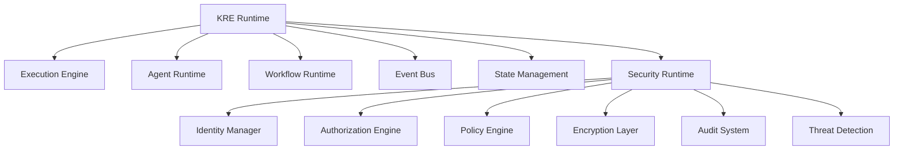

---

# 4. Arquitectura General de Seguridad

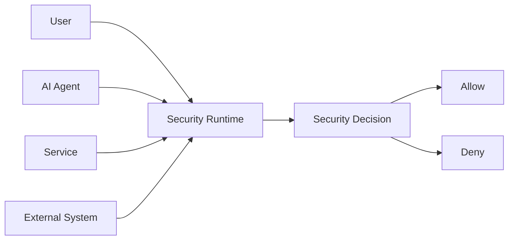

---

# 5. Identidad KAIZEN

Todo elemento ejecutable tiene identidad.

Entidades con identidad:

* Usuarios.
* Agentes.
* Workflows.
* Servicios.
* Dispositivos.
* Sistemas externos.

---

Modelo:

```json id="5f9yq1"
{
"identity_id":

"agent.legal.001",

"type":

"AI_AGENT",

"owner":

"organization01",

"status":

"ACTIVE"
}
```

---

# 6. Identity Manager

Responsable de:

* Crear identidades.
* Validarlas.
* Gestionarlas.
* Revocarlas.
* Versionarlas.

Funciones:

```text
Create Identity

Authenticate

Rotate Credentials

Revoke Access

Audit Identity
```

---

# 7. Identidad de Agentes IA

Cada agente posee:

```json id="2g5p9s"
{
"agent_id":

"ComplianceAgent",

"signature":

"KAIZEN-SIGN-8892",

"trust_level":

"HIGH",

"permissions":

[
"read_policy",
"analyze_document"
]

}
```

---

# 8. Modelo de Confianza

KAIZEN utiliza niveles:

| Nivel     | Descripción          |
| --------- | -------------------- |
| UNTRUSTED | Sin confianza        |
| LOW       | Acceso limitado      |
| STANDARD  | Operación normal     |
| HIGH      | Agentes certificados |
| SYSTEM    | Componentes núcleo   |

---

# 9. Authentication Runtime

Autenticación para:

* Usuarios.
* Agentes.
* Servicios.
* APIs.

Métodos:

* Tokens.
* Certificados.
* Firmas digitales.
* Llaves rotatorias.
* Identidad federada.

---

# 10. Authorization Engine

Determina permisos.

Modelo:

```text
Who?

↓

Can do what?

↓

On which resource?

↓

Under which condition?

```

---

Ejemplo:

```json id="v7k2za"
{
"subject":

"HR_AGENT",

"action":

"READ",

"resource":

"EMPLOYEE_DATA",

"decision":

"ALLOW"
}
```

---

# 11. Modelo RBAC + ABAC

KAIZEN combina:

## RBAC

Role Based Access Control

Ejemplo:

```text
Administrador

Auditor

Empleado

Agente IA
```

---

## ABAC

Attribute Based Access Control

Ejemplo:

```text
Permitir si:

Departamento = Legal

Nivel >= 3

Documento = Contrato

```

---

# 12. Permission Matrix

Ejemplo:

| Entidad      | Leer | Crear | Modificar | Eliminar |
| ------------ | ---- | ----- | --------- | -------- |
| Usuario      | ✅    | ❌     | ❌         | ❌        |
| Admin        | ✅    | ✅     | ✅         | ✅        |
| Agente Legal | ✅    | ✅     | Limitado  | ❌        |
| Auditor      | ✅    | ❌     | ❌         | ❌        |

---

# 13. Policy Engine

El Policy Engine evalúa reglas dinámicas.

Ejemplo:

```yaml id="c2o4l7"
policy:

name:
"Sensitive Document"

rules:

- require_mfa

- require_manager_approval

- log_access

```

---

# 14. Dynamic Authorization

Los permisos pueden cambiar según contexto.

Ejemplo:

Mismo agente:

Durante horario laboral:

```text
ALLOW
```

Fuera del horario:

```text
REQUIRE_APPROVAL
```

---

# 15. Agent Security Boundary

Cada agente opera dentro de un sandbox lógico.

Protege:

* Memoria.
* Herramientas.
* Datos.
* Recursos.

Modelo:

```text
KAIZEN Runtime

        |

Agent Sandbox

        |

Permissions

        |

Allowed Actions

```

---

# 16. Tool Access Control

Los agentes no poseen acceso ilimitado.

Ejemplo:

Agente financiero:

Puede:

✅ Leer facturas
✅ Analizar gastos

No puede:

❌ Transferir dinero

---

Modelo:

```json id="8b1v4m"
{
"agent":

"FinanceAgent",

"tools_allowed":

[
"ocr",
"analysis"
],

"blocked":

[
"payment_api"
]
}
```

---

# 17. Data Security

KAIZEN protege:

* Datos empresariales.
* Memorias IA.
* Estados.
* Eventos.
* Documentos.

---

Capas:

```text
Application Layer

↓

Runtime Security

↓

Encryption Layer

↓

Storage Security
```

---

# 18. Encryption Layer

Protección mediante:

## Data At Rest

Datos almacenados.

## Data In Transit

Comunicación.

## Data In Memory

Información temporal.

---

# 19. Tenant Isolation Security

KAIZEN es multiempresa.

Garantía:

```text
Tenant A

██████████


Tenant B

██████████


No Cross Access

```

---

Cada solicitud incluye:

```json id="2r4s9h"
{
"tenant_id":

"company001",

"security_context":

"isolated"
}
```

---

# 20. Runtime Threat Detection

Detecta:

* Comportamientos anómalos.
* Intentos indebidos.
* Agentes comprometidos.
* Accesos extraños.

Ejemplo:

```text
Agent Behavior:

Normal:
100 consultas/día

Actual:
10.000 consultas/minuto

↓

Threat Detection
```

---

# 21. AI Agent Governance

KAIZEN controla:

* Qué modelos usan.
* Qué información consultan.
* Qué acciones ejecutan.
* Qué decisiones toman.

---

Principio:

> La autonomía del agente siempre está limitada por políticas.

---

# 22. Security Events

Integración con Event Bus:

Ejemplo:

```text
PERMISSION.DENIED

AGENT.BLOCKED

TOKEN.EXPIRED

SECURITY.THREAT
```

---

# 23. Audit Runtime

Toda acción crítica genera registro.

Ejemplo:

```json id="u7p4m8"
{
"time":

"10:30",

"actor":

"LegalAgent",

"action":

"READ_DOCUMENT",

"result":

"ALLOWED"
}
```

---

# 24. Credential Management

Gestiona:

* Creación.
* Rotación.
* Expiración.
* Revocación.

Ejemplo:

```text
API KEY

↓

Rotate

↓

New Credential

↓

Invalidate Old
```

---

# 25. Security Recovery

Ante incidente:

Acciones:

```text
Detect

↓

Contain

↓

Suspend

↓

Investigate

↓

Restore

```

---

# 26. Security API Conceptual

Validación:

```typescript id="j5q0n1"
SecurityRuntime.authorize({

identity:

"agent001",

action:

"READ",

resource:

"document001"

})
```

---

Crear política:

```typescript id="m7k8x2"
SecurityRuntime.createPolicy({

name:

"Financial Approval"

})
```

---

# 27. Métricas del Security Runtime

Debe medir:

```text
authentication_requests

authorization_checks

blocked_actions

security_events

policy_violations

credential_rotations

threat_detection_rate

```

---

# 28. Principios Arquitectónicos

El Security Runtime KAIZEN debe ser:

## Zero Trust

Nunca confiar automáticamente.

## Granular

Permisos específicos.

## Dinámico

Políticas adaptativas.

## Auditable

Todo registrado.

## Resistente

Protección ante ataques.

## Gobernable

IA bajo control humano.

---

# 29. Resultado del Documento

Con KRE-0007 queda definido:

✅ Identidad universal
✅ Autenticación
✅ Autorización
✅ RBAC + ABAC
✅ Zero Trust
✅ Políticas dinámicas
✅ Seguridad de agentes IA
✅ Control de herramientas
✅ Cifrado
✅ Multi-tenant isolation
✅ Threat Detection
✅ Auditoría
✅ Gobierno de IA

---

# Estado actualizado Serie KRE

| Documento                          | Estado      |
| ---------------------------------- | ----------- |
| KRE-0001 Runtime Architecture      | ✅ Completo  |
| KRE-0002 Execution Engine          | ✅ Completo  |
| KRE-0003 Agent Runtime             | ✅ Completo  |
| KRE-0004 Workflow Runtime          | ✅ Completo  |
| KRE-0005 Event Bus                 | ✅ Completo  |
| KRE-0006 State Management          | ✅ Completo  |
| **KRE-0007 Security Runtime**      | ✅ Completo  |
| KRE-0008 Resource Management       | ⏳ Siguiente |
| KRE-0009 Observability & Telemetry | ⏳           |
| KRE-0010 Runtime Conformance       | ⏳           |

---

# Siguiente documento oficial:

# KRE-0008 — Resource Management

Definirá la administración inteligente de recursos del Runtime KAIZEN:

* CPU.
* Memoria.
* GPU.
* almacenamiento.
* redes.
* cuotas.
* escalamiento automático.
* asignación dinámica.
* optimización por IA.
* costos operacionales.
* gestión multi-nodo.
* infraestructura híbrida Edge + Cloud.


# KRE-0008 — Resource Management

# KAIZEN Runtime Environment (KRE)

## Sistema Inteligente de Administración de Recursos Computacionales

**Estado:** ⏳ En desarrollo
**Dependencias:**
✅ KRE-0001 Runtime Architecture
✅ KRE-0002 Execution Engine
✅ KRE-0003 Agent Runtime
✅ KRE-0004 Workflow Runtime
✅ KRE-0005 Event Bus
✅ KRE-0006 State Management
✅ KRE-0007 Security Runtime

**Siguiente documento:** KRE-0009 Observability & Telemetry
**Capa:** Runtime Infrastructure Management Layer
**Clasificación:** Documento Arquitectónico Fundamental

---

# 1. Propósito del Resource Management

El **Resource Management** es la capa responsable de administrar todos los recursos físicos y virtuales utilizados por KAIZEN Runtime.

Su función es garantizar que:

* Los agentes tengan recursos suficientes.
* Los workflows se ejecuten eficientemente.
* Los procesos críticos tengan prioridad.
* Los costos estén optimizados.
* La infraestructura escale automáticamente.

Principio fundamental:

> KAIZEN asigna recursos dinámicamente según la importancia, demanda y contexto de cada ejecución.

---

# 2. Problema que Resuelve

En plataformas tradicionales:

```text
Aplicación

↓

Servidor fijo

↓

Recursos limitados
```

KAIZEN utiliza:

```text
Inteligencia

↓

Planificación dinámica

↓

Asignación automática

↓

Optimización continua
```

---

# 3. Posición dentro de KAIZEN

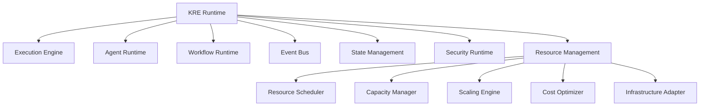

---

# 4. Modelo General de Recursos KAIZEN

KAIZEN administra:

```text
Computación

├── CPU
├── GPU
├── TPU
├── Memory


Almacenamiento

├── Database
├── Object Storage
├── Cache


Red

├── Bandwidth
├── Connections
├── Latency


Servicios

├── APIs
├── Models
├── Workers
```

---

# 5. Resource Object

Todo recurso se representa como entidad KAIZEN.

Ejemplo:

```json id="8j7k2n"
{
"resource_id":

"gpu-node-001",

"type":

"GPU",

"capacity":

"80GB",

"status":

"AVAILABLE",

"location":

"COLOMBIA"
}
```

---

# 6. Resource Manager Architecture

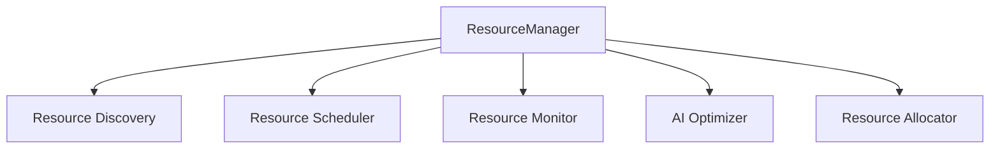

---

# 7. Resource Discovery

Detecta recursos disponibles.

Incluye:

* Servidores.
* Nodos cloud.
* Edge devices.
* GPUs.
* Servicios externos.

Ejemplo:

```text
Nuevo nodo conectado

↓

Discovery

↓

Registrar recurso

↓

Disponible para ejecución
```

---

# 8. Resource Scheduler

El Scheduler decide:

* Dónde ejecutar.
* Cuándo ejecutar.
* Qué recursos usar.

Considera:

```text
Carga actual

+

Prioridad

+

Costo

+

Latencia

+

Capacidad
```

---

# 9. Resource Allocation Engine

Asigna recursos a ejecuciones.

Ejemplo:

Agente IA:

```text
Vision Agent

Necesita:

GPU

16GB RAM

High Priority

```

Asignación:

```text
GPU Node 03

RAM 32GB

Priority Queue HIGH
```

---

# 10. Resource Profiles

Cada componente define necesidades.

Ejemplo:

```json id="x0d8l4"
{
"agent":

"ImageAnalyzer",

"profile":

{

"cpu":4,

"memory":"16GB",

"gpu":true

}

}
```

---

# 11. Tipos de Recursos

---

# 11.1 CPU Resources

Para:

* Procesos normales.
* Reglas.
* APIs.
* Workflows.

---

# 11.2 GPU Resources

Para:

* Modelos IA.
* Visión.
* Generación.
* Entrenamiento.

---

# 11.3 Memory Resources

Gestiona:

* Memoria temporal.
* Contextos IA.
* Caché.

---

# 11.4 Storage Resources

Incluye:

* Documentos.
* Modelos.
* Estados.
* Eventos.

---

# 11.5 Network Resources

Controla:

* Latencia.
* Conexiones.
* Transferencias.

---

# 12. Resource Isolation

Cada ejecución puede tener límites.

Ejemplo:

```text
Agent A

CPU: 4 cores

Memory: 8GB


Agent B

CPU: 2 cores

Memory: 4GB
```

---

Evita:

* Contención.
* Fallos.
* Ataques por consumo.

---

# 13. Resource Quotas

KAIZEN permite límites.

Ejemplo:

Empresa Premium:

```yaml id="4r0s9f"
resources:

cpu:

100 cores

gpu:

4 units

storage:

10TB
```

---

Empresa Básica:

```yaml id="8x2y4q"
resources:

cpu:

10 cores

gpu:

0

storage:

100GB
```

---

# 14. Auto Scaling Engine

KAIZEN escala automáticamente.

Ejemplo:

Demanda aumenta:

```text
100 usuarios

↓

500 usuarios

↓

Auto Scale

↓

Crear Workers

```

---

Escalamiento:

## Horizontal

Más nodos.

```text
Node 1

Node 2

Node 3
```

---

## Vertical

Más capacidad.

```text
CPU 8

↓

CPU 32
```

---

# 15. Predictive Scaling

KAIZEN utiliza IA para anticipar demanda.

Ejemplo:

Detecta:

```text
Todos los lunes

9:00 AM

Alta carga documental
```

Prepara:

```text
Workers adicionales
```

---

# 16. Resource Priority System

Prioridades:

```text
P0 Critical

P1 Enterprise

P2 Standard

P3 Background

P4 Batch
```

---

Ejemplo:

Emergencia seguridad:

```text
Threat Detection

↓

P0

↓

Recursos máximos
```

---

# 17. Resource Optimization AI

El sistema aprende:

* Patrones de uso.
* Costos.
* Rendimiento.
* Necesidades.

Optimiza:

```text
Antes:

GPU todo el día


Después:

GPU solo cuando necesario
```

---

# 18. Cost Management

KAIZEN controla costos:

Métricas:

```text
CPU cost

GPU cost

Storage cost

API cost

Execution cost
```

---

Ejemplo:

Comparación:

```text
Cloud GPU:

$500 mensual


Local GPU:

$120 mensual

```

Selecciona mejor opción.

---

# 19. Multi-Cloud Resource Management

KAIZEN puede operar:

```text
Private Cloud

       |

Public Cloud

       |

Edge Nodes

```

---

Ejemplo:

Datos sensibles:

```text
Local Node
```

IA pesada:

```text
Cloud GPU
```

---

# 20. Edge Runtime Support

Soporta ejecución cercana al usuario.

Ejemplo:

```text
Sensor

↓

Edge Node

↓

KAIZEN Runtime

↓

Cloud Intelligence
```

---

# 21. Resource Failure Management

Si un recurso falla:

```text
Worker Failure

↓

Detect

↓

Migrate Task

↓

Restore State

↓

Continue
```

---

Integración:

* Execution Engine.
* State Management.
* Event Bus.

---

# 22. Resource Health Monitoring

Evalúa:

```text
CPU temperature

Memory usage

GPU health

Network latency

Disk status

```

---

# 23. Resource Lifecycle

Estados:

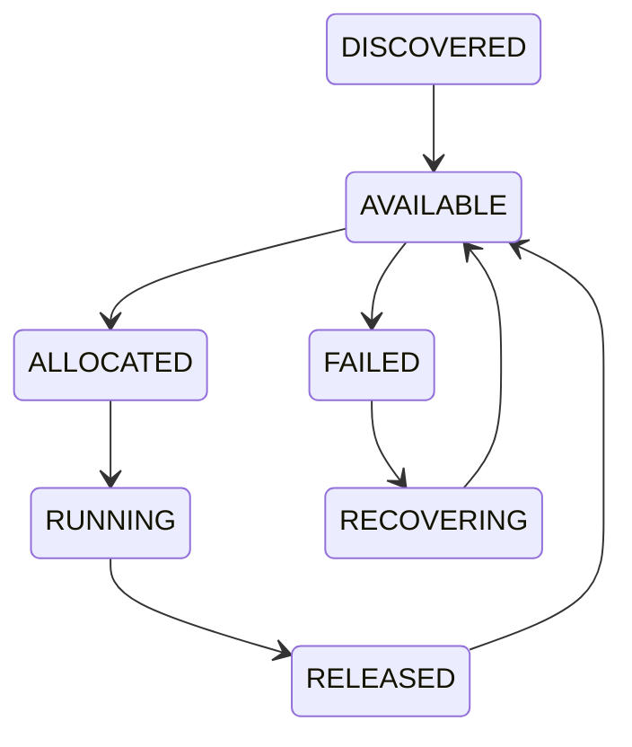

---

# 24. Resource Governance

Define:

* Quién puede usar.
* Cuánto puede usar.
* Durante cuánto tiempo.

Ejemplo:

```json id="3x7m1a"
{
"tenant":

"company01",

"max_gpu":

2,

"max_runtime":

"8h"
}
```

---

# 25. Resource API Conceptual

Consultar recursos:

```typescript id="r2h6v9"
ResourceManager.list({

type:

"GPU"

})
```

Asignar:

```typescript id="m8p3z1"
ResourceManager.allocate({

resource:

"gpu01",

task:

"AI_PROCESS"

})
```

Liberar:

```typescript id="k4s7q0"
ResourceManager.release({

resource:

"gpu01"

})
```

---

# 26. Métricas del Resource Management

Debe medir:

```text
resource_usage

allocation_time

idle_resources

scaling_events

cost_per_execution

capacity

availability

```

---

# 27. Principios Arquitectónicos

El Resource Management KAIZEN debe ser:

## Eficiente

Usar solo lo necesario.

## Autónomo

Gestionarse automáticamente.

## Escalable

Crecer bajo demanda.

## Económico

Optimizar costos.

## Resiliente

Sobrevivir fallos.

## Inteligente

Predecir necesidades.

---

# 28. Resultado del Documento

Con KRE-0008 queda definido:

✅ Administración de CPU/GPU/Memoria
✅ Almacenamiento
✅ Red
✅ Scheduling de recursos
✅ Asignación dinámica
✅ Auto Scaling
✅ Predictive Scaling
✅ Optimización IA
✅ Control de costos
✅ Multi-cloud
✅ Edge Computing
✅ Aislamiento
✅ Cuotas
✅ Recuperación ante fallos

---

# Estado actualizado Serie KRE

| Documento                          | Estado      |
| ---------------------------------- | ----------- |
| KRE-0001 Runtime Architecture      | ✅ Completo  |
| KRE-0002 Execution Engine          | ✅ Completo  |
| KRE-0003 Agent Runtime             | ✅ Completo  |
| KRE-0004 Workflow Runtime          | ✅ Completo  |
| KRE-0005 Event Bus                 | ✅ Completo  |
| KRE-0006 State Management          | ✅ Completo  |
| KRE-0007 Security Runtime          | ✅ Completo  |
| **KRE-0008 Resource Management**   | ✅ Completo  |
| KRE-0009 Observability & Telemetry | ⏳ Siguiente |
| KRE-0010 Runtime Conformance       | ⏳           |

---

# Siguiente documento oficial:

# KRE-0009 — Observability & Telemetry

Definirá la capa de visión total del Runtime KAIZEN:

* métricas,
* logs,
* trazas distribuidas,
* monitoreo de agentes,
* monitoreo de workflows,
* análisis predictivo,
* detección de anomalías,
* dashboards,
* auditoría operacional,
* inteligencia del rendimiento del sistema.


# KRE-0009 — Observability & Telemetry

# KAIZEN Runtime Environment (KRE)

## Sistema de Observabilidad, Inteligencia Operacional y Telemetría Distribuida

**Estado:** ⏳ En desarrollo
**Dependencias:**
✅ KRE-0001 Runtime Architecture
✅ KRE-0002 Execution Engine
✅ KRE-0003 Agent Runtime
✅ KRE-0004 Workflow Runtime
✅ KRE-0005 Event Bus
✅ KRE-0006 State Management
✅ KRE-0007 Security Runtime
✅ KRE-0008 Resource Management

**Siguiente documento:** KRE-0010 Runtime Conformance
**Capa:** Runtime Intelligence & Operations Layer
**Clasificación:** Documento Arquitectónico Fundamental

---

# 1. Propósito del Observability & Telemetry

El **Observability & Telemetry Runtime** es la capa encargada de proporcionar una visión completa del comportamiento interno de KAIZEN.

Su misión:

> Hacer visible todo lo que ocurre dentro del Runtime: ejecuciones, agentes, workflows, eventos, recursos, seguridad y rendimiento.

KAIZEN no solamente debe funcionar.

Debe poder responder:

* ¿Qué ocurrió?
* ¿Cuándo ocurrió?
* ¿Por qué ocurrió?
* ¿Quién lo ejecutó?
* ¿Qué recursos utilizó?
* ¿Cómo mejorarlo?

---

# 2. Principio Fundamental

La observabilidad KAIZEN se basa en:

```text
Logs

+

Metrics

+

Traces

+

Events

+

AI Analysis

=

Operational Intelligence
```

---

# 3. Posición dentro de KAIZEN

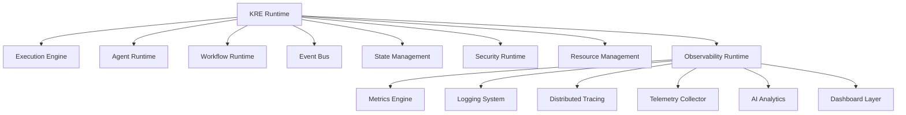

---

# 4. Arquitectura General

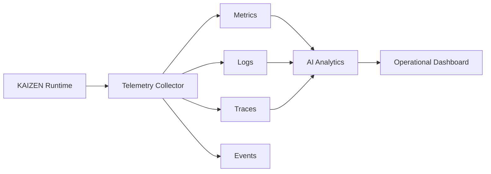

---

# 5. Modelo de Telemetría KAIZEN

Toda actividad genera señales.

Ejemplo:

Un agente ejecuta una tarea:

```text
Agent Started

↓

Tool Called

↓

Decision Generated

↓

Task Completed

↓

Performance Recorded
```

Cada paso genera telemetría.

---

# 6. Tipos de Telemetría

KAIZEN utiliza cinco fuentes principales:

---

# 6.1 Metrics

Datos numéricos del sistema.

Ejemplo:

```text
CPU Usage: 72%

Memory: 8GB

Latency: 200ms

Tasks/sec: 500
```

---

# 6.2 Logs

Registro detallado de eventos.

Ejemplo:

```json
{
"time":

"10:30",

"service":

"WorkflowRuntime",

"message":

"Workflow completed"
}
```

---

# 6.3 Distributed Traces

Permiten seguir una operación completa.

Ejemplo:

```text
User Request

↓

API Gateway

↓

Workflow

↓

Agent

↓

Database

↓

Response
```

---

# 6.4 Runtime Events

Eventos generados por componentes.

Ejemplo:

```text
AGENT.STARTED

WORKFLOW.FAILED

RESOURCE.ALLOCATED
```

---

# 6.5 AI Insights

Análisis inteligente:

Ejemplo:

```text
Detectado:

Workflow financiero tarda 40% más

Causa probable:

API externa lenta
```

---

# 7. Telemetry Collector

Componente central que recolecta información.

Funciones:

* Recibir datos.
* Normalizar.
* Clasificar.
* Enviar a almacenamiento.
* Generar alertas.

---

Arquitectura:

```text
Component

↓

Telemetry Agent

↓

Collector

↓

Analytics Engine
```

---

# 8. Observabilidad de Agentes IA

KAIZEN monitorea agentes:

Características:

* Tiempo de razonamiento.
* Herramientas utilizadas.
* Decisiones.
* Errores.
* Costos.
* Consumo de tokens.
* Calidad del resultado.

---

Ejemplo:

```json
{
"agent":

"LegalAgent",

"execution_time":

"32s",

"tools":

[
"search",
"document_analysis"
],

"quality_score":

0.94
}
```

---

# 9. Agent Trace

Permite reconstruir el comportamiento de un agente.

Ejemplo:

```text
Goal Received

↓

Context Loaded

↓

Memory Retrieved

↓

Reasoning

↓

Tool Selection

↓

Execution

↓

Response
```

---

# 10. Workflow Observability

Cada workflow genera:

* Duración total.
* Pasos ejecutados.
* Esperas humanas.
* Errores.
* Compensaciones.

Ejemplo:

```text
Workflow:

Contract Approval


Duration:

5 days


Bottleneck:

Manager Approval
```

---

# 11. Execution Engine Monitoring

Controla:

* Colas.
* Workers.
* Procesos.
* Retries.
* Fallos.

Métricas:

```text
queue_depth

execution_latency

failure_rate

retry_count
```

---

# 12. Resource Telemetry

Integración con KRE-0008.

Monitorea:

```text
CPU

GPU

Memory

Storage

Network

Cost
```

---

Ejemplo:

```text
GPU Usage:

95%

Prediction:

Need additional GPU node
```

---

# 13. Security Observability

Integración con KRE-0007.

Monitorea:

* Intentos fallidos.
* Accesos.
* Violaciones.
* Agentes sospechosos.

Ejemplo:

```text
ALERT:

Agent exceeded permission boundary
```

---

# 14. Distributed Tracing

Permite seguir solicitudes entre servicios.

Ejemplo:

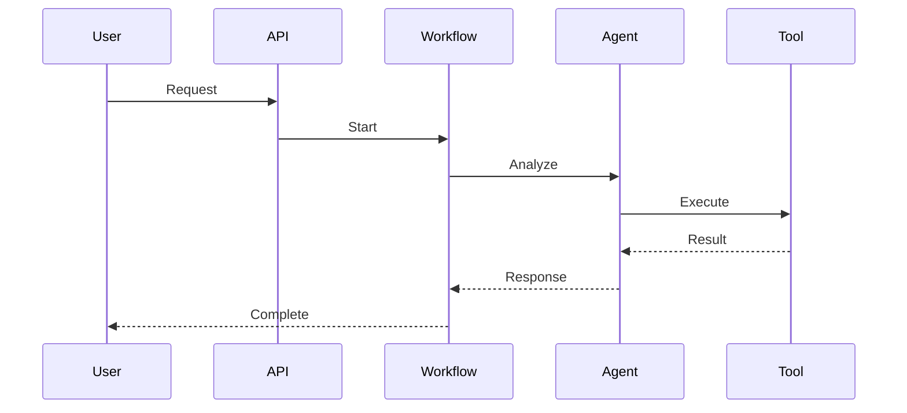

---

# 15. Correlation ID

Toda ejecución posee identificador único.

Ejemplo:

```text
REQUEST-ID:

KAIZEN-883920
```

Permite unir:

* Logs.
* Eventos.
* Estados.
* Métricas.

---

# 16. Performance Intelligence

KAIZEN analiza:

* Velocidad.
* Eficiencia.
* Cuellos de botella.
* Costos.

Ejemplo:

```text
Proceso:

Invoice Processing


Antes:

40 segundos


Optimización IA:

12 segundos
```

---

# 17. Anomaly Detection

La IA detecta comportamientos anormales.

Ejemplo:

Normal:

```text
1000 eventos/minuto
```

Actual:

```text
50000 eventos/minuto
```

Resultado:

```text
Posible anomalía detectada
```

---

# 18. Predictive Operations

KAIZEN puede anticipar problemas.

Ejemplo:

Predicción:

```text
Storage llegará al límite
en 14 días
```

Acción:

```text
Expandir automáticamente
```

---

# 19. Alert Management

Sistema de alertas inteligente.

Tipos:

## Critical

Acción inmediata.

## Warning

Revisión.

## Information

Registro.

---

Ejemplo:

```json
{
"severity":

"CRITICAL",

"message":

"Agent failure detected"
}
```

---

# 20. Operational Dashboard

Panel principal:

```text
KAIZEN Runtime Control Center

--------------------------------

Active Agents

Running Workflows

System Health

Security Status

Resource Usage

Costs

Alerts

--------------------------------
```

---

# 21. Runtime Health Score

KAIZEN calcula salud global.

Ejemplo:

```text
Runtime Health:

98.7%

Components:

Execution:
99%

Security:
100%

Resources:
97%

Agents:
98%
```

---

# 22. Audit Timeline

Reconstrucción completa:

```text
10:00

User created workflow

10:01

Agent started

10:03

Document processed

10:05

Approval completed
```

---

# 23. Telemetry Storage

Clasificación:

## Hot Data

Información reciente.

Uso:

Monitoreo tiempo real.

---

## Warm Data

Historial operativo.

Uso:

Análisis.

---

## Cold Data

Archivo histórico.

Uso:

Auditoría.

---

# 24. Observability API

Consultar métricas:

```typescript
Telemetry.query({

service:

"AgentRuntime",

metric:

"latency"

})
```

---

Crear alerta:

```typescript
Alert.create({

condition:

"failure_rate > 5%"

})
```

---

# 25. Métricas Fundamentales

KAIZEN mide:

```text
system_health

execution_latency

agent_quality

workflow_duration

event_throughput

resource_usage

security_events

cost_efficiency

```

---

# 26. Observability Governance

Define:

* Qué registrar.
* Cuánto almacenar.
* Quién puede ver.
* Nivel de detalle.

---

Ejemplo:

```yaml
policy:

agent_logs:

retention:

90_days

access:

admin_only
```

---

# 27. Principios Arquitectónicos

El Observability Runtime KAIZEN debe ser:

## Transparente

Todo visible.

## Predictivo

Anticipa problemas.

## Inteligente

Usa IA.

## Auditable

Historial completo.

## Escalable

Millones de señales.

## Accionable

No solo muestra datos, genera respuestas.

---

# 28. Resultado del Documento

Con KRE-0009 queda definido:

✅ Sistema de métricas
✅ Logs centralizados
✅ Trazabilidad distribuida
✅ Telemetría de agentes
✅ Telemetría de workflows
✅ Monitoreo de recursos
✅ Seguridad operacional
✅ AI Analytics
✅ Detección de anomalías
✅ Alertas inteligentes
✅ Dashboards
✅ Auditoría operacional
✅ Predicción de problemas

---

# Estado actualizado Serie KRE

| Documento                              | Estado      |
| -------------------------------------- | ----------- |
| KRE-0001 Runtime Architecture          | ✅ Completo  |
| KRE-0002 Execution Engine              | ✅ Completo  |
| KRE-0003 Agent Runtime                 | ✅ Completo  |
| KRE-0004 Workflow Runtime              | ✅ Completo  |
| KRE-0005 Event Bus                     | ✅ Completo  |
| KRE-0006 State Management              | ✅ Completo  |
| KRE-0007 Security Runtime              | ✅ Completo  |
| KRE-0008 Resource Management           | ✅ Completo  |
| **KRE-0009 Observability & Telemetry** | ✅ Completo  |
| KRE-0010 Runtime Conformance           | ⏳ Siguiente |

---

# Siguiente documento oficial:

# KRE-0010 — Runtime Conformance

Documento final de la Serie KRE.

Definirá:

* estándares de cumplimiento,
* validación del Runtime,
* pruebas de conformidad,
* compatibilidad entre versiones,
* certificación KAIZEN Runtime,
* requisitos mínimos,
* perfiles de despliegue,
* garantías de interoperabilidad,
* checklist oficial del estándar KRE.


# KRE-0010 — Runtime Conformance

# KAIZEN Runtime Environment (KRE)

## Estándar de Conformidad, Certificación e Interoperabilidad del Runtime

**Estado:** ⏳ En desarrollo
**Dependencias:**
✅ KRE-0001 Runtime Architecture
✅ KRE-0002 Execution Engine
✅ KRE-0003 Agent Runtime
✅ KRE-0004 Workflow Runtime
✅ KRE-0005 Event Bus
✅ KRE-0006 State Management
✅ KRE-0007 Security Runtime
✅ KRE-0008 Resource Management
✅ KRE-0009 Observability & Telemetry

**Siguiente etapa:** Consolidación del estándar KAIZEN Runtime
**Capa:** Runtime Governance & Certification Layer
**Clasificación:** Documento Normativo Fundamental

---

# 1. Propósito del Runtime Conformance

El documento **KRE-0010 Runtime Conformance** define las reglas que determinan si una implementación del **KAIZEN Runtime Environment** cumple con el estándar oficial.

Su objetivo es garantizar que cualquier Runtime compatible con KAIZEN mantenga:

* Arquitectura consistente.
* Comportamiento predecible.
* Seguridad obligatoria.
* Interoperabilidad.
* Escalabilidad.
* Observabilidad.
* Compatibilidad futura.

Principio:

> Un Runtime KAIZEN certificado debe comportarse de forma equivalente independientemente de dónde sea desplegado.

---

# 2. Objetivo de la Conformidad KAIZEN

Una implementación KRE debe demostrar:

```text
 id="0sqf2w"
Arquitectura Correcta

+

Ejecución Determinista

+

Seguridad Integrada

+

Estado Persistente

+

Comunicación Event Driven

+

Observabilidad Completa

+

Gestión de Recursos

=

KAIZEN Compatible Runtime
```

---

# 3. Posición dentro del Estándar KAIZEN

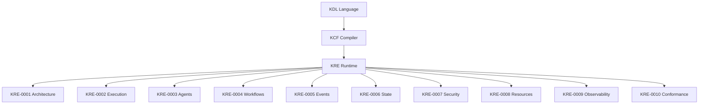

---

# 4. Modelo de Certificación KAIZEN

Los Runtime pueden tener niveles:

---

# KRE Level 1 — Basic Runtime

Requisitos:

✅ Execution Engine
✅ State Management básico
✅ Event Bus básico
✅ Seguridad básica

Uso:

* Aplicaciones pequeñas.
* Desarrollo.

---

# KRE Level 2 — Professional Runtime

Incluye:

✅ Agentes IA
✅ Workflows
✅ Observabilidad
✅ Gestión de recursos

Uso:

* Empresas.
* SaaS.

---

# KRE Level 3 — Enterprise Runtime

Incluye:

✅ Multi-tenant
✅ Zero Trust
✅ Escalamiento automático
✅ Auditoría avanzada
✅ Alta disponibilidad

Uso:

* Grandes organizaciones.

---

# KRE Level 4 — Autonomous Runtime

Nivel máximo.

Incluye:

✅ Optimización IA
✅ Auto recuperación
✅ Auto escalamiento
✅ Gobierno autónomo
✅ Predicción operacional

---

# 5. Requisitos Generales de Conformidad

Todo Runtime certificado debe implementar:

| Área                | Obligatorio |
| ------------------- | ----------- |
| Execution Engine    | ✅           |
| Agent Runtime       | ✅           |
| Workflow Runtime    | ✅           |
| Event Bus           | ✅           |
| State Management    | ✅           |
| Security Runtime    | ✅           |
| Resource Management | ✅           |
| Observability       | ✅           |

---

# 6. Conformance Architecture

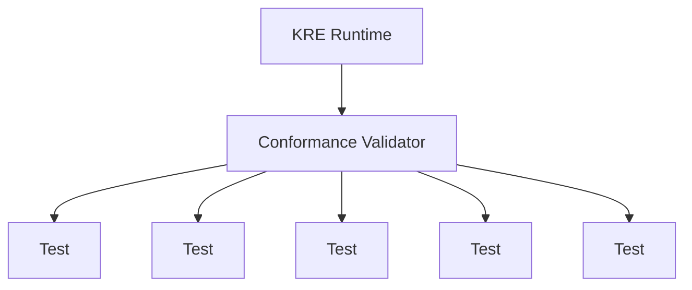

---

# 7. Runtime Validator

El Validator verifica:

* Componentes presentes.
* Versiones compatibles.
* APIs disponibles.
* Seguridad activa.
* Métricas funcionando.

Ejemplo:

```json id="7v1p4h"
{
"runtime":

"KAIZEN Enterprise",

"version":

"1.0",

"status":

"CERTIFIED"
}
```

---

# 8. Architecture Compliance

Valida:

## Componentes obligatorios

Debe existir:

```text
Execution Engine

Agent Runtime

Workflow Runtime

Event Bus

State Layer

Security Layer

Resource Layer

Telemetry Layer
```

---

# 9. Execution Compliance

El Runtime debe garantizar:

## Determinismo

Mismo contexto:

```text
Input + Rules + Version
```

produce:

```text
Resultado consistente
```

---

Debe soportar:

* Prioridades.
* Colas.
* Retries.
* Timeouts.
* Cancelación.
* Recuperación.

---

# 10. Agent Runtime Compliance

Los agentes deben tener:

```text
Identity

Memory

Permissions

Tools

Lifecycle

Version
```

---

Prohibido:

❌ Agentes sin identidad.
❌ Acciones sin permisos.
❌ Memoria sin control.

---

# 11. Workflow Compliance

Todo workflow debe soportar:

* Estados.
* Versionamiento.
* Persistencia.
* Auditoría.
* Recuperación.

---

Debe poder:

```text
Pause

Resume

Rollback

Compensate

Replay
```

---

# 12. Event Bus Compliance

Debe garantizar:

## Comunicación:

* Publish.
* Subscribe.
* Routing.

## Seguridad:

* Firma.
* Validación.
* Control acceso.

## Persistencia:

* Replay.
* Historial.

---

# 13. State Compliance

Debe soportar:

* Estado actual.
* Historial.
* Versiones.
* Snapshots.
* Recuperación.

---

Modelo mínimo:

```text
Entity

↓

Current State

↓

History

↓

Events
```

---

# 14. Security Compliance

Requisitos obligatorios:

## Identity

Cada actor identificado.

## Authorization

Cada acción validada.

## Audit

Cada acción registrada.

## Isolation

Separación de tenants.

---

Debe cumplir:

```text
Zero Trust Runtime
```

---

# 15. Resource Compliance

Debe administrar:

* CPU.
* Memoria.
* Storage.
* Red.
* GPU.

Debe incluir:

* Límites.
* Cuotas.
* Escalamiento.
* Optimización.

---

# 16. Observability Compliance

Debe generar:

## Logs

Eventos detallados.

## Metrics

Indicadores numéricos.

## Traces

Seguimiento completo.

## Alerts

Respuesta operacional.

---

# 17. Compatibility Matrix

KAIZEN define compatibilidad:

| Versión | Compatibilidad |
| ------- | -------------- |
| KRE 1.x | KDL 1.x        |
| KRE 2.x | KDL 2.x        |
| KRE 3.x | KDL 3.x        |

---

Regla:

Una versión mayor puede romper compatibilidad.

Una versión menor debe mantener compatibilidad.

---

# 18. Runtime Profiles

KAIZEN define configuraciones estándar.

---

# Development Profile

Características:

* Debug activo.
* Logs completos.
* Recursos limitados.

---

# Production Profile

Características:

* Alta seguridad.
* Optimización.
* Monitoreo activo.

---

# Enterprise Profile

Características:

* Multi-región.
* Alta disponibilidad.
* Auditoría avanzada.

---

# Autonomous Profile

Características:

* Auto optimización.
* Auto recuperación.
* Gestión IA.

---

# 19. Conformance Testing

Pruebas oficiales:

---

## Functional Tests

Validan comportamiento.

Ejemplo:

```text
Crear agente

↓

Ejecutar tarea

↓

Obtener resultado
```

---

## Security Tests

Validan:

* Permisos.
* Ataques.
* Aislamiento.

---

## Performance Tests

Validan:

* Latencia.
* Escalabilidad.
* Carga.

---

## Reliability Tests

Validan:

* Fallos.
* Recuperación.
* Disponibilidad.

---

# 20. Runtime Certification Process

Proceso:

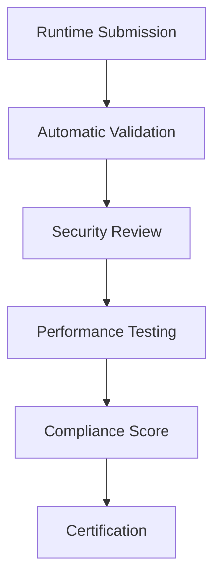

---

# 21. Conformance Score

KAIZEN utiliza puntuación:

```text
 id="7u9w5k"
Architecture      20%

Execution         20%

Security          20%

Reliability       15%

Performance       15%

Observability     10%

TOTAL             100%
```

---

# 22. Certificados KAIZEN

Ejemplo:

```text
KAIZEN CERTIFIED RUNTIME

Runtime:

Enterprise AI Runtime

Version:

1.0

Level:

KRE-3

Score:

97%

Status:

VALID
```

---

# 23. Interoperabilidad

Un Runtime certificado debe comunicarse con:

* Otros Runtime KAIZEN.
* Agentes externos certificados.
* Herramientas compatibles.
* Sistemas empresariales.

---

Modelo:

```text
KAIZEN Runtime A

        ↕

KAIZEN Protocol

        ↕

KAIZEN Runtime B
```

---

# 24. Governance del Estándar

El estándar debe controlar:

* Cambios.
* Versiones.
* Compatibilidad.
* Deprecaciones.

---

Modelo:

```text
Proposal

↓

Review

↓

Testing

↓

Approval

↓

Release
```

---

# 25. Evolución del Runtime

Roadmap:

```text
KRE 1.0

Base Runtime


↓

KRE 2.0

Distributed Runtime


↓

KRE 3.0

Autonomous Runtime


↓

KRE 4.0

Self Optimizing Runtime
```

---

# 26. Principios Finales del KRE

El Runtime KAIZEN debe ser:

## Compatible

Todos hablan el mismo estándar.

## Seguro

IA bajo gobierno.

## Escalable

Desde una aplicación hasta infraestructura global.

## Observable

Nada ocurre sin registro.

## Autónomo

Puede optimizarse.

## Evolutivo

Preparado para futuras generaciones.

---

# 27. Resultado del Documento

Con KRE-0010 queda definido:

✅ Modelo oficial de certificación
✅ Niveles de Runtime
✅ Validación arquitectónica
✅ Pruebas de cumplimiento
✅ Compatibilidad entre versiones
✅ Gobernanza del estándar
✅ Perfiles de despliegue
✅ Interoperabilidad
✅ Runtime Certification
✅ Evolución futura

---

# Estado FINAL Serie KRE

| Documento                          | Estado     |
| ---------------------------------- | ---------- |
| KRE-0001 Runtime Architecture      | ✅ Completo |
| KRE-0002 Execution Engine          | ✅ Completo |
| KRE-0003 Agent Runtime             | ✅ Completo |
| KRE-0004 Workflow Runtime          | ✅ Completo |
| KRE-0005 Event Bus                 | ✅ Completo |
| KRE-0006 State Management          | ✅ Completo |
| KRE-0007 Security Runtime          | ✅ Completo |
| KRE-0008 Resource Management       | ✅ Completo |
| KRE-0009 Observability & Telemetry | ✅ Completo |
| **KRE-0010 Runtime Conformance**   | ✅ Completo |

---

# 🎯 Serie KRE COMPLETADA

La tercera gran capa de KAIZEN queda definida:

```text
KAIZEN STANDARD

      ↓

KDL
KAIZEN Definition Language

      ↓

KCF
KAIZEN Compiler Framework

      ↓

KRE
KAIZEN Runtime Environment

      ↓

Intelligent Execution Platform
```

---

## Próxima etapa recomendada del estándar KAIZEN:

# KSP — KAIZEN Service Platform

Cuarta gran capa:

* servicios nativos KAIZEN,
* API Gateway,
* Identity Service,
* Agent Marketplace,
* Model Registry,
* Knowledge Platform,
* Billing Engine,
* Tenant Platform,
* Developer Platform,
* Extension Framework.

La base del lenguaje, compilador y runtime queda oficialmente establecida.
