Continuamos con la siguiente gran capa del estándar KAIZEN.

# KSP — KAIZEN Service Platform

## Plataforma de Servicios Nativos KAIZEN

**Estado:** ⏳ Inicio de nueva capa
**Dependencias:**

✅ KDL — KAIZEN Definition Language
✅ KCF — KAIZEN Compiler Framework
✅ KRE — KAIZEN Runtime Environment

**Capa:** Service & Platform Layer
**Clasificación:** Arquitectura Fundamental KAIZEN
**Objetivo:** Proporcionar los servicios base sobre los cuales viven aplicaciones, agentes, workflows y ecosistemas empresariales.

---

# Serie KSP — Progreso Inicial

| Documento                                | Estado      |
| ---------------------------------------- | ----------- |
| KSP-0001 Service Platform Architecture   | ⏳ Iniciando |
| KSP-0002 API Gateway & Service Mesh      | Pendiente   |
| KSP-0003 Identity & Organization Service | Pendiente   |
| KSP-0004 Tenant Management Service       | Pendiente   |
| KSP-0005 Agent Marketplace Service       | Pendiente   |
| KSP-0006 Model Registry Service          | Pendiente   |
| KSP-0007 Knowledge Platform Service      | Pendiente   |
| KSP-0008 Developer Platform              | Pendiente   |
| KSP-0009 Billing & Subscription Service  | Pendiente   |
| KSP-0010 Extension Framework             | Pendiente   |

---

# KSP-0001 — Service Platform Architecture

# KAIZEN Service Platform (KSP)

## Arquitectura Base de Servicios Empresariales Inteligentes

**Estado:** ⏳ En desarrollo
**Capa:** Platform Services Layer
**Documento Base:** KSP-0001

---

# 1. Propósito de KAIZEN Service Platform

La **KAIZEN Service Platform (KSP)** es la cuarta gran capa del estándar KAIZEN.

Su función es proporcionar todos los servicios compartidos necesarios para construir soluciones sobre:

* KDL.
* KCF.
* KRE.

Mientras KRE ejecuta inteligencia, KSP proporciona:

* Servicios.
* APIs.
* Identidad.
* Organizaciones.
* Usuarios.
* Modelos IA.
* Conocimiento.
* Extensiones.
* Comercialización.

---

# 2. Arquitectura Completa KAIZEN

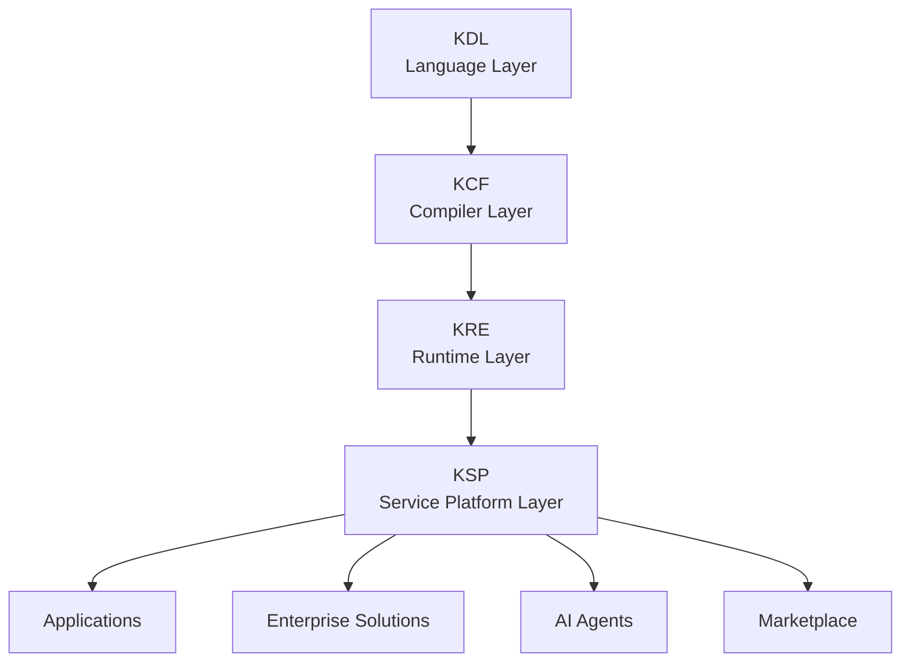

---

# 3. Problema que Resuelve KSP

Sin una plataforma de servicios:

```text
Cada aplicación crea:

- Usuarios
- Seguridad
- Pagos
- APIs
- IA
- Datos
```

Resultado:

Duplicación.

---

Con KSP:

```text
Aplicaciones KAIZEN

        ↓

Servicios Compartidos

        ↓

Runtime KAIZEN
```

---

# 4. Principio Fundamental

> KSP convierte KAIZEN de un runtime de ejecución en un ecosistema completo de construcción, distribución y operación de software inteligente.

---

# 5. Arquitectura General KSP

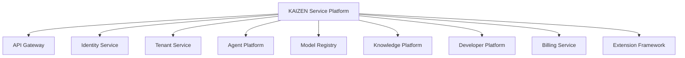

---

# 6. Capas Internas de KSP

## 6.1 Core Services Layer

Servicios fundamentales:

* Identidad.
* Usuarios.
* Organizaciones.
* Configuración.

---

## 6.2 Intelligence Services Layer

Servicios IA:

* Modelos.
* Embeddings.
* RAG.
* Agentes.
* Memoria.

---

## 6.3 Business Services Layer

Servicios empresariales:

* Facturación.
* Suscripciones.
* Marketplace.
* Licencias.

---

## 6.4 Developer Services Layer

Herramientas para construir:

* APIs.
* SDKs.
* Plugins.
* Extensiones.

---

# 7. Modelo de Servicio KAIZEN

Cada servicio es una entidad registrada.

Ejemplo:

```json
{
"service_id":

"identity.service",

"version":

"1.0",

"status":

"ACTIVE",

"runtime":

"KRE"
}
```

---

# 8. Service Registry

KSP mantiene un catálogo de servicios.

Funciones:

* Registrar servicios.
* Descubrir servicios.
* Versionar.
* Controlar disponibilidad.

Ejemplo:

```text
Application

↓

Service Discovery

↓

Identity Service

↓

Response
```

---

# 9. API Gateway KAIZEN

Punto único de entrada.

Responsabilidades:

* Routing.
* Autenticación.
* Rate limiting.
* Transformación.
* Seguridad.

Modelo:

```text
Client

↓

KAIZEN Gateway

↓

Services

```

---

# 10. Service Mesh

Comunicación interna:

```text
Service A

 ↕

Service Mesh

 ↕

Service B
```

Controla:

* Seguridad.
* Latencia.
* Balanceo.
* Observabilidad.

---

# 11. Service Lifecycle

Cada servicio tiene:

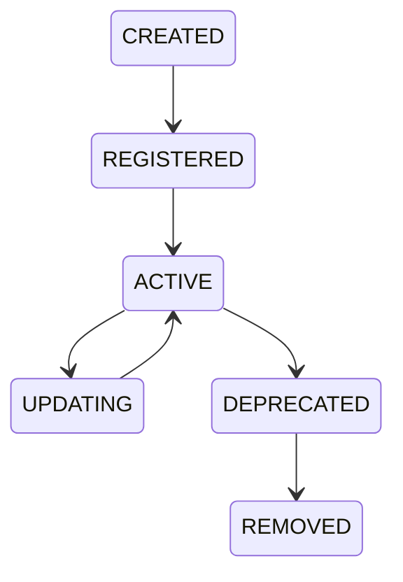

---

# 12. Multi-Tenant Native

KSP nace preparado para SaaS.

Modelo:

```text
KAIZEN Platform

      |

-----------------

Tenant A

Tenant B

Tenant C

-----------------

```

Cada tenant posee:

* Configuración.
* Usuarios.
* Recursos.
* Servicios habilitados.

---

# 13. Service Security

Todos los servicios heredan:

Del KRE Security Runtime:

* Identidad.
* Permisos.
* Auditoría.
* Políticas.

---

# 14. Service Communication Protocol

KAIZEN define comunicación estándar:

```text
Request

↓

Authentication

↓

Authorization

↓

Execution

↓

Response

↓

Telemetry
```

---

# 15. Service Configuration Management

Cada servicio posee configuración:

Ejemplo:

```json
{
"service":

"billing",

"environment":

"production",

"features":

{

"payments":true

}

}
```

---

# 16. Feature Management

Permite:

* Activar funcionalidades.
* Pruebas A/B.
* Despliegues graduales.

Ejemplo:

```text
Feature:

AI Assistant

Estado:

10% usuarios

```

---

# 17. Service Health Management

Cada servicio reporta:

* Estado.
* Latencia.
* Errores.
* Disponibilidad.

Integrado con:

KRE-0009 Observability.

---

# 18. Service Scaling

KSP utiliza:

KRE Resource Management:

```text
Alta demanda

↓

Escalamiento

↓

Nuevas instancias

```

---

# 19. Service Marketplace Ready

La plataforma permite publicar:

* Agentes.
* Servicios.
* Extensiones.
* Plantillas.

Ejemplo:

```text
Developer

↓

Publica Agent

↓

Marketplace

↓

Usuarios Instalan
```

---

# 20. Developer First Architecture

KSP incluye:

* SDKs.
* APIs.
* Documentación.
* Testing.
* Sandbox.

---

# 21. Ecosistema KAIZEN

```text
Developers

      |

KAIZEN Platform

      |

Agents

      |

Businesses

      |

Users
```

---

# 22. Principios Arquitectónicos KSP

La plataforma debe ser:

## Modular

Servicios independientes.

## Extensible

Nuevas capacidades.

## Segura

Gobierno centralizado.

## Multi-tenant

SaaS nativo.

## Global

Preparada para múltiples regiones.

## Inteligente

Optimizada por IA.

---

# 23. Resultado KSP-0001

Con este documento queda definido:

✅ Inicio de Service Platform
✅ Arquitectura general KSP
✅ Catálogo de servicios
✅ API Gateway conceptual
✅ Service Mesh
✅ Registro de servicios
✅ Multi-tenancy
✅ Seguridad heredada KRE
✅ Escalabilidad
✅ Developer Ecosystem

---

# Estado actualizado KAIZEN

```text
CAPA 1

KDL
✅ Completa


CAPA 2

KCF
✅ Completa


CAPA 3

KRE
✅ Completa


CAPA 4

KSP

⏳ Iniciada
```

---

# Estado Serie KSP

| Documento                                  | Estado      |
| ------------------------------------------ | ----------- |
| **KSP-0001 Service Platform Architecture** | ✅ Completo  |
| KSP-0002 API Gateway & Service Mesh        | ⏳ Siguiente |
| KSP-0003 Identity & Organization Service   | Pendiente   |
| KSP-0004 Tenant Management Service         | Pendiente   |
| KSP-0005 Agent Marketplace Service         | Pendiente   |
| KSP-0006 Model Registry Service            | Pendiente   |
| KSP-0007 Knowledge Platform Service        | Pendiente   |
| KSP-0008 Developer Platform                | Pendiente   |
| KSP-0009 Billing & Subscription Service    | Pendiente   |
| KSP-0010 Extension Framework               | Pendiente   |

---

## Siguiente documento oficial:

# KSP-0002 — API Gateway & Service Mesh

Definirá:

* puerta de entrada universal KAIZEN,
* gestión de APIs,
* comunicación entre servicios,
* autenticación,
* autorización,
* balanceo,
* rate limiting,
* service discovery,
* malla de servicios,
* seguridad interna,
* observabilidad distribuida.


# KSP-0002 — API Gateway & Service Mesh

# KAIZEN Service Platform (KSP)

## Capa Universal de Comunicación, Enrutamiento y Conectividad de Servicios

**Estado:** ⏳ En desarrollo
**Dependencias:**

✅ KDL — KAIZEN Definition Language
✅ KCF — KAIZEN Compiler Framework
✅ KRE — KAIZEN Runtime Environment
✅ KSP-0001 Service Platform Architecture

**Siguiente documento:** KSP-0003 Identity & Organization Service
**Capa:** Service Communication & Integration Layer
**Clasificación:** Documento Arquitectónico Fundamental

---

# 1. Propósito del API Gateway & Service Mesh

El **KSP-0002 API Gateway & Service Mesh** define la infraestructura de comunicación de KAIZEN.

Su objetivo es establecer cómo:

* Usuarios.
* Aplicaciones.
* Agentes.
* Servicios.
* Sistemas externos.

se comunican dentro del ecosistema KAIZEN.

Principio:

> Toda comunicación dentro de KAIZEN debe ser segura, observable, gobernada y optimizada.

---

# 2. Problema que Resuelve

Arquitecturas tradicionales:

```text
Aplicación A
      |
      |
Servicio B
      |
      |
Servicio C
      |
      |
Servicio D
```

Problemas:

* Conexiones directas.
* Baja seguridad.
* Difícil monitoreo.
* Poco control.

---

KAIZEN:

```text
                 API Gateway

                     |

        ----------------------------

        Service Mesh

        |          |          |

    Service A  Service B  Service C

```

---

# 3. Posición dentro de KAIZEN

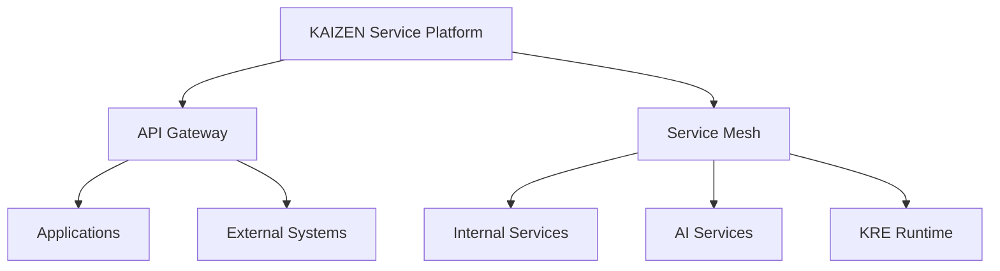

---

# 4. Arquitectura General

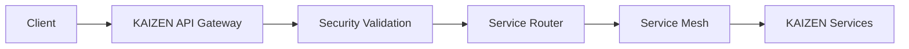

---

# 5. API Gateway KAIZEN

El Gateway es la entrada oficial al ecosistema.

Funciones:

* Recepción de solicitudes.
* Validación.
* Enrutamiento.
* Seguridad.
* Control de tráfico.
* Transformación.

---

# 6. Gateway Request Lifecycle

Flujo:

```text
Request

↓

API Gateway

↓

Identity Validation

↓

Authorization

↓

Rate Limit Check

↓

Route Selection

↓

Service Execution

↓

Response

↓

Telemetry
```

---

# 7. API Gateway Components

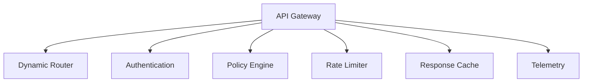

---

# 8. Dynamic Service Routing

KAIZEN no usa rutas fijas.

Ejemplo:

Solicitud:

```text
/document/analyze
```

Gateway consulta:

```text
Service Registry

↓

Document AI Service v2

↓

Execute
```

---

# 9. Service Discovery

El Gateway conoce servicios disponibles.

Ejemplo:

```json
{
"service":

"knowledge.service",

"instances":

3,

"health":

"ACTIVE"
}
```

---

# 10. Load Balancing

Distribuye tráfico:

Ejemplo:

```text
Request

        |

----------------

Node 1  33%

Node 2  33%

Node 3  34%

----------------

```

Estrategias:

* Round Robin.
* Least Connections.
* Performance Based.
* AI Predictive Routing.

---

# 11. AI Intelligent Routing

KAIZEN puede decidir:

Ejemplo:

Solicitud IA:

```text
Image Generation
```

Sistema evalúa:

```text
GPU disponible

Costo

Latencia

Ubicación

Modelo
```

Resultado:

```text
Enviar a:

GPU Node Europa
```

---

# 12. Authentication Gateway

Todo acceso externo pasa primero por seguridad.

Valida:

* Usuario.
* Aplicación.
* Agente.
* Servicio.

Integración:

KRE-0007 Security Runtime.

---

# 13. Authorization Gateway

Evalúa:

```text
Quién

↓

Qué quiere hacer

↓

Sobre qué recurso

↓

Con qué permisos
```

Ejemplo:

```json
{
"identity":

"finance.agent",

"action":

"READ",

"resource":

"invoice"
}
```

---

# 14. Rate Limiting

Controla consumo.

Ejemplo:

Plan Basic:

```text
1000 requests/hour
```

Plan Enterprise:

```text
1.000.000 requests/hour
```

---

Protege contra:

* Abuso.
* Saturación.
* Ataques.

---

# 15. API Version Management

KAIZEN soporta evolución.

Ejemplo:

```text
/api/v1/document

/api/v2/document
```

Permite:

* Compatibilidad.
* Migraciones.
* Deprecación gradual.

---

# 16. Service Mesh KAIZEN

El Service Mesh controla comunicación interna.

Modelo:

```text
Service A

   |

Sidecar Proxy

   |

Service Mesh

   |

Sidecar Proxy

   |

Service B
```

---

# 17. Service Mesh Responsibilities

Gestiona:

* Comunicación.
* Seguridad.
* Balanceo.
* Retries.
* Circuit Breakers.
* Telemetría.

---

# 18. Internal Service Identity

Cada servicio posee identidad.

Ejemplo:

```json
{
"service":

"billing.service",

"identity":

"KSP-BILLING-001",

"trust":

"HIGH"
}
```

---

# 19. Secure Service Communication

Toda comunicación interna utiliza:

* Identidad.
* Certificados.
* Cifrado.
* Políticas.

Modelo:

```text
Service A

↓

Verify Identity

↓

Encrypted Channel

↓

Service B
```

---

# 20. Circuit Breaker Pattern

Evita fallos en cascada.

Ejemplo:

Servicio externo falla:

```text
10 errores

↓

Circuit OPEN

↓

Bloquear llamadas

↓

Recuperación automática
```

---

# 21. Retry Management

Control inteligente:

Ejemplo:

```text
Intento 1

↓

Falla

↓

Esperar 2s

↓

Intento 2

↓

Esperar 5s

↓

Intento 3
```

---

# 22. Traffic Management

Permite:

* Canary deployment.
* Blue/Green deployment.
* A/B testing.

Ejemplo:

```text
Nuevo servicio:

10% tráfico

↓

Validación

↓

100% tráfico
```

---

# 23. Observabilidad Integrada

Cada comunicación genera:

* Logs.
* Métricas.
* Traces.

Ejemplo:

```text
Request ID:

KZ-882910

Gateway

↓

Service A

↓

Service B

↓

Database
```

---

# 24. API Marketplace Integration

Los desarrolladores pueden publicar APIs.

Ejemplo:

```text
Developer

↓

Create API

↓

Register Service

↓

Publish Marketplace

↓

Users Consume
```

---

# 25. External Integration Layer

KAIZEN puede conectarse con:

* ERP.
* CRM.
* Bancos.
* Plataformas SaaS.
* APIs públicas.

Mediante:

```text
Connector Services
```

---

# 26. Gateway Policies

Ejemplo:

```yaml
policy:

endpoint:

/payment

rules:

- require_mfa

- audit_required

- enterprise_only
```

---

# 27. API Governance

Controla:

* Propietario.
* Versión.
* Estado.
* Uso.
* Costos.

---

# 28. Performance Optimization

KAIZEN optimiza:

* Cache.
* Compresión.
* Conexiones.
* Routing.

---

# 29. API Gateway API Conceptual

Registrar servicio:

```typescript
Gateway.register({

service:

"analytics.service",

version:

"1.0"

})
```

---

Crear ruta:

```typescript
Gateway.route({

path:

"/analytics",

target:

"analytics.service"

})
```

---

# 30. Métricas del Gateway

Debe medir:

```text
requests_per_second

latency

error_rate

active_connections

traffic_distribution

service_health

```

---

# 31. Principios Arquitectónicos

El API Gateway & Service Mesh KAIZEN debe ser:

## Seguro

Todo acceso validado.

## Transparente

Toda comunicación observable.

## Escalable

Millones de solicitudes.

## Inteligente

Routing optimizado por IA.

## Resistente

Fallos aislados.

## Gobernable

APIs bajo control.

---

# 32. Resultado del Documento

Con KSP-0002 queda definido:

✅ API Gateway universal
✅ Service Mesh interno
✅ Service Discovery
✅ Routing dinámico
✅ Balanceo inteligente
✅ Autenticación integrada
✅ Autorización dinámica
✅ Rate Limiting
✅ Circuit Breaker
✅ Retries
✅ Versionamiento API
✅ Observabilidad distribuida
✅ Integraciones externas

---

# Estado actualizado Serie KSP

| Documento                                | Estado      |
| ---------------------------------------- | ----------- |
| KSP-0001 Service Platform Architecture   | ✅ Completo  |
| **KSP-0002 API Gateway & Service Mesh**  | ✅ Completo  |
| KSP-0003 Identity & Organization Service | ⏳ Siguiente |
| KSP-0004 Tenant Management Service       | Pendiente   |
| KSP-0005 Agent Marketplace Service       | Pendiente   |
| KSP-0006 Model Registry Service          | Pendiente   |
| KSP-0007 Knowledge Platform Service      | Pendiente   |
| KSP-0008 Developer Platform              | Pendiente   |
| KSP-0009 Billing & Subscription Service  | Pendiente   |
| KSP-0010 Extension Framework             | Pendiente   |

---

# Siguiente documento oficial:

# KSP-0003 — Identity & Organization Service

Definirá la identidad central de KAIZEN:

* usuarios,
* organizaciones,
* equipos,
* roles,
* permisos,
* perfiles,
* identidad de agentes,
* federación,
* autenticación empresarial,
* gobierno organizacional.

# KSP-0003 — Identity & Organization Service

# KAIZEN Service Platform (KSP)

## Servicio Central de Identidad, Organizaciones y Gobierno de Acceso

**Estado:** ⏳ En desarrollo
**Dependencias:**

✅ KDL — KAIZEN Definition Language
✅ KCF — KAIZEN Compiler Framework
✅ KRE — KAIZEN Runtime Environment
✅ KSP-0001 Service Platform Architecture
✅ KSP-0002 API Gateway & Service Mesh

**Siguiente documento:** KSP-0004 Tenant Management Service
**Capa:** Identity, Organization & Governance Layer
**Clasificación:** Servicio Núcleo KAIZEN

---

# 1. Propósito del Identity & Organization Service

El **Identity & Organization Service** es el núcleo encargado de administrar todas las identidades dentro del ecosistema KAIZEN.

Define:

* Quién existe dentro de KAIZEN.
* A qué organización pertenece.
* Qué roles posee.
* Qué puede hacer.
* Qué agentes puede controlar.
* Qué recursos puede utilizar.

Principio:

> Toda entidad KAIZEN debe tener una identidad verificable, gobernable y auditable.

---

# 2. Problema que Resuelve

En sistemas tradicionales:

```text id="9h6f3z"
Usuario

↓

Aplicación

↓

Permisos separados

↓

Configuraciones duplicadas
```

Problemas:

* Identidades fragmentadas.
* Falta de control central.
* Seguridad inconsistente.

---

KAIZEN:

```text id="u8k2qf"
Identidad Universal

        ↓

Organización

        ↓

Roles

        ↓

Permisos

        ↓

Acciones
```

---

# 3. Posición dentro de KAIZEN

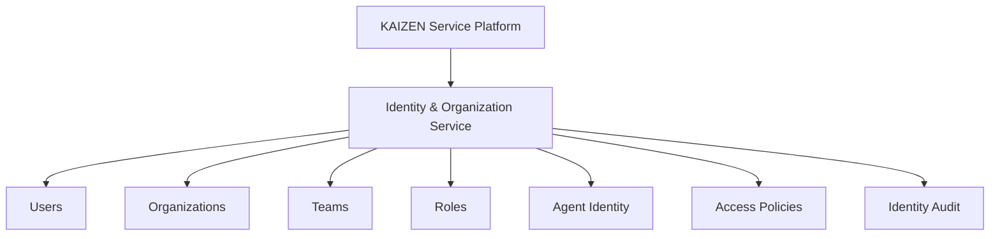

---

# 4. Modelo de Identidad KAIZEN

KAIZEN reconoce diferentes tipos de identidad:

```text id="m7x0qb"
Human Identity

AI Agent Identity

Service Identity

Device Identity

Organization Identity

External Identity
```

---

# 5. Identity Object

Toda identidad posee una estructura común.

Ejemplo:

```json id="d8m1wf"
{
"identity_id":

"user.roberto.001",

"type":

"HUMAN",

"status":

"ACTIVE",

"organization":

"company001",

"trust_level":

"HIGH"
}
```

---

# 6. Arquitectura del Servicio

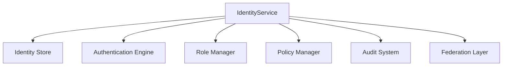

---

# 7. Human Identity Management

Gestiona usuarios humanos.

Información:

* Nombre.
* Perfil.
* Organización.
* Roles.
* Preferencias.
* Seguridad.

---

Ejemplo:

```json id="q5s9dk"
{
"user":

"juan@example",

"organization":

"Acme",

"role":

"Administrator"
}
```

---

# 8. Organization Model

KAIZEN organiza entidades jerárquicamente.

Modelo:

```text id="0cgf8w"
Platform

 └── Organization

      └── Department

           └── Team

                └── User
```

---

# 9. Organization Entity

Ejemplo:

```json id="k0m7z9"
{
"organization_id":

"org001",

"name":

"Enterprise Company",

"type":

"BUSINESS",

"status":

"ACTIVE"
}
```

---

# 10. Multi-Level Organizations

KAIZEN soporta:

* Empresas.
* Filiales.
* Áreas.
* Departamentos.
* Equipos.

Ejemplo:

```text id="b5u7x3"
Corporation

├── Colombia

│    ├── Legal

│    └── Finance

│

└── Mexico

     ├── Sales

     └── Operations

```

---

# 11. Team Management

Los equipos agrupan identidades.

Ejemplo:

```text id="5v7n0k"
AI Research Team

Members:

- User A

- Agent B

- Service C
```

---

# 12. Role Management

Los roles definen capacidades.

Ejemplos:

```text id="7m0c4h"
Platform Owner

Administrator

Developer

Manager

Analyst

AI Operator

Viewer
```

---

# 13. Role Object

```json id="h7q1a9"
{
"role_id":

"developer",

"permissions":

[
"create_service",
"deploy_agent"
]
}
```

---

# 14. Permission Model

KAIZEN utiliza permisos granulares.

Formato:

```text id="z9j4kp"
ACTION

+

RESOURCE

+

CONTEXT
```

Ejemplo:

```text id="8j2xv1"
CREATE

Agent

Production Environment
```

---

# 15. Agent Identity Management

Los agentes IA también tienen identidad.

Ejemplo:

```json id="q9x2bv"
{
"agent_id":

"legal.agent.001",

"owner":

"legal.department",

"trust":

"HIGH",

"version":

"2.1"
}
```

---

# 16. Service Identity

Los servicios internos poseen identidad propia.

Ejemplo:

```text id="q3m6sd"
Billing Service

Identity:

service.billing

Trust:

SYSTEM
```

---

# 17. Authentication Methods

KAIZEN soporta:

* Passwordless.
* MFA.
* OAuth.
* SSO.
* Certificados.
* Tokens.
* Identidad federada.

---

# 18. Enterprise Federation

Integración con:

* Active Directory.
* LDAP.
* SAML.
* OAuth providers.

Modelo:

```text id="9w1kp2"
Enterprise Identity

↓

KAIZEN Federation

↓

KAIZEN Identity
```

---

# 19. Identity Lifecycle

Cada identidad sigue un ciclo:

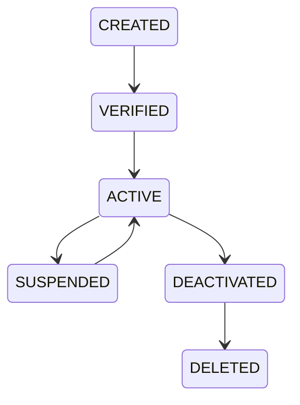

---

# 20. Identity Trust System

KAIZEN asigna confianza.

Ejemplo:

| Nivel    | Uso                 |
| -------- | ------------------- |
| UNKNOWN  | Sin validar         |
| BASIC    | Usuario normal      |
| VERIFIED | Usuario validado    |
| TRUSTED  | Entidad empresarial |
| SYSTEM   | Núcleo KAIZEN       |

---

# 21. Access Decision Flow

Cada acción:

```text id="m8q2zx"
Request

↓

Identify Actor

↓

Validate Organization

↓

Check Role

↓

Evaluate Policy

↓

Allow / Deny

↓

Audit
```

---

# 22. Identity Audit

Registra:

* Inicio sesión.
* Cambios.
* Permisos.
* Acciones críticas.

Ejemplo:

```json id="p4z8vx"
{
"actor":

"admin",

"action":

"CREATE_ROLE",

"time":

"10:30"
}
```

---

# 23. Identity Security

Protección:

* Detección anomalías.
* Bloqueo automático.
* Rotación credenciales.
* Sesiones seguras.

---

# 24. Delegation System

Permite delegar responsabilidades.

Ejemplo:

Administrador:

```text id="x5q9kf"
Delegar:

Gestionar agentes IA

A:

Manager Legal
```

---

# 25. Identity API Conceptual

Crear usuario:

```typescript id="s4z7nm"
Identity.create({

type:

"HUMAN",

organization:

"org001"

})
```

---

Crear organización:

```typescript id="w2n8cv"
Organization.create({

name:

"Enterprise"

})
```

---

Asignar rol:

```typescript id="v5p1cx"
Identity.assignRole({

user:

"user001",

role:

"admin"

})
```

---

# 26. Métricas del Identity Service

Debe medir:

```text id="k6p8qx"
active_users

organizations

authentication_rate

failed_logins

role_changes

identity_events

federation_requests

```

---

# 27. Principios Arquitectónicos

El Identity Service KAIZEN debe ser:

## Universal

Una identidad para todo el ecosistema.

## Seguro

Protección permanente.

## Flexible

Humanos y agentes IA.

## Empresarial

Preparado para grandes organizaciones.

## Auditable

Cada cambio registrado.

## Escalable

Millones de identidades.

---

# 28. Resultado del Documento

Con KSP-0003 queda definido:

✅ Identidad universal KAIZEN
✅ Gestión de usuarios
✅ Organizaciones
✅ Equipos
✅ Roles
✅ Permisos
✅ Identidad de agentes IA
✅ Identidad de servicios
✅ Federación empresarial
✅ Ciclo de vida
✅ Auditoría
✅ Gobierno organizacional

---

# Estado actualizado Serie KSP

| Documento                                    | Estado      |
| -------------------------------------------- | ----------- |
| KSP-0001 Service Platform Architecture       | ✅ Completo  |
| KSP-0002 API Gateway & Service Mesh          | ✅ Completo  |
| **KSP-0003 Identity & Organization Service** | ✅ Completo  |
| KSP-0004 Tenant Management Service           | ⏳ Siguiente |
| KSP-0005 Agent Marketplace Service           | Pendiente   |
| KSP-0006 Model Registry Service              | Pendiente   |
| KSP-0007 Knowledge Platform Service          | Pendiente   |
| KSP-0008 Developer Platform                  | Pendiente   |
| KSP-0009 Billing & Subscription Service      | Pendiente   |
| KSP-0010 Extension Framework                 | Pendiente   |

---

# Siguiente documento oficial:

# KSP-0004 — Tenant Management Service

Definirá la arquitectura multi-tenant nativa de KAIZEN:

* aislamiento empresarial,
* organizaciones SaaS,
* planes,
* límites,
* recursos por tenant,
* configuración independiente,
* seguridad de datos,
* escalamiento multiempresa,
* administración global de clientes.


# KSP-0004 — Tenant Management Service

# KAIZEN Service Platform (KSP)

## Sistema Nativo de Multi-Tenancy, Aislamiento Empresarial y Gobierno de Clientes

**Estado:** ⏳ En desarrollo
**Dependencias:**

✅ KDL — KAIZEN Definition Language
✅ KCF — KAIZEN Compiler Framework
✅ KRE — KAIZEN Runtime Environment
✅ KSP-0001 Service Platform Architecture
✅ KSP-0002 API Gateway & Service Mesh
✅ KSP-0003 Identity & Organization Service

**Siguiente documento:** KSP-0005 Agent Marketplace Service
**Capa:** Multi-Tenant Infrastructure & SaaS Governance Layer
**Clasificación:** Servicio Núcleo KAIZEN

---

# 1. Propósito del Tenant Management Service

El **Tenant Management Service** define la arquitectura multi-tenant de KAIZEN.

Su responsabilidad es administrar la separación lógica y operacional entre diferentes organizaciones que utilizan la plataforma.

Principio:

> Cada organización dentro de KAIZEN opera como un ecosistema independiente, seguro y configurable, compartiendo la plataforma sin compartir datos.

---

# 2. Concepto de Tenant en KAIZEN

Un **Tenant** representa un espacio aislado dentro de KAIZEN.

Puede representar:

* Empresa.
* Institución.
* Comunidad.
* Gobierno.
* Grupo empresarial.
* Cliente SaaS.

Ejemplo:

```text id="8j5p0d"
KAIZEN Platform

        |

--------------------------------

Tenant A

Empresa Manufacturera


Tenant B

Universidad


Tenant C

Gobierno

--------------------------------
```

---

# 3. Problema que Resuelve

Arquitecturas tradicionales:

```text id="r4q2bw"
Cliente A

Servidor A


Cliente B

Servidor B
```

Problemas:

* Alto costo.
* Duplicación.
* Difícil mantenimiento.

---

KAIZEN:

```text id="y7v3nx"
Una plataforma

        ↓

Múltiples tenants

        ↓

Aislamiento completo

        ↓

Operación independiente
```

---

# 4. Posición dentro de KAIZEN

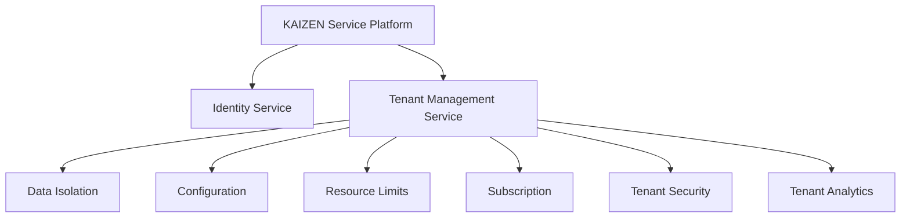

---

# 5. Arquitectura General

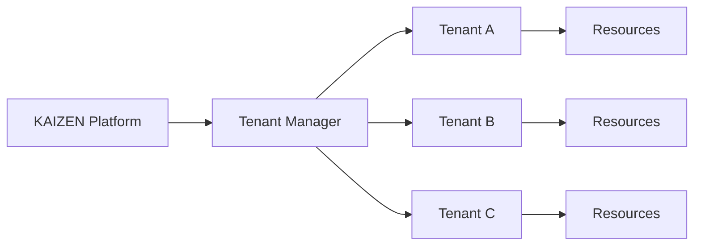

---

# 6. Tenant Object

Cada tenant posee una identidad propia.

Ejemplo:

```json id="9x2m5v"
{
"tenant_id":

"tenant.company001",

"name":

"Enterprise Corp",

"type":

"BUSINESS",

"status":

"ACTIVE",

"plan":

"ENTERPRISE"
}
```

---

# 7. Tenant Lifecycle

Un tenant tiene estados:

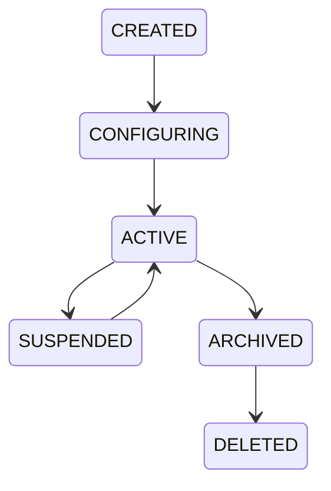

---

# 8. Tenant Creation Workflow

Proceso:

```text id="w7c1qp"
Create Tenant

↓

Validate Organization

↓

Assign Plan

↓

Create Isolation Boundary

↓

Initialize Services

↓

Activate Tenant
```

---

# 9. Tenant Isolation Model

KAIZEN soporta aislamiento por capas:

```text id="j4m8sx"
Application Isolation

↓

Service Isolation

↓

Data Isolation

↓

Resource Isolation

↓

Security Isolation
```

---

# 10. Data Isolation

Los datos de cada tenant están separados.

Modelo:

```text id="n8q4yt"
Tenant A

Users

Documents

Agents

Workflows


≠


Tenant B

Users

Documents

Agents

Workflows
```

---

# 11. Tenant Context

Toda solicitud contiene contexto.

Ejemplo:

```json id="k7v2pz"
{
"tenant_id":

"company001",

"user":

"user01",

"request":

"create_agent"
}
```

---

# 12. Tenant Resolver

Componente encargado de identificar:

* De qué tenant viene la solicitud.
* Qué configuración aplicar.
* Qué límites utilizar.

Flujo:

```text id="q1m6xc"
Request

↓

Tenant Resolver

↓

Load Tenant Context

↓

Execute
```

---

# 13. Tenant Configuration

Cada tenant puede personalizar:

* Nombre.
* Branding.
* Idioma.
* Servicios activos.
* Integraciones.
* Políticas.

Ejemplo:

```json id="h6w0zk"
{
"tenant":

"company001",

"settings":

{

"language":"es",

"ai_enabled":true,

"branding":"custom"

}

}
```

---

# 14. Tenant Resource Management

Integración con:

KRE-0008 Resource Management.

Cada tenant posee:

* CPU.
* Memoria.
* Storage.
* GPU.
* Límites.

Ejemplo:

```yaml id="q9s4mn"
tenant:

enterprise001:

resources:

cpu:500

gpu:10

storage:"50TB"
```

---

# 15. Tenant Quotas

Controla consumo.

Ejemplo:

```text id="r8d5hy"
Basic Plan

100 agentes

10GB storage


Enterprise Plan

10000 agentes

100TB storage
```

---

# 16. Tenant Security Boundary

Cada tenant posee:

* Políticas propias.
* Roles propios.
* Auditoría propia.
* Claves propias.

---

Modelo:

```text id="b2x7mq"
Tenant Security Context

        |

Identity

        |

Permissions

        |

Resources
```

---

# 17. Tenant Service Activation

Los servicios pueden activarse por tenant.

Ejemplo:

Tenant A:

```text id="v9z3ps"
AI Agents

Knowledge Platform

Analytics
```

Tenant B:

```text id="m0q8cx"
Documents

Workflow
```

---

# 18. Tenant Feature Flags

Permite activar funcionalidades.

Ejemplo:

```yaml id="x2f7qa"
features:

advanced_ai:

enabled:true


marketplace:

enabled:false
```

---

# 19. Tenant Migration

KAIZEN permite migrar tenants.

Casos:

* Cambio de región.
* Upgrade.
* Separación empresarial.

Proceso:

```text id="p7k5cd"
Export

↓

Validate

↓

Transfer

↓

Restore

↓

Activate
```

---

# 20. Tenant Backup & Recovery

Protege:

* Datos.
* Configuración.
* Estados.
* Workflows.
* Agentes.

---

Modelo:

```text id="h5v8nq"
Tenant Snapshot

+

Backup Storage

=

Recovery Point
```

---

# 21. Tenant Analytics

Cada tenant tiene métricas:

```text id="z1c9mv"
Users

Executions

Agents

Storage

Costs

Performance
```

---

# 22. Tenant Billing Integration

Integración con:

KSP-0009 Billing Service.

Controla:

* Plan.
* Consumo.
* Facturación.
* Límites.

---

# 23. Tenant API Conceptual

Crear tenant:

```typescript id="g6p2rv"
Tenant.create({

name:

"Company"

})
```

---

Obtener contexto:

```typescript id="s5q8km"
Tenant.resolve({

request:

"REQ001"

})
```

---

Actualizar límites:

```typescript id="m9x3jt"
Tenant.updateQuota({

tenant:

"company001",

storage:

"20TB"

})
```

---

# 24. Métricas del Tenant Service

Debe medir:

```text id="c8v4sz"
active_tenants

tenant_growth

resource_usage

quota_usage

tenant_health

migration_events

```

---

# 25. Principios Arquitectónicos

El Tenant Management Service debe ser:

## Aislado

Datos separados.

## Escalable

Millones de tenants.

## Seguro

Sin cruces de información.

## Flexible

Planes y configuraciones.

## Automatizado

Provisionamiento inteligente.

## Empresarial

Preparado para SaaS global.

---

# 26. Resultado del Documento

Con KSP-0004 queda definido:

✅ Arquitectura multi-tenant
✅ Aislamiento empresarial
✅ Tenant lifecycle
✅ Tenant context
✅ Configuración independiente
✅ Límites de recursos
✅ Seguridad por tenant
✅ Activación de servicios
✅ Migración
✅ Backup y recuperación
✅ Integración SaaS

---

# Estado actualizado Serie KSP

| Documento                                | Estado      |
| ---------------------------------------- | ----------- |
| KSP-0001 Service Platform Architecture   | ✅ Completo  |
| KSP-0002 API Gateway & Service Mesh      | ✅ Completo  |
| KSP-0003 Identity & Organization Service | ✅ Completo  |
| **KSP-0004 Tenant Management Service**   | ✅ Completo  |
| KSP-0005 Agent Marketplace Service       | ⏳ Siguiente |
| KSP-0006 Model Registry Service          | Pendiente   |
| KSP-0007 Knowledge Platform Service      | Pendiente   |
| KSP-0008 Developer Platform              | Pendiente   |
| KSP-0009 Billing & Subscription Service  | Pendiente   |
| KSP-0010 Extension Framework             | Pendiente   |

---

# Siguiente documento oficial:

# KSP-0005 — Agent Marketplace Service

Definirá el ecosistema de distribución de inteligencia KAIZEN:

* marketplace de agentes IA,
* publicación de agentes,
* instalación,
* versiones,
* certificación,
* reputación,
* monetización,
* permisos,
* seguridad,
* ciclo de vida de agentes,
* economía de desarrolladores KAIZEN.


# KSP-0005 — Agent Marketplace Service

# KAIZEN Service Platform (KSP)

## Ecosistema de Distribución, Certificación y Economía de Agentes Inteligentes

**Estado:** ⏳ En desarrollo
**Dependencias:**

✅ KDL — KAIZEN Definition Language
✅ KCF — KAIZEN Compiler Framework
✅ KRE — KAIZEN Runtime Environment
✅ KSP-0001 Service Platform Architecture
✅ KSP-0002 API Gateway & Service Mesh
✅ KSP-0003 Identity & Organization Service
✅ KSP-0004 Tenant Management Service

**Siguiente documento:** KSP-0006 Model Registry Service
**Capa:** AI Agent Ecosystem & Distribution Layer
**Clasificación:** Servicio Estratégico KAIZEN

---

# 1. Propósito del Agent Marketplace Service

El **Agent Marketplace Service** es el ecosistema oficial para crear, publicar, descubrir, instalar, administrar y monetizar agentes inteligentes dentro de KAIZEN.

Su objetivo es convertir los agentes IA en componentes reutilizables y distribuidos.

Principio:

> Un agente KAIZEN no es solamente un programa; es una capacidad inteligente certificada que puede ser compartida, instalada y evolucionada.

---

# 2. Visión del Marketplace

KAIZEN crea una economía de inteligencia:

```text id="6t7xkq"
Developer

↓

Construye Agent

↓

Certifica

↓

Marketplace

↓

Empresas Instalan

↓

Agent Evoluciona

↓

Developer Recibe Valor
```

---

# 3. Problema que Resuelve

Modelo tradicional:

```text id="c4m7hz"
Cada empresa crea sus propios agentes

↓

Duplicación de esfuerzo

↓

Poca reutilización

↓

Difícil mantenimiento
```

---

Modelo KAIZEN:

```text id="m2x8pq"
Un agente creado una vez

↓

Disponible globalmente

↓

Adaptable por organización

↓

Gobernado por políticas
```

---

# 4. Posición dentro de KAIZEN

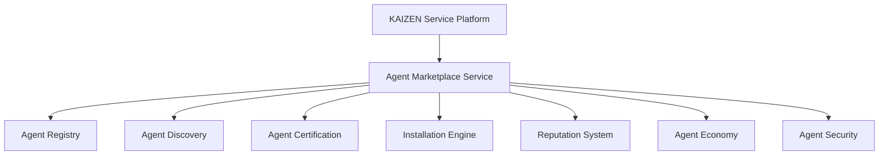

---

# 5. Arquitectura General

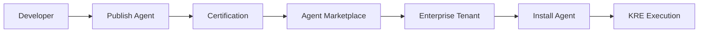

---

# 6. Agent Package Definition

Un agente KAIZEN se distribuye como paquete.

Incluye:

```text id="p8d2km"
Agent Definition

↓

Skills

↓

Tools

↓

Permissions

↓

Memory Configuration

↓

Model Requirements

↓

Version

↓

Documentation
```

---

# 7. Agent Manifest

Cada agente posee un manifiesto.

Ejemplo:

```json id="x9m3qa"
{
"agent_id":

"legal.contract.agent",

"name":

"Contract Analyzer",

"version":

"1.0",

"category":

"Legal",

"trust_level":

"CERTIFIED"
}
```

---

# 8. Agent Registry

Catálogo central de agentes.

Almacena:

* Identidad.
* Versión.
* Autor.
* Capacidades.
* Requisitos.
* Certificación.

---

Ejemplo:

```text id="a7f5nv"
Agent Registry

├── Finance Agents

├── Legal Agents

├── Marketing Agents

├── Healthcare Agents

└── Enterprise Agents
```

---

# 9. Agent Discovery Engine

Permite encontrar agentes.

Búsqueda por:

* Nombre.
* Categoría.
* Industria.
* Capacidad.
* Idioma.
* Reputación.

---

Ejemplo:

Usuario:

```text id="m4x8cy"
"Necesito analizar contratos"
```

Marketplace:

```text id="v7q2pz"
Encuentra:

Contract Intelligence Agent
```

---

# 10. Agent Categories

KAIZEN organiza agentes:

## Business

* Finanzas.
* ERP.
* CRM.
* Ventas.

## Professional

* Legal.
* Medicina.
* Ingeniería.

## Productivity

* Asistentes.
* Automatización.

## Data & Analytics

* BI.
* Predicción.

## Creative

* Diseño.
* Contenido.

---

# 11. Agent Certification System

No todos los agentes tienen el mismo nivel.

Niveles:

| Nivel                | Estado            |
| -------------------- | ----------------- |
| Community            | Sin validar       |
| Verified             | Revisado          |
| Certified            | Cumple estándar   |
| Enterprise Certified | Nivel corporativo |
| KAIZEN Native        | Oficial           |

---

# 12. Agent Validation Pipeline

Proceso:

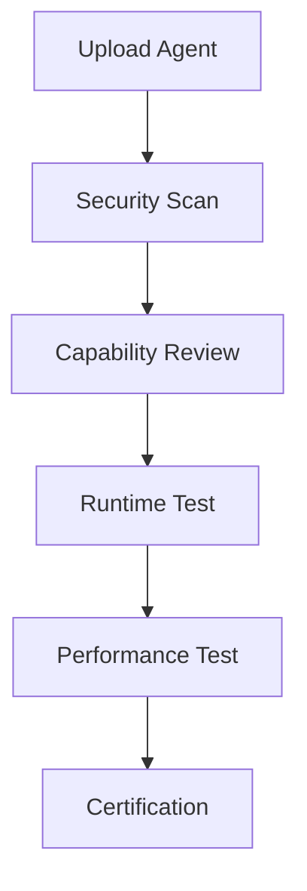

---

# 13. Agent Security Review

Evalúa:

* Permisos.
* Herramientas.
* Acceso datos.
* Código.
* Comportamiento.

---

Bloquea:

❌ Acciones no autorizadas.
❌ Acceso excesivo.
❌ Comportamiento peligroso.

---

# 14. Agent Installation Engine

Instala agentes en tenants.

Proceso:

```text id="q9c5nv"
Select Agent

↓

Review Permissions

↓

Approve Installation

↓

Deploy Runtime

↓

Activate Agent
```

---

# 15. Agent Configuration

Cada empresa puede personalizar:

* Idioma.
* Modelo IA.
* Datos.
* Herramientas.
* Límites.

Ejemplo:

```json id="g7v3mx"
{
"agent":

"SalesAgent",

"tenant":

"company001",

"model":

"enterprise-model",

"permissions":

"restricted"
}
```

---

# 16. Agent Version Management

Los agentes evolucionan.

Soporta:

* Versiones.
* Actualizaciones.
* Rollback.
* Compatibilidad.

Ejemplo:

```text id="z5w8py"
Agent v1.0

↓

Agent v1.1

↓

Agent v2.0
```

---

# 17. Agent Dependency Management

Un agente puede depender de:

* Modelos.
* APIs.
* Herramientas.
* Otros agentes.

Ejemplo:

```text id="h3m7qz"
Financial Agent

Necesita:

├── OCR Service

├── Banking API

└── Risk Agent
```

---

# 18. Agent Reputation System

Evalúa:

* Calificaciones.
* Uso.
* Rendimiento.
* Seguridad.
* Satisfacción.

Ejemplo:

```text id="r6x2mq"
Agent Score:

4.8 / 5

10.000 instalaciones

99.5% uptime
```

---

# 19. Agent Analytics

Métricas:

```text id="k8z1ws"
Downloads

Active Users

Executions

Success Rate

Revenue

Errors
```

---

# 20. Agent Monetization

KAIZEN permite economía de agentes.

Modelos:

## Free

Agentes gratuitos.

## Subscription

Pago mensual.

## Usage Based

Pago por ejecución.

## Enterprise License

Licencias corporativas.

---

# 21. Revenue Sharing

Ejemplo:

```text id="x5v9nb"
Enterprise compra Agent

↓

Marketplace procesa pago

↓

Developer recibe porcentaje

↓

KAIZEN Platform recibe comisión
```

---

# 22. Agent Governance

Controla:

* Propietario.
* Licencia.
* Uso permitido.
* Restricciones.
* Auditoría.

---

# 23. Agent API Conceptual

Publicar agente:

```typescript id="c7m2vx"
Marketplace.publish({

agent:

"MarketingAgent",

version:

"1.0"

})
```

---

Buscar agente:

```typescript id="f8n4qd"
Marketplace.search({

category:

"Finance"

})
```

---

Instalar:

```typescript id="p2k7mz"
Marketplace.install({

agent:

"RiskAgent",

tenant:

"company001"

})
```

---

# 24. Integración con KRE

Cuando un agente es instalado:

```text id="b8x5kc"
Marketplace

↓

Tenant Service

↓

Security Runtime

↓

Agent Runtime

↓

Execution
```

---

# 25. Integración con Model Registry

Los agentes pueden requerir:

* Modelos específicos.
* Embeddings.
* Fine-tuned models.

Integración:

KSP-0006.

---

# 26. Principios Arquitectónicos

El Agent Marketplace debe ser:

## Seguro

Agentes certificados.

## Abierto

Cualquier desarrollador puede participar.

## Escalable

Millones de agentes.

## Comercial

Economía sostenible.

## Gobernado

IA bajo control.

## Interoperable

Agentes reutilizables.

---

# 27. Resultado del Documento

Con KSP-0005 queda definido:

✅ Marketplace oficial de agentes IA
✅ Registro de agentes
✅ Publicación
✅ Instalación
✅ Certificación
✅ Seguridad
✅ Versionamiento
✅ Reputación
✅ Monetización
✅ Economía de desarrolladores
✅ Gobierno de agentes

---

# Estado actualizado Serie KSP

| Documento                                | Estado      |
| ---------------------------------------- | ----------- |
| KSP-0001 Service Platform Architecture   | ✅ Completo  |
| KSP-0002 API Gateway & Service Mesh      | ✅ Completo  |
| KSP-0003 Identity & Organization Service | ✅ Completo  |
| KSP-0004 Tenant Management Service       | ✅ Completo  |
| **KSP-0005 Agent Marketplace Service**   | ✅ Completo  |
| KSP-0006 Model Registry Service          | ⏳ Siguiente |
| KSP-0007 Knowledge Platform Service      | Pendiente   |
| KSP-0008 Developer Platform              | Pendiente   |
| KSP-0009 Billing & Subscription Service  | Pendiente   |
| KSP-0010 Extension Framework             | Pendiente   |

---

# Siguiente documento oficial:

# KSP-0006 — Model Registry Service

Definirá el sistema central de inteligencia artificial KAIZEN:

* catálogo de modelos IA,
* gestión de versiones,
* modelos fundacionales,
* modelos especializados,
* fine-tuning,
* evaluación,
* despliegue,
* gobernanza,
* seguridad,
* ciclo de vida de modelos.


# KSP-0006 — Model Registry Service

# KAIZEN Service Platform (KSP)

## Sistema Central de Gestión, Gobernanza y Ciclo de Vida de Modelos de Inteligencia Artificial

**Estado:** ⏳ En desarrollo
**Dependencias:**

✅ KDL — KAIZEN Definition Language
✅ KCF — KAIZEN Compiler Framework
✅ KRE — KAIZEN Runtime Environment
✅ KSP-0001 Service Platform Architecture
✅ KSP-0002 API Gateway & Service Mesh
✅ KSP-0003 Identity & Organization Service
✅ KSP-0004 Tenant Management Service
✅ KSP-0005 Agent Marketplace Service

**Siguiente documento:** KSP-0007 Knowledge Platform Service
**Capa:** AI Infrastructure & Model Governance Layer
**Clasificación:** Servicio Estratégico de Inteligencia KAIZEN

---

# 1. Propósito del Model Registry Service

El **Model Registry Service** es el sistema central encargado de administrar todos los modelos de inteligencia artificial utilizados dentro del ecosistema KAIZEN.

Su función es controlar:

* Registro de modelos.
* Versionamiento.
* Evaluación.
* Seguridad.
* Despliegue.
* Disponibilidad.
* Compatibilidad.
* Gobernanza.

Principio:

> Todo modelo de inteligencia artificial dentro de KAIZEN debe ser identificado, evaluado, versionado y gobernado antes de participar en procesos inteligentes.

---

# 2. Visión del Model Registry

KAIZEN trata los modelos IA como activos empresariales.

Modelo tradicional:

```text
Modelo IA

↓

Archivo aislado

↓

Sin control
```

---

Modelo KAIZEN:

```text
Modelo IA

↓

Registro Central

↓

Evaluación

↓

Certificación

↓

Despliegue

↓

Monitoreo

↓

Evolución
```

---

# 3. Posición dentro de KAIZEN

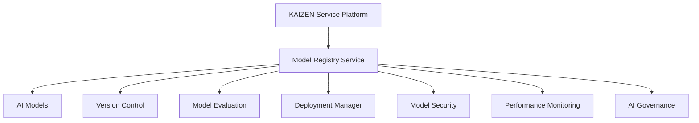

---

# 4. Arquitectura General

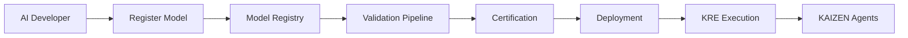

---

# 5. Tipos de Modelos KAIZEN

El Registry administra diferentes tipos:

---

## Foundation Models

Modelos generales:

* Lenguaje.
* Visión.
* Audio.
* Multimodales.

---

## Specialized Models

Modelos entrenados para:

* Finanzas.
* Medicina.
* Legal.
* Ingeniería.
* Industria.

---

## Enterprise Models

Modelos privados:

* Datos internos.
* Información propietaria.
* Procesos corporativos.

---

## Agent Models

Modelos asociados a agentes específicos.

---

# 6. Model Entity

Cada modelo posee identidad propia.

Ejemplo:

```json id="v9q5mw"
{
"model_id":

"kaizen.legal.llm",

"name":

"Legal Intelligence Model",

"version":

"2.0",

"type":

"SPECIALIZED",

"status":

"CERTIFIED"
}
```

---

# 7. Model Manifest

Define características:

```json id="x5m2kd"
{
"name":

"Finance AI Model",

"provider":

"KAIZEN",

"context":

"128K",

"languages":

[
"es",
"en"
],

"capabilities":

[
"text",
"analysis"
]
}
```

---

# 8. Model Lifecycle

Un modelo sigue:

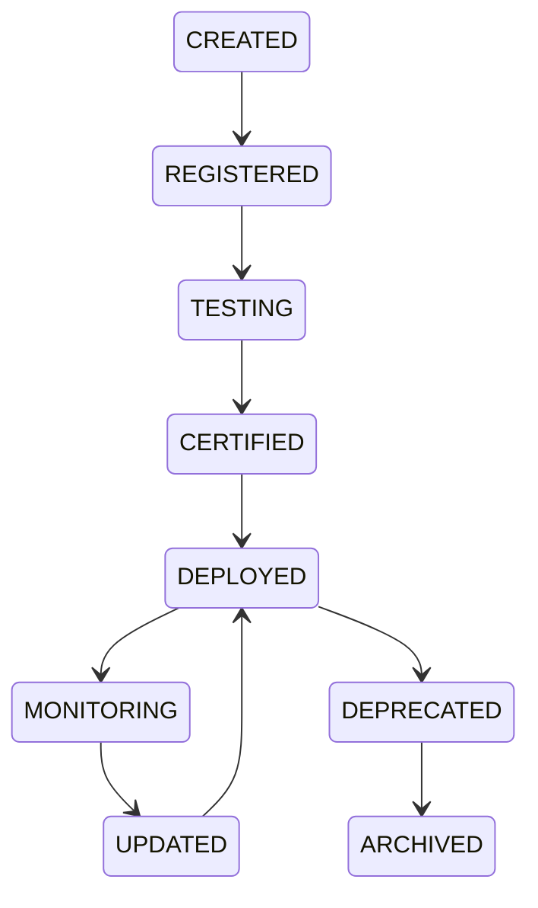

---

# 9. Model Registration

Proceso:

```text id="m4x7nv"
Upload Model

↓

Create Manifest

↓

Security Scan

↓

Performance Test

↓

Compatibility Check

↓

Register
```

---

# 10. Model Version Control

KAIZEN mantiene historial completo.

Ejemplo:

```text id="r8k2py"
Model

v1.0

↓

v1.1

↓

v2.0

↓

v3.0
```

---

Permite:

* Rollback.
* Comparación.
* Auditoría.
* Reproducción.

---

# 11. Model Evaluation Framework

Antes de aprobar un modelo:

Evalúa:

## Calidad

* Precisión.
* Consistencia.
* Comprensión.

## Seguridad

* Sesgos.
* Riesgos.
* Filtraciones.

## Rendimiento

* Latencia.
* Costos.
* Escalabilidad.

---

# 12. Model Benchmarking

Compara modelos.

Ejemplo:

```text id="z5v8mq"
Modelo A

Accuracy: 94%

Latency: 200ms


Modelo B

Accuracy: 97%

Latency: 400ms
```

---

# 13. Model Certification Levels

KAIZEN define:

| Nivel         | Estado      |
| ------------- | ----------- |
| Experimental  | Pruebas     |
| Verified      | Validado    |
| Certified     | Producción  |
| Enterprise    | Corporativo |
| KAIZEN Native | Oficial     |

---

# 14. Model Deployment Manager

Gestiona despliegues.

Tipos:

## Cloud

Infraestructura KAIZEN.

## Private

Servidor empresarial.

## Edge

Dispositivo local.

## Hybrid

Combinación.

---

# 15. Model Routing

Selecciona modelo adecuado.

Ejemplo:

Solicitud:

```text
Analizar contrato legal
```

Sistema:

```text
Consulta capacidades

↓

Selecciona Legal Model

↓

Ejecuta
```

---

# 16. Model Security

Protege:

* Pesos del modelo.
* Datos.
* Prompts.
* Configuración.

Incluye:

* Control acceso.
* Cifrado.
* Auditoría.

---

# 17. Model Access Control

Define:

Quién puede usar:

* Modelo.
* Versión.
* Capacidad.

Ejemplo:

```json id="j6w2xp"
{
"model":

"finance-ai",

"allowed":

[
"finance.department"
]
}
```

---

# 18. Model Cost Management

Controla:

* Tokens.
* GPU.
* Tiempo ejecución.
* Consumo.

Ejemplo:

```text id="k7p9mz"
Model Usage:

1.200.000 tokens

Cost:

$120 USD
```

---

# 19. Model Monitoring

Supervisa:

* Calidad.
* Drift.
* Errores.
* Rendimiento.

---

Detecta:

```text id="c5v8yn"
Modelo degradándose

↓

Reentrenamiento

↓

Nueva versión
```

---

# 20. Model Registry + Agent Marketplace

Relación:

```text id="n8m3qz"
Agent

↓

Requires Model

↓

Model Registry

↓

Deploy Model

↓

Execute Agent
```

---

# 21. Model Dependencies

Un modelo puede requerir:

* GPU.
* Embeddings.
* Vector Database.
* APIs.

Ejemplo:

```text id="p6x4kv"
Medical Agent

Needs:

├── Medical LLM

├── Vision Model

└── Knowledge Base
```

---

# 22. Model API Conceptual

Registrar modelo:

```typescript id="h2q7mx"
Model.register({

name:

"Enterprise LLM",

version:

"1.0"

})
```

---

Buscar modelo:

```typescript id="w7m5kp"
Model.search({

capability:

"reasoning"

})
```

---

Desplegar:

```typescript id="z9x3nv"
Model.deploy({

model:

"legal-ai",

environment:

"production"

})
```

---

# 23. Integración con KRE

Flujo:

```text id="b7m4qx"
Model Registry

↓

Deployment Manager

↓

KRE Runtime

↓

Agent Runtime

↓

Execution Engine
```

---

# 24. Métricas del Model Registry

Debe medir:

```text id="x8q1mz"
registered_models

active_models

model_usage

accuracy

latency

cost

failures

drift_events
```

---

# 25. Gobernanza de Modelos IA

KAIZEN controla:

* Propiedad.
* Licencia.
* Uso permitido.
* Datos utilizados.
* Versiones.
* Auditoría.

---

# 26. Principios Arquitectónicos

El Model Registry debe ser:

## Controlado

Cada modelo identificado.

## Seguro

Protección de inteligencia.

## Escalable

Miles de modelos.

## Auditable

Historial completo.

## Flexible

Modelos propios y externos.

## Inteligente

Optimización automática.

---

# 27. Resultado del Documento

Con KSP-0006 queda definido:

✅ Registro central de modelos IA
✅ Ciclo de vida completo
✅ Versionamiento
✅ Evaluación
✅ Certificación
✅ Despliegue
✅ Seguridad
✅ Monitoreo
✅ Gobernanza
✅ Integración con agentes KAIZEN

---

# Estado actualizado Serie KSP

| Documento                                | Estado      |
| ---------------------------------------- | ----------- |
| KSP-0001 Service Platform Architecture   | ✅ Completo  |
| KSP-0002 API Gateway & Service Mesh      | ✅ Completo  |
| KSP-0003 Identity & Organization Service | ✅ Completo  |
| KSP-0004 Tenant Management Service       | ✅ Completo  |
| KSP-0005 Agent Marketplace Service       | ✅ Completo  |
| **KSP-0006 Model Registry Service**      | ✅ Completo  |
| KSP-0007 Knowledge Platform Service      | ⏳ Siguiente |
| KSP-0008 Developer Platform              | Pendiente   |
| KSP-0009 Billing & Subscription Service  | Pendiente   |
| KSP-0010 Extension Framework             | Pendiente   |

---

# Siguiente documento oficial:

# KSP-0007 — Knowledge Platform Service

Definirá la capa de conocimiento universal KAIZEN:

* Knowledge Graph.
* RAG Platform.
* Vector Database.
* Memoria empresarial.
* Document Intelligence.
* Embeddings.
* Recuperación semántica.
* Gestión del conocimiento organizacional.
* Conexión entre datos, agentes y modelos IA.


# KSP-0007 — Knowledge Platform Service

# KAIZEN Service Platform (KSP)

## Plataforma Universal de Conocimiento, Memoria Empresarial e Inteligencia Semántica

**Estado:** ⏳ En desarrollo
**Dependencias:**

✅ KDL — KAIZEN Definition Language
✅ KCF — KAIZEN Compiler Framework
✅ KRE — KAIZEN Runtime Environment
✅ KSP-0001 Service Platform Architecture
✅ KSP-0002 API Gateway & Service Mesh
✅ KSP-0003 Identity & Organization Service
✅ KSP-0004 Tenant Management Service
✅ KSP-0005 Agent Marketplace Service
✅ KSP-0006 Model Registry Service

**Siguiente documento:** KSP-0008 Developer Platform
**Capa:** Knowledge & Semantic Intelligence Layer
**Clasificación:** Servicio Estratégico de Gestión del Conocimiento

---

# 1. Propósito del Knowledge Platform Service

El **Knowledge Platform Service (KPS)** proporciona la infraestructura de conocimiento del ecosistema KAIZEN.

Su misión es transformar información dispersa en conocimiento estructurado, consultable y reutilizable por personas, agentes, modelos IA y aplicaciones.

Principio:

> El conocimiento empresarial debe convertirse en un activo vivo, gobernado, verificable y reutilizable.

---

# 2. Visión General

KAIZEN distingue cuatro niveles:

```text
Datos

↓

Información

↓

Conocimiento

↓

Inteligencia
```

Los datos aislados no generan valor.

La plataforma convierte esos datos en conocimiento operativo.

---

# 3. Posición dentro del Ecosistema

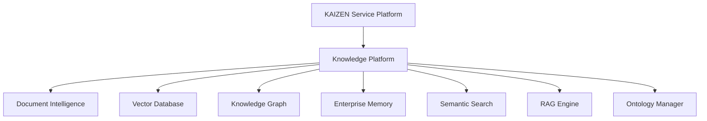

---

# 4. Arquitectura General

```mermaid
graph LR

Sources[Information Sources]

Sources --> Processing[Knowledge Processing]

Processing --> Embeddings

Processing --> Metadata

Processing --> Knowledge Graph

Processing --> Documents

Processing --> Memory

Memory --> Search

Search --> Agents

Search --> Applications

Search --> Models

```

---

# 5. Fuentes de Conocimiento

El KPS puede ingerir información desde:

* Documentos.
* Bases de datos.
* APIs.
* ERP.
* CRM.
* Correos electrónicos.
* Chats.
* Wikis.
* Manuales.
* Videos.
* Audio.
* Imágenes.
* Sensores IoT.
* Sistemas externos.

---

# 6. Pipeline de Ingesta

```text
Importar

↓

Validar

↓

Extraer contenido

↓

Normalizar

↓

Clasificar

↓

Generar metadatos

↓

Crear embeddings

↓

Actualizar grafo

↓

Disponible para búsqueda
```

---

# 7. Document Intelligence

Procesa documentos mediante:

* OCR.
* Reconocimiento de tablas.
* Formularios.
* Firmas.
* Entidades.
* Fechas.
* Relaciones.
* Clasificación automática.

---

# 8. Metadata Engine

Cada documento genera metadatos.

Ejemplo:

```json
{
"id":"contract001",

"type":"Legal Contract",

"language":"es",

"department":"Legal",

"tags":[
"cliente",
"contrato",
"confidencial"
]
}
```

---

# 9. Embedding Engine

Convierte contenido en representación semántica.

```text
Documento

↓

Chunking

↓

Embedding Model

↓

Vector

↓

Vector Database
```

---

# 10. Vector Database

Almacena representaciones semánticas.

Permite:

* Similaridad.
* Contexto.
* Recuperación.
* Búsqueda inteligente.

---

# 11. Knowledge Graph

El conocimiento se organiza mediante relaciones.

```mermaid
graph TD

Contract --> Client

Client --> Project

Project --> Invoice

Invoice --> Payment

Payment --> Bank

```

El grafo permite responder preguntas complejas.

---

# 12. Ontology Manager

Define conceptos oficiales.

Ejemplo:

```text
Empleado

↓

Pertenece

↓

Departamento

↓

Pertenece

↓

Organización
```

Todas las aplicaciones utilizan el mismo lenguaje conceptual.

---

# 13. Enterprise Memory

KAIZEN mantiene memoria permanente.

Tipos:

* Organizacional.
* Departamental.
* Equipo.
* Usuario.
* Agente.
* Workflow.

---

# 14. Memoria de Agentes

Cada agente puede recordar:

* Conversaciones.
* Decisiones.
* Preferencias.
* Contexto.
* Objetivos.
* Aprendizajes autorizados.

---

# 15. Context Builder

Antes de ejecutar un modelo IA:

```text
Pregunta

↓

Buscar conocimiento

↓

Recuperar documentos

↓

Recuperar memoria

↓

Construir contexto

↓

Enviar al modelo
```

---

# 16. Motor RAG

El motor RAG combina:

```text
Consulta

↓

Semantic Search

↓

Knowledge Graph

↓

Enterprise Memory

↓

Prompt Builder

↓

Modelo IA
```

---

# 17. Semantic Search

Permite buscar por significado.

Ejemplo:

Usuario:

```text
Contratos con cláusulas de confidencialidad
```

No busca palabras exactas.

Busca significado.

---

# 18. Hybrid Search

KAIZEN combina:

* Keyword Search.
* Semantic Search.
* Graph Traversal.
* Metadata Filters.

Resultado:

Mayor precisión.

---

# 19. Knowledge Governance

Todo conocimiento posee:

* Propietario.
* Nivel de confianza.
* Fuente.
* Fecha.
* Clasificación.
* Estado.

---

# 20. Clasificación del Conocimiento

Ejemplo:

| Nivel        | Uso               |
| ------------ | ----------------- |
| Público      | Libre             |
| Interno      | Organización      |
| Confidencial | Equipos           |
| Restringido  | Roles específicos |
| Secreto      | Alta dirección    |

---

# 21. Knowledge Lifecycle

```mermaid
stateDiagram-v2

CREATED --> VERIFIED

VERIFIED --> ACTIVE

ACTIVE --> UPDATED

UPDATED --> ACTIVE

ACTIVE --> ARCHIVED

ARCHIVED --> DELETED
```

---

# 22. Calidad del Conocimiento

El sistema evalúa:

* Precisión.
* Actualidad.
* Cobertura.
* Consistencia.
* Confiabilidad.

---

# 23. Conflict Resolution

Cuando existen documentos contradictorios:

```text
Documento A

↓

Documento B

↓

Motor de Conflictos

↓

Resolver

↓

Registrar decisión
```

---

# 24. Knowledge API Conceptual

Registrar documento:

```typescript
Knowledge.register({

document:

"contract.pdf"

})
```

Buscar:

```typescript
Knowledge.search({

query:

"ISO 45001"

})
```

Consultar grafo:

```typescript
Knowledge.graph({

entity:

"Proveedor"

})
```

---

# 25. Integración con Model Registry

```text
Modelo IA

↓

Knowledge Platform

↓

Contexto enriquecido

↓

Inferencia
```

---

# 26. Integración con Agent Marketplace

Los agentes utilizan:

* Memoria.
* Grafo.
* Documentos.
* RAG.
* Embeddings.

Todo proviene del KPS.

---

# 27. Integración con Runtime

```text
Workflow

↓

Agent Runtime

↓

Knowledge Platform

↓

Context Builder

↓

Modelo IA

↓

Resultado
```

---

# 28. Métricas

```text
documents

knowledge_nodes

relationships

embeddings

queries

semantic_hits

rag_requests

memory_usage

graph_size
```

---

# 29. Principios Arquitectónicos

La plataforma debe ser:

## Semántica

Comprende significado.

## Persistente

Conocimiento permanente.

## Gobernada

Información controlada.

## Distribuida

Escalable horizontalmente.

## Segura

Respeta permisos.

## Inteligente

Optimiza contexto automáticamente.

---

# 30. Resultado del Documento

Con KSP-0007 queda definido:

✅ Plataforma universal de conocimiento

✅ Enterprise Memory

✅ Knowledge Graph

✅ Vector Database

✅ Embedding Engine

✅ Semantic Search

✅ Hybrid Search

✅ Motor RAG

✅ Ontologías

✅ Gobernanza del conocimiento

✅ Integración con modelos y agentes

---

# Estado actualizado Serie KSP

| Documento                                | Estado      |
| ---------------------------------------- | ----------- |
| KSP-0001 Service Platform Architecture   | ✅ Completo  |
| KSP-0002 API Gateway & Service Mesh      | ✅ Completo  |
| KSP-0003 Identity & Organization Service | ✅ Completo  |
| KSP-0004 Tenant Management Service       | ✅ Completo  |
| KSP-0005 Agent Marketplace Service       | ✅ Completo  |
| KSP-0006 Model Registry Service          | ✅ Completo  |
| **KSP-0007 Knowledge Platform Service**  | ✅ Completo  |
| KSP-0008 Developer Platform              | ⏳ Siguiente |
| KSP-0009 Billing & Subscription Service  | Pendiente   |
| KSP-0010 Extension Framework             | Pendiente   |

---

# Próximo documento oficial

## **KSP-0008 — Developer Platform**

Este documento definirá el ecosistema completo para desarrolladores de KAIZEN, incluyendo:

* SDKs oficiales (TypeScript, Python, Go, Java, .NET y Rust).
* CLI unificada (`kaizen`).
* Framework para creación de agentes.
* Framework para creación de servicios.
* Framework para plugins y extensiones.
* APIs públicas y privadas.
* Portal para desarrolladores.
* Sandboxes y entornos de pruebas.
* Gestión de paquetes y dependencias.
* Dev Containers.
* Plantillas oficiales.
* Testing Kit.
* Emuladores locales.
* CI/CD nativo.
* Publicación automática en el Marketplace.
* Herramientas de documentación y generación automática de SDKs.
* Integración con KDL, KCF, KRE y todos los servicios KSP.

Este documento convertirá a KAIZEN en una plataforma de desarrollo completa, comparable en alcance a los ecosistemas de Kubernetes, AWS, Azure o Flutter, pero orientada al desarrollo de software inteligente y agentes de IA.


# KSP-0008 — Developer Platform

# KAIZEN Service Platform (KSP)

## Plataforma Integral para Desarrolladores, SDKs, Herramientas y Ecosistema de Extensión

**Estado:** ⏳ En desarrollo
**Dependencias:**

✅ KDL — KAIZEN Definition Language
✅ KCF — KAIZEN Compiler Framework
✅ KRE — KAIZEN Runtime Environment
✅ KSP-0001 Service Platform Architecture
✅ KSP-0002 API Gateway & Service Mesh
✅ KSP-0003 Identity & Organization Service
✅ KSP-0004 Tenant Management Service
✅ KSP-0005 Agent Marketplace Service
✅ KSP-0006 Model Registry Service
✅ KSP-0007 Knowledge Platform Service

**Siguiente documento:** KSP-0009 Billing & Subscription Service
**Capa:** Developer Experience (DX) & Platform Engineering Layer
**Clasificación:** Servicio Estratégico para el Ecosistema de Desarrollo

---

# 1. Propósito del Developer Platform

La **Developer Platform (KDP)** proporciona todas las herramientas necesarias para construir, probar, desplegar, publicar y mantener aplicaciones inteligentes sobre KAIZEN.

Su objetivo es ofrecer una experiencia unificada para desarrolladores individuales, equipos empresariales e ISVs (Independent Software Vendors).

Principio:

> Desarrollar sobre KAIZEN debe ser consistente, automatizado, reproducible y productivo desde el primer comando.

---

# 2. Visión General

```text
Developer

↓

CLI

↓

SDK

↓

Framework

↓

Testing

↓

Build

↓

Deploy

↓

Marketplace

↓

Production
```

---

# 3. Arquitectura General

```mermaid
graph TD

Developer --> CLI

CLI --> SDK

SDK --> Frameworks

Frameworks --> Runtime

Runtime --> Marketplace

Runtime --> Cloud

Runtime --> Enterprise

```

---

# 4. Componentes de la Plataforma

La plataforma incluye:

* CLI oficial.
* SDKs.
* APIs.
* Frameworks.
* Templates.
* Dev Containers.
* Local Runtime.
* Emulator.
* Testing Framework.
* CI/CD.
* Documentation Portal.
* Package Registry.

---

# 5. KAIZEN CLI

Comando oficial:

```bash
kaizen
```

Ejemplos:

```bash
kaizen new app

kaizen new agent

kaizen new service

kaizen build

kaizen run

kaizen deploy

kaizen publish

kaizen test
```

---

# 6. Estructura de Proyecto

```text
project/

├── kaizen.yaml

├── src/

├── agents/

├── workflows/

├── services/

├── knowledge/

├── models/

├── tests/

├── docs/

└── deployment/
```

---

# 7. SDKs Oficiales

KAIZEN mantiene SDKs para:

| Lenguaje   | Estado  |
| ---------- | ------- |
| TypeScript | Oficial |
| JavaScript | Oficial |
| Python     | Oficial |
| Go         | Oficial |
| Java       | Oficial |
| .NET       | Oficial |
| Rust       | Oficial |
| Kotlin     | Oficial |
| Swift      | Oficial |

Todos siguen la misma especificación.

---

# 8. Framework para Agentes

Crear un agente:

```typescript
export class FinanceAgent extends Agent {

execute(){

return this.reply();

}

}
```

---

# 9. Framework para Servicios

Crear servicio:

```typescript
export class BillingService extends Service {

execute(){

}

}
```

---

# 10. Framework para Workflows

```typescript
workflow("Approval")

.start()

.task("Validate")

.task("Review")

.task("Approve")

.end()
```

---

# 11. Plantillas Oficiales

El CLI incluye plantillas:

```text
Enterprise SaaS

CRM

ERP

Document Management

AI Assistant

Workflow Engine

Knowledge Platform

Analytics

Marketplace App

API Service
```

---

# 12. Dev Containers

Cada proyecto puede ejecutarse de forma idéntica.

Incluye:

* Runtime.
* SDK.
* CLI.
* Dependencias.
* Herramientas.

---

# 13. Emulador Local

KAIZEN permite ejecutar localmente:

```text
Runtime

↓

API Gateway

↓

Knowledge

↓

Identity

↓

Marketplace

↓

Storage
```

Sin depender de infraestructura externa.

---

# 14. Testing Framework

Tipos de pruebas:

* Unitarias.
* Integración.
* Agentes.
* Workflows.
* Eventos.
* Seguridad.
* Rendimiento.

---

Ejemplo:

```bash
kaizen test
```

---

# 15. Debugger Inteligente

Permite inspeccionar:

* Agentes.
* Eventos.
* Estado.
* Memoria.
* Workflows.
* Modelos IA.

---

# 16. Hot Reload

Cambios automáticos:

```text
Guardar archivo

↓

Compilar

↓

Actualizar Runtime

↓

Continuar ejecución
```

---

# 17. Package Registry

Repositorio oficial:

```text
KAIZEN Registry

↓

Packages

↓

Plugins

↓

Libraries

↓

Templates

↓

SDKs
```

---

# 18. Dependency Management

Archivo:

```yaml
dependencies:

knowledge:

1.2

billing:

2.0

analytics:

3.1
```

---

# 19. API Generator

Genera automáticamente:

* REST.
* GraphQL.
* gRPC.
* SDK Cliente.
* OpenAPI.

---

# 20. Documentation Generator

Desde el código genera:

* API Docs.
* Diagramas.
* Ejemplos.
* Referencia.

---

# 21. CI/CD Integrado

Pipeline:

```text
Commit

↓

Build

↓

Tests

↓

Security Scan

↓

Deploy

↓

Marketplace
```

---

# 22. Seguridad del Desarrollo

Todo proyecto incluye:

* Secret Scanner.
* Dependency Scanner.
* Vulnerability Scanner.
* Policy Validator.

---

# 23. Publicación

Comando:

```bash
kaizen publish
```

Proceso:

```text
Build

↓

Validate

↓

Sign

↓

Upload

↓

Marketplace
```

---

# 24. Observabilidad del Desarrollo

Métricas:

* Build time.
* Test coverage.
* Deployment frequency.
* Defect rate.
* Runtime errors.

---

# 25. Portal para Desarrolladores

Incluye:

* Documentación.
* Ejemplos.
* API Explorer.
* Tutoriales.
* Comunidad.
* Marketplace.

---

# 26. Extensibilidad

Permite crear:

* Plugins.
* Conectores.
* Adaptadores.
* Drivers.
* Integraciones.

---

# 27. Compatibilidad

Todos los proyectos funcionan sobre:

* KDL.
* KCF.
* KRE.
* KSP.

Sin cambios de arquitectura.

---

# 28. Principios Arquitectónicos

La plataforma debe ser:

## Productiva

Reducir tiempo de desarrollo.

## Consistente

Mismas herramientas para todos.

## Reproducible

Mismos resultados en cualquier entorno.

## Automatizada

Compilación y despliegue automáticos.

## Extensible

Preparada para nuevos lenguajes y herramientas.

## Abierta

Integración con IDEs y plataformas externas.

---

# 29. Resultado del Documento

Con KSP-0008 queda definido:

✅ CLI oficial `kaizen`
✅ SDKs oficiales multilenguaje
✅ Framework para agentes, servicios y workflows
✅ Emulador local
✅ Dev Containers
✅ Testing Framework
✅ Generación automática de APIs y documentación
✅ CI/CD integrado
✅ Package Registry
✅ Publicación en Marketplace
✅ Herramientas de seguridad para desarrolladores

---

# Estado actualizado Serie KSP

| Documento                                | Estado      |
| ---------------------------------------- | ----------- |
| KSP-0001 Service Platform Architecture   | ✅ Completo  |
| KSP-0002 API Gateway & Service Mesh      | ✅ Completo  |
| KSP-0003 Identity & Organization Service | ✅ Completo  |
| KSP-0004 Tenant Management Service       | ✅ Completo  |
| KSP-0005 Agent Marketplace Service       | ✅ Completo  |
| KSP-0006 Model Registry Service          | ✅ Completo  |
| KSP-0007 Knowledge Platform Service      | ✅ Completo  |
| **KSP-0008 Developer Platform**          | ✅ Completo  |
| KSP-0009 Billing & Subscription Service  | ⏳ Siguiente |
| KSP-0010 Extension Framework             | Pendiente   |

---

# Siguiente documento oficial

## **KSP-0009 — Billing & Subscription Service**

Este documento definirá el sistema comercial nativo de KAIZEN, incluyendo:

* Gestión de planes y suscripciones.
* Facturación.
* Consumo por uso (usage-based billing).
* Licencias.
* Marketplace Billing.
* Revenue Sharing.
* Monetización de agentes, modelos y extensiones.
* Gestión de cuotas y límites.
* Integración con múltiples proveedores de pago.
* Facturación empresarial y multi-tenant.
* Métricas financieras y gobierno económico del ecosistema.

Con este documento quedará definida la infraestructura económica de la plataforma KAIZEN.


# KSP-0009 — Billing & Subscription Service

# KAIZEN Service Platform (KSP)

## Plataforma Unificada de Facturación, Suscripciones, Monetización y Economía del Ecosistema

**Estado:** ⏳ En desarrollo
**Dependencias:**

✅ KDL — KAIZEN Definition Language
✅ KCF — KAIZEN Compiler Framework
✅ KRE — KAIZEN Runtime Environment
✅ KSP-0001 a KSP-0008

**Siguiente documento:** KSP-0010 Extension Framework
**Capa:** Commercial Platform & Ecosystem Economy Layer
**Clasificación:** Servicio Estratégico Comercial

---

# 1. Propósito del Billing & Subscription Service

El **Billing & Subscription Service (BSS)** proporciona la infraestructura económica del ecosistema KAIZEN.

Administra:

* Clientes.
* Suscripciones.
* Planes.
* Consumo.
* Facturación.
* Licencias.
* Marketplace.
* Pagos.
* Reparto de ingresos.
* Costos de IA.

Principio:

> Toda capacidad consumida dentro de KAIZEN debe ser medible, gobernable y facturable de forma transparente.

---

# 2. Arquitectura Comercial

```mermaid
graph TD

Tenant --> Subscription

Subscription --> Plan

Plan --> Limits

Limits --> Usage

Usage --> Billing

Billing --> Invoice

Invoice --> Payment

Payment --> Revenue

Revenue --> Marketplace
```

---

# 3. Modelo Económico

KAIZEN soporta múltiples esquemas simultáneamente.

## Free

Sin costo.

Limitaciones.

---

## Starter

Pago mensual.

---

## Professional

Mayor capacidad.

---

## Enterprise

Contrato corporativo.

---

## Government

Licenciamiento especial.

---

## Private Cloud

Licencia dedicada.

---

# 4. Modelo de Suscripción

Cada tenant posee:

```json
{
"tenant":"company001",

"plan":"Enterprise",

"status":"ACTIVE",

"renewal":"monthly"
}
```

---

# 5. Ciclo de Vida de una Suscripción

```mermaid
stateDiagram-v2

CREATED --> TRIAL

TRIAL --> ACTIVE

ACTIVE --> RENEWAL

RENEWAL --> ACTIVE

ACTIVE --> SUSPENDED

SUSPENDED --> ACTIVE

ACTIVE --> CANCELLED

CANCELLED --> ARCHIVED
```

---

# 6. Planes

Cada plan define:

* Usuarios.
* Agentes.
* GPU.
* Modelos.
* Storage.
* Workflows.
* API Calls.
* Marketplace.
* Integraciones.

---

Ejemplo:

| Recurso  | Starter | Enterprise |
| -------- | ------- | ---------- |
| Usuarios | 10      | Ilimitados |
| Agentes  | 20      | Ilimitados |
| Storage  | 20 GB   | 100 TB     |
| GPU      | No      | Sí         |

---

# 7. Motor de Consumo

Todo recurso genera eventos.

```text
Execution

↓

Usage Event

↓

Billing Engine

↓

Invoice
```

---

# 8. Recursos Facturables

KAIZEN puede medir:

* Tokens IA.
* Llamadas API.
* GPU.
* CPU.
* Almacenamiento.
* Transferencia.
* Workflows.
* Agentes.
* Modelos.
* Plugins.
* Marketplace.
* Documentos procesados.

---

# 9. Usage Metering

Ejemplo:

```json
{
"tenant":"company001",

"resource":"GPU",

"usage":"5.4 Hours"
}
```

---

# 10. Billing Engine

Calcula:

```text
Consumo

↓

Tarifas

↓

Descuentos

↓

Impuestos

↓

Factura
```

---

# 11. Facturación Flexible

Modelos:

## Flat Rate

Precio fijo.

---

## Usage Based

Pago por consumo.

---

## Tiered Pricing

Escalonado.

---

## Freemium

Gratuito + Premium.

---

## Enterprise Agreement

Contrato personalizado.

---

# 12. Marketplace Billing

Cuando un tenant instala:

* Agente.
* Modelo.
* Plugin.

El sistema registra:

```text
Marketplace

↓

Usage

↓

Revenue Sharing

↓

Developer

↓

KAIZEN
```

---

# 13. Revenue Sharing

Ejemplo:

```text
Cliente paga

↓

Marketplace

↓

70% Developer

↓

30% Plataforma
```

Los porcentajes son configurables.

---

# 14. Gestión de Licencias

Tipos:

* Individual.
* Empresa.
* Multiempresa.
* OEM.
* White Label.
* Gobierno.

---

# 15. Facturación Multi-Tenant

Cada tenant recibe:

* Facturas.
* Historial.
* Consumo.
* Presupuestos.
* Alertas.

---

# 16. Costos IA

KAIZEN calcula:

```text
Prompt

↓

Modelo

↓

Tokens

↓

GPU

↓

Costo

↓

Factura
```

---

# 17. Presupuestos

Cada organización puede definir:

```text
Límite mensual

↓

90%

↓

Alerta

↓

100%

↓

Bloqueo o Continuar
```

---

# 18. Cuotas

Ejemplo:

```yaml
limits:

gpu:500

storage:50TB

agents:10000

workflows:100000
```

---

# 19. Sistema de Promociones

Soporta:

* Cupones.
* Descuentos.
* Campañas.
* Créditos.
* Trials.

---

# 20. Integración de Pagos

Diseñado para múltiples proveedores.

Ejemplos:

* Stripe.
* PayPal.
* Wompi.
* Mercado Pago.
* Adyen.
* Bancos.
* Transferencias.

La arquitectura abstrae el proveedor mediante un **Payment Provider Interface**, permitiendo añadir nuevos métodos sin modificar el núcleo del sistema.

---

# 21. Monedas

Soporta:

* USD.
* EUR.
* COP.
* MXN.
* BRL.
* GBP.
* JPY.
* Otras mediante configuración.

---

# 22. Facturación Internacional

Incluye:

* Impuestos.
* IVA.
* GST.
* Retenciones.
* Reglas fiscales por región.

---

# 23. Billing API Conceptual

Crear suscripción:

```typescript
Billing.subscribe({

tenant:

"company001",

plan:

"enterprise"

})
```

---

Registrar consumo:

```typescript
Billing.meter({

resource:

"tokens",

amount:

5000

})
```

---

Emitir factura:

```typescript
Billing.invoice({

tenant:

"company001"

})
```

---

# 24. Dashboard Financiero

Cada tenant puede visualizar:

* Consumo.
* Costos.
* Facturas.
* Tendencias.
* Pronósticos.
* Recursos utilizados.

---

# 25. Auditoría Financiera

Todo movimiento registra:

* Fecha.
* Usuario.
* Tenant.
* Recurso.
* Valor.
* Método de pago.
* Estado.

---

# 26. Métricas

```text
monthly_revenue

active_subscriptions

usage_cost

marketplace_sales

token_consumption

gpu_usage

renewal_rate

churn_rate

lifetime_value

average_revenue_per_tenant
```

---

# 27. Principios Arquitectónicos

El Billing Service debe ser:

## Preciso

Cada recurso medido.

## Transparente

Costos verificables.

## Escalable

Millones de transacciones.

## Internacional

Multi-moneda y multi-impuesto.

## Flexible

Múltiples modelos comerciales.

## Integrado

Marketplace, IA y SaaS en un solo sistema.

---

# 28. Resultado del Documento

Con KSP-0009 queda definido:

✅ Gestión de planes y suscripciones.

✅ Facturación por consumo.

✅ Licenciamiento.

✅ Marketplace Billing.

✅ Revenue Sharing.

✅ Costos IA.

✅ Integración con múltiples proveedores de pago.

✅ Gestión de cuotas.

✅ Facturación multi-tenant.

✅ Auditoría financiera.

---

# Estado actualizado Serie KSP

| Documento                                   | Estado      |
| ------------------------------------------- | ----------- |
| KSP-0001 Service Platform Architecture      | ✅ Completo  |
| KSP-0002 API Gateway & Service Mesh         | ✅ Completo  |
| KSP-0003 Identity & Organization Service    | ✅ Completo  |
| KSP-0004 Tenant Management Service          | ✅ Completo  |
| KSP-0005 Agent Marketplace Service          | ✅ Completo  |
| KSP-0006 Model Registry Service             | ✅ Completo  |
| KSP-0007 Knowledge Platform Service         | ✅ Completo  |
| KSP-0008 Developer Platform                 | ✅ Completo  |
| **KSP-0009 Billing & Subscription Service** | ✅ Completo  |
| KSP-0010 Extension Framework                | ⏳ Siguiente |

---

# Próximo documento oficial

## **KSP-0010 — Extension Framework**

Este documento cerrará oficialmente la serie **KSP** y definirá la arquitectura de extensibilidad de KAIZEN, incluyendo:

* Framework oficial para plugins.
* Extensiones de servicios.
* Adaptadores.
* Conectores empresariales.
* Hooks y eventos.
* Middleware.
* Drivers.
* Extensiones del compilador.
* Extensiones del runtime.
* Extensiones de agentes.
* APIs de integración.
* Sandboxing.
* Firma y certificación de extensiones.
* Ciclo de vida de extensiones.
* Marketplace de extensiones.

Con **KSP-0010** quedará completamente definida la cuarta gran capa del estándar KAIZEN: la **Service Platform**, estableciendo la infraestructura de servicios compartidos sobre la que se construirán aplicaciones, agentes y soluciones empresariales inteligentes.


# KSP-0010 — Extension Framework

# KAIZEN Service Platform (KSP)

## Framework Universal de Extensiones, Plugins, Conectores e Integraciones

**Estado:** ✅ Completo
**Dependencias:**

✅ KDL — KAIZEN Definition Language
✅ KCF — KAIZEN Compiler Framework
✅ KRE — KAIZEN Runtime Environment
✅ KSP-0001 a KSP-0009

**Estado de la serie:** **KSP Finalizada**
**Siguiente serie:** **KOS — KAIZEN Operating System**

**Capa:** Platform Extensibility & Integration Layer
**Clasificación:** Servicio Estratégico de Extensibilidad

---

# 1. Propósito del Extension Framework

El **KAIZEN Extension Framework (KEF)** define la arquitectura oficial para extender cualquier componente del ecosistema KAIZEN sin modificar su núcleo.

Permite desarrollar:

* Plugins.
* Conectores.
* Adaptadores.
* Drivers.
* Middleware.
* Extensiones del Runtime.
* Extensiones del Compilador.
* Extensiones del Lenguaje.
* Integraciones empresariales.
* Módulos de IA.

Principio:

> Todo componente de KAIZEN debe poder extenderse mediante interfaces públicas, estables y gobernadas.

---

# 2. Visión General

```text id="ksp0010-001"
Core KAIZEN

↓

Extension API

↓

Plugins

↓

Connectors

↓

Enterprise Integrations

↓

Marketplace
```

---

# 3. Filosofía de Extensión

KAIZEN adopta un modelo **Extension First**.

Todo componente expone:

* Interfaces.
* Hooks.
* Eventos.
* APIs.
* Contratos.
* Ciclos de vida.

No se permite modificar directamente el núcleo.

---

# 4. Arquitectura General

```mermaid
graph TD

Core[KAIZEN Core]

Core --> ExtensionManager

ExtensionManager --> Plugins

ExtensionManager --> Connectors

ExtensionManager --> Drivers

ExtensionManager --> Middleware

ExtensionManager --> Services

ExtensionManager --> RuntimeExtensions

ExtensionManager --> CompilerExtensions

ExtensionManager --> LanguageExtensions
```

---

# 5. Tipos de Extensiones

KAIZEN reconoce:

## Platform Extensions

Amplían funcionalidades globales.

---

## Service Extensions

Agregan nuevos servicios.

---

## Runtime Extensions

Extienden KRE.

---

## Compiler Extensions

Extienden KCF.

---

## Language Extensions

Amplían KDL.

---

## Agent Extensions

Agregan capacidades IA.

---

## UI Extensions

Nuevos componentes visuales.

---

## Storage Extensions

Motores de persistencia.

---

## Security Extensions

Autenticación, cifrado y políticas.

---

## Integration Extensions

ERP, CRM, APIs externas.

---

# 6. Extension Package

Toda extensión contiene:

```text id="ksp0010-002"
Manifest

Code

Permissions

Dependencies

Version

Signature

Documentation

Tests
```

---

# 7. Extension Manifest

```json
{
"id":"erp.sap.connector",

"name":"SAP Connector",

"version":"1.0",

"type":"Connector",

"author":"KAIZEN Labs"
}
```

---

# 8. Lifecycle

```mermaid
stateDiagram-v2

CREATED --> VALIDATED

VALIDATED --> INSTALLED

INSTALLED --> ENABLED

ENABLED --> UPDATED

UPDATED --> ENABLED

ENABLED --> DISABLED

DISABLED --> REMOVED
```

---

# 9. Extension Manager

Responsable de:

* Instalar.
* Actualizar.
* Validar.
* Habilitar.
* Deshabilitar.
* Eliminar.

---

# 10. Sandboxing

Las extensiones ejecutan en aislamiento.

Nunca pueden acceder directamente:

* Memoria del Runtime.
* Credenciales.
* Datos de otros tenants.
* Servicios restringidos.

---

# 11. Sistema de Permisos

Ejemplo:

```yaml
permissions:

knowledge.read

workflow.execute

storage.write

agent.invoke
```

Toda extensión declara explícitamente sus capacidades.

---

# 12. Dependencias

Las extensiones pueden depender de:

* SDKs.
* Servicios.
* Modelos.
* Plugins.
* APIs.

El sistema resuelve versiones compatibles.

---

# 13. Extension API

```typescript
export interface Extension {

install()

enable()

disable()

update()

remove()

}
```

---

# 14. Runtime Hooks

Las extensiones pueden interceptar:

```text id="ksp0010-003"
Before Request

After Request

Before Agent

After Agent

Before Workflow

After Workflow

Before Event

After Event
```

---

# 15. Middleware

Ejemplo:

```text
Request

↓

Middleware

↓

Security

↓

Logging

↓

Runtime
```

---

# 16. Event Hooks

Eventos disponibles:

* OnInstall.
* OnUpdate.
* OnExecute.
* OnFailure.
* OnShutdown.
* OnTenantCreated.
* OnAgentPublished.
* OnModelRegistered.

---

# 17. Enterprise Connectors

Conectores oficiales para:

* SAP.
* Oracle.
* Salesforce.
* Microsoft Dynamics.
* ServiceNow.
* Workday.
* Google Workspace.
* Microsoft 365.
* Slack.
* Jira.
* GitHub.
* AWS.
* Azure.
* Google Cloud.

---

# 18. Drivers

Permite integrar:

* Bases de datos.
* Storage.
* Colas.
* Sistemas de archivos.
* Hardware.
* Dispositivos IoT.

---

# 19. Seguridad

Toda extensión debe superar:

* Validación.
* Firma digital.
* Escaneo de vulnerabilidades.
* Revisión de permisos.
* Compatibilidad.

---

# 20. Firma Digital

Cada extensión posee:

* Firma criptográfica.
* Autor.
* Integridad.
* Cadena de confianza.

---

# 21. Marketplace

Las extensiones pueden publicarse.

Proceso:

```text id="ksp0010-004"
Developer

↓

Publish

↓

Validation

↓

Marketplace

↓

Installation
```

---

# 22. Actualizaciones

El sistema soporta:

* Actualización automática.
* Manual.
* Rollback.
* Versiones paralelas.

---

# 23. Observabilidad

Cada extensión registra:

* Consumo.
* Errores.
* Eventos.
* Rendimiento.
* Seguridad.

---

# 24. API Conceptual

Instalar:

```typescript
Extension.install({

id:

"sap.connector"

})
```

Actualizar:

```typescript
Extension.update({

id:

"sap.connector"

})
```

Eliminar:

```typescript
Extension.remove({

id:

"sap.connector"

})
```

---

# 25. Integración con el Ecosistema

El Extension Framework puede extender:

| Componente         | Extensible |
| ------------------ | ---------- |
| KDL                | ✅          |
| KCF                | ✅          |
| KRE                | ✅          |
| KSP                | ✅          |
| Marketplace        | ✅          |
| Knowledge Platform | ✅          |
| Runtime            | ✅          |
| Billing            | ✅          |
| Identity           | ✅          |
| API Gateway        | ✅          |

---

# 26. Métricas

```text
installed_extensions

active_extensions

update_rate

execution_time

resource_usage

security_events

compatibility_score
```

---

# 27. Principios Arquitectónicos

El Extension Framework debe ser:

## Modular

Cada capacidad es independiente.

## Seguro

Aislamiento completo.

## Certificable

Extensiones verificadas.

## Escalable

Miles de plugins.

## Estable

Contratos públicos.

## Evolutivo

Preparado para nuevas categorías.

---

# 28. Resultado del Documento

Con **KSP-0010** queda definido:

✅ Framework oficial de extensiones.

✅ Plugins.

✅ Conectores.

✅ Drivers.

✅ Middleware.

✅ Hooks.

✅ APIs de extensión.

✅ Sandboxing.

✅ Firma digital.

✅ Marketplace de extensiones.

✅ Integración total con todo el ecosistema KAIZEN.

---

# Estado Final de la Serie KSP

| Documento                                | Estado |
| ---------------------------------------- | ------ |
| KSP-0001 Service Platform Architecture   | ✅      |
| KSP-0002 API Gateway & Service Mesh      | ✅      |
| KSP-0003 Identity & Organization Service | ✅      |
| KSP-0004 Tenant Management Service       | ✅      |
| KSP-0005 Agent Marketplace Service       | ✅      |
| KSP-0006 Model Registry Service          | ✅      |
| KSP-0007 Knowledge Platform Service      | ✅      |
| KSP-0008 Developer Platform              | ✅      |
| KSP-0009 Billing & Subscription Service  | ✅      |
| **KSP-0010 Extension Framework**         | ✅      |

---

# Resumen de la Serie KSP

Con esta serie queda definida la **Service Platform de KAIZEN**, proporcionando:

* Infraestructura de servicios compartidos.
* Identidad y gobierno organizacional.
* Multi-tenancy nativo.
* Marketplace de agentes.
* Registro y gobernanza de modelos IA.
* Plataforma de conocimiento con RAG y grafos.
* Herramientas completas para desarrolladores.
* Facturación y monetización integradas.
* Framework universal de extensiones e integraciones.

Esta capa se apoya sobre **KDL**, **KCF** y **KRE**, y constituye el conjunto de servicios transversales sobre los que se construirán aplicaciones, soluciones empresariales y ecosistemas inteligentes.

---

# Estado global del estándar KAIZEN

| Serie                             | Estado         |
| --------------------------------- | -------------- |
| KDL — KAIZEN Definition Language  | ✅ Completa     |
| KCF — KAIZEN Compiler Framework   | ✅ Completa     |
| KRE — KAIZEN Runtime Environment  | ✅ Completa     |
| **KSP — KAIZEN Service Platform** | ✅ **Completa** |

---

# Próxima gran serie oficial

## **KOS — KAIZEN Operating System**

La siguiente capa elevará a KAIZEN desde una plataforma de ejecución a un **Sistema Operativo para Software Inteligente**, definiendo entre otros:

* **KOS Kernel** (microkernel orientado a IA).
* Process Manager.
* Agent Scheduler.
* Workflow Scheduler.
* Memory Manager.
* Distributed Cluster Manager.
* Resource Allocator.
* Service Supervisor.
* AI Native Operating Environment.
* High Availability.
* Self-Healing.
* Auto Scaling.
* Federated Runtime.
* Edge Execution.
* Cloud Orchestration.
* Observabilidad del sistema operativo.
* Gobernanza distribuida.

Con **KOS** comenzará la quinta gran capa del estándar KAIZZEN, transformándolo en una plataforma con capacidades comparables a un sistema operativo distribuido, pero diseñado desde su origen para aplicaciones empresariales, agentes inteligentes y automatización impulsada por IA.


